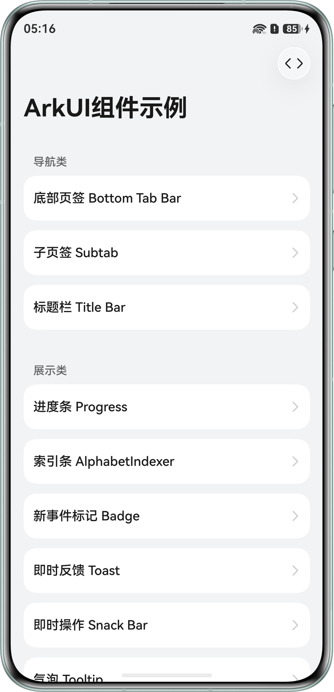
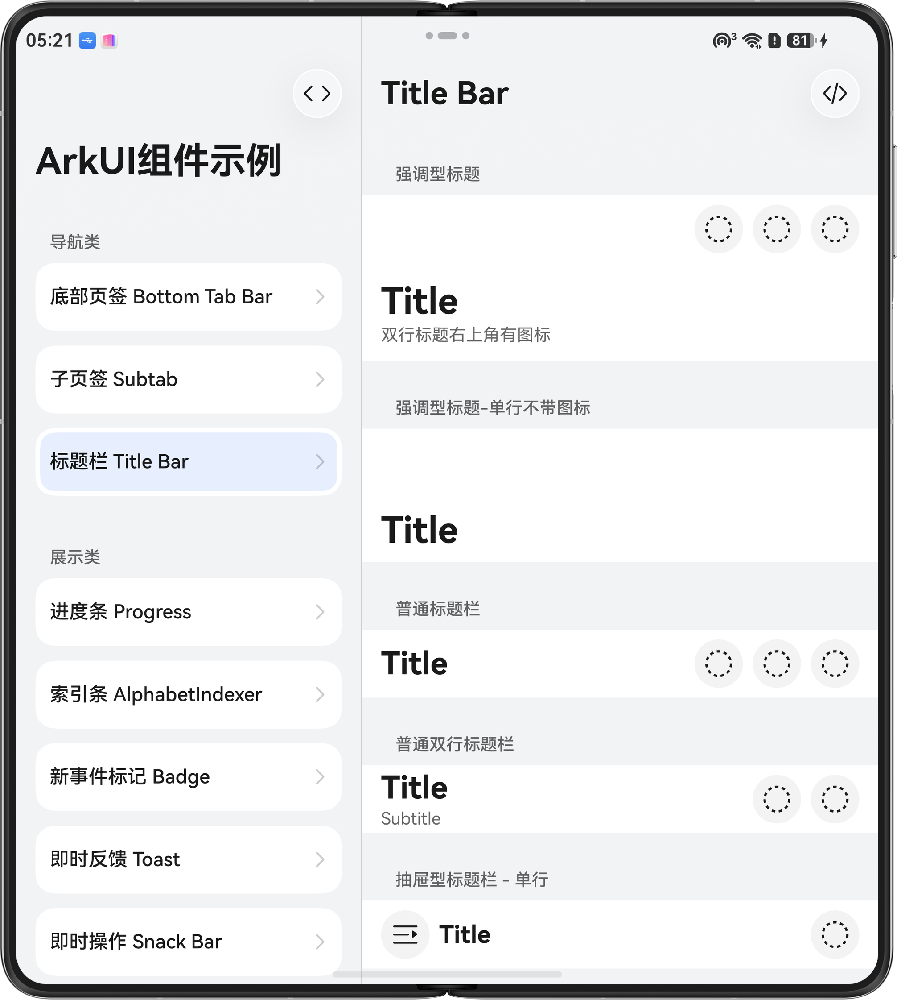
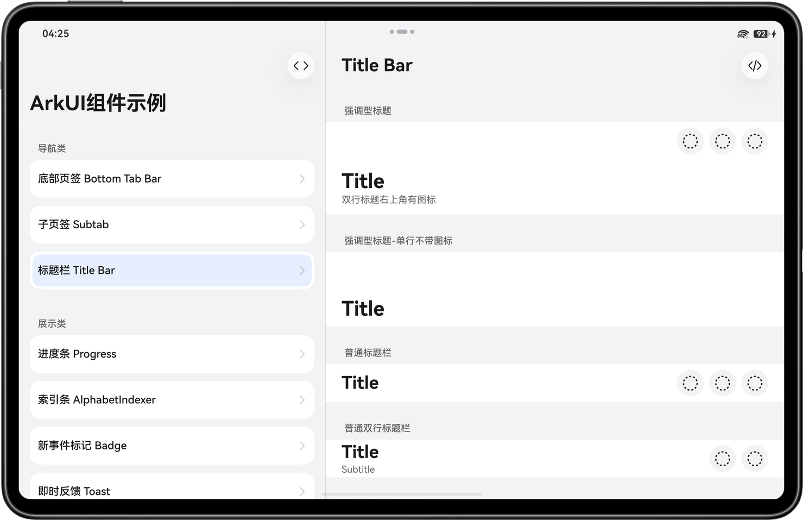
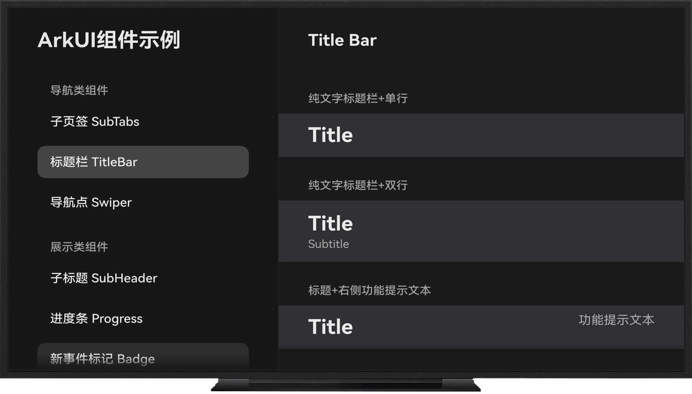
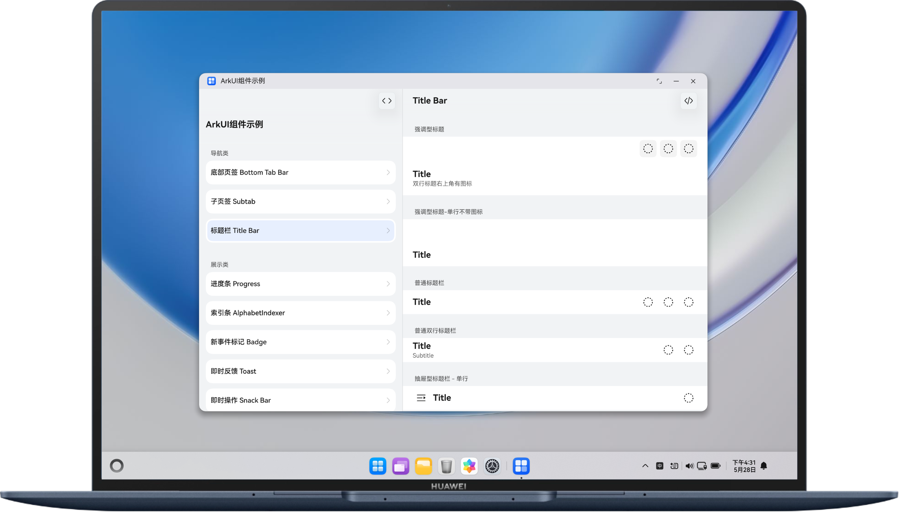
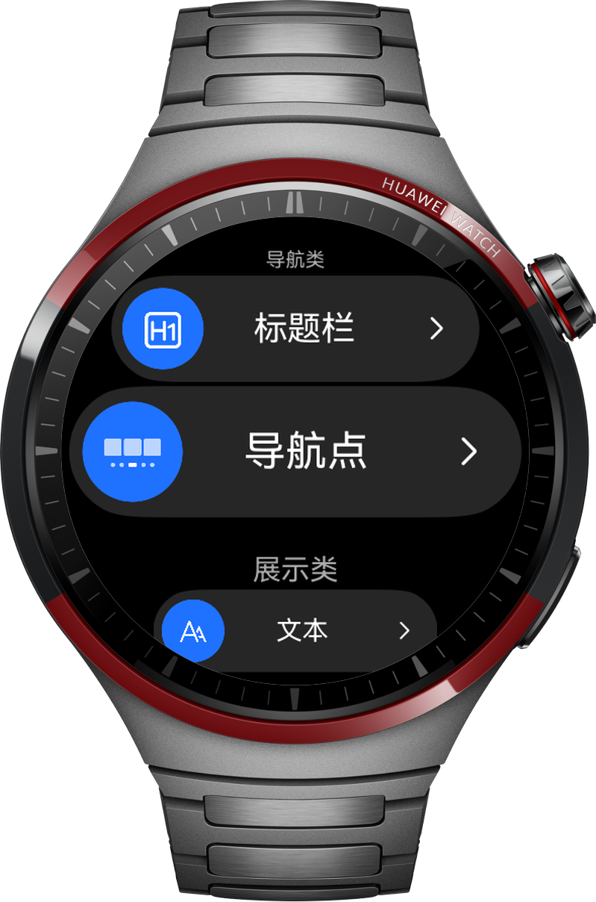

# ArkUI组件示例集合

## 项目简介

本项目是一个基于ArkUI的UI组件示例集合，旨在为开发者提供一套符合**HarmonyOS Design**设计规范的组件实现参考。

项目通过组合基础组件与样式特性，展示了如何在鸿蒙应用中打造具有“原生感”的视觉体验。开发者可以直接复用代码，或参考其实现逻辑定制自己的业务组件。本项目涵盖了六大类核心组件的样式与交互实现，具体包含：

- 操作类组件：[按钮](https://developer.huawei.com/consumer/cn/doc/design-guides/button-0000001929683228)、[核心操作栏](https://developer.huawei.com/consumer/cn/doc/design-guides/component_actionbar-0000002306891560)、[菜单](https://developer.huawei.com/consumer/cn/doc/design-guides/menu-0000001957001877)、[下拉按钮](https://developer.huawei.com/consumer/cn/doc/harmonyos-references/ts-basic-components-select)、[操作块](https://developer.huawei.com/consumer/cn/doc/harmonyos-references/ohos-arkui-advanced-chip)、[文本选择菜单](https://developer.huawei.com/consumer/cn/doc/harmonyos-references/ts-basic-components-text#bindselectionmenu11)；
- 容器类组件：[半模态面板](https://developer.huawei.com/consumer/cn/doc/design-guides/bindsheet-0000001956852753)、[弹出框](https://developer.huawei.com/consumer/cn/doc/design-guides/dialog-0000001957012569)、[列表](https://developer.huawei.com/consumer/cn/doc/design-guides/list-0000001929853910)、[宫格](https://developer.huawei.com/consumer/cn/doc/harmonyos-references/ts-container-grid)；
- 输入类组件：[计数器](https://developer.huawei.com/consumer/cn/doc/design-guides/counter-0000001929853284)、[搜索框](https://developer.huawei.com/consumer/cn/doc/design-guides/search-0000001956852741)、[文本框](https://developer.huawei.com/consumer/cn/doc/design-guides/textinput-0000001957012557)；
- 导航类组件：[底部页签](https://developer.huawei.com/consumer/cn/doc/design-guides/bottomtab-0000001956787789)、[子页签](https://developer.huawei.com/consumer/cn/doc/design-guides/chipsgroup-0000001929788350)、[标题栏](https://developer.huawei.com/consumer/cn/doc/design-guides/titlebar-0000001929628982)；
- 展示类组件：[新事件标记](https://developer.huawei.com/consumer/cn/doc/design-guides/badge-0000001929816016)、[进度条](https://developer.huawei.com/consumer/cn/doc/design-guides/progress-0000001929656644)、[即时操作](https://developer.huawei.com/consumer/cn/doc/design-guides/component_snackbar-0000002340726169)、[即时反馈](https://developer.huawei.com/consumer/cn/doc/design-guides/toast-0000001929656648)、[索引条](https://developer.huawei.com/consumer/cn/doc/harmonyos-references/ts-container-alphabet-indexer)、[气泡提示](https://developer.huawei.com/consumer/cn/doc/harmonyos-references/ts-universal-attributes-popup#bindpopup)、[数据可视化](https://developer.huawei.com/consumer/cn/doc/harmonyos-references/ts-basic-components-datapanel)、[二维码](https://developer.huawei.com/consumer/cn/doc/harmonyos-references/ts-basic-components-qrcode)；
- 选择类组件：[单选框](https://developer.huawei.com/consumer/cn/doc/design-guides/radio-0000001929853288)、[评分条](https://developer.huawei.com/consumer/cn/doc/design-guides/rating-0000001929853906)、[滑动条](https://developer.huawei.com/consumer/cn/doc/design-guides/slider-0000001957012565)、[开关](https://developer.huawei.com/consumer/cn/doc/design-guides/toggleswitch-0000001956852745)、[勾选](https://developer.huawei.com/consumer/cn/doc/harmonyos-references/ts-basic-components-checkbox)、选择器([时间选择器](https://developer.huawei.com/consumer/cn/doc/harmonyos-references/ts-basic-components-timepicker)、[日期选择器](https://developer.huawei.com/consumer/cn/doc/harmonyos-references/ts-basic-components-datepicker)、[文本选择器](https://developer.huawei.com/consumer/cn/doc/harmonyos-references/ts-basic-components-textpicker))、[分段按钮](https://developer.huawei.com/consumer/cn/doc/harmonyos-references/ohos-arkui-advanced-segmentbuttonv2)。

## 效果预览
### 手机/小折叠/平板

|                      手机                       |                     小折叠                      |                     平板                      |
|:---------------------------------------------:|:--------------------------------------------:|:-------------------------------------------:|
|  |  |  |

### 智慧屏幕/PC/穿戴

|                    智慧屏                     |                     PC                     |                      穿戴                       |
|:------------------------------------------:|:------------------------------------------:|:---------------------------------------------:|
|  |  |  |


## 使用说明

1. 将独立的应用示例工程导入DevEco Studio进行编译构建及运行调试。
2. 选择产品模块和对应的设备类型安装应用，运行后即可在设备上查看应用示例运行效果，以及进行相关调试。

## 工程目录

```
├──common/src/main/ets                                  // 公共模块
│  ├──common                                            // 通用组件目录
│  ├──components                                        // 公共组件库
│  ├──constants                                         // 公共常量文件
│  ├──designtoken                                       // 路由管理类
│  ├──model                                             // 公共数据类
│  └──utils                                             // 工具类                                            
└──products                                             // 产品定制层
│  ├──pc                                                // PC/2in1设备入口
│  ├──phone                                             // 手机设备入口
│  ├──tv                                                // 智慧屏设备入口
│  └──wearable                                          // 华为智能穿戴设备入口
└──build-profile                                        // 项目构建脚本
```

## 具体实现

1. 本示例实现了六大类符合HarmonyOS Design规范的UI组件，组件具体如下：
   - **操作类组件 (`components/action`)**
     - **核心操作栏**：基于`HdsActionBar`组件，实现了横向和垂直样式的核心操作类。
     - **按钮**：基于`Button`组件进行样式组合，实现了加载中、带图标、禁用态以及不同尺寸样式的按钮。
     - **操作块**：基于`Chip`组件，实现页签选项、邮件发送等场景组件样式。
     - **菜单**：利用`Menu`和`MenuItem`组件，实现了下拉菜单、带图标样式菜单、带标题样式菜单以及长按悬浮菜单 (`LongPressFloatingMenu`) 交互形态的菜单。
     - **下拉选项**：基于`Select`组件，实现不同尺寸、下拉按钮和输入框、下拉按钮和搜索框、单位切换的下拉选项。
     - **文本选择菜单**：基于`bindSelectionMenu`绑定构建函数实现文本选择菜单。
   - **容器类组件 (`components/container`)**
     - **半模态面板**：核心使用`bindSheet` 绑定构建函数，实现了模态型、非模态型、不同高度、竖屏以及横屏样式的半模态面板，同时实现了不同滑动响应优先级、同一面板内页面转换以及多重面板交互的半模态面板。
     - **弹出框**：基于`CustomContentDialog`、`SelectDialog`以及`TipsDialog`实现了基础类型、双行标题类型、选择类、带图形、带输入框、带提示信息以及带操作确认按钮的弹出框。
     - **网格**：基于`Grid`组件，实现图标型网格与内容型网格。
     - **列表**：使用`List` 、` ListItem`、 `ListItemGroup`组件，重点展示了效率型列表以及内容型列表。
   - **输入类组件 (`components/input`)**
     - **计数器（数字加减）**：通过组合`Advance.Counter`组件，实现了列表型、紧凑型 (上下布局型)、数字内联型以及日期内联型的数字加减交互。
     - **搜索框**：基于`Search`组件，定制了带图标、带搜索按键以及样式组合的搜索框。
     - **文本框**：基于`TextInput`和`TextArea`组件定制了单行文本框、多行文本框、全宽文本框、带图标的文本框、错误类型、带字符计数器以及密码样式的文本类输入框。
   - **导航类组件 (`components/navigation`)**
     - **底部页签**：使用`Tabs`和`HdsTabs`组件配合自定义`tabBar`，实现了背景模糊、渐变模糊等高级视觉效果，并提供了左右结构以及适配分栏布局的不同布局规则的底部页签效果。
     - **子页签**：基于`ChipGroup`以及`Tabs`组件，实现了胶囊样式、横向下划线样式以及竖向下划线样式的子页签效果。
     - **标题栏**：基于`HdsNavDestination`、`EditableTitleBar`组件，实现了强调型、普通单行、普通双行、抽屉型、二级页面单行、二级页面双行以及可编辑类型的标题栏。
   - **展示类组件 (`components/presentation`)**
     - **索引条**：基于`AlphabetIndexer`实现索引条。
     - **新事件标记**：基于`Badge`组件，实现了基础类型、自定义颜色、列表和底部页签上的新事件标记。
     - **数据可视化**：基于`DataPanel`组件，实现进度类、占比类-环形、占比类-线形、基础样式的数据面板
     - **气泡提示**：基于`bindPopup`绑定构建函数，实现基础样式、指向型和嵌入型的气泡提示。
     - **进度条**：基于`Progress`组件，实现了线性进度条、胶囊型进度条、圆形进度条；基于`LoadingProgress`实现了无明确进度的显示加载动效的效果。
     - **二维码**：基于`QRCode`组件，实现基础样式、带图片样式、加载状态、错误状态、自定义效果等二维码。
     - **即时操作**：基于`HdsSnackBar`组件，实现定时关闭模式、常驻模式以及横屏状态下的即时操作栏。
     - **子标题**：基于`SubHeaderV2`组件，实现基础样式标题、列表子标题和内容子标题。
     - **即时反馈**：基于`PromptAction`中的`showToast`，实现了不同弹出位置、竖屏模式下默认宽度、竖屏模式下最大宽度、横屏模式下默认宽度以及最大宽度的`Toast`弹窗。
   - **选择类组件 (`components/select`)**
     - **勾选**：基于`Checkbox`组件，实现基础样式、列表单选、列表多选等勾选框场景。
     - **选择器**：基于`TimePicer`、`DatePicer`、`TextPicer`组件分别实现时间选择器、日期选择器和文本选择器。
     - **单选框**：基于`Radio`组件，实现了勾号样式以及圆点样式的单选框。
     - **评分条**：基于`Rating`组件，实现了可操作类型评分条以及不可操作类型评分条。
     - **分段按钮**：基于`SegmentButtonV2`组件，实现单选分段按钮和多选分段按钮
     - **滑动条**：基于`Slider`组件，实现了基础类型、自定义类型以及常用组合类型的滑动条。
     - **开关**：基于`Toggle`组件，实现了默认开启/关闭状态、自定义圆角、自定义颜色、自定义尺寸样式的开关。
2. 分享功能的实现：通过Share Kit的systemShare模块实现碰一碰分享功能。

## 相关权限

- 允许使用Internet网络：ohos.permission.INTERNET。
- 获取网络状态权限：ohos.permission.GET_NETWORK_INFO。

## 约束与限制

1. 本示例仅支持标准系统上运行，支持设备：直板机、双折叠（Mate X系列）、三折叠、华为智能穿戴设备、智慧屏、PC/2in1。
2. HarmonyOS系统：HarmonyOS 6.0.2 Release及以上。
3. DevEco Studio版本：DevEco Studio 6.1.0 Release及以上。
4. HarmonyOS SDK版本：HarmonyOS 6.1.0 Release SDK及以上。