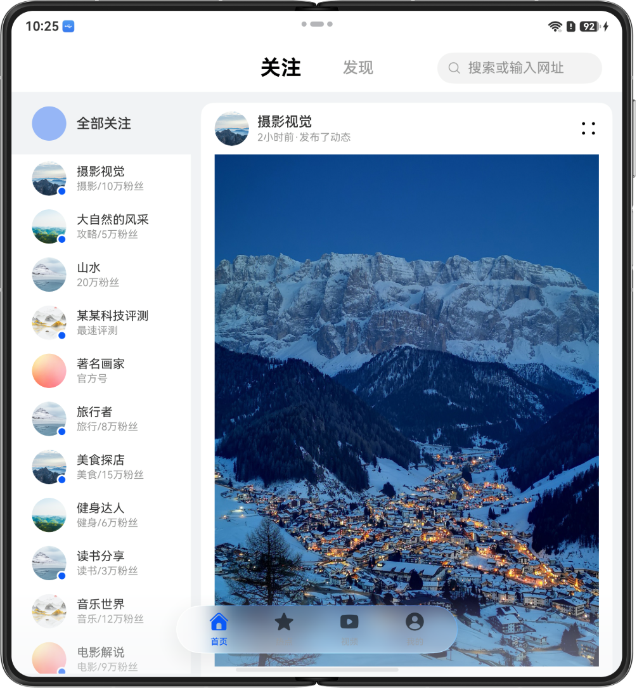
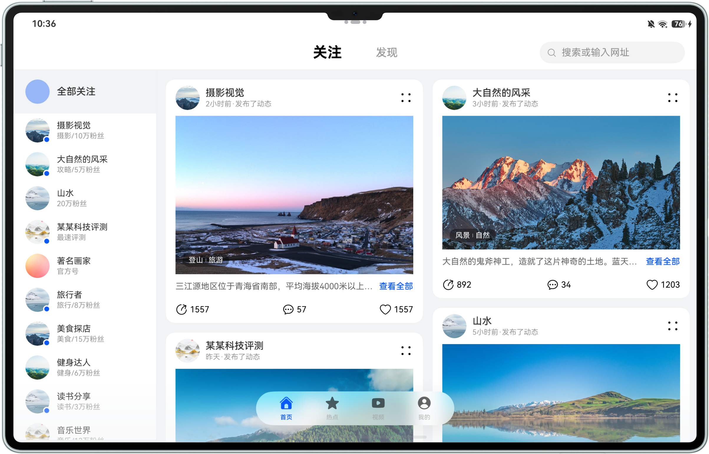
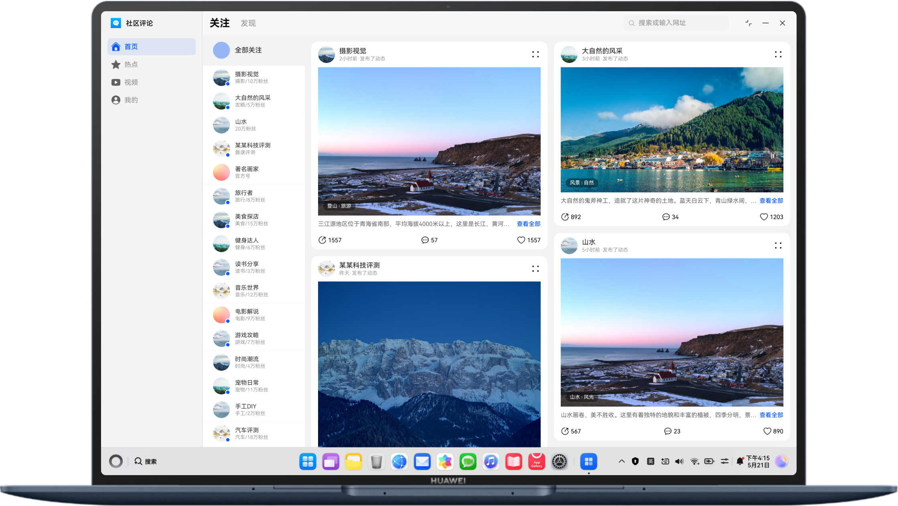

# 多设备社区评论界面

## 项目简介

本示例基于一多能力，实现一次开发、多端部署的社区评论应用界面，覆盖直板机、折叠屏、平板及电脑等多种设备形态。同时，采用三层架构组织代码工程，结合自适应布局与响应式布局，构建了从关注页、热点页、社交详情页以及图片详情页的完整社区评论体验。

## 效果预览

| 阔折叠外屏                                              | 直板机                                                | 折叠屏                                               |
|----------------------------------------------------|----------------------------------------------------|---------------------------------------------------|
|  |  |  |

| 平板                                               | 电脑                                                |
|--------------------------------------------------|---------------------------------------------------|
|  |  |
## 使用说明

1. 分别在直板机、双折叠、阔折叠、平板、电脑安装并打开应用，不同设备的应用页面通过响应式布局和自适应布局呈现不同的效果。
2. 首页关注页展示关注作者的帖子瀑布流，左侧展示关注者列表（大屏设备）。
3. 热点页展示实时帖子内容，大屏设备下左侧展示帖子卡片，右侧展示评论区。
4. 点击帖子卡片跳转到社区详情页，展示作者信息和作品图片。
5. 点击图片跳转到图片详情页，支持查看大图。
6. 在底部标签页来回切换，可在首页、热点、视频、个人中心之间切换。

## 工程目录

```
├──common
│  └──commonmulticommunityapplication                                     
│     └──src/main
│        ├──ets
│        │  ├──components                     // 公共组件类
│        │  ├──constants                      // 公共常量定义
│        │  ├──model                          // 公共model定义
│        │  ├──utils                          // 工具类
│        │  └──view                           // feature公共业务组件
│        └──resources                         // 公共资源
├──features                                   
│  ├──commoncommunityui                       // product公共业务组件模块
│  │  └──src/main
│  │     ├──ets
│  │     │  ├──view                           // product公共业务组件
│  │     │  └──viewmodel                      // product公共视图模型
│  │     └──resources                         // 静态路由表资源
│  ├──contentcommunity                        // 内容社区模块
│  │  └──src/main
│  │     ├──ets
│  │     │  ├──model                          // 帖子数据模型
│  │     │  ├──view                           // 帖子组件
│  │     │  └──viewmodel                      // 帖子视图模型
│  │     └──resources                         // 帖子模块资源
│  └──socialcommunity                         // 社交社区模块
│     └──src/main
│        ├──ets
│        │  ├──model                          // 关注者/评论数据模型
│        │  ├──view                           // 关注者/评论组件
│        │  └──viewmodel                      // 关注者/评论视图模型
│        └──resources                         // 社交模块资源
├──product                                    
│  ├──default                                 // 手机/平板设备
│  │  └──src/main
│  │     ├──ets
│  │     │  ├──entryability                   // 入口类
│  │     │  ├──entrybackupability             // 应用数据备份恢复自定义拓展类
│  │     │  └──pages                          // 入口页面
│  │     └──resources                         // 资源文件
│  └──pc                                      // PC设备
│     └──src/main
│        ├──ets
│        │  ├──pages                          // 入口页面
│        │  ├──pcability                      // 入口类
│        │  └──pcbackupability                // 应用数据备份恢复自定义拓展类
│        └──resources                         // 资源文件
└──oh-package.json5                           // 工程依赖声明

```

## 具体实现

1. 页面结构

| 版本 | 6.0.2(22) | 6.1.0(23) |
|------|-----------|-----------|
| 根容器 | Navigation嵌套Tabs，1个NavPathStack管理整套页面路由 | HdsNavigation嵌套HdsTabs，1个NavPathStack管理整套页面路由 |

2. 通过@Env(SystemProperties.BREAK_POINT)监听系统断点变化，动态适配UI、动态改变Navigation单栏/分栏的效果。
3. 采用安全区域拓展方式expandSafeArea适配沉浸式。
4. 使用MVVM架构模式，Model层定义数据接口，ViewModel层处理业务逻辑，View层负责UI展示。
5. 使用WaterFlow实现帖子瀑布流布局，自适应不同屏幕尺寸。
6. 使用SideBarContainer实现大屏设备下的侧边栏布局。

## 相关权限

不涉及

## 约束与限制

1. 本示例仅支持标准系统上运行，支持设备：直板机、双折叠（Mate X系列）、阔折叠、三折叠、平板、PC/2in1。
2. HarmonyOS系统：HarmonyOS 6.0.2 Release及以上。
3. DevEco Studio版本：DevEco Studio 6.1.0 Release及以上。
4. HarmonyOS SDK版本：HarmonyOS 6.1.0 Release SDK及以上。
