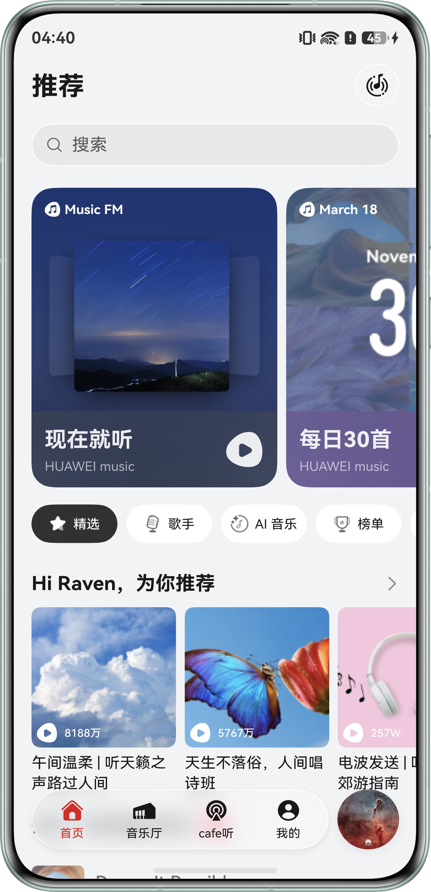
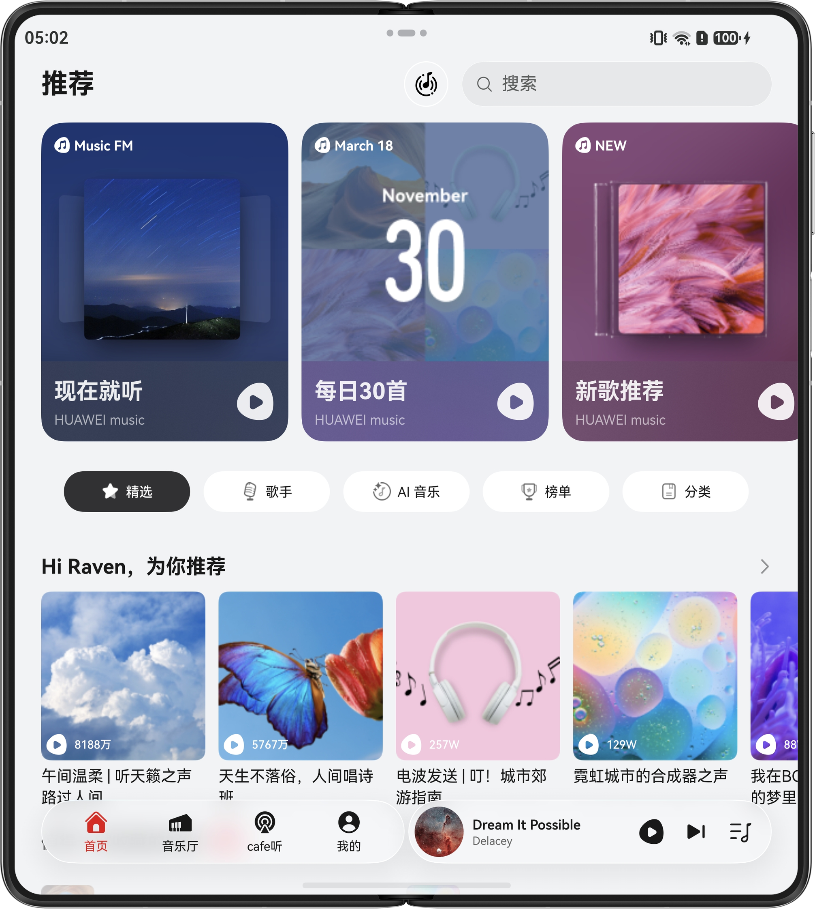
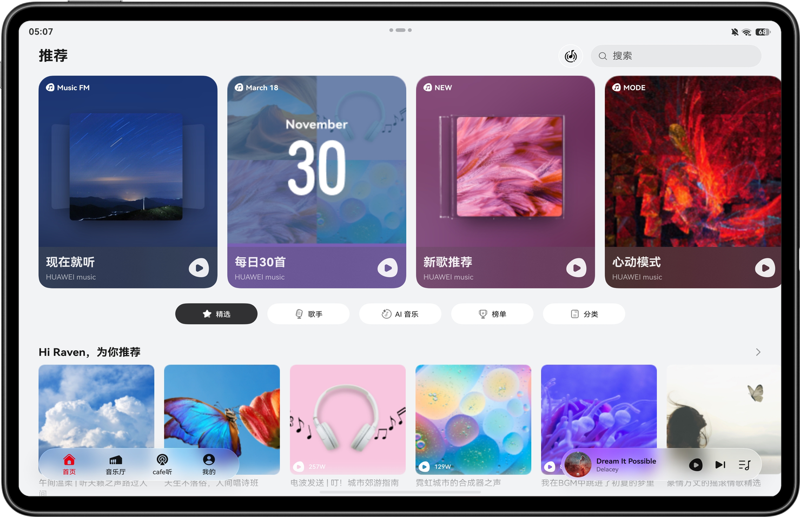
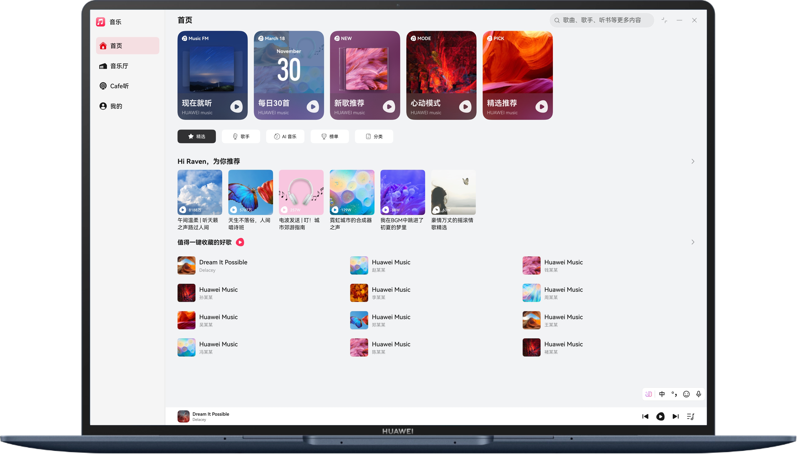
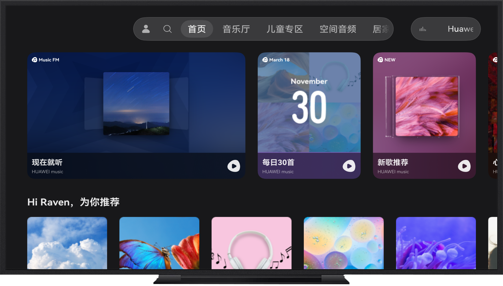
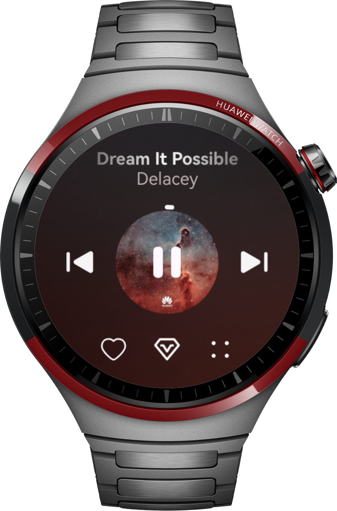

# 多设备音乐界面

## 项目简介

本示例基于**一多**能力，实现**一次开发、多端部署**的音乐应用界面，覆盖直板机、折叠屏、平板、电脑、智慧屏及智能穿戴等多种设备形态。同时，采用**三层架构**组织代码工程，结合**自适应布局**与**响应式布局**，构建了从首页推荐、歌单浏览到全屏播放与迷你播控的完整音乐体验。

## 效果预览

|                      **直板机**                       |                      **双折叠**                      |                       **平板**                        |
|:--------------------------------------------------:|:-------------------------------------------------:|:---------------------------------------------------:|
|  |  |  | 

|                     **电脑**                      |                     **智慧屏**                     |                       **穿戴**                       |
|:-----------------------------------------------:|:-----------------------------------------------:|:--------------------------------------------------:|
|  |  |  | 

## 使用说明

- **首页（推荐）**  
  进入应用后默认为带底部导航的首页，展示推荐信息流等内容（由`recommendation`特性模块实现）。

- **歌单与列表**  
  在首页或导航中进入歌单能力页，可浏览列表、选择歌曲；列表与播控状态由共享的`MusicAppState`等与`playlist`、`player`模块协同。

- **播放控制**  
  - 使用界面上的**播放/暂停、上一首、下一首**等控制当前队列播放。  
  - 点击**控制区空白处**或**列表中的歌曲**可进入全屏**播放页**，查看封面、进度与歌词等区域。

## 工程目录

```
├── common                                                  // 公共能力层目录
│   └── musicbasic                                          // 基础HAR：歌曲数据、全局状态、断点与窗口工具
│       └── src/main                                        // 模块标准源码与资源根目录
│           ├── ets                                         // ArkTS业务源码根目录
│           │   ├── api                                     // 接口DTO与映射
│           │   ├── constants                               // 公共常量
│           │   ├── data                                    // 歌曲/歌单/推荐Feed等行数据模型
│           │   ├── db                                      // 内存曲库等数据访问
│           │   ├── model                                   // 全局播控状态、菜单、歌曲实体等
│           │   └── util                                    // 日志、断点、窗口、持久化门面等工具
│           └── resources                                   // 字符串、颜色、媒体与rawfile资源
├── features                                                // 特性HAR：按业务能力拆分
│   ├── player                                              // 播放器：全屏页、歌词、音频播放封装
│   │   └── src/main                                        // 模块标准源码与资源根目录
│   │       ├── ets                                         // ArkTS业务源码根目录
│   │       │   ├── constant                                // 播放器与歌词相关常量
│   │       │   ├── model                                   // 播放UI模型、媒体服务、歌词条目
│   │       │   ├── util                                    // LRC、后台播放、播放意图壳层等
│   │       │   ├── view                                    // 播放页 UI 组件（含穿戴等形态适配）
│   │       │   └── viewmodel                               // 播放页ViewModel
│   │       └── resources                                   // 模块字符串、图标与主题资源
│   ├── playlist                                            // 歌单：详情页、分栏、迷你播控条
│   │   └── src/main                                        // 模块标准源码与资源根目录
│   │       ├── ets                                         // ArkTS业务源码根目录
│   │       │   ├── model                                   // 歌单与列表UI模型、数据源
│   │       │   ├── util                                    // 歌单演示数据等工具
│   │       │   ├── view                                    // 歌单页与迷你条 UI（含穿戴路由相关）
│   │       │   └── viewmodel                               // 歌单与播控联动ViewModel
│   │       └── resources                                   // 模块字符串与图标资源
│   └── recommendation                                      // 推荐首页、宽屏面板、首页迷你条
│       └── src/main                                        // 模块标准源码与资源根目录
│           ├── ets                                         // ArkTS业务源码根目录
│           │   ├── model                                   // 推荐区块UI模型与数据源
│           │   ├── util                                    // 推荐演示数据工具
│           │   ├── view                                    // 推荐首页、迷你条、宽屏面板与穿戴首页等 UI
│           │   └── viewmodel                               // 推荐首页ViewModel
│           └── resources                                   // 模块字符串、横幅与主题资源
└── products                                                // 各设备形态HAP产品入口
    ├── default                                             // 手机/平板应用入口
    │   └── src/main                                        // 模块标准源码与资源根目录
    │       ├── ets                                         // ArkTS入口与页面根目录
    │       │   ├── entryability                            // 主入口Ability
    │       │   ├── pages                                   // 页面路由（主导航与壳层）
    │       │   └── phonebackupextability                   // 手机侧备份扩展Ability
    │       └── resources                                   // 权限声明、页面profile、图标与多语言
    ├── pc                                                  // PC/2in1应用入口
    │   └── src/main                                        // 模块标准源码与资源根目录
    │       ├── ets                                         // ArkTS入口与页面根目录
    │       │   ├── pages                                   // PC主页与路由页面
    │       │   ├── pcability                               // PC入口Ability
    │       │   └── pcbackupability                         // PC备份扩展Ability
    │       └── resources                                   // 分层图标、页面profile、多语言
    ├── tv                                                  // 智慧大屏应用入口
    │   └── src/main                                        // 模块标准源码与资源根目录
    │       ├── ets                                         // ArkTS入口与页面根目录
    │       │   ├── pages                                   // TV主页与路由页面
    │       │   ├── tvability                               // TV入口Ability
    │       │   └── tvbackupability                         // TV备份扩展Ability
    │       └── resources                                   // 分层图标、页面profile、多语言
    └── watch                                               // 智能穿戴应用入口
        └── src/main                                        // 模块标准源码与资源根目录
            ├── ets                                         // ArkTS入口与页面根目录
            │   ├── pages                                   // 穿戴主页路由页面
            │   ├── watchability                            // 穿戴入口Ability
            │   └── watchbackupability                      // 穿戴备份扩展Ability
            └── resources                                   // 表盘图标、路由profile、多语言
```

## 具体实现

- **入口与播放壳层**  
  - 手机/平板入口页[products/default/src/main/ets/pages/Index.ets](products/default/src/main/ets/pages/Index.ets)使用`HdsNavigation`、`RecommendPage`与`@ohos/player`提供的`dispatchShellPlaybackIntent`、`PlaybackPageCoverContent`等，在`MusicAppState.isShowPlay`为真时呈现全屏播放覆盖层。  
  - 播放意图由`PlaybackIntentState`（`musicbasic`）与`dispatchShellPlaybackIntent`统一分发。

- **状态与数据**  
  - 全局播放与UI状态集中在`MusicAppState`（`common/musicbasic`），歌单队列可与本地`MusicDbApi`同步。  
  - 断点与窗口信息通过`BreakpointSystem`、`WindowInfo`等工具参与布局计算。

- **推荐与歌单UI**  
  - 推荐页由`RecommendViewModel`与各Section组件拼装；首页浮动迷你条等位于`features/recommendation`。  
  - 歌单详情、分栏列表与列表内播控由`features/playlist`下各`view`/`viewmodel`实现，并与`MusicListPlaybackViewModel`协作。

- **播放器与歌词**  
  - 全屏播放、控制区与歌词展示由`features/player`中`PlaybackPage`、`LrcView`、`PlayerViewModel`、`MediaService`等协同完成；歌词资源与解析逻辑位于`util`/`model`。  
  - 手机入口在`module.json5`中声明`audioPlayback`背景模式及`KEEP_BACKGROUND_RUNNING`等，与应用内后台播放工具（如`BackgroundUtil`）配合。

- **穿戴与其它形态**  
  - `products/watch`等针对智能穿戴使用独立页面与圆形表盘适配。

## 相关权限

| 权限                                        | 用途           |
|-------------------------------------------|--------------|
| `ohos.permission.KEEP_BACKGROUND_RUNNING` | 保持音频播放相关后台能力 |

## 约束与限制

1. 本示例仅支持标准系统上运行，支持设备：直板机、双折叠（Mate X系列）、三折叠、阔折叠、平板、电脑、智慧屏、智能穿戴。

2. HarmonyOS系统：HarmonyOS 6.0.2 Release及以上。

3. DevEcoStudio版本：DevEcoStudio 6.1.0 Release及以上。

4. HarmonyOSSDK版本：HarmonyOS 6.1.0 Release SDK及以上。
