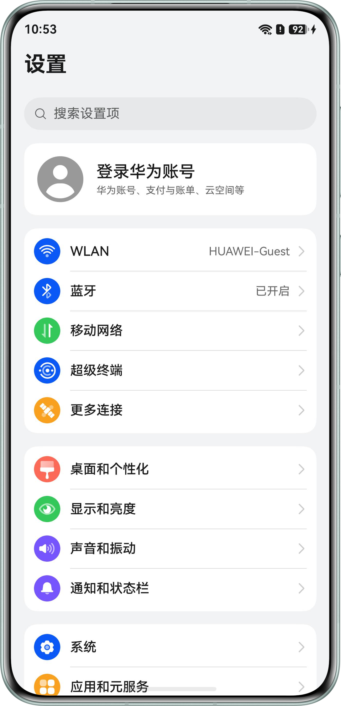
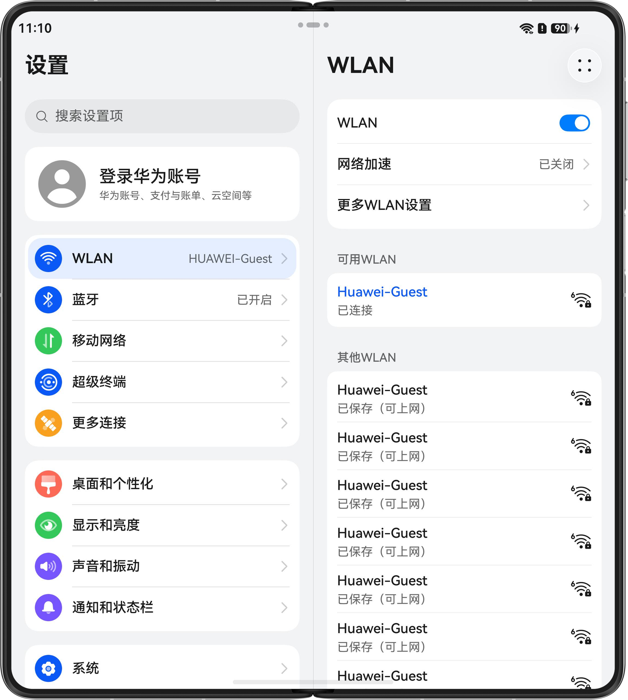
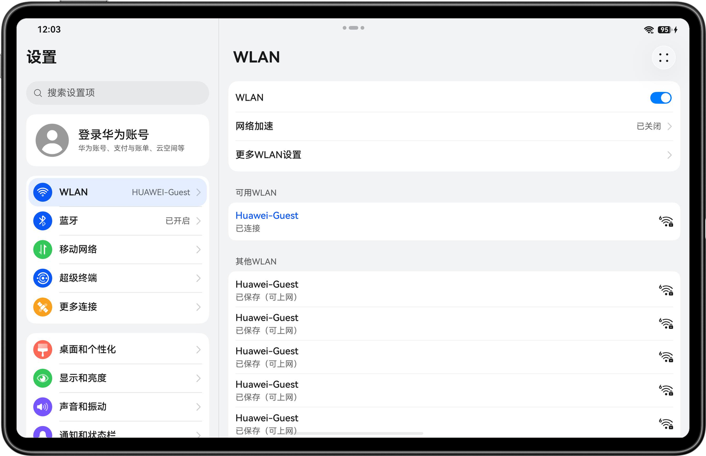
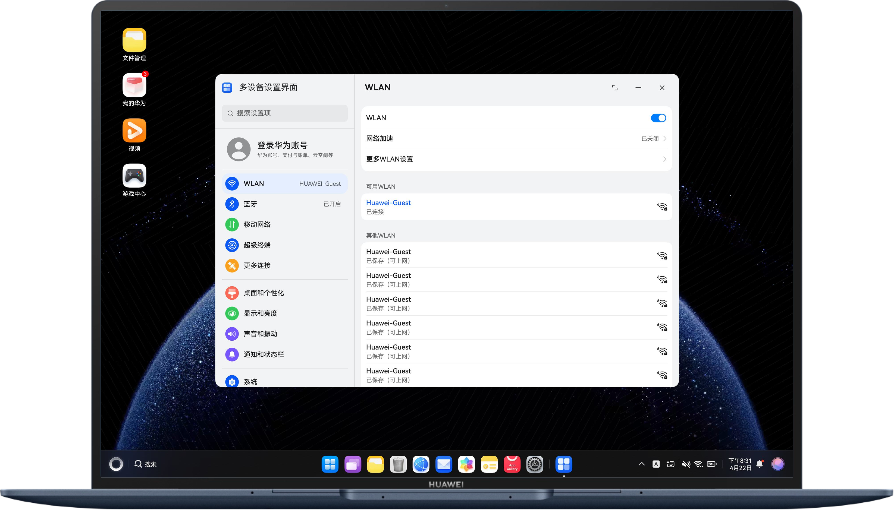

# 多设备设置界面

## 项目简介
本示例基于一多能力，实现了一次开发，多段部署的设置界面，覆盖直板机、阔折叠、双折叠、平板、电脑等多种设备。同时，采用三层架构组织代码工程，结合自适应布局与响应式布局，实现了导航页与目标页。

## 效果预览
| 阔折叠                                                |  直板机                                               | 双折叠 |
|----------------------------------------------------|--------------------------------------------------------|-----|
|  |  |     |

| 平板                                                  | 电脑                                              |
|-----------------------------------------------------|-------------------------------------------------|
|  |  |

## 使用说明
1. 在手机、平板上安装名为**multisettingdefaultsample**的hap包，在电脑上安装名为**multisettingdepcsample**的hap包。安装完成后打开应用，即可在不同设备上通过自适应和响应式布局呈现的差异化设置界面。
2. 导航栏实现多组按钮，支持点击。其中**WLAN**和**更多连接**按钮实现了详细的内容页。
3. **WLAN**页点击**更多WLAN设置**可以跳转至新页面。
4. **更多连接**页点击**NFC**可以跳转至新页面。
## 工程目录
```
├──AppScope                                        // 应用全局配置
│  └──resources                                    // 全局资源
├──common                                          // 公共模块层
│  └──multisettingbase                             // 公共能力模块
│     ├──src/main/ets                              // 代码区
│     │  ├──model                                  // 数据模型
│     │  ├──utils                                  // 工具类
│     │  └──view                                   // 公共视图组件
│     └──src/main/resources                        // 资源目录
├──features                                        // 功能模块层
│  └──multisettinglink                             // 网络连接功能模块
│     ├──src/main/ets                              // 代码区
│     │  ├──model                                  // 数据模型
│     │  ├──view                                   // 视图组件
│     │  └──viewmodel                              // 视图模型
│     └──src/main/resources                        // 资源目录
├──products                                        // 产品层
│  ├──default                                      // 手机/平板设备入口
│  │  ├──src/main/ets                              // 代码区
│  │  │  ├──common                                 // 公共常量
│  │  │  ├──entryability                           // 应用入口能力
│  │  │  ├──entrybackupability                     // 备份能力
│  │  │  ├──pages                                  // 页面
│  │  │  ├──view                                   // 视图组件
│  │  │  └──viewmodel                              // 视图模型
│  │  └──src/main/resources                        // 资源目录
│  └──pc                                           // 电脑设备入口
│     ├──src/main/ets                              // 代码区
│     │  ├──common                                 // 公共常量
│     │  ├──pages                                  // 页面
│     │  ├──pcability                              // 电脑应用入口能力
│     │  ├──pcbackupability                        // 电脑备份能力
│     │  ├──view                                   // 视图组件
│     │  └──viewmodel                              // 视图模型
│     └──src/main/resources                        // 资源目录
└──screenshot                                      // 截图目录
   └──devices                                      // 设备截图
```
## 具体实现
1. 将工程目录按照products、features、common的三层架构进行组织。由于电脑设备和手机、设备的UI结构有差异，因此在products层创建了两个hap包作为不同设备的入口：名称为**multisettingdefaultsample**的hap包，作为手机、平板设备的应用入口；名称为**multisettingpcsample**的hap包，作为电脑设备的应用入口。在features层实现连接（link）模块，供products层统一调用；在common层存放通用工具类。
2. 网络连接（multisettinglink）模块
   - 主要实现了内容页（WLAN页）的组成组件，包含了页面展示的WLAN列表数据。
3. 公共（multisettingcommon）模块
   - 主要实现了按钮组件，判断传入的不同参数，展示不同的布局。实现Logger、WindowUtil、WidthBreakpointType等工具类。
4. 设备（multisettingdefaultsample、multisettingpcsample）模块
   - 使用common、features层har包中的组件组成应用涉及的页面。主要使用HdsNavigation、Navigation及系统路由表实现导航栏及内容栏页面跳转功能。

## 相关权限
不涉及

## 约束与限制
1. 本示例仅支持标准系统上运行，支持设备：直板机、双折叠（Mate X系列）、阔折叠、平板、电脑。

2. HarmonyOS系统：HarmonyOS 6.0.2 Release及以上。

3. DevEco Studio版本：DevEco Studio 6.1.0 Release及以上。

4. HarmonyOS SDK版本：HarmonyOS 6.1.0 Release SDK及以上。

