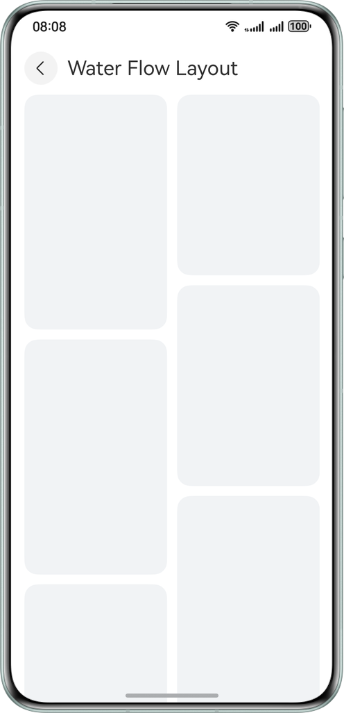
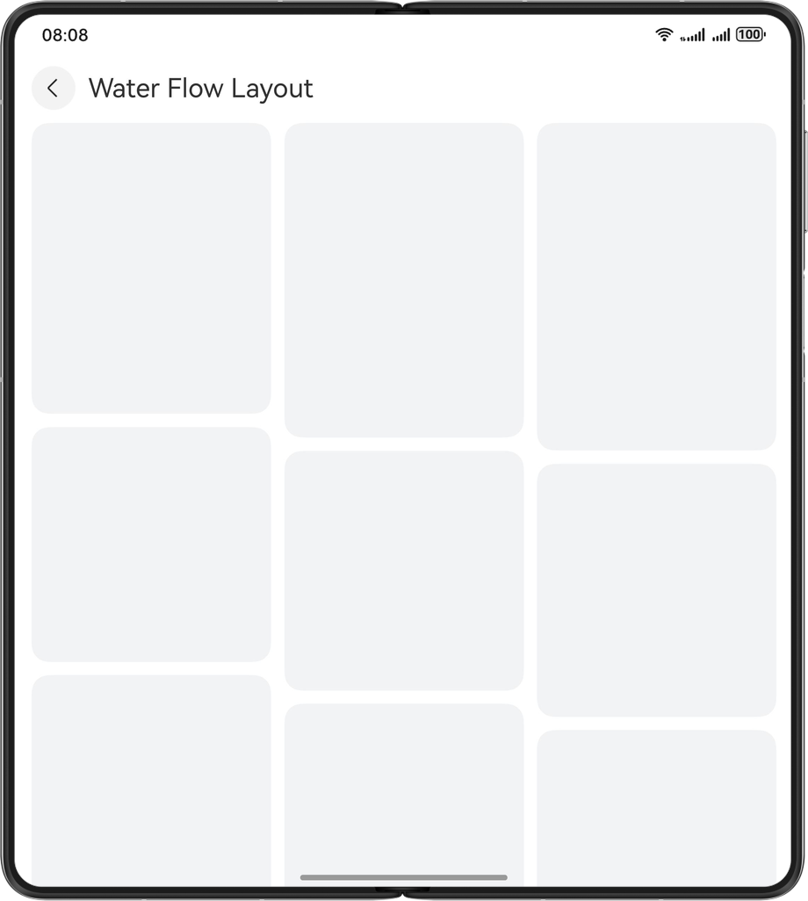
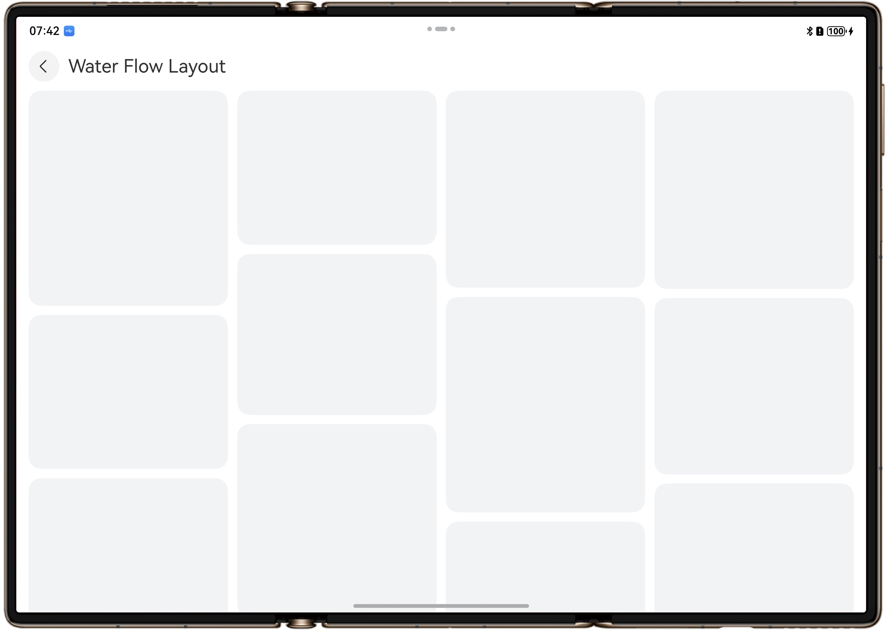
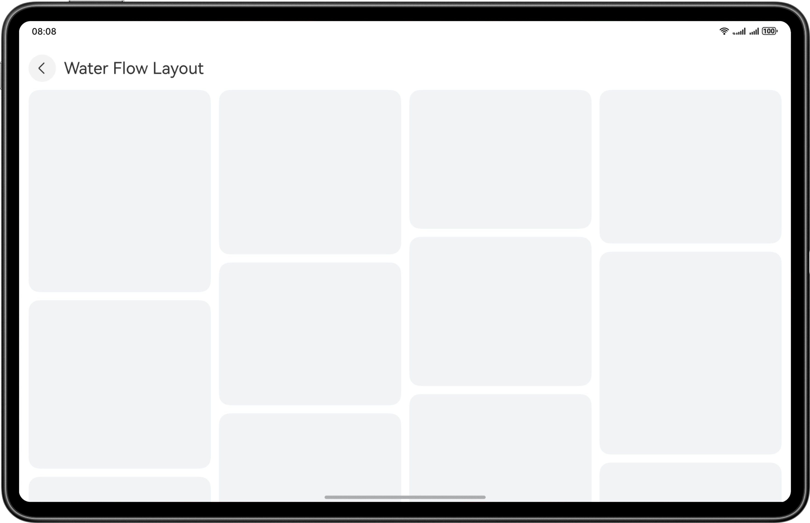
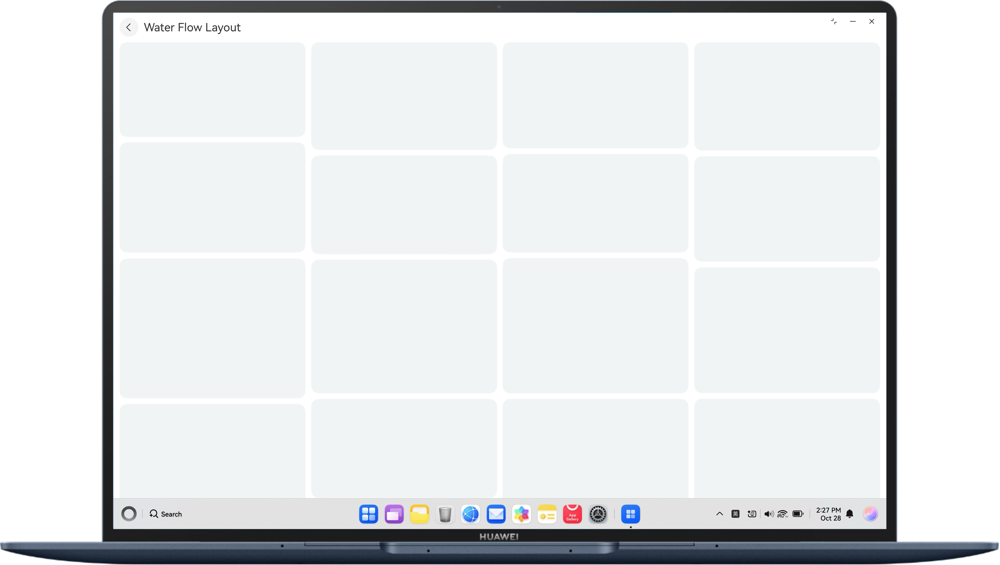

# Responsive Layout Based on One-Time Development for Multi-device Deployment

## Overview

This sample demonstrates how to use the responsive capability of one-time development for multi-device deployment provided by HarmonyOS to implement common responsive layouts on multiple devices (Bar phone, Bi-fold phone (Mate X series), Tri-fold phone, Tablet and PC/2-in-1 devices).

## Preview

Running effect on smartphones



Running effect on large-sized foldable phones



Running effect on triple-screen foldable phones



Running effect on tablets



Running effect on PC devices



## How to Use

You can click different list items on the home page to display the effect of responsive layout pages on multiple devices, including: list layout, waterfall layout, carousel layout, grid layout, sidebar layout, two-column layout, triple-column layout, orientation layout, bottom/side navigation layout, and indentation layout.
In the two-column and three-column layouts, Conversation, Calendar, and Mailbox application scenarios are displayed respectively to help developers use the two-column layout and triple-column layout.

## Project Directory
```
├──entry/src/main/ets/ 
│  ├──constants                          
│  │  ├──CommonConstants.ets             // common constant class
│  │  ├──ConversationConstants.ets       // conversation related constant
│  │  └──ProductDetailConstants.ets      // product related constant      
│  ├──entryability 
│  │  └──EntryAbility.ets 
│  ├──entrybackupability 
│  │  └──EntryBackupAbility.ets 
│  ├──pages 
│  │  ├──DoubleColumnConversation.ets    // Single/Dual-column chat page 
│  │  ├──DoubleColumnLayout.ets          // Single/Dual-column page 
│  │  ├──GridLayout.ets                  // Grid page 
│  │  ├──IndentedLayout.ets              // Indentation layout page 
│  │  ├──Index.ets                       // Home page 
│  │  ├──ListLayout.ets                  // List layout page 
│  │  ├──MoveLayout.ets                  // Orientation layout page 
│  │  ├──SidebarLayout.ets               // Sidebar layout page 
│  │  ├──SwiperLayout.ets                // Carousel layout page 
│  │  ├──TabsLayout.ets                  // Bottom/Side navigation page 
│  │  ├──TripleColumnCalendar.ets        // Triple-column calendar page 
│  │  ├──TripleColumnLayout.ets          // Triple-column layout page 
│  │  ├──TripleColumnMail.ets            // Triple-column mail page 
│  │  └──WaterFlowLayout.ets             // Waterfall layout page 
│  ├──utils 
│  │  ├──WidthBreakpointType.ets         // Utility for managing breakpoint types 
│  │  └──WindowUtil.ets                  // Window utility 
│  └──views 
│     ├──DoubleConversationView          // Double-column conversation view catalogue
│     │  ├──model                        
│     │  │  └──ConversationData.ets      // Conversation Data type
│     │  ├──productView                   
│     │  │  ├──CommonView.ets            // Product common view
│     │  │  ├──ProductConfig.ets         // Product config part
│     │  │  ├──ProductDiscount.ets       // Product discount part
│     │  │  ├──ProductPrice.ets          // Product price part
│     │  │  └──ProductUtilView.ets       // Product util part
│     │  ├──ConversationDetail.ets       // Conversation detail page
│     │  ├──ConversationDetailNone.ets   // Default conversation page
│     │  ├──ConversationList.ets         // Conversation list
│     │  ├──ConversationNavBarView.ets   // Conversation navigation page
│     │  ├──DoubleConversationView.ets   // Double column conversation homepage
│     │  ├──MessageBubble.ets            // Message Bubble 
│     │  └──ProductPage.ets              // Product detail page
│     ├──TabsView                        // Tab view catalogue
│     │  ├──model                        
│     │  │  └──TabData.ets               // Tab's data type
│     │  ├──TabSideBarView.ets           // Sidebar of Tab
│     │  ├──TabsView.ets                 // Tabs navigation homepage
│     │  ├──TopTabView.ets               // Toptap view
│     │  └──VideoInfoView.ets            // Video content page
│     ├──TripleCalendarView              // Triple-column calendar view catalogue
│     │  ├──model                        
│     │  │  ├──CalendarItem.ets          // Calendar data types 
│     │  │  └──TripData.ets              // Trip shedule data types
│     │  ├──CalendarSideBarView.ets      // Calendar sidebar
│     │  ├──CalendarView.ets             // Calendar content page
│     │  ├──TripleCalendarView.ets       // Triple Column Calendar homepage
│     │  └──TripShedule.ets              // Schedule page of Calendar
│     ├──TripleMailView                  // Triple-column mailbox view catalogue
│     │  ├──model                        
│     │  │  └──MailData.ets              // Mail data type
│     │  ├──MailContent.ets              // Mail content
│     │  ├──MailNavView.ets              // Mailbox navigation
│     │  ├──MailSideBarView.ets          // Sidebar of mailbox
│     │  └──TripleMailView.ets           // Mailbox homepage
│     ├──DoubleColumnView.ets            // Single/Dual-column view 
│     ├──GridView.ets                    // Grid view 
│     ├──IndentedView.ets                // Indentation layout view 
│     ├──ListView.ets                    // List layout view 
│     ├──MoveView.ets                    // Orientation layout view 
│     ├──NavigationBarView.ets           // Split-view layout navigation bar view 
│     ├──NavigationContentView.ets       // Split-view layout content view 
│     ├──SidebarView.ets                 // Sidebar view 
│     ├──SwiperView.ets                  // Carousel layout view 
│     ├──TripleColumnView.ets            // Triple-column view 
│     └──WaterFlowView.ets               // Waterfall layout view 
└──entry/src/main/resource               // Static resources
```

## How to Implement
1.	Use the **List** component and breakpoints to implement the list layout.
2.	Use the **WaterFlow** component and breakpoints to implement the waterfall layout.
3.	Use the **Swiper** component and breakpoints to implement the carousel layout.
4.	Use the **Grid** component and breakpoints to implement the grid layout.
5.	Use the **SideBarContainer** component and breakpoints to implement the sidebar.
6.	Use the **Navigation** component and breakpoints to implement single/dual-column layout.
7.	Use the **SideBarContainer** component, **Navigation** component, and breakpoints to implement triple-column layout.
8.	Use the **Tabs** component and breakpoints to implement bottom/side navigation.
9.	Use the **GridRow**/**GridCol** component, breakpoints, and grid to implement the orientation layout.
10.	Use the **GridRow**/**GridCol** component, breakpoints, and grid to implement the indentation layout.

## Required Permissions

N/A.

## Dependencies

N/A.

## Constraints

1. The sample app is supported on Bar phone, Bi-fold phone (Mate X series), Tri-fold phone, Tablet and PC/2-in-1 devices running the standard system.
2. The HarmonyOS version must be HarmonyOS 6.0.0 Release or later.
3. The DevEco Studio version must be DevEco Studio 6.0.0 Release or later.
4. The HarmonyOS SDK version must be HarmonyOS 6.0.0 Release SDK or later.

