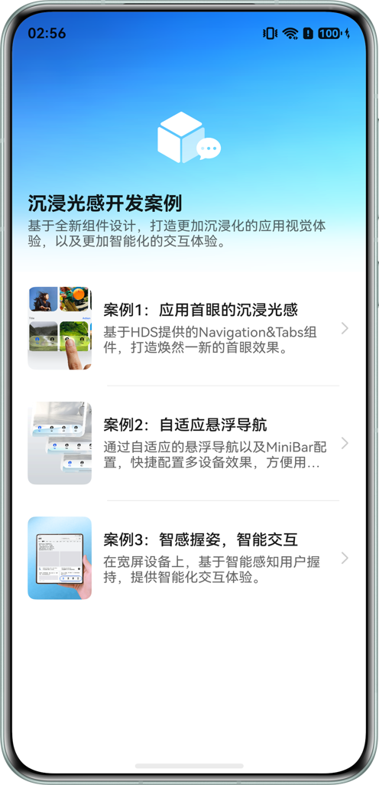
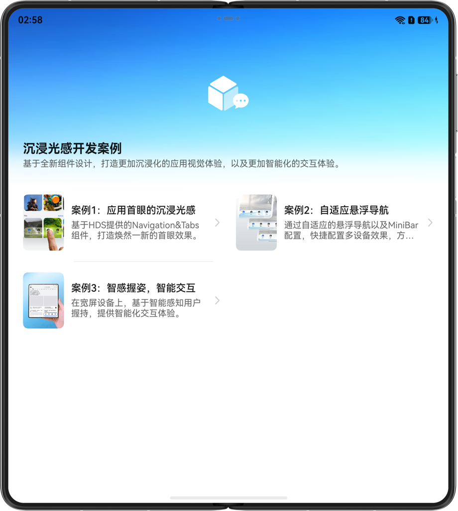
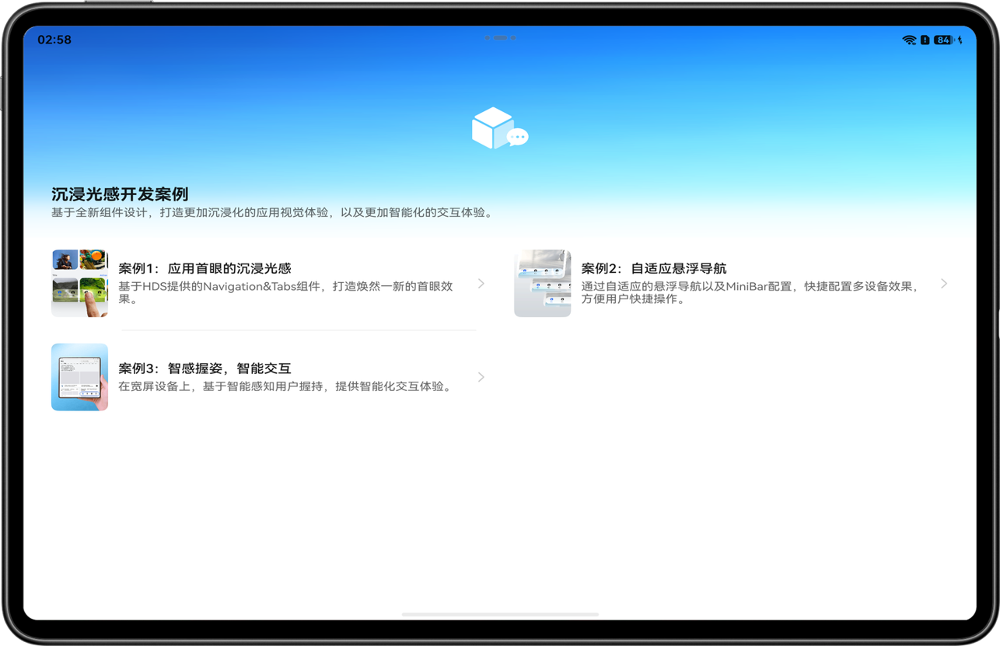

# 沉浸光感开发案例

## 介绍
本示例基于HDS提供的全新组件设计，打造更加沉浸化的应用视觉体验，以及更加智能化的交互体验。

其以首眼的沉浸光感，自适应悬浮导航和智感握姿三个场景来展示焕然一新的应用视觉体验。

## 效果图预览

|                  **手机**                  |                     **折叠屏**                     |                       **平板**                        | 
|:----------------------------------------:|:-----------------------------------------------:|:---------------------------------------------------:|
|  |  |  |


## 使用说明

1. 进入应用首页，点击首页列表中的案例，进入详情页，详情页在图片展示区域左右滑动，可以进行案例的切换，点击案例的立即体验按钮，跳转到对应案例的功能页面。
2. 点击“应用首眼的沉浸光感”案例的立即体验，跳转到沉浸光感页面，点击右上角的“沉浸光感”按钮，可以切换当前页面标题栏按钮和底部页签组件的光感材质的强弱程度。
3. 点击“自适应悬浮导航”案例的立即体验，跳转到悬浮导航页面，页面底部有两个底部页签正常tabs组件和（MiniBar）迷你栏，在宽度小于600vp设备上，右边的迷你栏默认是折叠状态,这是点击迷你栏，miniBar展开的同时和tabsBar会折叠起来，大于600vp时迷你栏是默认展开样式。
4. 点击“智感握姿，智能交互”案例的立即体验，跳转到智感握姿页面，分别使用左右手握持设备，并滑动或点击页面，底部的悬浮页签组件的位置会根据你握持滑动状态左右变化。

## 工程目录

```
├──entry/src/main/ets                         // 代码区
│  ├──common
│  │  └──CommonConstants.ets                  // 公共常量
│  ├──component
│  │  ├──MaterialLevelMenu.ets                // 沉浸光感下拉菜单
│  │  └──WaterFlowView.ets                    // 瀑布流内容页面
│  ├──entryability
│  │  └──EntryAbility.ets       
│  ├──model
│  │  ├──GlobalInfoModel.ets                  // 一多公共数据实体类
│  │  ├──SampleModel.ets                      // 案例实体类
│  │  └──TabsBarModel.ets                     // 底部页签实体类       
│  ├──pages
│  │  └──MainPage.ets                         // 主页面       
│  ├──utils
│  │  ├──BreakpointSystem.ets                 // 一多断点工具类
│  │  ├──MaterialUtil.ets                     // 新材质工具类
│  │  ├──Logger.ets                           // 日志打印工具类
│  │  ├──PreferenceManager.ets                // 本地数据持久化工具类
│  │  └──WindowUtil.ets                       // 窗口工具类
│  └──view
│     ├──AdaptiveTabView.ets                  // 自适应悬浮Tab页面
│     ├──DesignDetailView.ets                 // 设计详情页面
│     ├──DetailView.ets                       // 案例详情页面
│     ├──ImmersiveLightView.ets               // 沉浸光感页面
│     ├──SmartReachView.ets                   // 智感握姿页面
│     └──ToolBarList.ets                      // TooBar页面
└──entry/src/main/resources                   // 应用资源目录
```

## 相关权限

不涉及

## 依赖

不涉及

## 约束与限制

1. 本示例仅支持标准系统上运行，支持设备：直板机，双折叠，阔折叠，三折叠，平板。

2. HarmonyOS系统：HarmonyOS 6.1.0 Release及以上。

3. DevEco Studio版本：DevEco Studio 6.1.0 Release及以上。

4. HarmonyOS SDK版本：HarmonyOS 6.1.0 Release SDK及以上。