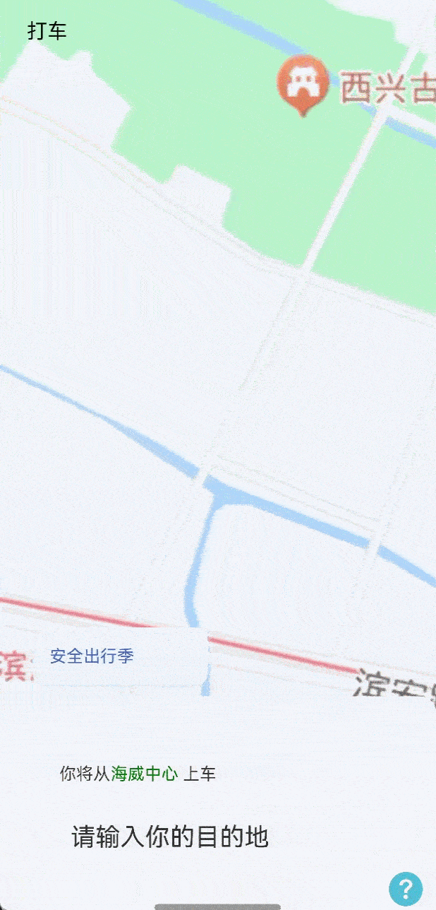

# 底部抽屉滑动效果案例

### 介绍

本示例主要介绍了利用List实现底部抽屉滑动效果场景，并将界面沉浸式（全屏）显示，及背景地图可拖动。

### 效果图预览



**使用说明**

1. 向上滑动底部列表，支持根据滑动距离进行分阶抽屉式段滑动。

### 下载安装

1. 模块oh-package.json5文件中引入依赖。
```typescript
"dependencies": {
  "@ohos-cases/bottomdrawerslidecase": "har包地址"
}
```

2. ets文件import自定义视图实现抽屉视图。

```typescript
import { BottomDrawer, BottomDrawerHeight } from '@ohos-cases/bottomdrawerslidecase';
```
### 快速使用

本章节主要介绍了如何快速通过BottomDrawer来实现抽屉效果。

1. 构建初始数据。

```typescript
const LIST_ITEM: SettingItem[] = [
  new SettingItem('list_item_id_first'),
  new SettingItem('list_item_id_second'),
  new SettingItem('list_item_id_third'),
  new SettingItem('list_item_id_fourth'),
  new SettingItem('list_item_id_fifth'),
  new SettingItem('list_item_id_sixth'),
  new SettingItem('list_item_id_seventh'),
  new SettingItem('list_item_id_eighth'),
  ];
```
2. 构建抽屉视图。其中listBuilder为列表模块，开发者可以自定义。

```typescript
 BottomDrawer({
  searchAddress: this.searchAddress,
  listBuilder: this.listBuilder,
  isShow: this.isShow,
  bottomDrawerHeight: this.bottomDrawerHeight
})
```

### 属性(接口)说明

BottomDrawer视图属性

|         属性         |         类型         |    释义     |  默认值  |
|:------------------:|:------------------:|:---------:|:-----:|
|   searchBuilder    |      ()=>void      |   搜索视图    |   -   |
|    listBuilder     |      ()=>void      |   列表视图    |   -   |
|       isShow       |      boolean       | 控制标题栏是否显示 | false |
| bottomDrawerHeight | BottomDrawerHeight | 控制标题栏是否显示 | false |

### 实现思路

本例涉及的关键特性和实现方案如下：

1. 使用RelativeContainer和Stack布局，实现可滑动列表在页面在底部，且在列表滑动到页面顶部时，显示页面顶部标题栏。

```typescript
Stack({ alignContent: Alignment.TopStart }) {
  RelativeContainer() {
    // Image地图
    ImageMapView()
    // 底部可变分阶段滑动列表
    BottomDrawer({
      searchAddress: this.searchAddress,
      listBuilder: this.listBuilder,
      isShow: this.isShow,
      bottomDrawerHeight: this.bottomDrawerHeight
    }).id('scrollPart')
      .alignRules({
        'bottom': { 'anchor': '__container__', 'align': VerticalAlign.Bottom },
        'left': { 'anchor': '__container__', 'align': HorizontalAlign.Start },
        'right': { 'anchor': '__container__', 'align': HorizontalAlign.End },
      })
  }
  TopTitle({
    isShow: this.isShow
  })
    .id('title_bar')
}
```

2. 通过对List设置组合手势，记录手指按下和离开屏幕纵坐标，判断手势是上/下滑。

```typescript
Column() {
  List(){
    ...
  }
}.gesture(
  // 以下组合手势为顺序识别，当长按手势事件未正常触发时则不会触发拖动手势事件
   GestureGroup(GestureMode.Sequence,
     PanGesture()
       .onActionStart((event: GestureEvent) => {
         this.yStart = event.offsetY;
      })
       .onActionUpdate((event: GestureEvent) => {
         const yEnd = event.offsetY; // 手指离开屏幕的纵坐标
         const height = Math.abs(Math.abs(yEnd) - Math.abs(this.yStart)); // 手指在屏幕上的滑动距离
         if (yEnd < this.yStart) {
           this.isUp = true;
           const temHeight = this.listHeight + height;
           if (temHeight >= this.bottomDrawerHeight.maxHeight) {
             this.isScroll = true;
             this.isShow = true;
             this.listHeight = this.bottomDrawerHeight.maxHeight;
           } else {
             this.isScroll = false;
             this.listHeight = temHeight;
           }
         }
         // 判断下滑，且list跟随手势滑动
         else {
           this.isUp = false;
           const temHeight = this.listHeight - height;
           if (this.itemNumber === 0) {
             // 列表高度随滑动高度变化
             this.listHeight = temHeight;
           } else {
             this.listHeight = this.bottomDrawerHeight.maxHeight;
           }
         }
         this.yStart = event?.offsetY;
      })
       .onActionEnd(() => {
         ...
       })
   )
 )

```

3. 根据手指滑动的长度对列表高度进行改变（以上滑为例）。

```typescript
this.isScroll = false;
this.listHeight = temHeight;
```

4. 在手指滑动结束离开屏幕后，通过判断此时列表高度处于哪个区间，为列表赋予相应的高度（以上滑为例）。

```typescript
.onActionEnd(() => {
  if (this.isUp) {
    // 分阶段滑动，当list高度位于第一个item和第二个item之间时，滑动到第二个item
    if (this.listHeight > this.bottomDrawerHeight.minHeight &&
      this.listHeight <= this.bottomDrawerHeight.middleHeight + this.bottomAvoidHeight) {
      this.listHeight = this.bottomDrawerHeight.middleHeight;
      this.isScroll = false;
      this.isShow = false;
      return;
    }
    // 分阶段滑动，当list高度位于顶部和第二个item之间时，滑动到页面顶部
    else if (this.bottomDrawerHeight.middleHeight + this.bottomAvoidHeight < this.listHeight &&
      this.listHeight <= this.bottomDrawerHeight.maxHeight) {
      this.listHeight = this.bottomDrawerHeight.maxHeight;
      this.isShow = true;
      return;
    }
  }
  // 列表下滑时，分阶段滑动
  else {
    if (this.listHeight === this.bottomDrawerHeight.maxHeight) {
      this.isShow = true;
      this.isScroll = true;
      this.listHeight = this.bottomDrawerHeight.maxHeight;
    }
    // 分阶段滑动，当list高度位于顶部和第二个item之间时,滑动到第二个item
    else if (this.listHeight >=
    this.bottomDrawerHeight.middleHeight &&
      this.listHeight <= this.bottomDrawerHeight.maxHeight) {
      this.listHeight =
        this.bottomDrawerHeight.middleHeight;
      this.isShow = false;
      this.isScroll = false;
      return;
    }
    // 分阶段滑动，当list高度位于第一个item和第二个item之间时，滑动到第一个item
    else if (this.listHeight <=
      this.bottomDrawerHeight.middleHeight + this.bottomAvoidHeight ||
      this.listHeight <= this.bottomDrawerHeight.minHeight) {
      this.listHeight = this.bottomDrawerHeight.minHeight;
      this.isShow = false;
      this.isScroll = false;
      return;
    }
  }
})
```

### 高性能知识点

不涉及

### 工程结构&模块类型

   ```
   bottomdrawerslidecase                // har类型
   |---src/main/ets/constants
   |   |---CommonConstants              // 常量
   |---src/main/ets/components
   |   |---Component                    // 自定义组件 
   |  |---src/main/ets/model
   |   |---DataType.ets                 // 数据类型
   |---src/main/ets/utils
   |   |---ArrayUtil.ets                // 数组控制
   |   |---BottomDrawer.ets             // 抽屉视图
   |   |---dataSource.ets               // 数据类型文件
   |   |---WindowModel.ets              // 窗口管理器
   |---src/main/ets/view
   |   |---BottomDrawerSlideCase.ets    // 列表吸顶穿透界面
   ```

### 模块依赖

- 依赖[har包-common库中日志打印模块](../../common/utils/src/main/ets/log/Logger.ets)
- 依赖[路由管理模块](../../common/routermodule)

### 参考资料

- [@ohos.window](https://developer.huawei.com/consumer/cn/doc/harmonyos-references/js-apis-window-0000001820880785)
- [触摸事件](https://developer.huawei.com/consumer/cn/doc/harmonyos-references/ts-universal-events-touch-0000001774121158)
- [基础手势](https://developer.huawei.com/consumer/cn/doc/harmonyos-references/ts-basic-gestures-pangesture-0000001774280890)