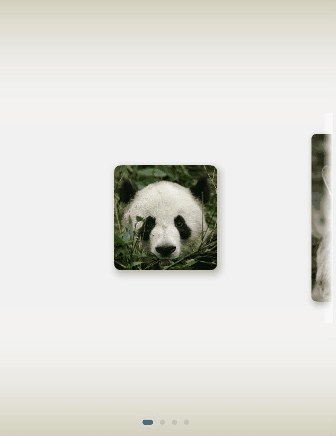
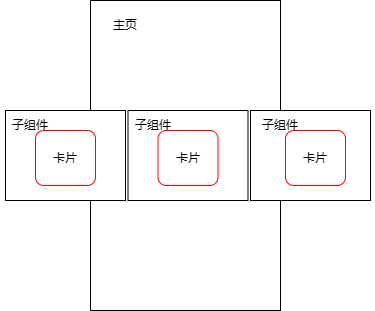
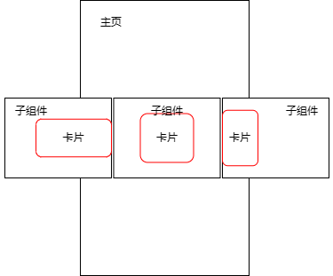

# 自定义Swiper卡片预览效果实现

### 介绍
本方案做的是采用Swiper组件实现容器视图居中完全展示，两边等长露出，并且跟手滑动缩放效果。新增组件内容边缘渐变实现。新增colorPicker实现背景跟随主题颜色。

### 效果图预览


### 下载安装

1.ohpm安装cardswiperanimation库。
```typescript
ohpm install @ohos-cases/cardswiperanimation
```

2.模块oh-package.json5文件中引入依赖。
```typescript
"dependencies": {
  "@ohos-cases/cardswiperanimation": "har包地址"
}
```
3.ets文件import实现卡片组件滚动切换组件。

```typescript
import { CardSwiperAnimationComponent } from '@ohos-cases/cardswiperanimation';
```

### 快速使用

本章节主要介绍了如何快速实现一个卡片组件滚动切换组件。
1. 初始化CardSwiperAnimationComponent的内容数据。

```typescript
  // 卡片列表
initCardsList : CardInfo[] = [];
// 边缘渐变
isEdgeFading : boolean = true;
// 主题背景渐变
isBackgroundColorChange : boolean = true;
// 开启预览大图
isShowPreviewImage : boolean = true;

aboutToAppear() :void {
  this.initCardsList = [
  // 卡片比例 1 x 1
    { src: $r('app.media.panda'), width: Constants.CARD_UNIT_LENGTH, height: Constants.CARD_UNIT_LENGTH },
    // 卡片比例 1 x 2
    { src: $r('app.media.kangaroo'), width: Constants.CARD_UNIT_LENGTH, height: 2 * Constants.CARD_UNIT_LENGTH },
    // 卡片比例 2 x 1
    { src: $r('app.media.bear'), width: 2 * Constants.CARD_UNIT_LENGTH, height: Constants.CARD_UNIT_LENGTH },
    // 卡片比例 2 x 2
    { src: $r('app.media.parrot'), width: 2 * Constants.CARD_UNIT_LENGTH, height: 2 * Constants.CARD_UNIT_LENGTH },
  ];
}
```

2. 构建CardSwiperComponent视图组件。

```typescript
Column() {
  /**
   * 卡片组件滚动切换
   * initCardsList: 初始化数据列表
   * isEdgeFading: 边缘渐变开启
   * isBackgroundColorChange: 主题背景渐变开启
   * isShowPreviewImage : 预览大图开启
   */
  CardSwiperComponent({
    initCardsList : this.initCardsList,
    isEdgeFading : this.isEdgeFading,
    isBackgroundColorChange: this.isBackgroundColorChange,
    isShowPreviewImage : this.isShowPreviewImage
  })
    .height($r('app.string.card_swiper_component_size'))
}
.height($r('app.string.card_swiper_animation_component_size'))
.width($r('app.string.card_swiper_animation_component_size'))
```

### 属性(接口)说明

CardSwiperComponent视图属性

|      属性      |         类型          |     释义      | 默认值 |
|:------------:|:-------------------:|:-----------:|:---:|
|  initCardsList     |   CardInfo[]    |   初始化数据列表   |  -  |
| isEdgeFading |        boolean         |  是否开启边缘渐变   |  true  |
| isBackgroundColorChange |        boolean         |   是否开启主题背景渐变    |  true  |
|   isShowPreviewImage   | boolean |    是否开启预览大图     |  true  |

### 实现思路
本解决方案通过维护所有卡片偏移的数组，实时更新卡片的偏移量，以实现swiper子组件内图片居中展示，两边等长露出。

**使用说明**

直接进入页面，对图片进行左右滑动。使用核心组件CardSwiperComponent时，配置isEdgeFading开启卡片边缘渐变，配置isBackgroundColorChange开启主题背景渐变，配置isShowPreviewImage开启大图预览。边缘渐变效果可通过Constants中BEGIN_COLOR、END_COLOR等参数实现更改，背景渐变效果可通过Constants中LINEAR_GRADIENT_ANGLE等参数实现更改。

1.左右露出效果静态实现。

Swiper组件基础视图效果如下。



如果所有子组件卡片大小一样，子组件内卡片居中展示即可实现效果。但是当子组件的卡片大小不一样时，无法通过简单的设置居中布局实现左右的等长露出。
此时需要计算当前缩放系数状态下的卡片的偏移量。



```typescript
  /**
   * 计算指定卡片的最大偏移量。
   * @param index {number} target card's index.
   * @returns offset value.
   */
  getMaxOffset(index: number): number {
    /*
     * 这里的偏移量指相对容器左侧的值。
     * 计算公式为：屏幕宽度 - Swiper两侧突出的偏移量 - 卡片自身的宽度。
     * 此值即为卡片可偏移的最大值，也就是卡片右对齐的状态值。
     * 如果居中，则将最大偏移量 / 2。
     */
    // 原图时最大偏移量
    let maxOffset: number = this.displayWidth - this.cardsList[index].width - 2 * this.swiperMargin;
    // 缩放时最大偏移量
    let maxOffsetScale: number = this.displayWidth - this.cardsList[index].width * this.MIN_SCALE - 2 * this.swiperMargin;
    this.proportion = maxOffset / maxOffsetScale;
    return maxOffsetScale;
  }
        
  /**
   * 计算卡片偏移量，并维护偏移量列表。
   * @param targetIndex { number } swiper target card's index.
   */
  calculateOffset(target: number) {
    let left = target - 1;
    let right = target + 1;

    // 计算上一张卡片的偏移值
    if (this.isIndexValid(left)) {
      this.cardsOffset[left] = this.getMaxOffset(left) - this.cardsList[left].width * (1 - this.MIN_SCALE) / 2;
    }
    // 计算当前卡片的偏移值
    if (this.isIndexValid(target)) {
      this.cardsOffset[target] = this.getMaxOffset(target) * this.proportion / 2;
    }
    // 下一张片的偏移值
    if (this.isIndexValid(right)) {
      this.cardsOffset[right] = -this.cardsList[right].width * (1 - this.MIN_SCALE) / 2;
    }
  }
```

2.滑动跟手缩放实现

滑动swiper组件动态位置更新原理和上一步静态位置获取原理一样，只不过在滑动过程通过相应的回调函数实时位置更新与缩放。
在以下这四个swiper回调接口中，分别实现卡片跟手、离手、导航点切换时的卡片**偏移量与缩放系数更新**。

| 接口名              | 基本功能                |
|:-----------------|:--------------------|
| onGestureSwipe   | 在页面跟手滑动过程中，逐帧触发该回调。 | 
| onAnimationStart | 切换动画开始时触发该回调。       |
| onChange         | 子组件索引变化时触发该事件。      |
| onAnimationEnd   | 切换动画结束时触发该函数。       |

具体api接口信息查看：[Swiper事件](https://developer.huawei.com/consumer/cn/doc/harmonyos-references-V5/ts-container-swiper-V5)。

- 在onGestureSwiper回调中，根据手指滑动的距离实时维护卡片的偏移量与缩放系数。

```typescript
.onGestureSwipe((index, event) => {
  let currentOffset = event.currentOffset;
  // 获取当前卡片（居中）的原始偏移量
  let maxOffset = this.getMaxOffset(index) / 2;
  // 实时维护卡片的偏移量列表，做到跟手效果
  if (currentOffset < 0) {
    // 向左偏移
    /*
     * 此处计算原理为：按照比例设置卡片的偏移量。
     * 当前卡片居中，向左滑动后将在左边，此时卡片偏移量即为 maxOffset * 2（因为向右对齐）。
     * 所以手指能够滑动的最大距离（this.displayWidth）所带来的偏移量即为 maxOffset。
     * 易得公式：卡片实时偏移量 = （手指滑动长度 / 屏幕宽度） * 卡片最大可偏移量 + 当前偏移量。
     * 之后的计算原理相同，将不再赘述。
     */
    this.cardsOffset[index] = (-currentOffset / this.displayWidth) * maxOffset + maxOffset;
    if (this.isIndexValid(index + 1)) {
      // 下一个卡片的偏移量
      let maxOffset = this.getMaxOffset(index + 1) / 2;
      this.cardsOffset[index + 1] = (-currentOffset / this.displayWidth) * maxOffset;
    }
    if (this.isIndexValid(index - 1)) {
      // 上一个卡片的偏移量
      let maxOffset = this.getMaxOffset(index - 1) / 2;
      this.cardsOffset[index - 1] = (currentOffset / this.displayWidth) * maxOffset + 2 * maxOffset;
    }
  } else if (currentOffset > 0) {
    // 向右滑动
    this.cardsOffset[index] = maxOffset - (currentOffset / this.displayWidth) * maxOffset;
    if (this.isIndexValid(index + 1)) {
      let maxOffset = this.getMaxOffset(index + 1) / 2;
      this.cardsOffset[index + 1] = (currentOffset / this.displayWidth) * maxOffset;
    }
    if (this.isIndexValid(index - 1)) {
      let maxOffset = this.getMaxOffset(index -1) / 2;
      this.cardsOffset[index - 1] = 2 * maxOffset - (currentOffset / this.displayWidth) * maxOffset;
    }
  }
  // 页面跟手滑动过程中触发回调，动态计算卡片滑动距离实时计算缩放系数。
  this.calculateScaling(index, currentOffset);
})
/**
 * 根据卡片滑动距离实时计算卡片缩放系数。
 * @param index {number} target card's index.
 * @param offset {number} current Offset distance.
 */
calculateScaling(index: number, offset: number) {
  let currentScale: number = this.scaleList[index];
  let nextIndex: number = (index === this.scaleList.length - 1 ? 0 : index + 1);
  let preIndex: number = (index === 0 ? this.scaleList.length - 1 : index - 1);
  let nextScale: number = this.scaleList[nextIndex];
  let preScale: number = this.scaleList[preIndex];
  if (this.startSwiperOffset === 0) {
    this.startSwiperOffset = offset;
  }
  // 滑动距离
  let distance: number = Math.abs(this.startSwiperOffset - offset);
  currentScale = this.MAX_SCALE - Math.min(distance / this.displayWidth, this.MAX_SCALE - this.MIN_SCALE);
  // 滑动时实时缩放的比例
  if (this.startSwiperOffset > offset) {
    nextScale = this.MIN_SCALE + Math.min(distance / this.displayWidth, this.MAX_SCALE - this.MIN_SCALE);
    preScale = this.MIN_SCALE;
  } else {
    preScale = this.MIN_SCALE + Math.min(distance / this.displayWidth, this.MAX_SCALE - this.MIN_SCALE);
    nextScale = this.MIN_SCALE;
  }
  this.scaleList[this.currentSwiperIndex] = currentScale;
  this.scaleList[nextIndex] = nextScale;
  this.scaleList[preIndex] = preScale;
}
```

- 在onAnimationStart回调中，计算手指离开屏幕时卡片的偏移量与缩放系数，避免产生突变的偏移量与缩放系数。

```typescript
.onAnimationStart((index, targetIndex) => {
  this.calculateOffset(targetIndex);
  if (index === targetIndex) {
    let nextIndex: number = (index === this.scaleList.length - 1 ? 0 : index + 1);
    let preIndex: number = (index === 0 ? this.scaleList.length - 1 : index - 1);
    this.scaleList[index] = this.MAX_SCALE;
    this.scaleList[nextIndex] = this.MIN_SCALE;
    this.scaleList[preIndex] = this.MIN_SCALE;
  } else {
    let nextIndex: number = (targetIndex === this.scaleList.length - 1 ? 0 : targetIndex + 1);
    let preIndex: number = (targetIndex === 0 ? this.scaleList.length - 1 : targetIndex - 1);
    this.scaleList[targetIndex] = this.MAX_SCALE;
    this.scaleList[nextIndex] = this.MIN_SCALE;
    this.scaleList[preIndex] = this.MIN_SCALE;
  }
})
```
这里的 calculateOffset 函数即步骤1中维护卡片偏移量的函数。

- 在onChange回调中提前计算Swiper滑动后卡片的位置与缩放系数。

```typescript
.onChange((index) => {
  this.calculateOffset(index);
  // index发生变化时，修改数组中对应的缩放系数
  this.currentSwiperIndex = index;
  this.scaleList[this.currentSwiperIndex] = this.MAX_SCALE;
  // 若index为第一张图时，最后一张图片缩放系数为MIN_SCALE，否则index-1缩放系数为MIN_SCALE
  if (this.currentSwiperIndex === 0) {
    this.scaleList[this.scaleList.length - 1] = this.MIN_SCALE;
  } else {
    this.scaleList[this.currentSwiperIndex - 1] = this.MIN_SCALE;
  }
  // 若index为最后一张图时，第一张图缩放系数为MIN_SCALE，否则index+1缩放系数为MIN_SCALE
  if (this.currentSwiperIndex === this.scaleList.length - 1) {
    this.scaleList[0] = this.MIN_SCALE;
  } else {
    this.scaleList[this.currentSwiperIndex + 1] = this.MIN_SCALE;
  }
})
```

计算方式同上一步。
- 在onAnimationEnd回调中，让startSwiperOffset归0。
```typescript
.onAnimationEnd(() => {
  this.startSwiperOffset = 0;
})
```

3.图片预览效果实现

图片预览动效是通过**共享元素转场**结合**全屏模态**实现的。
通过geometryTransition属性绑定两个需要“一镜到底”的组件（本案例中的图片），结合模态窗口转场即可。
图片缩放动效是通过设置scale属性，使用状态变量this.scaleList中的缩放系数。

```typescript
// 以下代码仅展示关键部分，详请查看源码
Image(this.cardInfo.src)
  ...
  // TODO 知识点：geometryTransition通过id参数绑定两个组件转场关系，实现一镜到底动画
  .geometryTransition(this.cardIndex.toString(), { follow: true })
  ...
  .bindContentCover(
    this.isPhotoShow,
    this.photoShowBuilder(this.cardInfo.src, this.cardIndex.toString()),
    {
      backgroundColor: $r('app.color.photo_preview_build_background'),
      modalTransition: ModalTransition.ALPHA,
      transition: TransitionEffect.OPACITY.animation({
        duration: Constants.DURATION, curve: Constants.DEFAULT_ANIMATION_CURVE
      })
    }
  )
...
// 全屏模态组件
@Builder
photoShowBuilder(img: ResourceStr, id: string) {
  Column() {
    Image(img)
      .borderRadius($r('app.integer.card_swiper_photo_radius'))
      .geometryTransition(id, { follow: true })
      .width(this.isTablet ? $r('app.string.card_swiper_tablet_preview_width') :
      $r('app.string.card_swiper_photo_preview_width'))
      .transition(TransitionEffect.opacity(Constants.OPACITY))
  }
  ...
  .onClick(() => {
    this.animateFunc();
  })
  .transition(TransitionEffect.OPACITY.animation({
    duration: Constants.DURATION, curve: Constants.DEFAULT_ANIMATION_CURVE
  }))
}
```
4.创建遮罩层自定义组件，实现见渐变边缘的效果。结合通用属性overlay和linearGradient实现渐变效果
```typescript
@Builder
fadingOverlay() {
  Column()
    .width($r('app.string.fadingedge_fill_size'))
    .height($r('app.integer.fadingedge_list_height'))
      // TODO: 知识点: linearGradient 可以设置指定范围内的颜色渐变效果
    .linearGradient({
      angle: Const.OVERLAY_LINEAR_GRADIENT_ANGLE,
      colors: [
        [this.linearGradientBeginColor, Const.OVERLAY_LINEAR_GRADIENT_COLOR_POS[0]],
        [Const.BEGIN_COLOR, Const.OVERLAY_LINEAR_GRADIENT_COLOR_POS[1]],
        [Const.BEGIN_COLOR, Const.OVERLAY_LINEAR_GRADIENT_COLOR_POS[2]],
        [this.linearGradientEndColor, Const.OVERLAY_LINEAR_GRADIENT_COLOR_POS[3]],
      ]
    })
    .animation({
      curve: Curve.Ease,
      duration: Const.DURATION
    })
    .hitTestBehavior(HitTestMode.Transparent)
    .visibility(this.isEdgeFading ? Visibility.Visible : Visibility.Hidden)
}
```
通过list组件的onChange回调中计算渐变遮罩触发边缘渐变的改变。
```typescript
.onChange((index) => {
  this.calculateOffset(index);
  // index发生变化时，修改数组中对应的缩放系数
  this.currentSwiperIndex = index;
  ...
  // index为第一张图时
  if (this.currentSwiperIndex === 0) {
    ...
    // 第一张时的渐变遮罩色，仅右侧渐变
    this.linearGradientBeginColor = Constants.BEGIN_COLOR;
    this.linearGradientEndColor = Constants.END_COLOR;
  } else {
    ...
  }
  // index为最后一张图时，仅左侧渐变
  if (this.currentSwiperIndex === this.scaleList.length - 1) {
    ...
    // 最后一张时的渐变遮罩色
    this.linearGradientBeginColor = Constants.END_COLOR;
    this.linearGradientEndColor = Constants.BEGIN_COLOR;
  } else {
    ...
  }
  // index为中间位置时，两侧都有边缘渐变效果
  if (this.currentSwiperIndex != 0 && this.currentSwiperIndex != this.scaleList.length - 1) {
    this.linearGradientBeginColor = Constants.END_COLOR;
    this.linearGradientEndColor = Constants.END_COLOR;
  }
})
```
5.在事件onAnimationStart切换动画过程中通过Image模块相关能力，获取图片颜色平均值，使用effectKit库中的ColorPicker智能取色器进行颜色取值。
```typescript
const context = getContext(this);
//获取resourceManager资源管理器
const resourceMgr: resourceManager.ResourceManager = context.resourceManager;
const fileData: Uint8Array = await resourceMgr.getMediaContent(this.imgData[targetIndex] as Resourse);
//获取图片的ArrayBuffer
const buffer = fileData.buffer;
//创建imageSource
const imageSource: image.ImageSource = image.createImageSource(buffer);
//创建pixelMap
const pixelMap: image.PixelMap = await imageSource.createPixelMap();

effectKit.createColorPicker(pixelMap, (err, colorPicker) => {
  //读取图像主色的颜色值，结果写入Color
  let color = colorPicker.getMainColorSync();
})
```
同时通过接口animateTo开启背景颜色渲染的属性动画。全局界面开启沉浸式状态栏。
```typescript
animateTo({ duration: 500, curve: Curve.Linear, iterations: 1 }, () => {
  //将取色器选取的color示例转换为十六进制颜色代码
  this.bgColor = "#" + color.alpha.toString(16) + color.red.toString(16) + color.green.toString(16) + color.blue.toString(16);
})
```
通过属性linearGradient设置背景色渲染方向以及渲染氛围。
```typescript
linearGradient({ 
  // 渐变方向
  angle: Constants.OVERLAY_LINEAR_GRADIENT_ANGLE,
  // 渐变数组配置
  colors: [
    [this.linearGradientBeginColor, Constants.OVERLAY_LINEAR_GRADIENT_COLOR_POS[0]],
    [Constants.BEGIN_COLOR, Constants.OVERLAY_LINEAR_GRADIENT_COLOR_POS[1]],
    [Constants.BEGIN_COLOR, Constants.OVERLAY_LINEAR_GRADIENT_COLOR_POS[2]],
    [this.linearGradientEndColor, Constants.OVERLAY_LINEAR_GRADIENT_COLOR_POS[3]],
  ]
})
```


### 高性能知识点
- 本示例使用了LazyForEach进行数据懒加载以降低内存占用。
- Swiper组件的onGestureSwipe事件是个高频回调，注意在里面不要调用冗余操作和耗时操作。

### 工程结构&模块类型

```
   cardswiperanimation                       // har类型
   |---src/main/ets/common
   |   |---Constants.ets                     // 常量
   |---src/main/ets/model
   |   |---CardModel.ets                     // 模型层-保存卡片信息列表的懒加载类
   |---src/main/ets/utils                  
   |   |---CardComponent.ets                 // 卡片组件
   |   |---CardSwiperComponent.ets           // 卡片滑动组件
   |   |---Logger.ets                        // 日志类
   |---src/main/ets/view                  
   |   |---CardSwiper.ets                    // 视图层-主页
```

### 模块依赖

- [**routermodule**](../routermodule)
- [**utils**](../../common/utils)

### 参考资料

- [**Swiper容器组件**](https://developer.huawei.com/consumer/cn/doc/harmonyos-references-V5/ts-container-swiper-V5)
- [**共享元素转场**](https://developer.huawei.com/consumer/cn/doc/harmonyos-references-V5/ts-transition-animation-geometrytransition-V5)
- [**linearGradient**](https://developer.huawei.com/consumer/cn/doc/harmonyos-references-V5/ts-universal-attributes-gradient-color-V5#lineargradient)
- [**overlay**](https://developer.huawei.com/consumer/cn/doc/harmonyos-references-V5/ts-universal-attributes-overlay-V5)
- [**@ohos.multimedia.image(图片处理)**](https://developer.huawei.com/consumer/cn/doc/harmonyos-references-V5/js-apis-image-V5)
- [**animationTo参考文档**](https://developer.huawei.com/consumer/cn/doc/harmonyos-references-V5/ts-explicit-animation-V5)
- [**EffectKit**](https://developer.huawei.com/consumer/cn/doc/harmonyos-references-V5/effect_kit-V5)