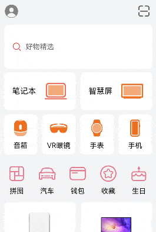

# 滚动吸顶效果实现案例

### 介绍

本示例介绍运用Stack组件以构建多层次堆叠的视觉效果。通过绑定Scroll组件的onScroll滚动事件回调函数，精准捕获滚动动作的发生。当滚动时，实时地调节组件的透明度、高度等属性，从而成功实现了嵌套滚动效果、透明度动态变化以及平滑的组件切换。其中，搜索框能够实现“吸顶”效果，在用户滚动页面时始终保持在顶部。

### 效果图预览



**使用说明**

1. 加载完成后显示整个界面，超过一屏可以上下滑动可见嵌套滚动效果。
2. 当滚动页面时，搜索框的位置会随着父级Scroll组件的滚动而变化。当父级Scroll组件滚动到底部时，搜索框恰好位于屏幕顶部。此时，父级Scroll组件停止滚动，子级Scroll组件开始滚动，实现嵌套滚动效果，从而实现搜索框的“吸顶”功能。

### 实现思路

1. 在向上滑动过程中观察到头部组件（头像和二维码布局界面）是处于层级底部，而其他组件覆盖在其上方，为此，选择[Stack组件](src/main/ets/view/ComponentStack.ets)来获取堆叠效果。搜索框的“吸顶”效果，通过监听onDidScroll事件来捕捉父级Scroll组件沿Y轴滚动的距离，并实时调整搜索框的高度。当用户滚动页面时，搜索框的位置会随着父级Scroll组件的滚动而变化。当父级Scroll组件滚动到底部时，搜索框恰好位于屏幕顶部，此时通过设置.nestedScroll属性（参考下面第4点）来控制父级与子级Scroll组件之间的嵌套滚动效果，进而实现搜索框的“吸顶”功能。
```javascript
Stack({ alignContent: Alignment.Top }) {
  Flex({ justifyContent: FlexAlign.SpaceBetween }) { 
    // 头像和二维码页面布局代码
    // ...
  }
  Scroll(this.scroller) {
    // ...
  }
  .onDidScroll(() => {
    // 获取滑动距离
    const yOffset: number = this.scroller.currentOffset().yOffset;
    // this.searchHeight 随 yOffset变化的公式。按需调整。
    this.searchHeight = this.searchHeightRaw - yOffset * 0.6;
  })
}
```
2. 在搜索栏下方的快捷功能区，向上滑动时，快捷功能区会逐渐隐藏，出现一个横向的新布局的快捷功能区，此处也通过使用[Stack组件](src/main/ets/view/ComponentStack.ets)来获取堆叠效果。
```javascript
Stack({ alignContent: Alignment.Top }) { 
  // 图标背景为白色快捷功能区
  IconView({
    isChange: this.isChange,
    marginSpace: this.marginSpace,
    opacity1: this.opacity1
  })

  // Scroll滚动子组件
  Scroll(this.scroller2) { 
    // 向上滑动透明的横向快捷区逐渐显示的布局代码
    // 上图下文字透明背景样式布局代码
    // 商品列表组件布局代码
    // ...
  }
}
```
3. 实现滚动过程中动态调整文本框高度的功能时，运用Scroll组件滚动事件[回调函数onDidScroll](src/main/ets/view/ComponentStack.ets)在滚动时修改文本框的高度及组件的透明度。
```javascript   
.onDidScroll(() => {
  // 通过Scroll的偏移量来动态修改透明度、尺寸和颜色等属性
  // ...
})
```
4. 存在多层嵌套滚动的情况时，应该先滚动父组件，再滚动自身。只需要在内层的Scroll组件的[属性nestedScroll](src/main/ets/view/ComponentStack.ets)设置向前向后两个方向上的嵌套滚动模式，实现与父组件的滚动联动。
```javascript  
Scroll(this.scroller2){
  // ...
}
.width('100%')
.scrollBar(BarState.Off)
.nestedScroll({
  scrollForward: NestedScrollMode.PARENT_FIRST, // 可滚动组件往末尾端滚动时的嵌套滚动选项,父组件先滚动，父组件滚动到边缘以后自身滚动。
  scrollBackward: NestedScrollMode.SELF_FIRST // 可滚动组件往起始端滚动时的嵌套滚动选项,自身先滚动，自身滚动到边缘以后父组件滚动。
})
```
5. 在商品列表区域，采用[瀑布流（WaterFlow）容器](src/main/ets/view/ProductList.ets)进行布局，将商品信息动态分布并分成两列呈现，每列商品自上而下排列。
```javascript   
WaterFlow() {
  LazyForEach(this.productData, (item: ProductDataModel) => {
    FlowItem() {
      // ...
  }, (item: ProductDataModel) => item.id.toString())
}
.nestedScroll({
  scrollForward: NestedScrollMode.PARENT_FIRST,
  scrollBackward: NestedScrollMode.SELF_FIRST
})
.columnsTemplate("1fr 1fr")
}
```

6. 在商品列表（[ProductList.ets](src/main/ets/view/ProductList.ets)）中，由于进入页面时只显示前两条数据，所以使用分帧加载的方式，在第一帧中将前两条数据放入到列表中，在第二帧中放入剩余数据。

```typescript
aboutToAppear() {
    // 创建DisplaySync对象
    this.displaySync = displaySync.create();
    // 设置期望帧率
    const range: ExpectedFrameRateRange = {
      expected: 120,
      min: 60,
      max: 120
    };
    this.displaySync.setExpectedFrameRateRange(range);
    // 添加帧回调
    this.displaySync.on("frame", () => {
      // 第一帧中加载前两条数据
      if (this.frame === 1) {
        this.productData.pushData(PRODUCT_DATA.slice(0, 2))
        this.frame += 1;
      } else if (this.frame === 2) {
        // 第二帧中放入剩余数据
        this.productData.pushData(PRODUCT_DATA.slice(2, PRODUCT_DATA.length));
        this.frame += 1;
        this.displaySync?.stop();
      }
    });
    // 开启帧回调监听
    this.displaySync.start();
  }
```

### 高性能知识点

本示例使用了LazyForEach进行数据懒加载，[WaterFlow布局](src/main/ets/view/ProductList.ets)时会根据可视区域按需创建FlowItem组件，并在FlowItem滑出可视区域外时销毁以降低内存占用。
本例中Scroll组件绑定onScroll滚动事件回调，onScroll属于频繁回调，在回调中需要尽量减少耗时和冗余操作，例如减少不必要的日志打印。
本例中使用DisplaySync分帧加载数据，减少动画首帧响应时间，降低加载数据的完成时延。

### 工程结构&模块类型

```
componentstack                                   // har类型
|---mock
|   |---IconMock.ets                             // 本地数据源 
|---model
|   |---DataSource.ets                           // 列表数据模型
|   |---IconModel.ets                            // 数据类型定义 
|---view
|   |---ComponentStack.ets                       // 滚动吸顶效果实现案例主页面 
|   |---IconView.ets                             // 按钮快捷入口自定义组件 
|   |---ProductList.ets                          // 商品列表自定义组件
```

### 模块依赖

本实例依赖common模块来实现[资源](../../common/utils/src/main/resources/base/element)的调用。 还需要依赖[EntryAbility.ets模块](../../product/entry/src/main/ets/entryability/EntryAbility.ets)。

### 参考资料

[WaterFlow](https://developer.huawei.com/consumer/cn/doc/harmonyos-references-V4/ts-container-waterflow-0000001815767844-V4?catalogVersion=V4)

[Stack](https://developer.huawei.com/consumer/cn/doc/harmonyos-references-V4/ts-container-stack-0000001815767840-V4?catalogVersion=V4)

[Z序控制](https://developer.huawei.com/consumer/cn/doc/harmonyos-references-V4/ts-universal-attributes-z-order-0000001862687545-V4?catalogVersion=V4)

[触摸测试控制](https://developer.huawei.com/consumer/cn/doc/harmonyos-references-V5/ts-universal-attributes-hit-test-behavior-V5)

[组件可见区域变化事件](https://developer.huawei.com/consumer/cn/doc/harmonyos-references-V4/ts-universal-component-visible-area-change-event-0000001815767708-V4?catalogVersion=V4)

[DisplaySync](https://developer.huawei.com/consumer/cn/doc/harmonyos-references-V5/js-apis-graphics-displaysync-V5)