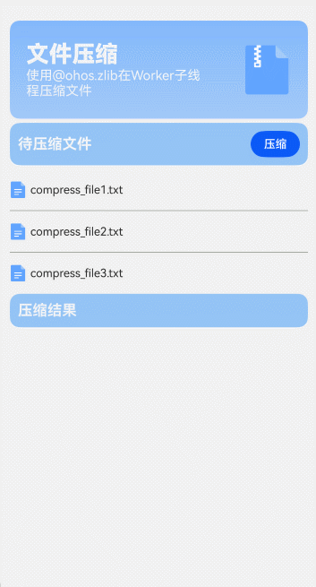

# 文件压缩案例

### 介绍

本示例介绍在[Worker](https://developer.huawei.com/consumer/cn/doc/harmonyos-references-V5/js-apis-worker-V5#onmessage9)子线程使用[@ohos.zlib](https://developer.huawei.com/consumer/cn/doc/harmonyos-references-V5/js-apis-zlib-V5)
提供的zlib.compressfile接口对沙箱目录中的文件进行压缩操作，压缩成功后将压缩包所在路径返回主线程，获取压缩文件列表。

### 效果图预览



**使用说明**

1. 点击压缩按钮，压缩待压缩文件，显示压缩结果。

### 下载安装

1. 模块oh-package.json5文件中引入依赖

   ```json5
   "dependencies": {
     "compressfile": "har包地址"
   }
   ```

2. ets文件import自定义视图实现文件压缩效果组件

   ```ts
   import { CompressFileComponent } from 'compressfile';
   ```

### 快速使用

本节主要介绍了如何快速上手使用压缩文件组件，包括构建压缩组件以及常见自定义参数的初始化。

1. 构建组件

   在代码合适的位置使用CompressFileComponent组件并传入对应的参数，后续将介绍对应参数的初始化。

   ```ts
   /**
    * 构建压缩组件
    * compressBundleName: 压缩成功后压缩包的名字
    * beCompressFileDir: 待压缩文件所在目录名
    * compressZipPath: 压缩成功后压缩包路径
    */
   CompressFileComponent({
     compressBundleName: this.compressBundleName,
     beCompressFileDir: this.beCompressFileDir,
     compressZipPath: this.compressZipDir,
   })
   ```
   
2. 各参数初始化，compressBundle可直接赋空，beCompressFileDir可直接赋值字符串，compressZipPath需指定路径，格式为：目录名/压缩包名字。

   ```ts
   @State compressBundleName: string = ''; // 压缩成功后压缩包名字
   @State compressZipDir: string = 'bundlefile/compress_file.zip'; // 压缩成功后压缩包文件路径
   @State beCompressFileDir: string = 'compressfile'; // 待压缩文件所在目录名
   ```

### 属性(接口)说明

CompressFileComponent组件属性

| 属性              | 类型   | 释义                                            | 默认值 |
| ----------------- | ------ | ----------------------------------------------- | ------ |
| compressBundle    | string | 压缩成功后压缩包的名字                          | -      |
| compressZipPath   | string | 压缩成功后压缩包文件路径                        | -      |
| beCompressFileDir | string | 待压缩文件在rawfile下和应用沙箱目录下所在目录名 | -      |

### 实现思路

本示例通过主线程向子线程发送被压缩文件目录，压缩文件名称和沙箱路径，在子线程中使用Zlib模块提供的zlib.compressfile接口实现文件压缩。
1.  在/src/main/ets/worker目录下创建Worker.ets线程文件，绑定Worker对象。[源码参考](./src/main/ets/worker/Worker.ets)

   ```ts
   const workerPort: ThreadWorkerGlobalScope = worker.workerPort;
   ```

2.  在build-profile.json5中进行配置Worker线程文件路径，Worker线程文件才能确保被打包到应用中。[源码参考](build-profile.json5)

   ```json5
   "buildOption": {
     "sourceOption": {
       "workers": [
         "./src/main/ets/workers/Worker.ets"
       ]
     }
   }
   ```

3.  在主线程创建一个Worker线程，通过new worker.ThreadWorker()创建Worker实例，传入Worker.ets的加载路径。[源码参考](./src/main/ets/components/CompressFileComponent.ets)

   ```ts
   let workerInstance: worker.ThreadWorker = new worker.ThreadWorker('@compressfile/ets/worker/Worker.ets');
   ```

4. 主线程使用postMessage()向Worker线程发送应用沙箱路径，压缩包路径和被压缩文件所在目录。[源码参考](./src/main/ets/components/CompressFileComponent.ets)

   ```ts
   workerInstance.postMessage({
     pathDir: this.pathDir,
     compressZipPath: this.compressZipPath,
     beCompressFileDir: this.beCompressFileDir
   });
   ```
   
5.  在Worker.ets文件中通过调用onmessage()方法接收主线程发送的应用沙箱路径，压缩文件名称和压缩文件目录名称。[源码参考](./src/main/ets/worker/Worker.ets)

   ```ts
   workerPort.onmessage = (e: MessageEvents): void => {
     logger.info(TAG, `Worker onmessage：${JSON.stringify(e.data)}`);
     const pathDir: string = e.data.pathDir; // 沙箱目录
     const rawfileDirName: string = e.data.beCompressFileDir; // 被压缩文件所在目录名
     // TODO: 知识点: 压缩文件输出路径不能有特殊字符，否则会压缩失败
     // 压缩包输出路径
     const outFilePath: string = `${pathDir}/${e.data.compressZipPath}`;
     // 压缩包输出目录
     const outFileDir: string = outFilePath.slice(0, outFilePath.lastIndexOf('/'));
   };
   ```
   
6. 使用fs.access判断输出目录是否已经存在，如果不存在使用fs.mkdirSync()创建空目录用于放置压缩后的文件。空目录创建成功后使用zlib.compressFile接口压缩文件，输出到空目录中。[源码参考](./src/main/ets/worker/Worker.ets)

   ```ts
   fs.access(outFileDir, (err: BusinessError, res: boolean) => {
     if (err) {
       logger.error(TAG, `access failed with error message: ${err.message}, error code: ${err.code}`)
     } else {
       if (!res) {
         fs.mkdirSync(outFileDir);
         logger.info(TAG, 'mkdirSync succeed');
       }
     }
   });
   let options: zlib.Options = {
     level: zlib.CompressLevel.COMPRESS_LEVEL_DEFAULT_COMPRESSION,
     memLevel: zlib.MemLevel.MEM_LEVEL_DEFAULT,
     strategy: zlib.CompressStrategy.COMPRESS_STRATEGY_DEFAULT_STRATEGY
   };
   try {
     // 对目录下的文件进行压缩
     zlib.compressFile(`${pathDir}/${rawfileZipName}`, outFile, options, (errData: BusinessError) => {
       if (errData !== null) {
         logger.error(TAG, `compress failed with error message: ${errData.message}, error code: ${errData.code}`);
       } else {
         workerPort.postMessage(outFileDir);
       }
     })
   } catch (errData) {
     let code = (errData as BusinessError).code;
     let message = (errData as BusinessError).message;
     logger.error(TAG, `compress errData is error code: ${code}, message: ${message}`);
   }
   ```

### 高性能知识点

1. 本示例使用在Work子线程中使用zlib.compressFile压缩文件，避免阻塞主线程的运行。参考文章[多线程能力场景化示例实践](../../../docs/performance/multi_thread_capability.md)。

### 工程结构&模块类型

```
compressFile                                  // har类型
|---/src/main/ets/components                        
|   |---CompressFile.ets                      // 文件压缩案例首页
|   |---CompressFileComponent.ets             // 文件压缩组件
|---/src/main/ets/worker                        
|   |---Worker.ets                            // Worker线程
|---/src/main/ets/utils
|   |---Logger.ets                            // 日志打印工具类
```

### 模块依赖

   [routermodule(动态路由)](../../common/routermodule)

### 参考资料

   [@ohos.worker(启动一个Worker)](https://developer.huawei.com/consumer/cn/doc/harmonyos-references-V5/js-apis-worker-V5#onmessage9)

   [@ohos.zlib(Zip模块)](https://developer.huawei.com/consumer/cn/doc/harmonyos-references-V5/js-apis-zlib-V5)

   [@ohos.file.fs(文件管理)](https://developer.huawei.com/consumer/cn/doc/harmonyos-references-V5/js-apis-file-fs-V5)
