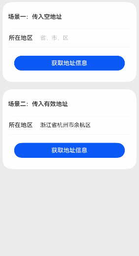

# 自定义地址选择案例

### 介绍

本示例介绍如何使用bindSheet，changeIndex，onAreaChange实现带切换动效的自定义地址选择组件。

### 效果图预览



**使用说明**

1. 进入页面，点击场景一中“所在地区”一栏，可拉起省市区的地址选择弹窗。选择完区后，弹窗自动关闭，“所在地区”一栏显示当前选择的省市区名。

2. 进入页面，点击场景二中的'获取地址信息'按钮，可以查看省市区名和相应的id。点击“所在地区”一栏，在拉起的地址选择弹窗里选择另一个省市区后，再次点击'获取地址信息'按钮，会显示最新选择的省市区的信息。

### 实现思路

1. 使用getRawFileContentSync从rawfile目录下读取省市区json文件数据，使用util.TextDecoder进行解码。源码参考[JsonUtils.ets](./src/main/ets/customaddresspicker/utils/JsonUtils.ets)。

```typescript
getAddressData(): Array<Province> {
  // 从rawfile本地json文件中获取数据
  const value = getContext().resourceManager.getRawFileContentSync(this.jsonFileDir);
  // 解码为utf-8格式
  const textDecoder = util.TextDecoder.create('utf-8', { ignoreBOM: true });
  const textDecoderResult = textDecoder.decodeToString(new Uint8Array(value.buffer));
  const jsonObj: JsonObjType = JSON.parse(textDecoderResult) as JsonObjType;
  const modelBuckets: Array<Province> = [];
  // 映射json数据为model对象
  const modelObj = jsonObj.addressList;
  for (let i = 0; i < modelObj.length; i++) {
  const contactTemp = new Province(modelObj[i].code, modelObj[i].name, modelObj[i].children);
  // 从json中读取每个省数据写入modelBuckets
  modelBuckets.push(contactTemp);
}
return modelBuckets;
}
```

2. 使用bindSheet绑定地址选择半模态弹窗页面。源码参考[CustomAddressPicker.ets](./src/main/ets/customaddresspicker/view/CustomAddressPicker.ets)。

```typescript
Row() {
  // ...
}
.width($r('app.string.custom_address_picker_full_size'))
.height($r('app.float.custom_address_picker_size_forty_eight'))
.onClick(() => {
  // 显示地址选择半模态弹窗页面
  this.isShow = true;
  this.currentIndex = AddressType.Province;
})
.bindSheet($$this.isShow, this.addressSelectPage(), {
  height: $r('app.string.custom_address_picker_percent_seventy'), // 半模态弹窗高度
  showClose: false, // 设置不显示自带的关闭图标
  dragBar: false,
  onDisappear: () => {
    // 退出地址选择半模态弹窗页面时，重置相关参数
    this.animationDuration = 0;
    // 如果当前省市区没选全，则清空当前选择的地址信息
    if (this.currentSelectInfo.region === '') {
      this.currentSelectInfo.provinceId = '';
      this.currentSelectInfo.cityId = '';
      this.currentSelectInfo.regionId = '';
      this.currentSelectInfo.province = '';
      this.currentSelectInfo.city = '';
      this.currentSelectInfo.region = '';
      this.cityList = [];
      this.regionList = [];
    }
  }
})
```

3. 使用changeIndex控制省市区列表TabContent切换。使用组件区域变化回调onAreaChange获取选择的省市区Text组件宽度，存入textInfos数组，用于后续计算选择省市区名后下方下滑线动画水平偏移量leftMargin。源码参考[CustomAddressPicker.ets](./src/main/ets/customaddresspicker/view/CustomAddressPicker.ets)。

```typescript
Text(`${params.name === '' ? '请选择' : params.name} `)
  .height($r('app.string.custom_address_picker_full_size'))
  .fontSize($r('app.float.custom_address_picker_size_sixteen'))
  .fontWeight(this.currentIndex === params.index ? Constants.FONT_WEIGHT_FIVE_HUNDRED :
  Constants.FONT_WEIGHT_FOUR_HUNDRED)
  .fontColor(this.currentIndex === params.index ? $r('app.color.custom_address_picker_font_color_black') :
  $r('app.color.custom_address_picker_font_color_gray'))
  .constraintSize({ maxWidth: 'calc(33%)' })
  .textOverflow({ overflow: TextOverflow.Ellipsis })
  .maxLines(Constants.SIZE_ONE)
  .onClick(() => {
    // 使用changeIndex控制省市区列表TabContent切换
    this.controller.changeIndex(params.index);
  })
  .id(params.index.toString())
  .onAreaChange((oldValue: Area, newValue: Area) => {
    // 使用组件区域变化回调onAreaChange获取选择的省市区Text组件宽度，存入textInfos数组，用于后续计算选择省市区名后下方下滑线动画水平偏移量leftMargin
    // 组件区域变化时获取当前Text的宽度newValue.width和x轴相对位置newValue.position.x
    this.textInfos[params.index] = [newValue.position.x as number, newValue.width as number];
    if (this.currentIndex === params.index && params.index === AddressType.Province) {
      // 计算选择的省市区名下方的下滑线偏移量
      this.leftMargin = (this.textInfos[this.currentIndex][1] - Constants.DIVIDER_WIDTH) / 2;
    }
  })
```

4. 在选择完区名后，使用JSON.parse(JSON.stringify(xxx))深拷贝选择的省市区数据，用于后续操作中需要加载上一次选择的完整省市区数据。源码参考[CustomAddressPicker.ets](./src/main/ets/customaddresspicker/view/CustomAddressPicker.ets)。

```typescript
List() {
  ForEach(this.regionList, (item: CommonAddressList) => {
    ListItem() {
      this.areaNameItem(AddressType.Region, item)
    }.onClick(() => {
      // 记录选择的区信息
      this.currentSelectInfo.regionId = item.code;
      this.currentSelectInfo.region = item.name;
      this.provinceCityRegion =
        this.currentSelectInfo.province + this.currentSelectInfo.city + this.currentSelectInfo.region;
      // 选择区后，退出地址选择半模态弹窗页面
      this.isShow = false;
      // 将当前选中省市区信息保存到lastSelectInfo
      this.lastSelectInfo.provinceId = this.currentSelectInfo.provinceId;
      this.lastSelectInfo.province = this.currentSelectInfo.province;
      this.lastSelectInfo.cityId = this.currentSelectInfo.cityId;
      this.lastSelectInfo.city = this.currentSelectInfo.city;
      this.lastSelectInfo.regionId = this.currentSelectInfo.regionId;
      this.lastSelectInfo.region = this.currentSelectInfo.region;
      // TODO 知识点：在选择完区名后，使用JSON.parse(JSON.stringify(xxx))深拷贝选择的省市区数据，用于后续操作中需要加载上一次选择的完整省市区数据
      // 深拷贝保存到相应的变量中
      this.lastCityList = JSON.parse(JSON.stringify(this.cityList));
      this.lastRegionList = JSON.parse(JSON.stringify(this.regionList));
      this.address = JSON.parse(JSON.stringify(this.lastSelectInfo));
    })
  }, (item: CommonAddressList) => JSON.stringify(item))
}
```

### 高性能知识点

本示例中如果当前点击选择的省或者市与之前选择一样，则跳过省、市数据获取，直接调用changeIndex(AddressType.City)切换到下一级地区列表，减少冗余查询以提升性能。

### 工程结构&模块类型

```
customaddresspicker                             // har类型
|---pages
|   |---AddressPickerSample.ets                 // 地址选择场景页面
|---customaddresspicker
|   |---constant
|   |   |---Constants.ets                       // 常量定义
|   |---model
|   |   |---AddressModel.ets                    // 地址选择相关类
|   |---utils
|   |   |---JsonUtils.ets                       // json工具类
|   |---view
|   |   |---CustomAddressPicker.ets             // 自定义地址选择组件
```

### 模块依赖

本示例依赖路由模块来[注册路由](../../common/routermodule/src/main/ets/router/DynamicsRouter.ets)。

### 参考资料

[util工具函数](https://developer.huawei.com/consumer/cn/doc/harmonyos-references-V5/js-apis-util-V5)

[bindSheet](https://developer.huawei.com/consumer/cn/doc/harmonyos-references-V5/ts-universal-attributes-sheet-transition-V5#bindsheet)

[onAreaChange](https://developer.huawei.com/consumer/cn/doc/harmonyos-references-V5/ts-universal-component-area-change-event-V5#onareachange)