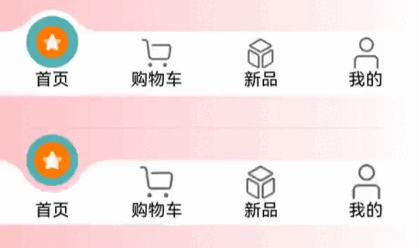

# 自定义TabBar页签凸起和凹陷案例

### 介绍

本文基于已有的模块[自定义TabBar](../customtabbar/README.md)
思路，完善了凸起的选择时凸起点交界处的圆滑过度，并扩展了一个 凹陷选择时不遮挡原本内容。

### 效果图预览



**使用说明**：

1. 依次点击tabBar页面，凸起和凹陷的选择样式移动到指定位置并且图标移动到圆球中心。

### 实现思路

**场景1：TabBar页面实现有一圈圆弧外轮廓**

单独绘制一个圆，然后将圆向上偏移1/3。通过 `radialGradient` 设置选中的圆心的背景色，然后在单独绘制左右俩边的圆角过渡。
具体代码可参考[TabsRaisedCircleSelect.ets](src/main/ets/components/tabsRaisedCircle/TabsRaisedCircleSelect.ets)

```typescript
RelativeContainer() {
  // 选中时凸起的圆
  Column()
    .aspectRatio(1)
    .height(TabItemSelectOptions.chamfer.circleDiameter)
    .borderRadius(TabItemSelectOptions.chamfer.circleDiameter / 2)
    .borderWidth(TabItemSelectOptions.chamfer.circleDiameter * 0.1)
    .borderColor(TabItemSelectOptions.tabsBgColor)
    .radialGradient({
      center: [TabItemSelectOptions.chamfer.circleDiameter / 2, TabItemSelectOptions.chamfer.circleDiameter / 2],
      radius: TabItemSelectOptions.chamfer.circleDiameter / 2,
      colors: [[TabItemSelectOptions.tabsSelectBgColor,
        (TabItemSelectOptions.chamfer.circleDiameter - 10) / TabItemSelectOptions.chamfer.circleDiameter],
        [Color.Transparent,
          (TabItemSelectOptions.chamfer.circleDiameter - 10) / TabItemSelectOptions.chamfer.circleDiameter]]
    })
    .id(TabItemSelectOptions.selectBodyId)
  if (TabItemSelectOptions.chamfer) {
    // 凸起圆 左边 的圆滑过度
    // TODO：知识点：通过裁切+渐变色制作一个平滑的过渡
    Column()
      .width(TabItemSelectOptions.chamfer.chamferXY[0])
      .height(TabItemSelectOptions.chamfer.chamferXY[1])
      .radialGradient({
        center: [0, 0],
        radius: TabItemSelectOptions.chamfer.chamferRadius,
        colors: [[Color.Transparent, 0.0], [Color.Transparent, 1], [TabItemSelectOptions.tabsBgColor, 1]]
      })
      .clipShape(new PathShape({
        commands: `M0 0 L0 ${vp2px(TabItemSelectOptions.chamfer.chamferXY[1])}   L${vp2px(TabItemSelectOptions.chamfer.chamferXY[0])} ${vp2px(TabItemSelectOptions.chamfer.chamferXY[1])} Z`
      }))
      .zIndex(-1)
      .alignRules({
        'right': { 'anchor': TabItemSelectOptions.selectBodyId, 'align': HorizontalAlign.Center },
        "bottom": { 'anchor': TabItemSelectOptions.selectBodyId, 'align': VerticalAlign.Center }
      })
    // 凸起圆 右边 的圆滑过度
    // TODO：知识点：通过裁切+渐变色制作一个平滑的过渡
    Column()
      .width(TabItemSelectOptions.chamfer.chamferXY[0])
      .height(TabItemSelectOptions.chamfer.chamferXY[1])
      .radialGradient({
        center: [TabItemSelectOptions.chamfer.chamferXY[0], 0],
        radius: TabItemSelectOptions.chamfer.chamferRadius,
        colors: [[Color.Transparent, 0.0], [Color.Transparent, 1], [TabItemSelectOptions.tabsBgColor, 1]]
      })
      .clipShape(new PathShape({
        commands: `M0 ${vp2px(TabItemSelectOptions.chamfer.chamferXY[1])}  L${vp2px(TabItemSelectOptions.chamfer.chamferXY[0])} 0 L${vp2px(TabItemSelectOptions.chamfer.chamferXY[0])} ${vp2px(TabItemSelectOptions.chamfer.chamferXY[1])} Z`
      }))
      .zIndex(-1)
      .alignRules({
        'left': { 'anchor': TabItemSelectOptions.selectBodyId, 'align': HorizontalAlign.Center },
        "bottom": { 'anchor': TabItemSelectOptions.selectBodyId, 'align': VerticalAlign.Center }
      })
  }
}
.width("auto")
.offset({
    x: -(TabItemSelectOptions.chamfer.circleDiameter / 2),
    y: -(TabItemSelectOptions.chamfer.circleDiameter / 3)
})
.zIndex(-1)
.alignRules({
    'left': {
      'anchor': `${TabItemSelectOptions.tabItemId}${TabItemSelectOptions.selectIndex}`,
      'align': HorizontalAlign.Center
    }
})
```

**场景2：TabBar页面实现有一圈凹陷的轮廓**

通过 `canvas` 来绘制 TabBar 的背景和凹槽部分，然后通过 `Stack` 来将 球体 和 菜单层叠在一起组合成一个完整的 TabBar 。
具体代码可参考[TabsConcaveCircle.ets](src/main/ets/components/tabsConcaveCircle/TabsConcaveCircle.ets)

```typescript
Stack() {
  // TODO: 背景 - 实现 凹槽 部分
  Canvas(this.context)
    .width('100%')
    .height('100%')
    .onReady(() => this.initCanvas())
  // 凹槽 上方球体部分
  if (this.circleInfo) {
    Column()
      .width(this.circleInfo.circleRadius * 2)
      .height(this.circleInfo.circleRadius * 2)
      .borderRadius(this.circleInfo.circleRadius)
      .backgroundColor(this.tabsSelectBgColor)
      .position({
        x: this.circleInfo.positionX,
        y: this.circleInfo.positionY
      })
  }
  // 菜单选项
  Row() {
    ForEach(this.tabsMenu || [], (item: TabMenusInterfaceIRequired, index: number) => {
      this.TabItem(item, index)
    })
  }
  .width("100%")
  .height("100%")
}
.width("100%")
.height(this.tabHeight)
```

**场景3：TabBar页签点击之后会改变图标显示，并有一小段动画效果**

改变图标显示功能可以先声明一个变量selectedIndex，此变量代表被选定的tabBar下标，点击的时候将当前tabBar的下标值进行赋值。
通过当前被选中的tabBar下标值和tabBar自己的下标值进行判断来达到点击之后改变图标显示的效果。
动画效果使用[animateTo](https://developer.huawei.com/consumer/cn/doc/harmonyos-references-V5/ts-explicit-animation-V5)
来触发动画 
具体代码分别参考。
[1.凸起 TabsRaisedCircle.ets](src/main/ets/components/tabsRaisedCircle/TabsRaisedCircle.ets)。
[2. 凹槽 TabsConcaveCircle.ets](src/main/ets/components/tabsConcaveCircle/TabsConcaveCircle.ets)。
动画触发地方参考两个文件中 `animateTo` 的地方。
凹槽的样式在`animateTo`会有一个`createAnimation`用来重新绘制`canvas`。
`getAnimateSelectIndex`方法是用来等待时间后图标上移。防止交叉动画。

```typescript
onClick(() => {
  animateTo({
    duration: this.animateTime,
  }, () => {
    this.selectIndex = index;
  })
})
/**
 * 获取动画控制的下标
 * 用于切换选项时，先让标签回到底部，然后让当前选项在上移
 */
getAnimateSelectIndex() {
  // 动画等待时间 - 用于等待上一个选项动画结束
  let animateDelay = 500;
  animateTo({
    duration: this.animateTime,
    delay: animateDelay
  }, () => {
    this.animateSelectIndex = this.selectIndex
  })
}
```

### 高性能知识点

不涉及。

### 工程结构&模块类型

```
customtabbar                                   // har类型
|---components
|   |---TabsConcaveCircle
|   |   |---TabsConcaveCircle.ets              // 视图层 - 凹槽自定义TabBar页面
|   |---TabsRaisedCircle
|   |   |---TabsRaisedCircle.ets               // 视图层 - 凸起自定义TabBar页面
|   |   |---TabsRaisedCircleSelect.ets         // 视图层 - 凸起选中时圆形样式
|---types
|   |---ConcaveCircleType.ets                  // 数据结构层-凹槽所需要的数据结构
|   |---RaisedCircleTypes.ets                  // 数据结构层-凸起所需要的数据结构
|   |---TabMenusInterface.ets                  // 数据结构层-TabBar所需要的数据结构
|---utils
|   |---Functions.ets                          // 处理层-公共方法
|   |---CircleClass.ets                        // 处理层-数据类-class
|---view
|   |---index.ets                              // 示例代码
```

### 模块依赖

不涉及。

### 参考资料

[显式动画 (animateTo)](https://developer.huawei.com/consumer/cn/doc/harmonyos-references-V5/ts-explicit-animation-V5)

[Tabs组件](https://developer.huawei.com/consumer/cn/doc/harmonyos-references-V5/ts-container-tabs-V5)

[Canvas组件](https://developer.huawei.com/consumer/cn/doc/harmonyos-references-V5/ts-components-canvas-canvas-V5)

