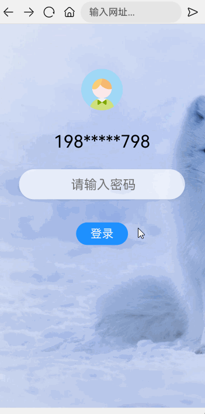

# H5页面调用自定义输入法案例

### 介绍

本示例介绍了[@ohos.web.webview](https://developer.huawei.com/consumer/cn/doc/harmonyos-references/js-apis-webview-0000001813416660)组件和[Web](https://developer.huawei.com/consumer/cn/doc/harmonyos-references/ts-basic-components-web-0000001860247877)以及[CustomDialog](https://developer.huawei.com/consumer/cn/doc/harmonyos-references/ts-methods-custom-dialog-box-0000001815767908)接口实现H5页面调用自定义输入法的功能。
该场景多用于浏览器需要使用安全输入法时。

### 效果图预览



**使用说明**：

* 点击密码输入框，弹出自定义键盘。
* 在自定义键盘上输入内容，能成功映射到h5页面内。

### 实现步骤

实现H5页面调用自定义输入法，有两个关键点，一是需要将arkTS方法注册到h5页面中；二是要实现弹出键盘的组件。

1. 构建一个 Browser 对象，集成浏览器的方法。创建一个自定义组件 TabletTitle，构成浏览器的工具栏。
```ts
// 自定义浏览器对象
export class Browser {
  inputValue: string = "";
  progress: number = 0;
  isRegistered: boolean = false;
  hideProgress: boolean = true;
  tabsController: TabsController = new TabsController();
  webController: WebviewController = new web_webview.WebviewController();
  // 跳转页面
  loadUrl(addr: string | Resource) {
    this.webController.loadUrl(addr);
  }
  // 返回页面
  back(): boolean {
    if (this.webController.accessBackward()) {
      this.webController.backward();
      return true;
    }
    return false;
  }
  // 前进页面
  forward() {
    if (this.webController.accessForward()) {
      this.webController.forward();
    }
  }
  // 刷新页面
  refresh() {
    this.webController.refresh();
  }
}
```
2. 自定义键盘传入js对象 WebKeyboardObj， 构建两个函数：点击登录按钮事件和输入法弹窗弹出事件。其中输入法弹出事件中使用[CustomDialog](https://developer.huawei.com/consumer/cn/doc/harmonyos-references/ts-methods-custom-dialog-box-0000001815767908)修饰的组件，打开自定义弹窗。
```ts
dialogController: CustomDialogController | null = new CustomDialogController({
  builder: CustomKeyboard({
    dialogClose: this.dialogClose,
    items: this.items,
    inputValue: this.inputValue,
    curKeyboardType: this.curKeyboardType,
    onKeyboardEvent: this.onKeyboardEvent,
    closeDialog: this.closeDialog
  }),
  isModal: false,
  alignment: DialogAlignment.Bottom,
  customStyle: true
});
// ...
webKeyboardObj: WebKeyboardObj = {
  // 点击登录按钮事件
  login: () => {
    promptAction.showToast({
      message: $r('app.string.custom_keyboard_to_h5_login_button'),
      duration: 2000
    });
    this.closeDialog();
  },
  // 输入法弹窗弹出事件
  openDialog: (value: string) => {
    this.dialogController?.open();
    this.dialogClose = false;
    if (value?.length) {
      this.inputValue = value;
    }
  }
}
```
3. 将webKeyboardObj对象通过[webController.registerJavaScriptProxy](https://developer.huawei.com/consumer/cn/doc/harmonyos-references/js-apis-webview-0000001813416660#ZH-CN_TOPIC_0000001813416660__registerjavascriptproxy)注册到h5页面中,使页面中可以调用arkTS的方法。
```ts
// 注册方法到h5的js中
registerFunc(browser: Browser) {
  if (!browser.isRegistered) {
    browser.webController.registerJavaScriptProxy(this.webKeyboardObj, 'etsObj',
      ['login', 'openDialog'])
    browser.isRegistered = true;
    browser.webController.refresh();
  }
}
```
4. 构建一个h5页面，在js层中调用注册进入的arkTS方法。
```html
<script>
  function tapInput() {
    document.activeElement.blur();
    let input = document.getElementById("searchCon");
    etsObj.openDialog(input.value); // 打开自定义弹窗
  }
  function setInput(value) {
    let input = document.getElementById("searchCon");
    input.value = value;
  }
  function login() {
    etsObj.login(); // 点击登录按钮
  }
</script>
```

### 高性能知识点

**不涉及**

### 工程结构&模块类型

   ```
   customkeyboardtoh5                                 // har
   |---components
   |   |---Browser.ets                                // 浏览器对象类型
   |   |---CustomKeyboard.ets                         // 自定义键盘组件
   |   |---TitleBar.ets                               // Web组件
   |---model
   |   |---Constants.ets                              // 键盘组件对象类型
   |---view
   |   |---BrowserSafeCheck.ets                       // 容器页面
   ```

### 模块依赖

**不涉及**

### 参考资料

[Web](https://developer.huawei.com/consumer/cn/doc/harmonyos-references/ts-basic-components-web-0000001860247877)

[@ohos.web.webview](https://developer.huawei.com/consumer/cn/doc/harmonyos-references/js-apis-webview-0000001813416660)

[CustomDialog](https://developer.huawei.com/consumer/cn/doc/harmonyos-references/ts-methods-custom-dialog-box-0000001815767908)
