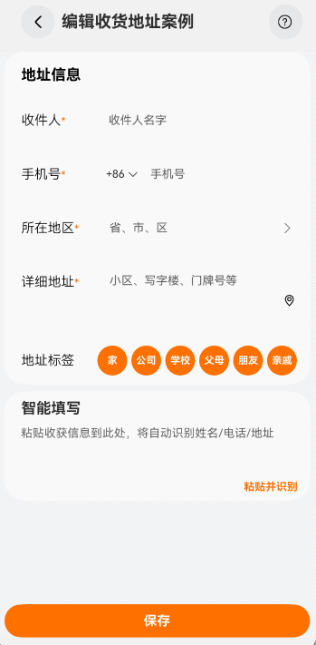

# 编辑收货地址案例

### 介绍

本示例多用于表单填写场景：其中通过使用TextPicker滑动选择文本内容组件实现三级联动选择省市区，并回填到输入框。

### 效果图预览



**使用说明**

1. 点击编辑收货地址案例。
2. 点击所在地区的输入框，弹出TextPicker组件，滑动选择省市区等待滑动结束静止后，点击确认，省市区回填到输入框中。
3. 点击底部的保存按钮时，表单会从上到下逐个验证，例如当用户同时未输入收件人和手机号时，会优先弹窗提示"姓名不能为空"，
当收件人填写完成，手机号没填时，点击保存，会弹窗提示"手机号不能为空"，以此类推直到收件人、手机号、所在地区、详细地址输入框都填写完成，点击按钮弹窗
"保存成功，此样式仅为案例展示"。

### 下载安装

1. 模块oh-package.json5文件中引入依赖。
```typescript
"dependencies": {
  "@ohos-cases/editaddress": "har包地址"
}
```
2. ets文件import实现自定义TextPicker视图。

```typescript
import { TextPickerView } from '@ohos-cases/editaddress';
```

### 快速使用

本章节主要介绍了如何快速实现一个自定义TextPicker的功能。
1. 初始化TextPicker的内容数据。开发者可以自行传递cascade的json数据，自定义取消和确定的方法，定义默认选中项在数组中的索引值，自定义TextPicker的标题内容。

```typescript
@State cascade: Array<Cascade> = [];

title: string | Resource = $r('app.string.editaddress_bind_sheet_title');
```

2. 构建TextPickerView视图组件。

```typescript
@Builder
textPickerBuild(cascade: Array<Cascade>,
selectHandle: (selectArr: number | number []) => void,
cancelHandle: () => void,
indexArr: number | number [], title: string | Resource) {
  Column() {
    TextPickerView({
      cascade,
      selectHandle,
      cancelHandle,
      indexArr,
      title
    });
  }
}
```

3. 将组件绑定在半模态。
```typescript
.bindSheet($$this.isPresent,
  this.textPickerBuild(this.cascade,
    (selectArr: number | number []) => {
      this.getSelectedPlace(selectArr);
      this.isPresent = false;
      this.isTextViewClicked = false;
    }, () => {
      this.isPresent = false;
      this.isTextViewClicked = false;
    }, this.addressForm.provinceArr, this.title), {
    // TextInput绑定半模态转场
    height: this.sheetHeight, // 半模态高度
    dragBar: this.showDragBar, // 是否显示控制条
    // 平板或折叠屏展开态在中间显示
    preferType: this.isCenter ? SheetType.CENTER : SheetType.POPUP,
    backgroundColor: $r('app.color.editaddress_btn_bgc'),
    showClose: false, // 是否显示关闭图标
    shouldDismiss: ((sheetDismiss: SheetDismiss) => { // 半模态页面交互式关闭回调函数
      sheetDismiss.dismiss();
    })
  })
```

### 属性(接口)说明

TextPickerView视图属性

|      属性      |         类型          |   释义   | 默认值 |
|:------------:|:-------------------:|:------:|:---:|
|  cascade     |   Array<Cascade>    | 联动资源属性 |  -  |
| selectHandle |        void         |  点击确定逻辑  |  -  |
| cancelHandle |        void         |  点击取消逻辑  |  -  |
|   indexArr   | number \| number [] |  默认选中项在数组中的索引值  |  -  |
|    title     | string \| Resource  |  TextPickerView标题  |  -  |

### 实现思路
场景：
通过使用TextPicker滑动选择文本内容组件实现三级联动选择省市区，并回填到输入框。
1. 通过给TextInput组件绑定半模态转场，与TextPicker组件结合，实现点击所在地区的输入框时，弹出半模态页面里选择省市区的样式。
```typescript
@Builder
halfModalLogin() { // 半模态窗口页面
  Column() {
    Row({ space: SPACE_THIRTY }) {
      Text($r('app.string.editaddress_bind_sheet_cancel'))
        .fontColor("#256fb5")
        .fontSize(18)
        .fontWeight(450)
        .padding({ bottom: 15, left: 50 })
        .onClick(() => {
          this.cancelHandle()
        })

      Text($r('app.string.editaddress_bind_sheet_title'))
        .fontColor(Color.Black)
        .fontSize(19)
        .padding({ bottom: 15 })

      Text($r('app.string.editaddress_bind_sheet_verify'))
        .fontColor("#256fb5")
        .fontSize(18)
        .fontWeight(450)
        .padding({ bottom: 15 })
        .onClick(() => {
          this.selectHandle(this.indexArr)
        })
    }
    .padding({ top: 20 })
    .backgroundColor($r('app.color.editaddress_bind_sheet_title_bgc'))
    .width('100%')

    TextPicker({ range: cascade, selected: this.addressForm.provinceArr })
      // TODO：滑动选中TextPicker文本内容后，触发该回调。当显示文本或图片加文本列表时，value值为选中项中的文本值
      .onChange((value: string | string[], index: number | number[]) => { 
        if (index instanceof Array) {
          this.addressForm.provinceArr = index;
        }
      })
      .padding({ top: 15 })
  }
}
build() {
  // ...
  TextInput({ placeholder: '省、市、区', text: this.addressForm.province })
     /**
     * TODO: 知识点: 通过bindSheet属性为组件绑定半模态页面，由于半模态必须绑定组件，
     * 此处绑定TextInput组件配合TextPicker作为半模态展示。
     * isPresent：是否显示半模态页面
     */
    .bindSheet($$this.isPresent,
      this.textPickerBuild(this.cascade,
        (selectArr: number | number []) => {
          this.getSelectedPlace(selectArr);
          this.isPresent = false;
          this.isTextViewClicked = false;
        }, () => {
          this.isPresent = false;
          this.isTextViewClicked = false;
        }, this.addressForm.provinceArr, this.title), {
        // TextInput绑定半模态转场
        height: this.sheetHeight, // 半模态高度
        dragBar: this.showDragBar, // 是否显示控制条
        // 平板或折叠屏展开态在中间显示
        preferType: this.isCenter ? SheetType.CENTER : SheetType.POPUP,
        backgroundColor: $r('app.color.editaddress_btn_bgc'),
        showClose: false, // 是否显示关闭图标
        shouldDismiss: ((sheetDismiss: SheetDismiss) => { // 半模态页面交互式关闭回调函数
          sheetDismiss.dismiss();
        })
      })
}
```
2. 定义省市区的json格式数据存放在文件中，通过在aboutToAppear()中调用loadRegion()，从文件中读取省市区json数据。
```typescript
aboutToAppear(): void {
  this.loadRegion();
}

/**
 * 从文件中读取省市区json数据
 */
async loadRegion(): Promise<void> {
  try {
  // 通过getRawFileContent()获取resources/rawfile目录下对应的文件内容，得到一个字节数组
  getContext(this).resourceManager.getRawFileContent(this.fileName, (error: BusinessError, value: Uint8Array) => {
  let rawFile = value;
  let textDecoder = util.TextDecoder.create('utf-8', { ignoreBOM: true });
  let retStr = textDecoder.decodeToString(rawFile, { stream: false }); // 再用@ohos.util (util工具函数)的TextDecoder给它解析出来
  this.cascade = JSON.parse(retStr);
})
} catch (error) {
  let code = (error as BusinessError).code;
  let message = (error as BusinessError).message;
  console.error(`callback getRawFileContent failed, error code: ${code}, message: ${message}.`);
}
}
```
3. 当滑动选中TextPicker文本内容后，通过.onChange((value: string | string[])触发回调，通过返回的当前选中项的索引值Index选中项数组对象进行循环处理，得到处理好的省市区字符串，点击"确认"时赋值给TextInput，完成回填。
```typescript
/**
 * 从TextPicker返回选中的数据中逐级查找省、市、区的名称，并将其组合成一个完整的地址字符串。
 */
getSelectedPlace(selectArr: number | number []) {
  if (this.addressForm.provinceArr instanceof Array) {
    let province = this.cascade[selectArr[0]]; // 获取省信息
    let areaName = ""; // 存储最终构建的省市区名称
    if (province) {
      areaName += this.cascade[selectArr[0]].text; // 省的名称添加到容器里
      if (province.children) { // 检查是否有市的信息
        let city = province.children[selectArr[1]]; // 市的名称添加到容器里
        if (city) {
          areaName += city.text;
          if (city.children) { // 检查是否有区的信息
            areaName += city.children[selectArr[2]].text; // 区的名称添加到容器里
          }
        }
      }
    }
    this.addressForm.areaName = areaName; // 将取出的省市区拼接的字符串回填给TextInput
    return;
  }
}

@Builder
halfModalLogin() { // 半模态窗口页面
  Column() {
    Row({ space: SPACE_THIRTY }) {
      // 半模态的确认按钮
      Text($r('app.string.editaddress_bind_sheet_verify'))
        .onClick(() => {
          this.getSelectedPlace();
        })
    }

    TextPicker({ range: cascade, selected: this.addressForm.provinceArr })
      // TODO：滑动选中TextPicker文本内容后，触发该回调。当显示文本或图片加文本列表时，value值为选中项中的文本值
      .onChange((value: string | string[], index: number | number[]) => { 
        if (index instanceof Array) {
          this.addressForm.provinceArr = index;
        }
      })
      // 设置所有选项中除了最上、最下及选中项以外的文本颜色、字号、字体粗细。
      .textStyle({
        color: $r('app.color.editaddress_textStyle_font_color'),
        font: {
          size: $r('app.string.editaddress_textStyle_font_size'),
          weight: FontWeight.Regular
        }
      })
      // 设置选中项的文本颜色、字号、字体粗细。
      .selectedTextStyle({
        color: $r('app.color.editaddress_selectedTextStyle_font_color'),
        font: {
          size: $r('app.string.editaddress_selectedTextStyle_font_size'),
          weight: FontWeight.Medium
        }
      })
  }
}
build() {
  // ...
  // 通过text属性
  TextInput({ placeholder: '省、市、区', text: this.addressForm.province })
}
```
4. 通过点击保存按钮时，触发嵌套的if条件验证从而实现表单从上到下必填验证功能。
```typescript
/**
 * 保存时，校验表单从上到下每项必填的方法
 */
validForm(): boolean {
  if (!this.addressForm.name) {
    promptAction.showToast({ message: $r('app.string.editaddress_name_judge') });
    return false;
  }
  if (!this.addressForm.phone) {
    promptAction.showToast({ message: $r('app.string.editaddress_phone_judge') });
    return false;
  }
  if (this.addressForm.phone.length < 11) {
    promptAction.showToast({ message: $r('app.string.editaddress_phone_judge_less_eleven') });
    return false;
  }
  if (!this.addressForm.areaName) {
    promptAction.showToast({ message: $r('app.string.editaddress_place_judge') });
    return false;
  }
  if (!this.addressForm.area) {
    promptAction.showToast({ message: $r('app.string.editaddress_detail_address_judge') });
    return false;
  }
  return true;
}

build() {
  // ...
  Text('保存')
    .onClick(() => {
      if (this.validForm()) {
        promptAction.showToast({ message: $r('app.string.editaddress_save_success') });
      }
    })
}
```
### 高性能知识点

不涉及

### 工程结构&模块类型

   ```
   editaddress                                     // har类型
   |---src/main/ets/view
   |   |---EditAddressView.ets                     // 视图层-主页
   |---src/main/ets/model
   |   |---Address.ets                             // 模型层-地址数据结构页 
   |   |---Cascade.ets                             // 模型层-三级联动数据结构页
   |---src/main/resources/rawfile                  
   |   |---regionsdata.json                        // 文件层-三级联动数据
   ```

### 模块依赖

[har包-common库中UX标准](../../common/utils/src/main/resources/base/element)  
[routermodule(动态路由)](../../common/routermodule)

### 参考资料

[TextPicker组件](https://developer.huawei.com/consumer/cn/doc/harmonyos-references-V5/ts-basic-components-textpicker-V5)  
