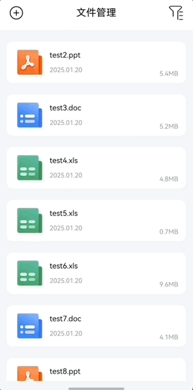

# 弹窗封装

### 介绍

本示例介绍如何封装弹窗，以及如何使用这种封装后的弹窗
### 效果图预览



**使用说明**
1. 进入案例，点击右上角筛选按钮，顶部弹出筛选框，点击一种文件类型进行筛选
2. 点击左上角添加按钮，中间弹出新增文件弹框，输入文件名以及选择文件类型，点击确定按钮添加完毕
3. 长按列表项出现弹窗，点击删除按钮，中间弹出删除确认框，点击确认按钮删除完毕
4. 长按列表项出现弹窗，底部弹出文件详情弹框

### 实现思路

1. 定义弹窗的父布局builder,支持自定义弹窗内容传入，设置弹窗蒙层。详细代码[DialogBuilder.ets](./src/main/ets/dialog/builder/DialogBuilder.ets)。
```typescript
@Builder
export function DialogBuilder(param: EncapsulateDialogBuilderParam) {
  Stack({ alignContent: getAlignment(param.dialogType) }) {
    Stack()
      .width('100%')
      .height('300%')
      .backgroundColor(0x33000000)
      .onClick(() => {
        if (param.isModalClosedByOverlayClick) {
          param.closeDialog!();
        }
      })
    param.builder.builder({ onConfirm: param.onConfirm, closeDialog: param.closeDialog, data: param.data })

  }.width('100%')
  .height('100%')
}
```
2. 使用[openCustomDialog](https://developer.huawei.com/consumer/cn/doc/harmonyos-references-V13/js-apis-arkui-uicontext-V13#opencustomdialog12)接口，该接口可支持传入builder。详细代码[DialogUtil.ets](./src/main/ets/dialog/util/DialogUtil.ets)。
```typescript
public static showCustomDialog(param: DialogParam): void {
   if (!DialogUtil.uiContext) {
     return;
   }
   let promptAction = DialogUtil.uiContext.getPromptAction();
   let encapsulateParam: EncapsulateDialogBuilderParam = DialogUtil.transformDialogParamToEncapsulateDialogBuilderParam(param);
   let compCont = new ComponentContent(DialogUtil.uiContext, wrapBuilder(DialogBuilder), encapsulateParam);
   // 设置了弹窗id即可将其与弹窗关联起来，后续可凭据弹窗id关闭弹窗
   if (param.dialogId) {
     DialogUtil.compContMap.set(param.dialogId, compCont);
   }
   DialogUtil.fillCancelMethod(encapsulateParam, promptAction, compCont, param.dialogId);
   DialogUtil.fillConfirmMethod(encapsulateParam, promptAction, compCont, param.dialogId);
   compCont.update(encapsulateParam);
   let options: promptAction.BaseDialogOptions = DialogUtil.dealSlideToClose(param);
   promptAction.openCustomDialog(compCont, options);
}
```
3. 自定义关闭弹窗回调。详细代码[DialogUtil.ets](./src/main/ets/dialog/util/DialogUtil.ets)。
```typescript
  private static fillCancelMethod(param: EncapsulateDialogBuilderParam, promptAction: PromptAction,
    compCont: ComponentContent<DialogParam>, dialogId: string | undefined) {
    let customCancel = param.closeDialog;
    let cancelDialog = () => {
      if (customCancel) {
        customCancel();
      }
      if (dialogId) {
        DialogUtil.compContMap.delete(dialogId);
      }
      promptAction.closeCustomDialog(compCont);
      // 关闭弹框之后释放对应的ComponentContent
      compCont.dispose();
    };
    param.closeDialog = cancelDialog;
  }
```
4. 自定义弹窗确认回调。详细代码[DialogUtil.ets](./src/main/ets/dialog/util/DialogUtil.ets)。
```typescript
  private static fillConfirmMethod(param: EncapsulateDialogBuilderParam, promptAction: PromptAction,
    compCont: ComponentContent<DialogParam>, dialogId: string | undefined) {
    let confirm = param.onConfirm;
    let confirmDialog = (isCloseDialog?: boolean, data?: ESObject) => {
      if (confirm) {
        confirm(isCloseDialog, data);
      }
      if (isCloseDialog) {
        if (dialogId) {
          DialogUtil.compContMap.delete(dialogId);
        }
        promptAction.closeCustomDialog(compCont);
        compCont.dispose();
      }
    };
    param.onConfirm = confirmDialog;
  }
```
5. 自定义弹窗弹出动效。详细代码[AnimationUtil.ets](./src/main/ets/dialog/util/AnimationUtil.ets)。
```typescript
  /**
 * 顶部弹出动画
 * @param duration 动画时间
 * @returns
 */
static transitionFromUp(duration: number = 200): TransitionEffect {
  return TransitionEffect.asymmetric(
    TransitionEffect.OPACITY.animation({ duration: duration }).combine(
      TransitionEffect.move(TransitionEdge.TOP).animation({ duration: duration })),
    TransitionEffect.OPACITY.animation({ delay: duration, duration: duration }).combine(
      TransitionEffect.move(TransitionEdge.TOP).animation({ duration: duration }))
  )
}
```

### 使用步骤
1. 初始化DialogUtil，需调用其init方法将UIContext传入。[DialogExampleView.ets](./src/main/ets/example/components/DialogExampleView.ets)。
```typescript
  aboutToAppear(): void {
    DialogUtil.init(this.getUIContext());
    ...
  }
```
2. 定义弹窗builder，该builder必须有且只有DialogBuilderParam参数。详细代码[CustomBuilder.ets](./src/main/ets/example/builder/CustomBuilder.ets)。
```typescript
@Builder
export function addFileDialogBuilder(param: DialogBuilderParam) {
  AddFileComponent({ param: param })
}
```
3. 定义弹窗封装组件，该组件内部必须有DialogBuilderParam参数且使用@Prop注解。详细代码[AddFileComponent.ets](./src/main/ets/example/components/AddFileComponent.ets)。
```typescript
@Component
export struct AddFileComponent {
  @Prop param: DialogBuilderParam;
  ...
}
```
4. 以上就封装好了自定义弹窗，接下来使用只需要调用一下showCustomDialog方法,将对应弹窗封装的builder传入。[DialogExampleView.ets](./src/main/ets/example/components/DialogExampleView.ets)。
```typescript
  showFileInfo(item: FileItem) {
    // 打开筛选弹窗
    DialogUtil.showCustomDialog({
      builder: wrapBuilder(fileInfoDialogBuilder),
      dialogType: DialogTypeEnum.BOTTOM,
      dialogBuilderParam: {
        data: item
      }
    })
  }
```

### 工程结构&模块类型
   ```
   encapsulationdialog                                  // har类型
   |---dialog                                           // 弹窗封装框架
   |---|---builder
   |---|---|---DialogBuilder.ets                        // 弹窗的父布局
   |---|---dto
   |---|---|---DialogBuilderParam.ets                   // 自定义弹窗封装builder需要传的参数
   |---|---|---DialogParam.ets                          // 调用弹窗需要传的参数
   |---|---|---EncapsulateDialogBuilderParam.ets
   |---|---enum
   |---|---|---DialogTypeEnum.ets
   |---|---util
   |---|---|---AnimationUtil.ets                        // 弹出动画工具类
   |---|---|---DialogOptionsFactory.ets
   |---|---|---DialogUtil.ets                           // 对外提供的弹窗封装能力
   |---example                                          // 弹窗封装使用案例
   |---|---builder                                      
   |---|---|---CustonBuilder.ets                        // 封装弹窗的自定义builder
   |---|---components                                   // 组件层
   |---|---|---AddFileComponent.ets                     // 添加文件的弹窗组件
   |---|---|---DialogExampleView.ets
   |---|---dto
   |---|---|---FileItem.ets
   |---|---|---MockData.ets
   |---FeatureComponent.ets                             // 案例视图入口
   ```

### 高性能知识点

不涉及。

### 模块依赖

1. 本示例依赖[动态路由模块](../../common/routermodule/src/main/ets/router/DynamicsRouter.ets)来实现页面的动态加载。

### 参考资料

[openCustomDialog](https://developer.huawei.com/consumer/cn/doc/harmonyos-references-V13/js-apis-arkui-uicontext-V13#opencustomdialog12)