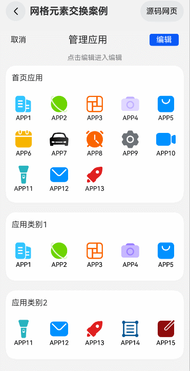

# 网格元素交换案例

### 介绍

直接进行交换和删除元素会给用户带来不好的体验效果，因此需要在此过程中注入一些特色的动画来提升体验效果，本案例通过Grid组件、attributeModifier、以
及animateTo函数实现了拖拽动画，删除动画和添加时的位移动画。

### 效果图预览

 

**使用说明**：

1. 进入页面，点击编辑，长按网格元素，执行拖拽操作，拖拽过程中显示此网格元素，拖拽到一定的位置时，会进行网格元素的位置交换。
2. 编辑模式下，点击首页应用里的网格元素，此元素会被删除，下面对应元素右上角会出现添加标志。
3. 编辑模式下，点击应用类别1/应用类别2里有添加标识的元素，该元素会移动到首页应用里。

### 实现思路

本示例主要通过attributeModifier、supportAnimation、animateTo等实现了删除动画以及长按拖拽动画。attributeModifier绑定自定义属性对象，
控制每个网格元素的属性更新。执行删除操作时，通过animateTo去更新offset值以及opacity等属性，执行添加操作时，通过animateTo去更新translate偏移量和visibility等属性。supportAnimation设置为true，支持GridItem
拖拽动画，在onItemDragStart开始拖拽网格元素时触发，onItemDragStart可以返回一个@Builder修饰的自定义组件，这样在拖拽的时候，
能够显示目标元素。onItemDrop在网格元素内停止拖拽时触发。此时执行元素位置的切换功能。

1. 声明一个数组，添加自定义属性对象，每个自定义属性对象对应一个网格元素，源码参考[AttributeModifier.ets](./src/main/ets/model/AttributeModifier.ets)和[GridItemDeletionCtrl.ets](./src/main/ets/model/GridItemDeletionCtrl.ets)。
```javascript
 constructor(data: T[]) {
   this.gridData = data;
   data.forEach(() => {
     this.modifier.push(new GridItemModifier());
   })
 }
 /**
 * 声明GridItem动态属性
 */
@Observed
export class GridItemModifier implements AttributeModifier<GridItemAttribute> {
  public offsetX: number = 0;
  public offsetY: number = 0;
  public opacity: number = 1;

  /**
   * 定义组件普通状态时的样式
   * @param instance
   */
  applyNormalAttribute(instance: GridItemAttribute): void {
    instance.translate({ x: this.offsetX, y: this.offsetY });
    instance.opacity(this.opacity);
  }
}
```
```ts
constructor(data: T[]) {
  this.sortAppData = data;
  data.forEach(() => {
    this.modifier.push(new TranslateItemModifier());
  })
}

/**
 * 声明被添加的gridItem动态属性
 */
@Observed
export class TranslateItemModifier extends AttributeUpdater<ColumnAttribute> {
  /**
   * 定义组件普通状态时的样式
   * @param instance
   */
  initializeModifier(instance: ColumnAttribute): void {
    instance.translate({ x: 0, y: 0 })
      .visibility(Visibility.Visible)
  }
}
```
2. 绑定attributeModifier属性，attributeModifier属性的值为对应的自定义属性对象。源码参考[GridExchange.ets](./src/main/ets/view/GridExchange.ets)。
```javascript
 GridItem() {
   IconWithNameView({ app: item })
 }
 .onAreaChange((oldValue: Area, newValue: Area) => {
   this.itemAreaWidth = Number(newValue.width);
 })
 .onTouch((event: TouchEvent) => {
   if (event.type === TouchType.Down) {
     this.movedItem = this.appInfoList[index];
   }
 })
 // TODO:知识点:动态绑定属性信息
 .attributeModifier(this.GridItemDeletion.getModifier(item) ? this.GridItemDeletion.getModifier(item) : undefined)
```
```ts
Column() {
  this.gridItemWithNameView({app: data.app, homeAppNames: data.homeAppNames});
}
// TODO:知识点:动态绑定属性信息
.attributeModifier(data.translateItemModifier.getModifier(data.app))
```

3. 编辑模式下点击网格元素，执行删除操作，删除过程中使用animateTo来更新元素的偏移量并实现动画效果。源码参考[GridItemDeletionCtrl.ets](./src/main/ets/model/GridItemDeletionCtrl.ets)。

```javascript
  deleteGridItem(item: T, itemAreaWidth: number): number {
    const index: number = this.gridData.indexOf(item);
    if(index === -1){
       return index;
    }
    animateTo({
      curve: Curve.Friction, duration: ANIMATION_DURATION, onFinish: () => {
        // 初始化偏移位置
        this.modifier.forEach((item) => {
          item.offsetX = 0;
          item.offsetY = 0;
        })
        // 删除对应的数据
        this.gridData.splice(index, 1);
        this.modifier.splice(index, 1);
        this.status = DeletionStatus.FINISH;
        // 存储动画状态
        AppStorage.setOrCreate('deletionStatus', this.status);
      }
    }, () => {
      // TODO:知识点:实现删除动画。先让目标元素的opacity为0，不可视，直接删除目标元素会导致偏移的时候位置异常，接着遍历元素的属性对象，修改偏移量。
      this.modifier[index].opacity = 0;
      this.modifier.forEach((item: GridItemModifier, ind: number) => {
        // 最后一条数据不执行偏移
        if (index === this.gridData.length - 1) {
          this.status = DeletionStatus.START;
          return;
        }
        if (ind > index && ind % COLUMN_COUNT !== 0) {
          item.offsetX = -itemAreaWidth;
        } else if (ind > index && ind % COLUMN_COUNT === 0) {
          item.offsetX = itemAreaWidth * 4; // 位置偏移到上一行的最后一列，因此偏移4个gridItem所占的宽度
          item.offsetY = -GRID_ITEM_SIZE;
        }
      })
      this.status = DeletionStatus.START;
    })
    return index;
  }
}
```
4. 交换网格元素，onItemDragStart以及onItemDrop来完成元素的交换功能，supportAnimation设置为true，支持在拖拽时显示动画效果。onItemDragStart函数中
返回目标自定义组件，可以在拖拽过程中显示。onItemDrop函数执行最后网格元素的交换。 源码参考[GridExchange.ets](./src/main/ets/view/GridExchange.ets)。
```javascript
 .supportAnimation(true)
 .editMode(this.isEdit)
 .onItemDragStart((event: ItemDragInfo, itemIndex: number) => {
   // TODO:知识点:在onItemDragStart函数返回自定义组件，可在拖拽过程中显示此自定义组件。
   return this.pixelMapBuilder();
 })
 .onItemDrop((event: ItemDragInfo, itemIndex: number, insertIndex: number, isSuccess: boolean) => {
   // TODO:知识点:执行gridItem切换操作
   if (isSuccess && insertIndex < this.appInfoList.length) {
     this.changeIndex(itemIndex, insertIndex);
   }
 })
```
5. 编辑模式下，点击有添加标识的网格元素，将其添加到首页应用中，删除过程中使用animateTo来更新元素的偏移量并实现动画效果。源码参考[GridItemDeletionCtrl.ets](./src/main/ets/model/GridItemDeletionCtrl.ets)。

```ts
addGridItem(item: T, appInfoList: AppInfo[]): void {
  const index: number = this.sortAppData.indexOf(item);
  const appId: string = (item as AppInfo).name.toString();
  animateTo({
    curve: Curve.Linear, duration: ANIMATION_DURATION, onFinish: () => {
      this.modifier[index].attribute?.visibility(Visibility.Hidden);
      // 初始化modifier所有属性
      this.modifier.forEach((item) => {
        item.attribute?.translate({ x: 0, y: 0 }).visibility(Visibility.Visible);
      })
      this.status = AddStatus.FINISH;
      // 存储动画状态
      AppStorage.setOrCreate('addStatus', this.status);
    }
  }, () => {
    let offsetX: number = 0;
    let offsetY: number = 0;

    // 首页应用里的gridItem个数
    const gridItemNumber: number = appInfoList.length;
    // 首页应用里的gridItem个数除列数的余数
    const homeAppIndex: number = gridItemNumber % COLUMN_COUNT;
    // 被点击应用的坐标信息
    const componentInfo: componentUtils.ComponentInfo = componentUtils.getRectangleById(appId);
    // 余数也是被点击应用移动的终点位置的索引号，两者索引号相减，再乘gridItem本身的宽度，就是横向移动的距离
    offsetX = (homeAppIndex - index) * GRID_ITEM_SIZE;
    // 首页应用里的个数为0
    if (appInfoList.length === 0) {
      // 用首页应用的第一个app的y轴坐标减去被点击应用的y轴坐标即可计算出y轴偏移量
      offsetY = FIRST_APP_SCREEN_OFFSET_Y - componentInfo.screenOffset.y;
      this.modifier[index].attribute?.translate({ x: offsetX, y: px2vp(offsetY) });
      this.status = AddStatus.START;
      return;
    }
    // 首页应用里最后一个gridItem的坐标信息
    const lastAppComponentInfo: componentUtils.ComponentInfo =
      componentUtils.getRectangleById(`${appInfoList[appInfoList.length - 1].name.toString()}InHome`);

    if (homeAppIndex === 0) {
      // 余数等于0，说明gridItem要移动到一行的第一个，y轴移动距离要加上girItem本身的高度
      offsetY = lastAppComponentInfo.screenOffset.y - componentInfo.screenOffset.y + lastAppComponentInfo.size.height;
    } else {
      // 余数不等于0，直接使用两者的y轴坐标相减即可得到移动距离
      offsetY = lastAppComponentInfo.screenOffset.y - componentInfo.screenOffset.y;
    }
    this.modifier[index].attribute?.translate({ x: offsetX, y: px2vp(offsetY) });
    this.status = AddStatus.START;
  })
}
```

### 高性能知识点

* 动态加载数据场景可以使用[LazyForEach](https://developer.harmonyos.com/cn/docs/documentation/doc-guides-V3/arkts-rendering-control-lazyforeach-0000001524417213-V3)遍历数据。
* [onAreaChange](https://developer.huawei.com/consumer/cn/doc/harmonyos-references-V2/ts-universal-component-area-change-event-0000001478061665-V2)
在区域发生大小变化的时候会进行调用，由于删除操作或者网格元素的交互都能够触发区域函数的使用，操作频繁，
建议此处减少日志的打印、复用函数逻辑来降低性能的内耗。
* [onTouch](https://developer.huawei.com/consumer/cn/doc/harmonyos-references-V2/ts-universal-events-touch-0000001427902424-V2)
在进行手势操作的时候会进行多次调用，建议此处减少日志的打印、复用函数逻辑来降低性能的内耗。
* [Flex](https://developer.huawei.com/consumer/cn/doc/harmonyos-references-V5/ts-container-flex-V5)
使用了flex布局会对应用功耗产生较大影响，请结合实际情况谨慎使用。

### 工程结构&模块类型

```
gridexchange                                 // har类型
|---model
|   |---AppInfo.ets                          // App信息
|   |---AttributeModifier.ets                // 属性对象
|   |---GridItemDeletionCtrl.ets             // 列表项交换
|   |---MockData.ets                         // 模拟数据
|---view
|   |---GridExchange.ets                     // 视图层-应用主页面
```

### 模块依赖

本实例依赖[common模块](../../common/utils)来实现日志的打印、资源 的调用、依赖[动态路由模块](../../common/routermodule/src/main/ets/router/DynamicsRouter.ets)来实现页面的动态加载。

### 参考资料

[Grid](https://developer.huawei.com/consumer/cn/doc/harmonyos-references-V2/ts-container-grid-0000001478341161-V2)

[animateTo](https://developer.huawei.com/consumer/cn/doc/harmonyos-references-V2/ts-explicit-animation-0000001478341181-V2)

[attributeModifier](https://developer.huawei.com/consumer/cn/doc/harmonyos-references-V5/ts-universal-attributes-attribute-modifier-V5)

[AttributeUpdater](https://developer.huawei.com/consumer/cn/doc/harmonyos-references-V5/js-apis-arkui-attributeupdater-V5)