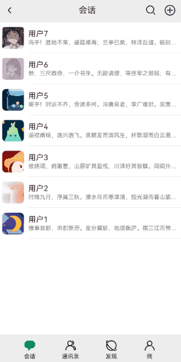

# 群头像拼接案例

### 介绍

本示例介绍使用[组件截图](https://developer.huawei.com/consumer/cn/doc/harmonyos-references-V5/js-apis-arkui-componentsnapshot-V5)
实现组件的截图并获取pixelMap对象。该场景多用于通信类应用。

### 效果图预览



**使用说明**

1. 进入**群头像案例**页面，点击右上角添加图标，在弹出的菜单中点击**发起群聊**，跳转至**发起群聊**页面。
2. 在**发起群聊页面**中，点击下方用户列表前的选择框，选中多个用户，点击右下方**完成**按钮，添加会话数据。
3. 在案例首页可以查看新增的会话数据，并可根据选择的用户自行展示群头像。

### 下载安装

1.模块oh-package.json5文件中引入依赖。

```typescript
"dependencies": {
  "@ohos-cases/groupavatar": "har包地址"
}
```

2.ets文件import自定义视图实现组件拼接。

```typescript
import { ImageCombination, SnapShotModel } from '@ohos-cases/groupavatar';
```

### 快速使用

1.当前组件默认id为avatar_group，开发者也可以通过SnapShotModel的setComponentId函数来设置组件id值。

```typescript
this.snapShotModel.setComponentId('id名称')
```

2.构建图片拼接组件视图。

```typescript
ImageCombination({
  imageArr: this.imageArr,
  snapShotModel: this.snapShotModel
})
```

3.执行组件截图逻辑。

```typescript
let imagePixelMap = this.snapShotModel?.getSnapShot();
```

### 属性(对外)接口

SnapShotModel - 组件截图类

|       属性       |              类型               |   释义   | 默认值 |
|:--------------:|:-----------------------------:|:------:|:---:|
| setComponentId | (componentId: string) => void |  设置id  |  -  |
|  getSnapShot   |          () => void           | 获取组件截图 |  -  |
| getComponentId |          () => void           | 获取组件Id |  -  |

ImageCombination - 组件拼接视图


|      属性       |               类型               |    释义     | 默认值 |
|:-------------:|:------------------------------:|:---------:|:---:|
|   imageArr    | ResourceStr[]\image.PixelMap[] | 已选择的联系人头像 |  -  |
| snapShotModel |         SnapShotModel          |  组件截图属性类  |  -  |

### 实现思路

利用组件截图能力获取群头像绘制组件图像。当组件的visibility属性不为None时，均可进行组件截图。

1. 通过选择的数据，组装群头像布局组件数据。源码参考[ImageCombination](src/main/ets/utils/ImageCombination.ets)

```typescript
/**
 * 将选择的头像列表组装为二维数组，用于填充九宫格组件
 * @param images
 * @returns
 */
function divideImage2Group(personGroup: (ResourceStr | image.PixelMap)[]): GroupAvatarModel[][] {
  let imageGroup: GroupAvatarModel[][] = [];
  if (personGroup.length <= 4) {
    // 人数少于等于4时，显示两行两列
    imageGroup = divideGroupBySize(personGroup, 2);
  } else if (personGroup.length <= 9) {
    // 人数大于4时，显示三行三列
    imageGroup = divideGroupBySize(personGroup, 3);
  } else {
    // 人数大于9时，仅显示前9个头像
    imageGroup = divideGroupBySize(personGroup.slice(0, 9), 3);
  }
  return imageGroup;
}

/**
 * 根据群组数量判断排列方式
 *  当群成员人数大于4人，则成员头像为整体区域的1/3，按照九宫格排列
 *  当群成员人数小于等于5人，则成员头像为整体区域的1/2，按照四宫格排列
 * @param images
 * @param rowSize
 * @returns
 */
function divideGroupBySize(personData: (ResourceStr | image.PixelMap)[], rowSize: number): GroupAvatarModel[][] {
  const imageCount: number = personData.length;
  const imageGroup: GroupAvatarModel[][] = [];
  let imageWidth: number = 0;
  let imageHeight: number = 0;
  let rowCount: number = 0;
  let firstRowCount: number = 0;

  // 设置群成员头像大小与排列方式
  if (rowSize === 2) {
    imageWidth = 30;
    imageHeight = 30;
    rowCount = Math.floor(imageCount / 2);
    firstRowCount = imageCount % 2;
  } else if (rowSize === 3) {
    imageWidth = 20;
    imageHeight = 20;
    rowCount = Math.floor(imageCount / 3);
    firstRowCount = imageCount % 3;
  }

  // 组装第一组图片数据
  const firstRowGroup: GroupAvatarModel[] = [];
  for (let i = 0; i < firstRowCount; i++) {
    firstRowGroup.push({
      src: personData[i],
      width: imageWidth,
      height: imageHeight
    });
  }
  // 当取余为0时，不需要单独设置首行组件
  if (firstRowGroup.length > 0) {
    imageGroup.push(firstRowGroup);
  }

  // 根据排列方式与非首行数，组装剩余的图片数据
  for (let i = 0; i < rowCount; i++) {
    const fullRowImages: (ResourceStr | image.PixelMap)[] =
      personData.slice(firstRowCount + i * rowSize, firstRowCount + (i + 1) * rowSize);
    const fullRowGroup: GroupAvatarModel[] = [];
    fullRowImages.forEach((img: ResourceStr | image.PixelMap) => {
      fullRowGroup.push({
        src: img,
        width: imageWidth,
        height: imageHeight
      });
    });
    imageGroup.push(fullRowGroup);
  }
  return imageGroup;
}
```

2. 通过嵌套两层ForEach组件，实现纵向与横向的线性布局。源码参考[ImageCombination](src/main/ets/utils/ImageCombination.ets)

```typescript
// 绘制组件，用于绘制群组头像
Column({ space: 2 }) {
  ForEach(divideImage2Group(this.imageArr), (item: GroupAvatarModel[]) => {
    RowComponent(item)
  })
}
// 设置组件ID，用于进行组件截图
.id(this.snapShotModel?.getComponentId())
.width(64)
.height(64)
.justifyContent(FlexAlign.Center)
// 设置组件隐藏
.visibility(Visibility.Hidden)

/**
 * 群组头像横向列表组件
 * @param imageArray
 */
@Builder
function RowComponent(imageArray: GroupAvatarModel[]) {
  Row({ space: 2 }) {
    ForEach(imageArray, (item: GroupAvatarModel) => {
      Image(item.src)
        .height(item.height)
        .width(item.width)
    })
  }
  .width(64)
  .justifyContent(FlexAlign.Center)
}
```

3. 使用Stack组件与visibility属性控制组件不显示，设置id属性，用于后续的组件截图操作。源码参考[ImageCombination.ets](src/main/ets/utils/ImageCombination.ets)

```typescript
// 使用堆叠组件，实现绘制组件在loading动画后执行
Stack() {
  // 绘制组件，用于绘制群组头像
  Column({ space: 2 }) {
    ForEach(divideImage2Group(this.selectPersonGroup), (item: GroupAvatarModel[]) => {
      RowComponent(item)
    })
  }
  // 设置组件ID，用于进行组件截图
  .id('avatar_group')
  .visibility(Visibility.Hidden)

  // loading弹框
  Column() {
    ...
  }
}
```

4. 使用[@ohos.arkui.componentSnapshot](https://developer.huawei.com/consumer/cn/doc/harmonyos-references-V13/js-apis-arkui-componentsnapshot-V13#snapshotoptions12)接口实现组件截图，并获取群头像资源。源码参考[SnapShotModel.ets](./src/main/ets/model/SnapShotModel.ets)

```typescript
getSnapShot(scale: number = 1, waitUntilRenderFinished?: boolean): image.PixelMap {
  let snapshotOptions: componentSnapshot.SnapshotOptions = {
    scale,
    waitUntilRenderFinished
  }
  return componentSnapshot.getSync(this.componentId, snapshotOptions);
}
```

### 高性能知识点

**不涉及**

### 工程结构&模块类型

   ```
   groupavatar                                     // har类型
   |---datasource
   |   |---DataSource.ets                          // 本地数据 
   |   |---GroupAvatarModel.ets                    // 数据模型
   |---model
   |   |---SnapShotModel.ets                       // 图片截图类
   |---utils
   |   |---ImageCombination.ets                    // 图片拼接组件
   |---view
   |   |---components
   |   |   |---BottomBarContent.ets                // 底部Tab组件
   |   |   |---NavigationBarContent.ets            // 顶部导航栏
   |   |   |---PersonContent.ets                   // 用户列表页面
   |   |   |---SessionContent.ets                  // 会话列表页面
   |   |---GroupAvatarAddPage.ets                  // 发起群聊页面
   |   |---GroupAvatarAddPage.ets                  // 首页
   ```

### 模块依赖

本实例依赖[common模块](../../common/utils)来实现日志的打印、依赖[动态路由模块](../../common/routermodule/src/main/ets/router/DynamicsRouter.ets)来实现页面的动态加载。

### 参考资料

1. [组件截图接口参考](https://developer.huawei.com/consumer/cn/doc/harmonyos-references-V5/js-apis-arkui-componentsnapshot-V5)
2. [页面布局参考](https://developer.huawei.com/consumer/cn/forum/topic/0203715166851530092?fid=0101591351254000314)