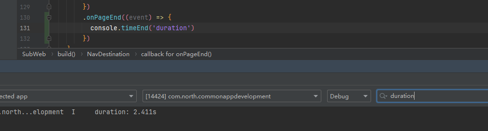
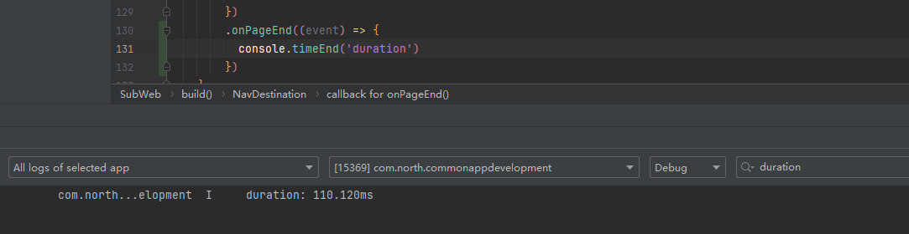

# H5页面资源离线缓存案例

### 介绍

在移动端 H5 应用中实现资源离线缓存是非常重要的，特别是在网络条件不稳定或用户可能在离线状态下使用应用的情况下：

1. 用户的网络连接不稳定，经常断开，但应用仍需提供可用的功能。
2. 移动设备在网络覆盖较差的地区，仍然需要访问应用的功能。
3. 初次加载应用时，将所有资源下载并缓存起来，以后访问时直接从本地加载，提高加载速度。

本模块结合内存缓存和磁盘缓存实现了一个H5页面资源离线缓存案例。

### 效果图预览


**使用说明**

1. 进入本案例页面后，点击可点击下方按钮加载页面。
2. 第一次进入页面时，页面资源会从网络中加载，加载时会将需要缓存的资源同步保存到内存和磁盘中。
3. 后续重新进入页面时，因内存和磁盘中已经存在相应资源，会直接从内存/磁盘中读取（可以通过增加版本号方式实现缓存资源更新，需开发者按照自己的业务逻辑来实现），即使在离线状态下也能快速加载页面。

### 实现思路

1. 指定需要缓存的资源，h5页面加载时，通过onInterceptRequest回调拦截资源加载请求,将会先检查缓存路径中是否存在对应资源
2. 若存在对应资源文件，可以自定义缓存处理逻辑，有如下多种处理：
    1. 资源增加版本号，页面加载时优先使用缓存，保证页面快速加载，不影响用户体验，同时通过对比版本号等方法判断资源是否需要更新，如果需要，则发起请求更新缓存资源，后续重新加载页面时使用新的缓存
    2. 默认为稳定资源，直接取出使用（本案例中直接取出使用）
3. 若不存在，构造http模块发起请求，接收响应后将资源返回给原始请求的同时并保存到本地内存和磁盘中，

```typescript
Web({ src: this.url, controller: this.controller })
  .javaScriptAccess(true)
  .onInterceptRequest((event) => {
    // 资源请求url
    let url: string = event.request.getRequestUrl();

    // 如果不是http/https请求，走原始逻辑
    if (!url.startsWith('http')) {
      return null;
    }

    // 资源类型：如https://cdnjs.cloudflare.com/ajax/libs/animejs/3.2.0/anime.min.js
    // 处理后type值为js
    let type: string;
    type = (url.split('.').pop() as string);
    // url匹配，是否为需要缓存的资源请求
    let matched: boolean = false;
    let cacheableResourceUrls: Array<string> = this.cacheableResourceUrls as Array<string>;
    for (let cacheableResourceUrl of cacheableResourceUrls) {
      if (new RegExp(cacheableResourceUrl, 'g').exec(url)) {
        matched = true;
        break;
      }
    }

    // 开发者可以增加缓存策略，例如：
    // 资源增加版本号，页面加载时优先使用缓存，保证页面快速加载，不影响用户体验，同时通过对比版本号等方法判断资源是否需要更新，如果需要，则发起请求更新缓存资源，后续重新加载页面时使用新的缓存

    if (matched) {
      // 查询缓存
      let cacheResource = (this.offlineResourceManager as OfflineResourceManager).fetchFromCache(url, type);
      // 构造请求响应
      let responseWeb: WebResourceResponse = new WebResourceResponse();
      const promise: Promise<String> = new Promise((resolve: Function, reject: Function) => {
        if (cacheResource) {
          // 返回缓存
          responseWeb.setResponseData(cacheResource as ResponseDataType);
          resolve("success");
        } else {
          // 发起请求
          let httpRequest: http.HttpRequest = http.createHttp();

          httpRequest.request(url, (err: BusinessError, data: http.HttpResponse) => {
            if (data) {
              // 数据正常返回
              (this.offlineResourceManager as OfflineResourceManager).submitToCache(url,
                data.result as ResponseDataType)
              responseWeb.setResponseData(data.result as ResponseDataType);
            } else {
              // 请求出错,返回null
              responseWeb.setResponseData(null);
            }

            responseWeb.setResponseMimeType(MimeType[type]);
            responseWeb.setReasonMessage('OK');
            responseWeb.setResponseCode(200);
            // http响应返回后将promise设置成resolve状态
            resolve("success");
          })
        }
      })
      promise.then(() => {
        responseWeb.setResponseIsReady(true);
      })
      responseWeb.setResponseIsReady(false);
      return responseWeb;
    }

    return null;
  })
```

### 高性能知识点

本案例性能收益

缓存前：耗时2.411s



缓存后：110.120ms



可以看到在使用本地缓存替换后，Web加载耗时明显减少。

### 工程结构&模块类型

```
h5cache                                             // har类型
|---src/main/ets/pages
|   |---SubWeb.ets                                  // 主页面
|---src/main/ets/common
|   |---DiskCacheManager.ets                        // 磁盘资源缓存管理
|   |---MemoryCacheManager.ets                      // 内存资源缓存管理
|   |---OfflineResourceManager.ets                  // 离线资源缓存管理
|   |---ResponseDataType.ets                        // 响应数据类型
|   |---WebParamsModel.ets                          // Web页面
|---src/main/ets/diskLruCache                       // 手动实现的磁盘缓存
|   |---DiskCacheEntry.ets 
|   |---DiskLruCache.ets   
|   |---FileUtils.ets
```

### 模块依赖

本实例依赖[common模块](../../common/utils)来实现日志的打印、资源
的调用、依赖[动态路由模块](../../common/routermodule/src/main/ets/router/DynamicsRouter.ets)来实现页面的动态加载。

### 参考资料

[Web](https://developer.huawei.com/consumer/cn/doc/harmonyos-references-V5/ts-basic-components-web-V5)

[util工具函数](https://developer.huawei.com/consumer/cn/doc/harmonyos-references-V5/js-apis-util-V5)

[文件管理](https://developer.huawei.com/consumer/cn/doc/harmonyos-references-V5/js-apis-file-fs-V5)

[离线资源免拦截注入](../../../docs/performance/performance-web-import.md#%E8%B5%84%E6%BA%90%E6%8B%A6%E6%88%AA%E6%9B%BF%E6%8D%A2%E5%8A%A0%E9%80%9F)


