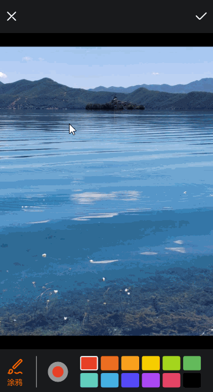

# 画笔调色板案例

### 介绍

本示例实现了一个网格渐变的画笔调色板，能够根据给定的 HSL 类型颜色和色阶数，按亮度生成渐变色，用户可以通过调色板选择颜色并在画布上绘制路径。

### 效果图预览



**使用说明**

1. 页面底部展示当前画笔颜色和预设的常用颜色，点击预设的常用颜色可以修改画笔颜色。
2. 点击画笔颜色，显示网格渐变的调色板，选择调色板上的颜色可以修改画笔颜色。
3. 在图片上触摸并拖动手指，可以绘制路径，路径颜色为当前选中的画笔颜色。

### 实现思路

1. 调色板（HslPalette）渐变方案和布局。
    
   - 根据给定的`hslHues`（HSL颜色列表）和`levels`（色阶数量）生成按亮度渐变的颜色，并根据给定的的渐变亮度起止点（`gradientStartPoint`和`gradientEndPoint`），使不同颜色的同一色阶亮度相同。源码参考[PaletteMainPage.ets](./src/main/ets/pages/PaletteMainPage.ets)

   ```ts
     private hslHues: HslType[] = []; // HSL 类型颜色的源数组
     private levels: number = 0; // 渐变色阶数
     private gradientStartPoint: number = 0; // 渐变开始点的亮度值
     private gradientEndPoint: number = 0; // 渐变结束点的亮度值
   
     // TODO：知识点：根据 HSL 色相数组和色阶数生成按亮度渐变的 HEX 格式颜色
     computeHSLGradient(hues: HslType[], levels: number): string[] {
       if (levels <= 0) {
         return [];
       }
       const colors: string[] = [];
       for (let i = 0; i < levels; i++) {
         hues.forEach(hsl => {
           // 根据给定的渐变亮度起止点和所处色阶计算渐变亮度
           const fadedL =
             this.gradientStartPoint + Math.round(i * (this.gradientEndPoint - this.gradientStartPoint) / levels); // 逐渐变淡
           // 将 HSL 转换为 HEX 格式
           const hex = hslToHex(hsl.hue, hsl.saturation, fadedL);
           // 添加到颜色数组
           colors.push(hex);
         });
       }
       return colors;
     }
   ```

    - 由于ArkUI组件不能直接使用HSL类型的颜色，所以获取到渐变亮度后需要通过 `hslToHex` 函数将 HSL 颜色转换为 HEX 颜色再存储在 `colors` 数组中。源码参考[ColorTypeConverter.ets](./src/main/ets/utils/ColorTypeConverter.ets)

   ```ts
   /**
    * 将 HSL 颜色模型转换为 HEX 颜色模型
    *
    * @param {number} hue - 色相 (Hue)，范围为 0 到 360
    * @param {number} saturation - 饱和度 (Saturation)，范围为 0 到 100
    * @param {number} lightness - 亮度 (Lightness)，范围为 0 到 100
    * @returns {string} - 返回 HEX 颜色值，格式为 '#RRGGBB'
    */
   export function hslToHex(hue: number, saturation: number, lightness: number): string {
     // 将 HSL 转换为 RGB
     const rgb: RgbType = hslToRgb(hue, saturation, lightness);
     // 返回 HEX 颜色值
     return rgbToHex(rgb.red, rgb.green, rgb.blue);
   }
   
   /**
    * 将 HSL 颜色值转换为 RGB 颜色格式。
    *
    * @param {number} hue - 色相，范围为 0-360。
    * @param {number} saturation - 饱和度，范围为 0-100，表示颜色的强度。
    * @param {number} lightness - 亮度，范围为 0-100，表示颜色的明暗程度。
    * @returns {rgbType} - 返回一个包含 RGB 值的对象，格式为 { red, green, blue }，每个值的范围为 0-255。
    */
   function hslToRgb(hue: number, saturation: number, lightness: number): RgbType {
     let red: number, green: number, blue: number;
   
     // 将饱和度和亮度从百分比转换为小数
     saturation /= 100;
     lightness /= 100;
   
     if (saturation === 0) {
       // 无饱和度，返回灰色
       red = Math.round(lightness * 255); // 灰色的 Red 值
       green = Math.round(lightness * 255); // 灰色的 Green 值
       blue = Math.round(lightness * 255); // 灰色的 Blue 值
     } else {
       // 辅助函数：根据 HSL 值计算 RGB 值，处理不同的色相区间
       const convertHueToRgb = (baseValue: number, brightnessMultiplier: number, hueFraction: number): number => {
         // 确保 hueFraction 在 0 到 1 之间
         if (hueFraction < 0) {
           hueFraction += 1;
         }
         if (hueFraction > 1) {
           hueFraction -= 1;
         }
         // 第一个区间
         if (hueFraction < 1 / 6) {
           return baseValue + (brightnessMultiplier - baseValue) * 6 * hueFraction;
         }
         // 第二个区间
         if (hueFraction < 1 / 2) {
           return brightnessMultiplier;
         }
         // 第三个区间
         if (hueFraction < 2 / 3) {
           return baseValue + (brightnessMultiplier - baseValue) * (2 / 3 - hueFraction) * 6;
         }
         // 第四个区间
         return baseValue;
       };
   
       // 根据亮度计算中间值 brightnessMultiplier 和 baseValue
       const brightnessMultiplier = lightness < 0.5 ? lightness * (1 + saturation) : lightness + saturation - lightness * saturation;
       const baseValue = 2 * lightness - brightnessMultiplier;
   
       // 计算 RGB 值
       red = Math.round(convertHueToRgb(baseValue, brightnessMultiplier, hue / 360 + 1 / 3) * 255);
       green = Math.round(convertHueToRgb(baseValue, brightnessMultiplier, hue / 360) * 255);
       blue = Math.round(convertHueToRgb(baseValue, brightnessMultiplier, hue / 360 - 1 / 3) * 255);
     }
     return {
       red: red,
       green: green,
       blue: blue
     }
   }
   
   /**
    * 将 RGB 颜色值转换为十六进制格式。
    *
    * @param {number} red - 红色分量，范围为 0-255。
    * @param {number} green - 绿色分量，范围为 0-255。
    * @param {number} blue - 蓝色分量，范围为 0-255。
    * @returns {string} - 返回表示 RGB 颜色的十六进制字符串，格式为 "#RRGGBB"。
    */
   function rgbToHex(red: number, green: number, blue: number): string {
     return '#' + ((1 << 24) + (red << 16) + (green << 8) + blue).toString(16).slice(1);
   };
   ```
   
   - 使用`Gird`组件遍历`colors`颜色数组生成网格型的渐变色块，可以通过点击色块修改 `@Link` 类型的状态变量 `selectedColor` 与父组件同步选中颜色。`Grid`的行、列模板根据给定的`hslHues`（HSL颜色列表）和`levels`（色阶数量）计算生成。源码参考[PaletteMainPage.ets](./src/main/ets/pages/PaletteMainPage.ets)

   ```ts
     @State columnsTemplate: string = ''; // Gird 组件的columnsTemplate
     @State rowsTemplate: string = ''; // Gird 组件的rowsTemplate
     @State colors: string[] = []; // 栅格布局使用的 HEX 颜色数组
     @Link selectedColor: string; // 当前选中的颜色
   
     // 根据色相数和色阶数初始化Gird的columnsTemplate和rowsTemplate
     initGridTemplate() {
       if (this.hslHues.length === 0) {
         this.columnsTemplate = '';
         this.rowsTemplate = '';
         return;
       }
       let rowsTemplate = '';
       // 初始化列模板
       this.columnsTemplate = this.hslHues.map(hsl => Constants.GRID_TEMPLATE_UINT).join(' ');
       // 初始化行模板
       for (let i = 0; i < this.levels; i++) {
         if (i === 0) {
           rowsTemplate = Constants.GRID_TEMPLATE_UINT;
         } else {
           rowsTemplate = `${rowsTemplate} ${Constants.GRID_TEMPLATE_UINT}`;
         }
       }
       this.rowsTemplate = rowsTemplate;
     }
     
     build() {
       Grid() {
         /**
          * TODO: 性能知识点：此处列表项确定且数量较少，使用了ForEach，在列表项多的情况下，推荐使用LazyForeEach
          * 文档参考链接：https://developer.huawei.com/consumer/cn/doc/harmonyos-guides/arkts-rendering-control-lazyforeach-0000001820879609
          */
         ForEach(this.colors, (color: string) => {
           GridItem() {
           }
           .border({
             width: this.selectedColor === color ? $r('app.integer.palette_color_block_border_width_selected') :
             $r('app.integer.palette_color_block_border_width'),
             color: $r('app.color.ohos_id_color_background')
           })
           .backgroundColor(color)
           .width($r('app.string.palette_full_size'))
           .height($r('app.string.palette_full_size'))
           .onClick(() => {
             // 点击切换选中颜色
             this.selectedColor = color;
           })
         }, (color: string) => color)
       }
       .columnsTemplate(this.columnsTemplate)
       .rowsTemplate(this.rowsTemplate)
       .width($r('app.string.palette_full_size'))
       .height($r('app.string.palette_full_size'))
     }
   ```

2. 根据HEX类型的颜色数组`hexHues`生成常用颜色网格，点击色块切换选中颜色。源码参考[PaletteMainPage.ets](./src/main/ets/pages/PaletteMainPage.ets)

```ts
  // 预设的常用颜色
  Grid() {
    /**
     * TODO: 性能知识点：此处列表项确定且数量较少，使用了ForEach，在列表项多的情况下，推荐使用LazyForeEach
     * 文档参考链接：https://developer.huawei.com/consumer/cn/doc/harmonyos-guides/arkts-rendering-control-lazyforeach-0000001820879609
     */
    ForEach(this.hexHues, (color: string) => {
      GridItem() {
      }
      .border({
        width: this.selectedColor === color ? $r('app.integer.palette_color_block_border_width_selected') :
        $r('app.integer.palette_color_block_border_width'),
        color: $r('app.color.ohos_id_color_background'),
        radius: $r('app.integer.palette_common_color_block_border_radius')
      })
      .backgroundColor(color)
      .width($r('app.string.palette_full_size'))
      .height($r('app.string.palette_full_size'))
      .onClick(() => {
        // 点击切换选中颜色
        this.selectedColor = color;
      })
    }, (color: string) => color)
  }
  .columnsTemplate('1fr 1fr 1fr 1fr 1fr 1fr') // 6列
  .rowsTemplate('1fr 1fr') // 2行
  .columnsGap($r('app.integer.palette_common_color_block_gird_gap'))
  .rowsGap($r('app.integer.palette_common_color_block_gird_gap'))
  .padding({
    left: $r('app.string.ohos_id_card_padding_start'),
    right: $r('app.string.ohos_id_card_padding_start')
  })
  .height($r('app.string.palette_full_size'))
  .width($r('app.integer.palette_common_color_block_gird_width'))
```

3. 父组件中定义状态变量`selectedColor`保存当前选中的画笔颜色，并通过`Row`组件的背景色进行展示，点击该组件可以切换调色板组件 `HslPalette` 的显隐。源码参考[PaletteMainPage.ets](./src/main/ets/pages/PaletteMainPage.ets)

```ts
  @State selectedColor: string = ''; // 当前选中的画笔颜色
```
```ts
  // 展示当前选中的画笔颜色
  Row()
    .backgroundColor(this.selectedColor)
    .width($r('app.integer.palette_pen_color_circle_size'))
    .height($r('app.integer.palette_pen_color_circle_size'))
    .borderRadius($r('app.integer.palette_pen_color_circle_border_radius'))
    .border({
      width: $r('app.integer.palette_pen_color_circle_border_width'),
      color: $r('app.color.palette_pen_color_circle_border_color')
    })
    .margin({ right: $r('app.integer.palette_pen_color_circle_margin_right') })
    .onClick(() => {
      // 点击切换调色板的显隐
      this.isShowPalette = !this.isShowPalette;
    })
```
```ts
  // 调色板区域，使用 isShowPalette 控制显隐
  if (this.isShowPalette) {
    Row() {
      HslPalette({
        hslHues: this.hslHues,
        levels: this.levels,
        gradientStartPoint: Constants.GRADIENT_START_POINT,
        gradientEndPoint: Constants.GRADIENT_END_POINT,
        selectedColor: this.selectedColor
      })
    }
    // ...
  }
```

4. 使用自绘制渲染节点`MyRenderNode`设置画笔颜色，初始化画笔和画布，并将手指移动的`path`路径绘制到画布上，通过`MyNodeController`将节点挂载到自定义节点容器组件`NodeContainer`上进行展示。同时，在`NodeContainer`的`onTouch`回调函数中，处理手指按下和移动事件，以动态更新绘制的轨迹。

   - 定义`RenderNode`的子类`MyRenderNode`，实例初始化时设置画笔颜色`penColor`，并通过`path`路径对象存储手指移动轨迹。`MyRenderNode`实例在进行绘制时会调用`draw`方法，初始化画笔`pen`并将保存的`path`路径绘制到`canvas`画布上。源码参考[RenderNodeModel.ets](./src/main/ets/model/RenderNodeModel.ets)

   ```ts
   /**
    * MyRenderNode类，初始化画笔和绘制路径
    */
   export class MyRenderNode extends RenderNode {
     path: drawing.Path = new drawing.Path(); // 新建路径对象，用于绘制手指移动轨迹
     penColor: common2D.Color = {
       alpha: 0xFF,
       red: 0x00,
       green: 0x00,
       blue: 0x00
     }; // 画笔颜色，默认为黑色
   
     // 创建节点时设置画笔颜色
     constructor(penColor: common2D.Color) {
       super();
       this.penColor = penColor;
     }
   
     // RenderNode进行绘制时会调用draw方法
     draw(context: DrawContext): void {
       const canvas = context.canvas;
       // 创建一个画笔Pen对象，Pen对象用于形状的边框线绘制
       const pen = new drawing.Pen();
       // 设置画笔开启反走样，可以使得图形的边缘在显示时更平滑
       pen.setAntiAlias(true);
       pen.setColor(this.penColor);
       // 开启画笔的抖动绘制效果。抖动绘制可以使得绘制出的颜色更加真实。
       pen.setDither(true);
       // 设置画笔的线宽为10px
       pen.setStrokeWidth(Constants.PEN_STROKE_WIDTH);
       // 将Pen画笔设置到canvas中
       canvas.attachPen(pen);
       // 绘制path
       canvas.drawPath(this.path);
     }
   }
   ```

   - 定义`NodeController`的子类`MyNodeController`，实例化后可以通过将自绘制渲染节点`MyRenderNode`挂载到对应节点容器`NodeContainer`上实现自定义绘制。源码参考[RenderNodeModel.ets](./src/main/ets/model/RenderNodeModel.ets)

   ```ts
   /**
    * NodeController的子类MyNodeController
    */
   export class MyNodeController extends NodeController {
     private rootNode: FrameNode | null = null; // 根节点
     rootRenderNode: RenderNode | null = null; // 从NodeController根节点获取的RenderNode，用于添加和删除新创建的MyRenderNode实例
   
     // MyNodeController实例绑定的NodeContainer创建时触发，创建根节点rootNode并将其挂载至NodeContainer
     makeNode(uiContext: UIContext): FrameNode {
       this.rootNode = new FrameNode(uiContext);
       if (this.rootNode !== null) {
         this.rootRenderNode = this.rootNode.getRenderNode();
       }
       return this.rootNode;
     }
   
     // 绑定的NodeContainer布局时触发，获取NodeContainer的宽高
     aboutToResize(size: Size): void {
       if (this.rootRenderNode !== null) {
         // NodeContainer布局完成后设置rootRenderNode的背景透明
         this.rootRenderNode.backgroundColor = 0X00000000;
         // rootRenderNode的位置从组件NodeContainer的左上角(0,0)坐标开始，大小为NodeContainer的宽高
         this.rootRenderNode.frame = {
           x: 0,
           y: 0,
           width: size.width,
           height: size.height
         };
       }
     }
   
     // 添加节点
     addNode(node: RenderNode): void {
       if (this.rootNode === null) {
         return;
       }
       if (this.rootRenderNode !== null) {
         this.rootRenderNode.appendChild(node);
       }
     }
   
     // 清空节点
     clearNodes(): void {
       if (this.rootNode === null) {
         return;
       }
       if (this.rootRenderNode !== null) {
         this.rootRenderNode.clearChildren();
       }
     }
   }
   ```

   - 创建自定义节点容器组件`NodeContainer`，接收`MyNodeController`的实例，组件的宽高为图片加载完成后实际内容区域的宽高，并通过相对容器布局的`alignRules`使`NodeContainer`与图片内容区域重叠，控制绘制区域。源码参考[PaletteMainPage.ets](./src/main/ets/pages/PaletteMainPage.ets)

   ```ts
     @Builder
     drawingArea() {
       Image($r('app.media.palette_picture'))
         .width($r('app.string.palette_full_size'))
         .objectFit(ImageFit.Contain)
         .alignRules({
           top: { anchor: Constants.TOP_BUTTON_LINE_ID, align: VerticalAlign.Bottom },
           middle: { anchor: Constants.CONTAINER_ID, align: HorizontalAlign.Center },
           bottom: { anchor: Constants.BOTTOM_PEN_SHAPE_ID, align: VerticalAlign.Top }
         })
         .onComplete((event) => {
           if (event !== undefined) {
             // NodeContainer的宽高设置为图片成功加载后实际绘制的尺寸
             this.nodeContainerWidth = px2vp(event.contentWidth);
             this.nodeContainerHeight = px2vp(event.contentHeight);
           }
         })
       NodeContainer(this.myNodeController)
         .width(this.nodeContainerWidth)
         .height(this.nodeContainerHeight)
         .alignRules({
           top: { anchor: Constants.TOP_BUTTON_LINE_ID, align: VerticalAlign.Bottom },
           middle: { anchor: Constants.CONTAINER_ID, align: HorizontalAlign.Center },
           bottom: { anchor: Constants.BOTTOM_PEN_SHAPE_ID, align: VerticalAlign.Top }
         })
         .onTouch((event: TouchEvent) => {
           this.onTouchEvent(event);
         })
     }
   ```

   - 在`NodeContainer`组件的`onTouch`回调函数中，手指按下时基于当前选中颜色`selectedColor`创建新的`MyRenderNode`节点，并挂载到`rootRenderNode`，手指移动更新节点中的`path`对象，并将节点重新渲染，绘制对应颜色的移动轨迹。源码参考[PaletteMainPage.ets](./src/main/ets/pages/PaletteMainPage.ets)

   ```ts
     /**
      * touch事件触发后绘制手指移动轨迹
      */
     onTouchEvent(event: TouchEvent): void {
       // 获取手指触摸位置的坐标点
       const positionX: number = vp2px(event.touches[0].x);
       const positionY: number = vp2px(event.touches[0].y);
       switch (event.type) {
         case TouchType.Down: {
           this.isShowPalette = false; // 隐藏调色板
           // TODO：知识点：使用hexToRgb转换函数将当前选中的HEX类型颜色转为RGB格式，创建penColor对象，通过new MyRenderNode(penColor)修改节点中的画笔颜色
           const rgb: RgbType | null = hexToRgb(this.selectedColor);
           if (rgb === null) {
             return;
           }
           const penColor: common2D.Color = {
             alpha: 0xFF,
             red: rgb.red,
             green: rgb.green,
             blue: rgb.blue
           };
           // 每次手指按下，创建一个 MyRenderNode 对象，用于记录和绘制手指移动的轨迹，传入penColor设置画笔颜色
           const newNode = new MyRenderNode(penColor);
           // 定义newNode的大小和位置，位置从组件NodeContainer的左上角(0,0)坐标开始，大小为NodeContainer的宽高
           newNode.frame = {
             x: 0,
             y: 0,
             width: this.nodeContainerWidth,
             height: this.nodeContainerHeight
           };
           this.currentNode = newNode;
           // 移动新节点中的路径path到手指按下的坐标点
           this.currentNode.path.moveTo(positionX, positionY);
           if (this.myNodeController.rootRenderNode !== null) {
             // appendChild在renderNode最后一个子节点后添加新的子节点
             this.myNodeController.addNode(this.currentNode);
           }
           break;
         }
         case TouchType.Move: {
           if (this.currentNode !== null) {
             // 手指移动，绘制移动轨迹
             this.currentNode.path.lineTo(positionX, positionY);
             // 节点的path更新后需要调用invalidate()方法触发重新渲染
             this.currentNode.invalidate();
           }
           break;
         }
         case TouchType.Up: {
           // 手指抬起，释放this.currentNode
           this.currentNode = null;
         }
         default: {
           break;
         }
       }
     }
   ```

### 高性能知识点

1. onTouch是系统高频回调函数，避免在函数中进行冗余或耗时操作，例如应该减少或避免在函数打印日志，会有较大的性能损耗。

### 工程结构&模块类型

   ```
   palette                                       // har类型
   |---/src/main/ets/model                        
   |   |---ColorModel.ets                        // 数据模型层-HSL和RGB对象数据模型 
   |   |---RenderNodeModel.ets                   // 数据模型层-节点数据模型
   |---/src/main/ets/pages                        
   |   |---PaletteMainPage.ets                   // 视图层-主页面
   |---/src/main/ets/data                        
   |   |---ColorsData.ets                        // 预设的常用颜色和用于生成渐变的HSL类型颜色数据
   |---/src/main/ets/constants                        
   |   |---Constants.ets                         // 常量数据
   |---/src/main/ets/utils                        
   |   |---ColorTypeConverter.ets                // HSL、RGB和HEX颜色类型转换工具函数
   ```

### 模块依赖

1. 本实例依赖[common模块](../../common/utils/src/main/resources)中的资源文件。
2. 本示例依赖[动态路由模块](../../common/routermodule/src/main/ets/router/DynamicsRouter.ets)来实现页面的动态加载。

### 参考资料

[@ohos.graphics.drawing (绘制模块)](https://developer.huawei.com/consumer/cn/doc/harmonyos-references-V5/js-apis-graphics-drawing-V5)

[NodeController](https://developer.huawei.com/consumer/cn/doc/harmonyos-references-V5/js-apis-arkui-nodecontroller-V5)

[自渲染节点RenderNode](https://developer.huawei.com/consumer/cn/doc/harmonyos-references-V5/js-apis-arkui-rendernode-V5)

[RelativeContainer相对布局](https://developer.huawei.com/consumer/cn/doc/harmonyos-references-V5/ts-container-relativecontainer-V5)
