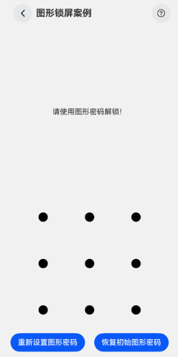

# 图形锁屏案例

### 介绍

本示例介绍使用[图案密码锁组件](https://developer.huawei.com/consumer/cn/doc/harmonyos-references-V5/ts-basic-components-patternlock-V5)与[振动接口](https://developer.huawei.com/consumer/cn/doc/harmonyos-references-V5/js-apis-vibrator-V5)实现图形锁屏场景。该场景多用于桌面及系统类应用。

### 效果图预览



**使用说明**

1. 进入**图形锁屏案例**页面，输入大写字母Z，进入下一页。
2. 点击**重新设置密码**按钮，连续输入两次相同的图形密码，完成图形密码设置，并可以输入新密码进入下一页。
3. 点击**恢复初始密码**按钮，可以恢复默认图形密码。

### 实现思路

使用[图案密码锁组件](https://developer.huawei.com/consumer/cn/doc/harmonyos-references-V5/ts-basic-components-patternlock-V5)展示图形锁界面，并使用[振动接口](https://developer.huawei.com/consumer/cn/doc/harmonyos-references-V5/js-apis-vibrator-V5)实现输入图形密码时反馈振动触感的功能。

1. 展示图形密码锁界面。源码参考[PatternLockComponent.ets](./src/main/ets/components/PatternLockComponent.ets)

```typescript
PatternLock(this.patternLockController)
  .border({
    radius: $r('app.integer.pattern_lock_border_radius')
  })
  // 设置组件的宽度和高度（宽高相同）
  .sideLength($r('app.integer.pattern_lock_side_length'))
  // 设置宫格中圆点的半径
  .circleRadius($r('app.integer.pattern_lock_circle_radius'))
  // 设置连线的宽度
  .pathStrokeWidth(14)
  // 设置连线的颜色
  .pathColor($r('app.color.pattern_lock_path_color'))
  // 设置宫格圆点在“激活”状态的填充颜色，“激活”状态为手指经过圆点但还未选中的状态
  .activeColor($r('app.color.pattern_lock_active_color'))
  // 设置宫格圆点在“选中“状态的填充颜色
  .selectedColor($r('app.color.pattern_lock_selected_color'))
  // 设置在完成密码输入后再次在组件区域按下时是否重置组件状态，默认为true
  .autoReset(true)
  // 设置宫格圆点在“激活”状态的背景圆环样式
  .activateCircleStyle({
    color: $r('app.color.pattern_lock_active_circle_color'),
    radius: {
      value: 18,
      unit: LengthUnit.VP
    },
    enableWaveEffect: true
  })
```

2. 通过[onPatternComplete事件](https://developer.huawei.com/consumer/cn/doc/harmonyos-references-V5/ts-basic-components-patternlock-V5#onpatterncomplete)进行图形密码设置与验证。源码参考[PatternLockComponent.ets](./src/main/ets/components/PatternLockComponent.ets)

```typescript
PatternLock(this.patternLockController)
  // TODO: 密码输入选中宫格原点时触发该回调，在此时机调用振动接口
  .onDotConnect(() => {
    // 触发振动效果
    this.startVibrator();
  })
  // TODO: 密码输入结束时触发该回调，用于密码校验与设置
  .onPatternComplete((input: number[]) => {
    // 输入密码长度小于5位时，提示错误
    if (!input || input.length < 5) {
      this.message = $r('app.string.pattern_lock_message_2');
      this.startVibrator(2);
      // 设置图案密码错误
      this.patternLockController?.setChallengeResult(PatternLockChallengeResult.WRONG);
      setTimeout(() => {
        this.patternLockController?.reset();
      }, 1000);
      return;
    }

    if (this.initalPasswords.length > 0) {
      if (this.initalPasswords.toString() === input.toString()) {
        this.message = $r('app.string.pattern_lock_message_3');
        this.startVibrator();
        setTimeout(() => {
          this.patternLockController?.reset();
          this.message = $r('app.string.pattern_lock_message_1');
          promptAction.showToast({
            message: $r('app.string.pattern_lock_message_3'),
            duration: 1000
          })
        }, 1000);
      } else {
        this.message = $r('app.string.pattern_lock_message_4');
        this.startVibrator(2);
        this.patternLockController?.setChallengeResult(PatternLockChallengeResult.WRONG);
        setTimeout(() => {
          this.patternLockController?.reset();
        }, 500);
      }
    } else {
      // 判断密码长度是否大于0，当前处于第二次输入密码状态
      if (this.passwords.length > 0) {
        if (this.passwords.toString() === input.toString()) {
          this.initalPasswords = input;
          this.passwords = [];
          this.message = $r('app.string.pattern_lock_message_5');
          this.patternLockController?.setChallengeResult(PatternLockChallengeResult.CORRECT);
          this.startVibrator();
          setTimeout(() => {
            this.patternLockController?.reset();
          }, 1000);
        } else {
          this.message = $r('app.string.pattern_lock_message_6');
          this.startVibrator(2);
          this.patternLockController?.setChallengeResult(PatternLockChallengeResult.WRONG);
          setTimeout(() => {
            this.patternLockController?.reset();
          }, 1000);
        }
      } else {
        this.passwords = input;
        this.message = $r('app.string.pattern_lock_message_7');
        setTimeout(() => {
          this.patternLockController?.reset();
        }, 1000);
      }
    }
  })
```

3. 使用[startVibration接口](https://developer.huawei.com/consumer/cn/doc/harmonyos-references-V5/js-apis-vibrator-V5#vibratorstartvibration9)实现振动效果。源码参考[PatternLockComponent.ets](./src/main/ets/components/PatternLockComponent.ets)

```typescript
startVibrator(vibratorCount?: number) {
  try {
    vibrator.startVibration({
      // 设置为'preset'，可使用系统预置振动效果
      type: 'preset',
      // 当前仅支持一种预置振动效果
      effectId: 'haptic.clock.timer',
      // 振动次数，默认振动1次
      count: vibratorCount && vibratorCount > 1 ? vibratorCount : 1
    }, {
      // 马达振动的使用场景
      usage: 'unknown'
    }, (error: BusinessError) => {
      if (error) {
        console.error(`Failed to start vibration. Code: ${error.code}, message: ${error.message}`);
      } else {
        console.info(`Success to start vibration.`);
      }
    })
  } catch (err) {
    const error: BusinessError = err as BusinessError;
    console.error(`An unexpected error occurred. Code: ${error.code}, message: ${error.message}`);
  }
}
```

### 高性能知识点

**不涉及**

### 工程结构&模块类型

   ```
   patternlock                                     // har类型
   |---components
   |   |---PatternLockComponent.ets                // 图形锁屏组件
   |   |---PatternLockMainPage.ets                 // 图形锁屏案例首页
   ```

### 模块依赖

本实例依赖依赖[动态路由模块](../../common/routermodule/src/main/ets/router/DynamicsRouter.ets)来实现页面的动态加载。

### 参考资料

1. [PatternLock组件](https://developer.huawei.com/consumer/cn/doc/harmonyos-references-V5/ts-basic-components-patternlock-V5)
2. [@ohos.vibrator (振动)](https://developer.huawei.com/consumer/cn/doc/harmonyos-references-V5/js-apis-vibrator-V5)