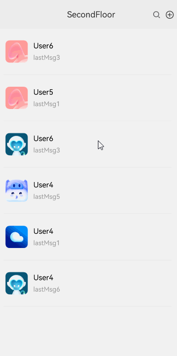

# 首页下拉进入二楼效果案例

### 介绍

本示例主要介绍了利用position和onTouch来实现首页下拉进入二楼、二楼上划进入首页的效果场景，利用translate和opacity实现动效的移动和缩放，并将界面沉浸式（全屏）显示。

### 效果图预览



**使用说明**

1. 向下滑动首页页面超过回弹触发高度位于中间部分时，页面触发刷新列表数据，刷新完成后回弹。
2. 向下滑动首页页面超过刷新列表触发高度，页面进入二楼。
3. 向下滑动未超过触发高度页面回弹。
4. 二楼页面向上滑动超过触发高度，页面进入首页，未超过触发高度页面回弹。
5. 效果图因要展示动效效果对展开速度进行了调整，可以通过[SecondFloor.ets](./src/main/ets/view/SecondFloor.ets)中expandSecondFloor的动效时长来调整二楼展开的速度，也可通过[FloorView.ets](./src/main/ets/view/FloorView.ets)中的OFFSET_STEP和EXPAND_FLOOR_INTERVAL_TIME来调整一楼展开的速度。

### 实现思路

本例涉及的关键特性和实现方案如下：

1. 使用Column布局将一楼页面二楼页面包裹，使用position将一、二楼页面固定，floorHeight设置二楼高度（初始Y轴为负的二楼高度），使用clip按指定的形状对当前组件进行裁剪，源码参考[SecondFloor.ets](./src/main/ets/view/SecondFloor.ets)和[FloorView.ets](./src/main/ets/view/FloorView.ets)。

    ```typescript
    Column() {
      // 二楼页面
      Column() {
        this.floorViewBuilder();
      }
      // 固定二楼刚开始位置
      .position({
        x: 0,
        // Y轴大小
        y: this.mainPageOffsetY
      })
      ...
      // 一楼页面
      Column() {
        this.mainPageBuilder();
      }
      .position({
        x: 0,
        // Y轴大小加上二楼高度
        y: this.offsetY + this.floorHeight
      })
    }
    .clip(true) // TODO：知识点：按指定的形状对当前组件进行裁剪，参数为boolean类型时，设置是否按照父容器边缘轮廓进行裁剪。
    ```

2. 通过对Column设置onTouch属性，记录手指按下和离开屏幕Y轴坐标，判断手势是上/下滑，当下滑距离达到触发距离进入二楼，未达到触发距离则刷新数据或直接回弹（以一楼页面下滑为例），源码参考[SecondFloor.ets](./src/main/ets/view/SecondFloor.ets)。

    ```typescript
    Column() {
      ...
      // 一楼页面
      Column() {
        this.mainPageBuilder();
      }
      ...
    }
      .onTouch((event) => {
        switch (event.type) {
          case TouchType.Down:
            this.onTouchDown(event);
            break;
          case TouchType.Move:
            this.onTouchMove(event);
            break;
            ...
            break;
        }
        event.stopPropagation(); // 阻止冒泡
      })
            
    /**
     * 按下事件、获取按下事件的位置
     * @param event 触屏事件
     */
    private onTouchDown(event: TouchEvent) {
      // 获取触发按压事件Y轴的位置
      this.lastY = event.touches[0].windowY;
      ...
    }
    
    /**
     * 滑动事件
     * @param event 触屏事件
     */
    private onTouchMove(event: TouchEvent) {
      ...
      let currentY = event.touches[0].windowY;
      // onTouch事件中本次Y轴大小减去上一次获取的Y轴大小，为负值则是向上滑动，为正值则是向下滑动
      let deltaY = currentY - this.lastY;
      ...
    }
    ```

3. 使用Row布局将刷新动画包裹，使用rotate实现图片圆圈的转动，源码参考[SecondFloor.ets](./src/main/ets/view/SecondFloor.ets)。

    ```typescript
    Row() {
      // this.floorHeight - Math.abs(this.offsetY)为下拉距离，下拉距离超过MINI_SHOW_DISTANCE（动效最小展示距离）且小于TRIGGER_HEIGHT（触发动画高度或者动效消失高度）展示动画
      if ((this.floorHeight - Math.abs(this.offsetY)) > MINI_SHOW_DISTANCE && (this.floorHeight - Math.abs(this.offsetY)) <= TRIGGER_HEIGHT) {
        Row() {
          Image($r("app.media.second_floor_user_loading"))
            // ...
            .rotate({ angle: this.rotateAngle })
        }
      }
    }
    ```

4. 滑动到中间位置时触发刷新动画，刷新时固定高度，刷新完成后回弹到一楼，源码参考[SecondFloor.ets](./src/main/ets/view/SecondFloor.ets)。

    ```typescript
    /**
     * 刷新列表方法
     */
    private UpdateUserData(): void {
      animateTo({
      duration: ANIMATION_DURATION, // 动画时长
      curve: Curve.Ease, // 动画曲线
      iterations: -1, // 播放次数,-1为无限循环
      playMode: PlayMode.Normal, // 动画模式
      }, () => {
        this.rotateAngle = ROTATE_ANGLE;
      })
      // 模拟网络加载耗时2s，结束后回弹
      setTimeout(() => {
        // 归零图片角度
        this.rotateAngle = 0;
        // 由于本案例仅有6条模拟数据，此处根据数据列表索引值随机改变列表项，模拟列表刷新
        this.userInfoList.forEach((value: UserInformation, index: number) => {
          this.userInfoList[index] =
            new UserInformation($r(`app.media.second_floor_ic_public_user${Math.floor((Math.random() * 6) + 1)}`),
              `User${Math.floor((Math.random() * 6) + 1)}`,
              `lastMsg${Math.floor((Math.random() * 6) + 1)}`);
        })
        // 加载完成后回弹到一楼
        this.scrollByTop();
      }, UPDATE_TIME)
    }
    
    /**
     * 刷新时回弹到固定高度
     */
    private scrollByUpdate(): void {
      this.backAnimator = animator.create({
        duration: 350,
        easing: "linear",
        // 动画延时播放
        delay: 0,
        // 动画结束后保持结束状态
        fill: "forwards",
        direction: "normal",
        // 播放次数
        iterations: 1,
        begin: this.offsetY,
        // 设置加载时页面从拉取的位置回弹到固定高度
        end: -this.floorHeight + UPDATE_HEIGHT
      })
      this.backAnimator.onFrame = (value: number) => {
        this.offsetY = value;
      }
      this.backAnimator.play();
    }
    ```

5. 在手指滑动结束离开屏幕后，通过判断此时二楼高度与Y轴高度差是否大于触发距离，若大于触发距离将进入二楼，若小于则触发刷新数据或直接回弹（以一楼下滑为例），源码参考[SecondFloor.ets](./src/main/ets/view/SecondFloor.ets)。

    ```typescript
    /**
     * 触摸抬起或取消触摸事件
     */
    private onTouchUp(): void {
      if (this.dragging) {
        // 二楼自身的高度减去向下Y轴的位移的绝对值大于触发值进入二楼，否则回弹
        if ((this.floorHeight - Math.abs(this.offsetY)) > this.expandFloorTriggerDistance) {
        // 进入二楼
        this.expandSecondFloor();
        } else if ((this.floorHeight - Math.abs(this.offsetY)) <= this.expandFloorTriggerDistance &&
          (this.floorHeight - Math.abs(this.offsetY)) > BACK_HEIGHT) {
          // 设定滑动结束在大于200小于100的中间位置触发刷新数据
          this.scrollByUpdate();
          this.UpdateUserData();
        } else {
          // 未达到触发距离回弹
          this.scrollByTop();
        }
      }
    }
    ```

### 高性能知识点

本例使用了onTouch事件实时监听获取相关数据，避免在函数中进行冗余或耗时操作，例如应该减少或避免在函数打印日志，会有较大的性能损耗。

本示例使用了setInterval进行页面移动控制，在页面移动到相应的位置后使用clearInterval销毁以降低内存占用。

### 工程结构&模块类型

   ```
secondfloorloadanimation                     // har类型
|---model 
|   |---AppInfo.ets                          // App信息
|   |---UserInformation.ets                  // 用户信息    
|---view
|   |---FloorView.ets                        // 视图层-应用二楼页面
|   |---SecondFloor.ets                      // 视图层-应用一楼页面
|   |---SecondFloorLoadAnimation.ets         // 视图层-应用主页面
   ```

### 模块依赖

- 本实例依赖[common模块](../../common/utils)来实现日志的打印、资源 的调用、依赖[动态路由模块](../../common/routermodule/src/main/ets/router/DynamicsRouter.ets)来实现页面的动态加载。

### 参考资料

- [@ohos.window](https://developer.huawei.com/consumer/cn/doc/harmonyos-references-V5/js-apis-window-V5)
- [触摸事件](https://developer.huawei.com/consumer/cn/doc/harmonyos-references-V5/ts-universal-events-touch-V5)