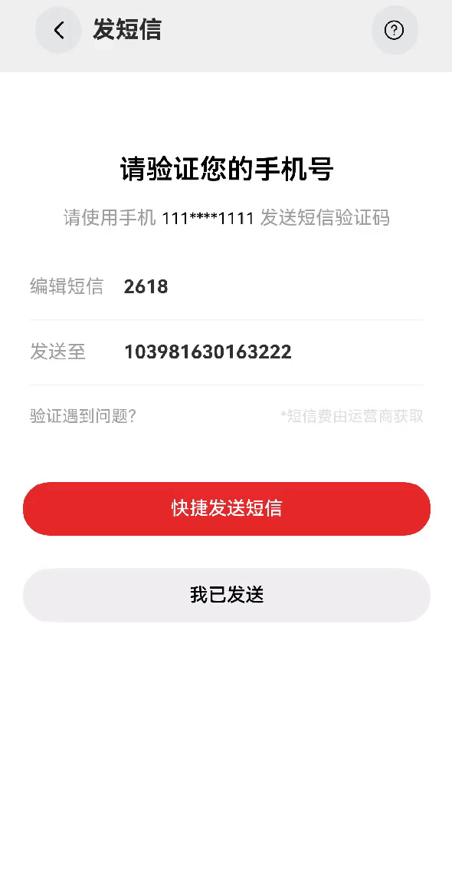

# 发短信案例

### 介绍

本示例介绍如何在应用中调起系统短信，通过startAbility接口中的指定号码并调起系统的发送短信页面。

### 效果图预览



**使用说明**
1. 点击发短信案例。
2. 点击按钮"快捷发送短信"。
3. 调起系统短信页面，并将短信发送人与内容回填到系统短信中。

### 实现思路

1、本案例通过startAbility接口中的指定号码并调起系统的发送短信页面。
```typescript
// TODO:知识点:通过调用元能力startAbility接口指定号码并跳转到发送短信页面
  gotoMessage(contactInfo: Array<Contact>, msg: string) {
    let context = getContext(this) as common.UIAbilityContext;
    // 通过指定的abilityName和bundleName拉起短信服务，并通过页面传入的want参数中填入短信内容与短信接收人的号码。
    let want: Want = {
      bundleName: 'com.ohos.mms',
      abilityName: 'com.ohos.mms.MainAbility',
      parameters: {
        contactObjects: JSON.stringify(contactInfo),
        pageFlag: 'conversation',
        content: msg // 这里填写短信内容
      },
    };
    context.startAbilityForResult(want).then((data) => {
      logger.info(`Success` + JSON.stringify(data));
    }).catch((err: BusinessError) => {[sidebaranimation](..%2Fsidebaranimation)
      logger.error(`Failed to startAbility. Code: ${err.code}, message: ${err.message}`);
    });
  }
```
2、点击页面"快捷发送短信"按钮时，通过指定的abilityName和bundleName拉起短信服务，并通过页面传入的want参数中填入发送的内容与短信接收人的号码，从而实现在应用内实现跳转到短信编辑的功能，并且携带编辑内容和收件人号码。
```typescript
Button($r('app.string.send_message_quickly_sent_message'))
  .onClick(() => {
    let contactInfo: Array<Contact> = [];
    let number = this.number;
    let msg = this.msg;
    // 这里填入发送的联系人名字和号码
    contactInfo.push(new Contact("xx安全团队", number))
    // 点击时，将短信接收人的号码与短信内容传参给系统短信
    this.gotoMessage(contactInfo, msg);
  })
```

### 高性能知识点

不涉及

### 工程结构&模块类型

   ```
   sendmessage                                     // har类型
   |---src/main/ets/components/mainpage
   |   |---MessageView.ets                         // 视图层-主页
   ```

### 模块依赖

[har包-common库中UX标准](../../common/utils/src/main/resources/base/element)  
[routermodule(动态路由)](../../feature/routermodule)

### 参考资料

[短信服务](https://developer.huawei.com/consumer/cn/doc/harmonyos-guides/telephony-sms-0000001774280350)