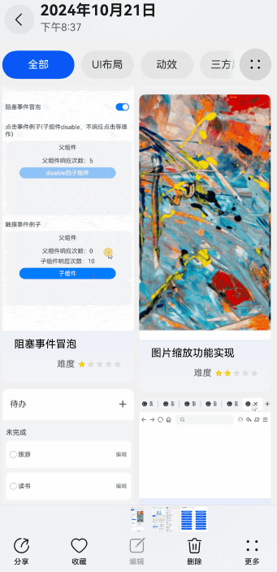

# 图片分享案例

### 介绍

本示例介绍使用[Share Kit](https://developer.huawei.com/consumer/cn/sdk/share-kit/?ha_source=sousuo&ha_sourceId=89000251)和[ShareExtensionAbility ](https://developer.huawei.com/consumer/cn/doc/harmonyos-references-V5/js-apis-app-ability-shareextensionability-V5)实现从图库分享图片到应用的场景。该场景多用于聊天类应用。

### 效果图预览



**使用说明**

1. 打开图库选择一张图片，点击左下角分享按钮拉起分享弹窗。
2. 在分享弹窗中选择需要分享的应用，将图片分享到应用。

### 实现思路

1. 通过[Share Kit（分享服务）](https://developer.huawei.com/consumer/cn/doc/harmonyos-guides-V5/share-kit-guide-V5)构造分享数据，启动分享面板选择需要分享过去的应用启动分享。
```ts
  // 构造ShareData，需配置一条有效数据信息
  const contextFaker: Context = getContext(this);
  let filePath = contextFaker.filesDir + '/exampleImage.jpg'; // 仅为示例 请替换正确的文件路径
  // 获取精准的utd类型
  let utdTypeId = utd.getUniformDataTypeByFilenameExtension('.jpg', utd.UniformDataType.IMAGE);
  let shareData: systemShare.SharedData = new systemShare.SharedData({
    utd: utdTypeId,
    uri: fileUri.getUriFromPath(filePath),
    title: '图片标题', // 不传title字段时,显示图片文件名
    description: '图片描述', // 不传description字段时,显示图片大小
    thumbnail: new Uint8Array() // 优先使用传递的缩略图预览  不传则默认使用原图做预览图
  });
  shareData.addRecord({
  utd: utdTypeId,
  uri: fileUri.getUriFromPath(filePath),
  title: '图片标题', // 不传title字段时,显示图片文件名
  description: '图片描述', // 不传description字段时,显示图片大小
  });
  // 进行分享面板显示
  let controller: systemShare.ShareController = new systemShare.ShareController(shareData);
  let context = getContext(this) as common.UIAbilityContext;
  controller.show(context, {
    selectionMode: systemShare.SelectionMode.SINGLE,
    previewMode: systemShare.SharePreviewMode.DETAIL,
  }).then(() => {
    console.info('ShareController show success.');
  }).catch((error: BusinessError) => {
    console.error(`ShareController show error. code: ${error.code}, message: ${error.message}`);
  });
```
2. 构建分享能力Ability，需要在应用配置文件（src/main/module.json5）的skills配置中注册。配置actions为ohos.want.action.sendData，并且uris需穷举所有支持的数据类型。源码参考[module.json5](../../product/entry/src/main/module.json5)
```ts
 "skills": [
   {
      "entities": [
      "entity.system.home"
      ],
     "actions": [
       "action.system.home",
       "ohos.want.action.sendData"
     ],
     "uris": [
       {
         "scheme": "file",
         "utd": "general.image",
         "maxFileSupported": 1
       }
      ]
    }
 ]
  ```
3. 在Ability被系统启动时，Ability会收到want数据，在onCreate中want数据中无直接的图片地址通过systemShare.getSharedData获取的图片地址，在onNewWant中want数据中有直接的图片数据可以直接使用。源码参考[EntryAbility.ets](../../product/entry/src/main/ets/entryability/EntryAbility.ets)
```ts
  onNewWant(want: Want, launchParam: AbilityConstant.LaunchParam): void {
    if (want.parameters!['ability.params.stream'] !== undefined) {
      AppStorage.setOrCreate('imageUri', want.parameters!["ability.params.stream"].toString());
    }
  }

  onCreate(want: Want, launchParam: AbilityConstant.LaunchParam): void {
    systemShare.getSharedData(want)
      .then((data: systemShare.SharedData) => {
        data.getRecords().forEach((record: systemShare.SharedRecord) => {
          // 处理分享数据
          AppStorage.setOrCreate('imageUri', record.uri)
        });
      })
  }
  ```
4. 通过systemShare.getSharedData或want数据中获取分享的图片地址，直接在页面中渲染页面。源码参考[ShareImagePage.ets](./src/main/ets/components/ShareImagePage.ets)
```ts
  aboutToAppear() {
    if (AppStorage.get('imageUri') !== undefined) {
      this.shareImageUri = AppStorage.get('imageUri');
      this.textDetailData.push({
        profilePicture: $r('app.media.photo0'),
        shareImageUri: this.shareImageUri,
        content: ''
      });
      // 通知lazyForeach重新加载数据
      this.dataSource.modifyAllData(this.textDetailData);
    }
  }
  ```

### 高性能知识点

**不涉及**

### 工程结构&模块类型

   ```
   shareimagepage                             // har类型
   |---components
   |   |---ShareImagePage.ets                 // 视图层-分享页面 
   |   |---ListDataSource.ets                 // 数据模型层-聊天列表数据 
   ```

### 模块依赖

[routermodule(动态路由)](../../common/routermodule/src/main/ets/router/DynamicsRouter.ets)

### 参考资料

[Share Kit](https://developer.huawei.com/consumer/cn/sdk/share-kit/?ha_source=sousuo&ha_sourceId=89000251)
