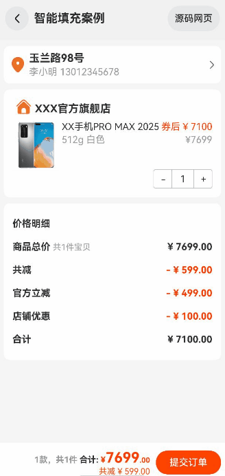

# 智能填充案例

### 介绍

本示例介绍了使用[智能填充](https://developer.huawei.com/consumer/cn/doc/harmonyos-guides-V13/scenario-fusion-introduction-to-smart-fill-V13)自动补充表单的功能。
该场景多用于需要使用多个填充相同表单的场景。

### 效果图预览



**使用说明**：

* 点击地址栏，弹出添加地址场景框。
* 点击其中一个输入框，弹出智能填充选项。

### 实现步骤

实现智能填充表单，有两个关键点，首先需要应用开通智能填充服务权限；然后设备智能填充开关必须处于打开状态。详情请见[智能填充](https://developer.huawei.com/consumer/cn/doc/harmonyos-guides-V13/scenario-fusion-introduction-to-smart-fill-V13)。

1. 识别智能填充主要依赖输入框内的ContentType属性。所以需要将输入框内加上对应的ContentType属性。
```ts
  TextInput({ text: this.text })
    .id(this.componentId)
    .width(CommonConstants.WIDTH_FULL)
    .backgroundColor(Color.White)
    .contentType(this.contentType) // 选择对应的ContentType属性
```
2. 智能填充在页面发生跳转的时候，或者手动触发保存逻辑的时候，方可触发保存表单逻辑。
```ts
  if (!this.isClicked) {
    // 主动触发保存历史表单输入
      autoFillManager.requestAutoSave(this.getUIContext())
    this.isClicked = true;
    // 设置超时时间以防止重复点击按钮保存历史表单输入
    setTimeout(() => {
      this.isClicked = false;
    }, 1000)
  }
```
3. 若在页面中也提供了弹窗提醒填充建议的功能，为避免弹窗冲突，建议您将对应输入组件的enableAutoFill属性设置为“false”以关闭智能填充功能。本案例未设置填充提醒功能，故无需设置关闭填充功能。

### 高性能知识点

**不涉及**

### 工程结构&模块类型

   ```
   smartfill                                  // har
   |---common
   |   |---CommonContants.ets.ets             // 常量文件
   |---components                             // 组件文件
   |---view
   |   |---SmartFill.ets                      // 案例页面
   ```

### 模块依赖

**不涉及**

### 参考资料

[智能填充](https://developer.huawei.com/consumer/cn/doc/harmonyos-guides-V13/scenario-fusion-introduction-to-smart-fill-V13)
