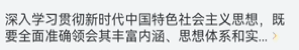

# 文字展开收起案例

### 介绍

本示例介绍了使用[@ohos.measure](https://developer.huawei.com/consumer/cn/doc/harmonyos-references/js-apis-measure-0000001774280802)
组件接口实现文字段落展开收起的功能，且同时介绍了如何解决图文混排的问题。
该场景多用于图文列表展示等。

### 效果图预览


**使用说明**：

1、点击“首页”或者“同城”tab

* 点击展开按钮，展开全部文字。
* 点击收起按钮，收起多余文字。

2、点击“热门”或者“其他”tab

* 点击右箭头，展开全部文字。
* 点击上箭头，收起多余文字。

### 下载安装

1.模块oh-package.json5文件中引入依赖。

```typescript
"dependencies": {
  "@ohos-cases/textexpand": "har包地址"
}
```

2.ets文件import自定义视图实现文本折叠视图。

```typescript
import { TextExpandModel, TextSectionAttribute, TextExpandView } from '@ohos-cases/textexpand';
```

### 快速使用

本章节介绍了如何快速实现一个文本折叠和展开的能力。

1.设置TextSectionAttribute属性，可以设置文本的最大行数、字体颜色、字体大小、行高以及文本行所占宽度。

```typescript
class TextSectionAttribute {
  title: ResourceStr = '';
  maxLines: number;
  fontColor: ResourceStr;
  fontSize: Resource | number | string;
  lineHeight:number;
  constraintWidth: Resource | number | string;

  constructor(title: ResourceStr = '', maxLines: number = 2, fontColor: ResourceStr = '#000',
    fontSize: Resource | number | string = '16vp', lineHeight: number = 16,
    constraintWidth: Resource | number | string = 350) {
    this.title = title;
    this.maxLines = maxLines;
    this.fontColor = fontColor;
    this.fontSize = fontSize;
    this.lineHeight = lineHeight;
    this.constraintWidth = constraintWidth;
  }
}
```

2.设置控制文本段落展开和收齐的文本或者图片属性。参数有文本或者图片的字符所占数、类型(0代表文本，1代表图片)、内容、字体大小或者图片大小、字体颜色.

```typescript
 class LastSpanAttribute {
    lastSpanType: number;
    charactersNumber: number;
    content: ResourceStr[];
    size: ResourceStr | number;
    color: ResourceStr | Color;
 
    constructor(lastSpanType: number, charactersNumber: number = 1,
      content: ResourceStr[], size: ResourceStr | number, color: ResourceStr | Color = Color.Orange) {
      this.lastSpanType = lastSpanType;
      this.charactersNumber = charactersNumber;
      this.content = content;
      this.size = size;
      this.color = color;
    }
  }
```

3.引用文本展开收起组件。

```typescript

 TextExpandView({
   textSectionAttribute: new TextSectionAttribute(this.rawTitle),
   lastSpanAttribute: this.tabItemIndex % 2 === 0 ? new LastSpanAttribute(0, 2,
     [$r('app.string.text_expand_expand_title'), $r('app.string.text_expand_collapse_title')], 16,
     Color.Orange) :
     new LastSpanAttribute(1, 1, [$r("app.media.text_expand_arrow_down"), $r('app.media.text_expand_arrow_right')],
       16, Color.Orange)
  }).id(`textClick${this.index}`)

```

### 属性(接口)说明

TextSectionAttribute类属性

|       属性        |           类型           |      释义      | 默认值 |
|:---------------:|:----------------------:|:------------:|:---:|
|      title      |      ResourceStr       |     文本内容     |  -  |
|    maxLines     |         number         |  设置文本的最大行数   |  2  |
|    fontColor    |      ResourceStr       |     文本颜色     |  -  |
|    fontSize     | Resource/number/string |     文本大小     | 16  |
|   lineHeight    |         number         |      行高      | 16  |
| constraintWidth | Resource/number/string | 设置文本的行所占最大宽度 | 350 |

LastSpanAttribute类属性

|        属性        |         类型         |       释义       |    默认值    |
|:----------------:|:------------------:|:--------------:|:---------:|
|   lastSpanType   |       number       | 类型(0为文本，1为图片)  |     -     |
| charactersNumber |       number       | 折叠文本或者图片所占字符个数 |     -     |
|     content      | ResourceStr/number |    文本或者图片内容    |     -     |
|       size       |      string[]      |    文本或者图片大小    |     -     |
|      color       | ResourceStr/Color  |      文本颜色      |     -     |


AlphabetListView自定义组件属性

|          属性          |          类型          |       释义        | 默认值 |
|:--------------------:|:--------------------:|:---------------:|:---:|
| textSectionAttribute | TextSectionAttribute |     文本章节属性类     |  -  |
|  lastSpanAttribute   |  LastSpanAttribute   | 控制文本折叠的文本或者图片属性 |  -  |


## 实现步骤

想要实现文字收起，难点在于如何判断展示多少文字可以达到只显示到指定行数（以两行为例）的目的。通过判断文字其在容器内的高度来将文字缩减到指定行数，可以实现收起效果的目的。利用 [measure.measureTextSize](https://developer.huawei.com/consumer/cn/doc/harmonyos-references/js-apis-measure-0000001774280802#ZH-CN_TOPIC_0000001811158890__measuremeasuretextsize10)
方法去分别计算文字总体的高度和两行文字的高度，再进行缩减文字，直到文字高度符合两行文字的要求。

1.使用measure.measureTextSize方法来判断总体文字的高度

```typescript

let titleSize: SizeOptions = MeasureText.measureTextSize({
  textContent: this.rawTitle, // 被计算文本内容
  lineHeight: this.textSectionAttribute.lineHeight,
  constraintWidth: this.textSectionAttribute.constraintWidth, // 被计算文本布局宽度
  fontSize: this.textSectionAttribute.fontSize // 被计算文本字体大小 
})
let height = px2vp(Number(titleSize.height));

```

2.使用measure.measureTextSize方法来判断两行文字的高度，当前为两行文字的高度

```typescript
 const minLinesTextSize: SizeOptions = MeasureText.measureTextSize({
   textContent: text,
   fontSize: fontSize,
   maxLines: maxLines,
   wordBreak: WordBreak.BREAK_ALL,
   constraintWidth: textWidth
 });
 const minHeight: Length | undefined = minLinesTextSize.height;
```

3.减少接收文字字符数。当接收文字高度小于指定行数高度时，使文字显示两行，达到实现收起状态的目的。本案例使用二分法查找正好两行的长度的字符串，效率更高

```typescript
 /**
   * 获取收起后的短段落字符串
   * @param text       长段落字符串
   * @param fontSize   字符大小
   * @param maxLines   收起后最大行数
   * @param textWidth  段落宽度
   * @param suffix     省略号
   * @param lastSpan   展开收起按钮
   * @returns          短段落字符串
   */
  public static getShortText(text: string, fontSize: Resource | number | string, maxLines: number, textWidth: string | number | Resource,
    suffix: string, lastSpan: string): string {
    const minLinesTextSize: SizeOptions = MeasureText.measureTextSize({
      textContent: text,
      fontSize: fontSize,
      maxLines: maxLines,
      wordBreak: WordBreak.BREAK_ALL,
      constraintWidth: textWidth
    });
    const minHeight: Length | undefined = minLinesTextSize.height;
    if (minHeight === undefined) {
      return '';
    }
    // 使用二分法查找正好两行的长度的字符串
    let leftCursor: number = 0;
    let rightCursor: number = text.length;
    let cursor: number = Math.floor(rightCursor / 2);
    let tempTitle: string = '';
    while (true) {
      tempTitle = text.substring(0, cursor) + suffix + lastSpan;
      const currentLinesTextSize: SizeOptions = MeasureText.measureTextSize({
        textContent: tempTitle,
        fontSize: fontSize,
        wordBreak: WordBreak.BREAK_ALL,
        constraintWidth: textWidth
      });
      const currentLineHeight: Length | undefined = currentLinesTextSize.height;
      if (currentLineHeight === undefined) {
        return '';
      }
      if (currentLineHeight > minHeight) {
        // 当前字符已超过两行，向左继续找
        rightCursor = cursor;
        cursor = leftCursor + Math.floor((cursor - leftCursor) / 2);
      } else {
        // 当前字符小于两行了，可能已经ok，但仍需向右查找
        leftCursor = cursor;
        cursor += Math.floor((rightCursor - cursor) / 2);
      }
      if (Math.abs(rightCursor - leftCursor) <= 1) {
        // 两次指针基本重合了，代表已找到
        break;
      }
    }
   // 这里由于添加空格 所以cursor需要减1
    return text.substring(0, cursor - 1) + suffix + '  ';
  }
```

4.而解决图文混排的问题，则需用等宽的字符代替icon进行布局计算，然后对应icon使用SymbolSpan组件来进行渲染

```typescript
// 这里使用与箭头icon等宽的字符‘的’来替代进行布局计算，因为measure只能对纯字符串进行布局计算
 this.textModifier.title =
   TextUtils.getShortText(TextUtils.getStringFromResource(this.rawTitle),
     this.textSectionAttribute.fontSize,
     this.textSectionAttribute.maxLines,
     this.textSectionAttribute.constraintWidth, MEASURE_ELLIPSIS, `${this.lastSpan}`)
```

```typescript
 Text() {
   Span(this.textModifier.title)
   if (this.textModifier.needProcess && !this.textModifier.exceedOneLine) {
     Span(this.lastSpanAttribute.content[0])
       .fontColor(this.lastSpanAttribute.color)
   }
 }
  .fontSize(this.lastSpanAttribute.size)
  .width(this.textSectionAttribute.constraintWidth)
  .lineHeight(this.textSectionAttribute.lineHeight)

if (this.textModifier.exceedOneLine) {
  Text(this.lastSpanAttribute.content[1])
    .fontSize(this.lastSpanAttribute.size)
    .width(this.textSectionAttribute.constraintWidth)
    .fontColor(this.lastSpanAttribute.color)
    .textAlign(TextAlign.End)
    .lineHeight(this.textSectionAttribute.lineHeight)
}
```

5.图文混排效果如下图所示，由文字段落和右箭头icon组成




### 高性能知识点

**不涉及**

### 工程结构&模块类型

   ```
   textexpand                                         // har
   |---component                                         
   |   |---ItemPart.ets                               // 文字展开收起组件
   |---utils
   |   |---Model.ets                                  // 文本属性
   |   |---TextExpandView.ets                         // 文本段落展开折叠视图
   |   |---TextUtils.ets                              // 计算并获取收起后的短段落字符串的工具类
   |---view
   |   |---TextExpand.ets                             // TextExpand 页面
   ```

### 模块依赖

本实例依赖common模块来获取[日志工具类logger](../../common/utils/src/main/ets/log/Logger.ets)。

### 参考资料

[@ohos.measure](https://developer.huawei.com/consumer/cn/doc/harmonyos-references/js-apis-measure-0000001774280802)
