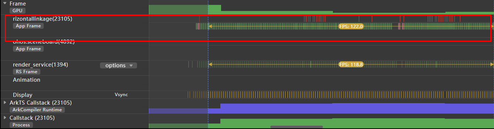

# 纵向横向列表联动案例

### 介绍
本示例主要通过[List](https://developer.huawei.com/consumer/cn/doc/harmonyos-references-V2/ts-container-list-0000001477981213-V2)组件绑定[Scroller](https://developer.huawei.com/consumer/cn/doc/harmonyos-references-V2/ts-container-scroll-0000001427902480-V2)滚动控制器和[LazyForEach](https://developer.huawei.com/consumer/cn/doc/harmonyos-guides-V2/arkts-rendering-control-lazyforeach-0000001524417213-V2)数据懒加载来实现纵向横向列表联动，该场景多用于汽车参数对比，股票信息查看。

### 效果图预览


**使用说明**

1. 纵向划动列表，内容和行标题保持联动
2. 横向划动列表，内容和列标题保持联动

### 实现思路
本示例通过将每一个List绑定不同的Scroller对象，通过控制Scroller对象的滚动偏移量，使同一方向滚动的List的滚动量保持一致，实现横向纵向列表联动。
1. 创建BasicDataSource类，LazyForEach加载数据。[源码参考](./src/main/ets/datasource/DataSource.ets)
2. 顶部列表，底部左侧列表，底部右侧列表分别绑定不同的Scroller对象。声明一个变量，存储展示内容横向滚动的偏移量。[源码参考](./src/main/ets/view/VerticalAndHorizontalList.ets)
```ts
private topListScroller: Scroller = new Scroller(); // 顶部列表（列标题）的滚动控制器
private bottomLeftListScroller: Scroller = new Scroller(); // 底部列表左侧（行标题）的滚动控制器
private bottomRightListScroller: Scroller = new Scroller(); // 底部列表右侧（展示内容）的滚动控制器
private remainOffset: number = 0; // 每一行内容的滚动偏移量
```
3. 通过对象保存Scroller数组，底部右侧每一行内容绑定一个Scroller对象。[源码参考](./src/main/ets/view/VerticalAndHorizontalList.ets)
```ts
loadShowData(): void {
  const context: Context = getContext(this);
  // 读取car.json里的数据
  let jsonData: Uint8Array = context.resourceManager.getRawFileContentSync('car.json');
  // 将数据解码，转成字符串
  let stringData: string = util.TextDecoder.create('utf-8').decodeToString(jsonData);
  let data: [] = JSON.parse(stringData) as [];
  for (let i = 0; i < data.length; i++) {
    const dataItem = data[i] as ShowData;
    let showData: ShowData = new ShowData();
    showData.sticky = dataItem.sticky;
    showData.sub = dataItem.sub;
    // 保存Scroller数组，与左侧标题一一对应
    showData.sub.forEach(element => {
      let scroller: Scroller = new Scroller();
      showData.scrollerArray.push(scroller);
    })
    this.showDataArray.push(showData);
  }
  this.dataSource.setData(this.showDataArray);
}
```

4. 顶部列表绑定topListScroller，列表横向划动时，让每一行的滚动控制器保持同步滚动，实现联动。[源码参考](./src/main/ets/view/VerticalAndHorizontalList.ets)
 ```ts
List({ scroller: this.topListScroller }) {
  this.topListItem();
}
.edgeEffect(EdgeEffect.None) // 将边缘滑动效果设置为无
.listDirection(Axis.Horizontal) // 设置滚动方向为横向滚动
.scrollBar(BarState.Off)
.onScrollFrameBegin((offset: number, state: ScrollState) => {
  // 顶部列标题列表滚动时，让每一行的滚动控制器保持同步滚动，实现联动
  this.dataSource.getAllData().forEach((showData: ShowData) => {
    showData.scrollerArray.forEach((scroller: Scroller) => {
      // 偏移量为顶部列表滚动控制器当前偏移量+本次滚动的偏移量
      scroller.scrollTo({ xOffset: this.topListScroller.currentOffset().xOffset + offset, yOffset: 0 });
    })
  })
  return { offsetRemain: offset };
})
 // ...
 ```
5. 底部左侧列表绑定bottomLeftListScroller，列表纵向滚动时，通过控制bottomRightListScroller的滚动偏移量实现联动。[源码参考](./src/main/ets/view/VerticalAndHorizontalList.ets)

 ```ts
List({ scroller: this.bottomLeftListScroller }) {
  // TODO:性能知识点：数据量较大，使用了[LazyForEach](https://developer.huawei.com/consumer/cn/doc/harmonyos-references-V5/ts-rendering-control-lazyforeach-V5) 进行数据懒加载优化，以降低内存占用和渲染开销
  LazyForEach(this.dataSource, (item: ShowData, index: number) => {
    ListItemGroup({ header: this.leftFixedTitle(item.sticky) }) {
      this.bottomLeftListItem(item);
    }
  }, (item: ShowData, index: number) => item.sticky + index)
}
.onScrollFrameBegin((offset: number, state: ScrollState) => {
  // 通过控制右下列表的滚动控制器来保持和左下列表的联动
  this.bottomRightListScroller.scrollTo({
    xOffset: 0,
    // 滚动偏移量为左下列表滚动控制器的当前偏移量+本次滚动的的偏移量
    yOffset: this.bottomLeftListScroller.currentOffset().yOffset + offset
  });
  return { offsetRemain: offset };
})
// ...
 ```

6. 底部右侧列表绑定bottomRightListScroller，列表纵向滚动时，通过控制bottomLeftListScroller的滚动偏移量实现纵向列表联动。列表纵向滚动时，让每一行的滚动控制器的滚动偏移量都保持一致，实现联动。通过父子传值(initOffset)，使每一行展示内容的初始滚动偏移量保持一致。[源码参考](./src/main/ets/view/VerticalAndHorizontalList.ets)

 ```ts
List({ scroller: this.bottomRightListScroller }) {
  // TODO:性能知识点：数据量较大，使用了[LazyForEach](https://developer.huawei.com/consumer/cn/doc/harmonyos-references-V5/ts-rendering-control-lazyforeach-V5) 进行数据懒加载优化，以降低内存占用和渲染开销
  LazyForEach(this.dataSource, (item: ShowData, index: number) => {
    ListItemGroup({ header: this.rightFixedTitle(index) }) {
      this.bottomRightListItem(item);
    };
  }, (item: ShowData, index: number) => item.sticky);
}
.onScrollFrameBegin((offset: number, state: ScrollState) => {
  // 下方左侧行标题列表与下方右侧列表的滚动偏移量保持一致
  this.bottomLeftListScroller.scrollTo({
    xOffset: 0,
    // 滚动偏移量为右下列表滚动控制器的当前偏移量+本次滚动的的偏移量
    yOffset: this.bottomRightListScroller.currentOffset().yOffset + offset
  })
  return { offsetRemain: offset };
})
.onDidScroll((scrollOffset: number, scrollState: ScrollState) => {
  // 行标题列表纵向滚动时，下方右侧的每一行展示内容的横向偏移量保持一致
  this.dataSource.getAllData().forEach((showData: ShowData) => {
    showData.scrollerArray.forEach((scroller: Scroller) => {
      scroller.scrollTo({ xOffset: this.remainOffset, yOffset: 0 });
    })
  })
})
// ...
 ```

7. 横向滚动列表每一行内容都绑定一个Scroller对象，列表滚动时，通过传参，传递滚动偏移量，使每一行内容的滚动偏移量都保持一致。[源码参考](./src/main/ets/view/VerticalAndHorizontalList.ets)

```ts
List({ scroller: this.scroller }) {
  LazyForEach(this.dataSource, (item: string, index: number) => {
    this.singleLineListItem(item);
    }
  }, (item: string) => item)
}
.onScrollFrameBegin((offset: number, scrollState: ScrollState) => {
  if (this.scrollCallback) {
    // 传递滚动偏移量
    this.scrollCallback(this.scroller!.currentOffset().xOffset + offset);
  }
  return { offsetRemain: offset };
})
.onDidScroll((scrollOffset: number, scrollState: ScrollState) => {
  if (this.remainOffsetCallback) {
    // 更新滚动偏移量
    this.remainOffsetCallback(this.scroller!.currentOffset().xOffset);
  }
})
.edgeEffect(EdgeEffect.None) // 将边缘滑动效果设置为无
.listDirection(Axis.Horizontal)
.scrollBar(BarState.Off)
 // ...
```


### 高性能知识点

本示例数据量较少的列表，使用ForEach加载List数据，数据量较多的列表使用了LazyForEach进行数据懒加载。<br>
本示例的滑动过程帧率可以达到满帧（120帧），trace截图如下所示：<br>


### 工程结构&模块类型

   ```
   verticalhorizontallinkage              // har类型
   |---datasource
   |   |---DataSource.ets                 // LazyForEach控制器
   |   |---ShowData.ets                   // 数据模型层-列表mock数据类型
   |---view                             
   |   |---VerticalAndHorizontalList.ets  // 视图层-应用主页面
                          
   ```

### 模块依赖

本实例依赖[动态路由模块](../../common/routermodule/src/main/ets/router/DynamicsRouter.ets)来实现页面的动态加载。

### 参考资料

[List](https://developer.huawei.com/consumer/cn/doc/harmonyos-references/ts-container-list-0000001862607449)

[Scroll](https://developer.huawei.com/consumer/cn/doc/harmonyos-references-V5/ts-container-scroll-V5#onscrolldeprecated)

[LazyForEach](https://developer.huawei.com/consumer/cn/doc/harmonyos-guides-V2/arkts-rendering-control-lazyforeach-0000001524417213-V2)