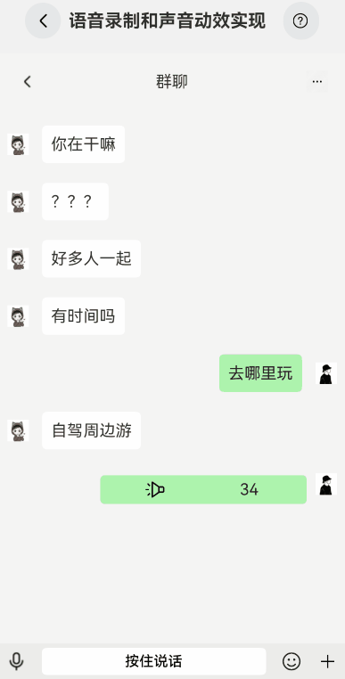

# 语音发送手势动画实现

### 介绍

本示例参考微信语音识别转文字的功能，根据长按与移动组合手势，移动到不同区域，实现发送语音、取消发送和转文字三种功能。

### 效果图预览



**使用说明**

1. 按住按钮开始录音。
2. 释放发送语音消息。
3. 拖拽到“文”字进行语音转文字模拟。
4. 拖拽到“取消”则放弃发送。
5. 录制完成后点击语音消息框可播放录音。

### 实现思路

1.定义枚举类型，标志3种模式，0表示语音识别，1表示转文字，2表示取消
```typescript
export enum VerifyModeEnum {
//语音识别
VOICE = 0,
//转文字
TEXT = 1,
//取消
CANCEL = 2
}
```
2.长按时默认模式时语音，组合移动手势时，根据移动的x轴和y轴的移动距离来判断切换哪种识别模式。<br>
其中移动到左上方区域，切换为取消模式；移动到右上方区域，切换为转文字模式；y轴距离小于一定的数值时，切换会语音模式
```typescript
const offsetX = event.offsetX;
const offsetY = event.offsetY;
//0=语音录制，1=转文字，2=取消
this.mode = getMode(offsetX, offsetY);
this.updateStateByMode();

...

/** 根据偏移计算模式：0=语音录制，1=转文字，2=取消 */
function getMode(offsetX: number, offsetY: number):number{
  if(offsetX < 0){
    return offsetY <= -20 ? VerifyModeEnum.CANCEL : VerifyModeEnum.VOICE;
  }else{
    return offsetY <= -20 ? VerifyModeEnum.TEXT : VerifyModeEnum.VOICE;
  }
}

...

updateStateByMode():void {
    if(this.mode === VerifyModeEnum.VOICE){
      this.backgroundVoice = Color.White;
      this.fontColorVoice = Color.Black;
      this.waterRipplesBg = "#ab8bf58b"
      //更新取消
      this.fontColorCancel = Color.White;
      this.backgroundCancel = Color.Gray;
      //更新转文字
      this.fontColorWord = Color.White;
      this.backgroundWord = Color.Gray;
    }else if(this.mode === VerifyModeEnum.TEXT){
      //转文字
      this.fontColorWord = Color.Black;
      this.backgroundWord = Color.White;
      this.waterRipplesBg = "#ab8bf58b"
      //更新取消
      this.fontColorCancel = Color.White;
      this.backgroundCancel = Color.Gray;
      this.backgroundVoice = Color.Gray;
      this.fontColorVoice = Color.White;
    }else if(this.mode === VerifyModeEnum.CANCEL){
      //取消
      this.fontColorCancel = Color.Black;
      this.backgroundCancel = Color.White;
      this.waterRipplesBg = "#abFF0000";
      //更新转文字
      this.fontColorWord = Color.White;
      this.backgroundWord = Color.Gray;
      this.backgroundVoice = Color.Gray;
      this.fontColorVoice = Color.White;
    }
  }

```

3.手势识别结束时，如果是语音模式，显示一条语音消息，如果是转文字模式，就模拟显示一条文本消息。最后调用方法将各种状态重置为初始状态。

### 高性能知识点

**不涉及。**


