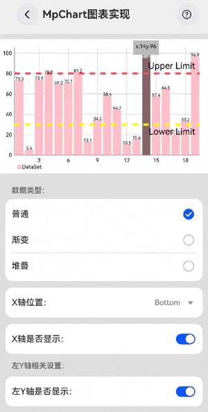

<p align="center">
  <h1 align="center">Navigation开发页面切换场景范例</h1>
</p>

## 简介

在应用开发中存在大量应用内多页面跳转场景，使用`Navigation`导航组件做统一的页面跳转管理，`Navigation`组件提供一系列属性方法来设置页面的标题栏、工具栏以及菜单栏的展示样式。还支持动态加载，navPathStack路由跳转等能力。

本文就以Navigation页面切换为例，展开讲解Navigation以上的技术点，帮助开发者快速学习。

## 场景概述

导航组件`Navigation`一般作为Page页面的根容器，Navigation组件可以作为首页和内容页的容器。首页显示Navigation的子组件，内容页显示NavDestination的子组件，主页和内容页通过路由进行切换。  
Navigation的路由切换的方式有两种：
* 在API Version 9上，首页导航内容需要配合NavRouter组件实现页面路由。
* 从API Version 10开始，首页推荐使用NavPathStack配合NavDestination属性进行页面路由。

本次示例主要介绍NavPathStack的使用。

导航组件Navigation还可以通过mode属性实现多设备适配，具体请参考[MULTIDEVICE_ADAPTATION.md](../../doc/MULTIDEVICE_ADAPTATION.md)

> 通过本篇文章的学习，你将学会：    
1.如何使用**NavPathStack路由转场**  
2.如何在**Navigation中跨包引用hsp**  
3.如何在**Navigation中使用动态加载**

## Router与Navigation适用场景对比
| 组件  | 适用场景 | 特点                | 转场动画效果对比 |
|-----|------|-------------------|----------|
| Router | 模块间与模块内页面切换  | 通过每个页面的url实现模块间解耦 | 页面平推转场效果 |
| Navigation | 模块内页面切换  | 通过组件级路由统一路由管理     | 向右折叠转场效果 |

## 使用NavPathStack路由转场
* NavPathStack有两种路由切换方法，一种是pushPath，如首页---->设置页面，通过使用this.pageStack.pushPath({ name: url })进行跳转；另外一种是pushPathByName，如首页---->详情页面，通过使用this.pageStack.pushPathByName(name, item)进行跳转，其中item为需要传递的参数。

* NavPathStack支持pop、move、clear方法的使用；pop方法的作用是弹出路由栈栈顶元素，如首页进入商品详情页面，在详情页面使用this.pageStack.pop()方法返回到首页，clear方法的作用是清除栈中所有页面，
  如首页跳转到详情页面，详情页面再进入直播页面，在直播页面通过使用this.pageStack.clear()直接返回到首页。除此之外，还有popTo(回退路由栈到第一个名为name的NavDestination页面)、
  popToIndex(回退路由栈到index指定的NavDestination页面)、moveToTop(将第一个名为name的NavDestination页面移到栈顶)、moveIndexToTop(将index指定的NavDestination页面移到栈顶)方法,
  由于本示例暂时没有合适的按钮去承载这些功能，所以本示例未体现。

* 路由栈信息,如下所示：
    ```
    获取栈中所有NavDestination页面的名称：this.pageInfos.getAllPathName()
    获取index指定的NavDestination页面的参数信息：this.pageInfos.getParamByIndex(1)
    获取全部名为name的NavDestination页面的参数信息：this.pageInfos.getParamByName('pageTwo')
    获取全部名为name的NavDestination页面的位置索引：this.pageInfos.getIndexByName('pageOne')
    获取栈大小：this.pageInfos.size()
    ```

### 实现思路

以Navigation组件为基础，通过[路由管理](../../common/routermodule/README.md)实现页面之间的跳转。

### 开发步骤

**Navigation中使用路由跳转页面**

1. 在onClick事件中，调用路由管理中的push方法。源码参考[FunctionalScenes.ets](../../feature/functionalscenes/src/main/ets/FunctionalScenes.ets)

    ```ts
    Column()
      .onClick(() => {
        DynamicsRouter.push(listData.routerInfo, listData.param);
      })
    ```

2. 在DynamicsRouter的push方法中，通过NavPathStack.pushPath方法实现页面的跳转。源码参考[DynamicsRouter](../../common/routermodule/src/main/ets/router/DynamicsRouter.ets)

    ```ts
    public static async push(routerInfo: RouterInfo, param?: string): Promise<void> {
      const pageName: string = routerInfo.pageName;
      const moduleName: string = routerInfo.moduleName;
      ...
      if (isImportSucceed) {
        const builderName: string = moduleName + "/" + pageName;
        DynamicsRouter.getNavPathStack().pushPath({ name: builderName, param: param });
      }
    }
    ```

**新模块中配置路由管理**

1. 添加需要加载的子模块的依赖，详细代码请参考[oh-package.json](../../product/entry/oh-package.json5)。

    ```
    "dependencies": {
      "event-propagation": "file:../../feature/eventpropagation",
      ...
    }
    ```

2. 添加动态import变量表达式需要的参数，此处在packages中配置的模块名必须和[oh-package.json](../../product/entry/oh-package.json5)中配置的名称相同，详细代码请参考[build-profile.json5](../../product/entry/build-profile.json5)。

    ```
    ...
    "buildOption": {
      "arkOptions": {
        "runtimeOnly": {
          "packages": [
            "event-propagation",
            ...
          ]
        }
      }
    }
    ```

3. 在routermodule模块中添加需要跳转的moduleName（模块名）和pageName（页面名），RouterInfo中配置的moduleName必须和[oh-package.json](../../product/entry/oh-package.json5)中配置的名称相同，RouterInfo中添加的pageName是子模块中需要加载的页面，详细代码请参考[RouterInfo.ets](../../common/routermodule/src/main/ets/constants/RouterInfo.ets)。

    ```ts
    export class RouterInfo {
      moduleName: string = '';
      pageName: string = '';
    
      constructor(moduleName: string, pageName: string) {
        this.moduleName = moduleName;
        this.pageName = pageName;
      }
    
      ...
      static readonly EVENT_TRANSMISSION_SOLUTION: RouterInfo = new RouterInfo('event-propagation', 'EventPropagation');
      ...
    }
    ```

4. 在WaterFlowData.ets中，将子模块要加载的页面，添加到列表中，详细代码请参考[WaterFlowData.ets](../../product/entry/src/main/ets/data/WaterFlowData.ets)。

    ```ts
    export const waterFlowData: SceneModuleInfo[] = [
      ...
      new SceneModuleInfo($r("app.media.event_propagation"), '阻塞事件冒泡', RouterInfo.EVENT_TRANSMISSION_SOLUTION, '其他', 1),
      ...
    }
    ```

5. 在子模块中添加路由管理的依赖，详细代码可参考[oh-package.json](../../feature/eventpropagation/oh-package.json5)。

    ```
    ...
    "dependencies": {
      ...
      "routermodule": "file:../../common/routermodule"
    }
    ```

6. 在子模块中添加动态加载页面组件的接口harInit，其中pageName和RouterInfo中配置的pageName相同，import()接口中传入的参数，是页面的相对路径。详细代码可参考[Index.ets](../../feature/eventpropagation/Index.ets)。
   如果模块中有多个页面需要跳转，则需要配置多个pageName和页面路径，并且pageName和页面路径需要一一对应，否则无法跳转到预期中的页面，详细代码可参考[barchart模块中的Index.ets](../../feature/barchart/Index.ets)。

    ```ts
    export function harInit(pageName: string) {
      switch (pageName) {
        case RouterInfo.EVENT_TRANSMISSION_SOLUTION.pageName:
          import('./src/main/ets/view/EventPropagation');
          break;
      }
    }
    ```

7. 在子模块中添加动态创建组件的方法，并注册到路由管理中，详细代码可参考[EventPropagation.ets](../../feature/eventpropagation/src/main/ets/view/EventPropagation.ets)。

    ```ts
    ...
    @Builder
    export function getEventPropagation(): void {
      EventPropagation();
    }
    
    DynamicsRouter.registerRouterPage(RouterInfo.EVENT_TRANSMISSION_SOLUTION,wrapBuilder(getEventPropagation));
    ```

## 参考文档

[1] [桔子购物sample · OpenHarmony - Gitee.com](https://gitee.com/openharmony/applications_app_samples/tree/master/code/Solutions/Shopping/OrangeShopping)

[2] [路由管理](../../common/routermodule/README.md)

# 使用预渲染实现Web页面瞬开效果实践

## 介绍

为了便于大家在使用本案例集时能够更详细的了解各个案例，本案例基于Web预渲染实现了案例介绍功能，即在大部分案例右上角的问号icon。

## 效果图预览



**使用说明**

1. 因为直接加载的线上README，因此本功能需联网使用
2. 点击icon，即会弹出对应案例的README
3. 返回或下拉bindSheet上方的dragBar可隐藏帮助页

**案例适配说明**

为确保案例正确显示其README，请确保entry模块的依赖中`xxx`中的`xxx`与案例目录名相同

## 实现思路

1. 使用Stack承载Navigation，从而使得icon能够在应用的各个案例（NavDestination承载）上显示。源码见[EntryView.ets](src/main/ets/pages/EntryView.ets)
    ```typescript
    Stack() {
      Navigation(this.pageStack) {
      //...
      }
      // 帮助功能：在每个案例的右下角添加“帮助”功能
      HelperView()
    }
    ```
1. 使用BindSheet+WebView加载仓上各模块README。源码见[HelperView.ets](./src/main/ets/view/HelperView.ets)
    ```typescript
    build() {
      Image($r("app.media.help"))
        .bindSheet($$this.isShowReadMe, this.buildReadMeSheet(), {
          //...
      })
    }
    
    @Builder
    buildReadMeSheet(): void {
      //...
    }
    ```
1. 使用webview预渲染提升用户体验，复用webview实例减少资源占用。源码见[NWebUtils.ets](./src/main/ets/common/utils/NWebUtils.ets)
    ```typescript
    /**
     * Builder中为动态组件的具体组件内容
     * 调用onActive，开启渲染
     */
    @Builder
    function WebBuilder(data: Data) {
      Web({ src: data.url, controller: data.controller })
        .onPageBegin(() => {
          data.controller.onActive();
        })
        .width($r("app.string.full_size"))
        .height($r("app.string.full_size"))
    }
    
    
    const wrap: WrappedBuilder<Data[]> = wrapBuilder<Data[]>(WebBuilder);
    
    /**
     * 用于控制和反馈对应的NodeContainer上的节点的行为，需要与NodeContainer一起使用
     */
    export class NWebNodeController extends NodeController {
      private rootNode: BuilderNode<Data[]> | null = null;
    
      /**
       * 必须要重写的方法，用于构建节点数、返回节点挂载在对应NodeContainer中
       * 在对应NodeContainer创建的时候调用、或者通过rebuild方法调用刷新
       */
      makeNode(uiContext: UIContext): FrameNode | null {
        if (this.rootNode) {
          return this.rootNode.getFrameNode();
        }
        return null; // 返回null控制动态组件脱离绑定节点
      }
    
      /**
       * 自定义函数，可作为初始化函数使用
       * 通过UIContext初始化BuilderNode，再通过BuilderNode中的build接口初始化@Builder中的内容
       */
      initWeb(url: string, uiContext: UIContext, controller: WebviewController) {
        if (this.rootNode) {
          return;
        }
        // 创建节点与动态web组件
        this.rootNode = new BuilderNode(uiContext);
        this.rootNode.build(wrap, { url: url, controller: controller });
      }
    }
    
    interface CurrentNode {
      url: string | null;
      webController: webview.WebviewController | null;
      nWebController: NWebNodeController | null;
      lastNetAvailable: boolean;
    }
    
    /**
     * 复用webview
     */
    function loadUrl(url: string): void {
      if (currentNode.webController) {
        currentNode.url = url;
        currentNode.webController.loadUrl(url);
      }
    }
    
    // 当前的Node
    const currentNode: CurrentNode = { url: null, nWebController: null, webController: null, lastNetAvailable: true };
    
    /**
     * 销毁相关资源
     */
    export function clearHelperWeb() {
      currentNode.url = null;
      currentNode.webController = null;
      currentNode.nWebController = null;
    }
    
    /**
     * 创建web实例，如果已经存在web实例，复用
     * @param url
     * @param uiContext
     */
    export function createNWeb(url: string, uiContext: UIContext): void {
      if (currentNode.webController && currentNode.nWebController && currentNode.url !== url || !currentNode.lastNetAvailable) {
        loadUrl(url);
        currentNode.lastNetAvailable = connection.hasDefaultNetSync();
        return;
      }
      clearHelperWeb();
      let baseNode = new NWebNodeController();
      let controller = new webview.WebviewController();
      // 初始化自定义web组件
      baseNode.initWeb(url, uiContext, controller);
      currentNode.url = url;
      currentNode.webController = controller;
      currentNode.nWebController = baseNode;
      currentNode.lastNetAvailable = connection.hasDefaultNetSync();
    }
    
    /**
     * 获取NodeController
     */
    export function getNWeb(url: string): NWebNodeController | null {
      if (currentNode.url != url || !currentNode.lastNetAvailable) {
        loadUrl(url);
      }
      currentNode.lastNetAvailable = connection.hasDefaultNetSync();
      return currentNode.nWebController;
    }
    
    /**
     * 停止页面加载：当url频繁切换时使用
     */
    export function stopWebLoad(): void {
      if (currentNode.url && currentNode.webController) {
        currentNode.webController.stop();
      }
    }
    ```
1. 监听NavPathStack的变更，及时切换url。源码见[HelperView.ets](src/main/ets/pages/HelperView.ets)
    ```typescript
    onPageStackChange(): void {
      if (!this.pageStack.size()) {
        this.helperUrl = HelperConstants.HELPER_URL_HOME;
      } else {
        const size: number = this.pageStack.size();
        let moduleName: string = this.pageStack.getAllPathName()[size-1].split('/')[1];
        this.helperUrl = HelperConstants.HELPER_URL_PROTOTYPE.replace("{placeholder}", moduleName);
      }
    }
    ```

## 参考资料

1. [web预渲染](https://developer.huawei.com/consumer/cn/doc/harmonyos-guides/web-develop-optimization-0000001860236525)
2. [bindSheet](https://developer.huawei.com/consumer/cn/doc/harmonyos-references/ts-universal-attributes-sheet-transition-0000001820880845#ZH-CN_TOPIC_0000001820880845__bindsheet)