📣📣【鸿蒙多设备适配专家 Skill 测试版介绍】

一、这是什么

这是一套将鸿蒙多设备适配经验系统化后形成的 AI Skill。当页面在手机、平板、折叠屏上出现适配问题时，它能自动识别问题归属的场景和开发阶段，输出对应的设计建议、开发方案、修复路径或验证矩阵。目前测试版已提交到代码仓。

二、怎么使用

接入后，只需描述你的页面现象或适配需求，Skill 会自动完成两件事：
1. 判断当前阶段（需求分析 / 开发实现 / 问题修复 / 功能验证）
2. 分流到对应适配主题，输出结构化方案

测试版地址：
https://gitcode.com/HarmonyOS_Skills/harmonyos-agent-skills/tree/main/03-solutions/HMOS-technologies/multi-device

三、原理简介

整体架构为「总入口 + 子 Skill + 统一输出契约」：

总入口先做阶段识别和场景分流，将问题归入六个主题之一（屏幕与窗口尺寸、折叠态与折痕、系统区域与键盘避让、多输入与焦点交互、自然方向与旋转语义、硬件调用与设备能力差异）。每个子 Skill 按统一 schema 组织（技能定义→核心约束→场景索引→资源索引→阶段输出），确保输出结构一致。复合场景独立建模，处理多个适配域同时作用的情况。

欢迎大家体验并提出宝贵意见。

📣📣案例已经上架应用市场，可通过下方链接或二维码进行下载，欢迎社区开发者下载使用。

下载链接：https://appgallery.huawei.com/app/detail?id=com.north.cases

二维码：

<div style="text-align: left;">

</div>

为了给广大开发者提供“更好用”、“更懂你”的性能工具体验，特别邀请您参加关于【DevEco Studio】性能工具的问卷调查，请您得空时帮忙填写反馈，谢谢！


再次感谢各位开发者们对性能工具的支持！鸿蒙有你更精彩！


⏳案例会定期更新，如果认为开发案例有帮助，欢迎在页面右上角点击 Star&Watch✨，方便及时接收案例更新通知。🙏🙏🙏

📣 亲爱的开发者，为了给广大开发者提供“更好用”、“更懂你”的性能工具体验，特别邀请您参加关于【DevEco Studio】性能工具的问卷调查，请您得空时帮忙填写反馈，谢谢！


# HarmonyOS NEXT开源组件市场

[HarmonyOS NEXT开源组件市场](plugin/case_plugin-1.0.10-Alpha.zip)，是一个辅助开发者进行应用开发的工具，提供了丰富的鸿蒙开发组件，可以帮助开发者快速进行功能开发，提升开发效率。**HarmonyOS NEXT应用开发案例集**中的组件会逐步上架到组件市场中，开发者可通过组件市场获取鸿蒙组件，添加到业务代码中可以直接编译运行。预览效果如下：


HarmonyOS NEXT开源组件市场是一个独立的插件，需通过DevEco Studio进行安装，可以[点击下载](plugin/case_plugin-1.0.10-Alpha.zip)，无需解压，直接通过zip进行本地安装，也可以通过DevEco Studio（5.0.7.200）中的插件市场进行下载，具体安装和使用方法可参考[HarmonyOS NEXT组件市场使用说明](plugin/README.md)。

在HarmonyOS NEXT组件市场的使用过程中，如果遇到问题或者改进意见，可通过[调查问卷](https://wj.qq.com/s2/15658343/4734)进行反馈~

# HarmonyOS NEXT应用开发性能指导
在开发HarmonyOS NEXT应用时，优化应用性能是至关重要的。本文将介绍应用开发过程中常见的一些性能问题，并提供相应的解决方案，配合相关参考示例，帮助开发者解决大部分性能问题。我们把应用性能分析的方法划分为了**性能分析四板斧**，详细介绍可以参考文章[HarmonyOS NEXT应用开发性能优化入门指导](docs/performance/README.md)，
另外我们提供一个应用性能优化实操宝典，开发者可以按照宝典指引，排查并解决常见的性能问题，详见[性能优化实操宝典](docs/performance/performance-optimization-practical-guidance.md)：

* **第一板斧：合理使用并行化、预加载和缓存**，我们需要合理的使用并行化、预加载和缓存等方法，例如使用多线程并发、异步并发、Web预加载等能力，提升系统资源利用率，减少主线程负载，加快应用的启动速度和响应速度。

* **第二板斧：尽量减少布局的嵌套层数**，在进行页面布局开发时，应该去除冗余的布局嵌套，使用相对布局、绝对定位、自定义布局、Grid、GridRow等扁平化布局，减少布局的嵌套层数，避免系统绘制更多的布局组件，达到优化性能、减少内存占用的目的。

* **第三板斧：合理管理状态变量**，应该合理的使用状态变量，精准控制组件的更新范围，控制状态变量关联组件数量，控制对象级状态变量的成员变量关联组件数，减少系统的组件渲染负载，提升应用流畅度。

* **第四板斧：合理使用系统接口，避免冗余操作**，应该合理使用系统的高频回调接口，删除不必要的Trace和日志打印，避免注册系统冗余回调，减少系统开销。

### 性能文章总览目录

| 分类            | 性能文章  |
|-----------------|------------|
| **ArkTS高性能编程**  | [高性能编程规范](docs/performance/high-performance-programming.md)、[高效并发编程](docs/performance/efficient-concurrent-programming.md)、[N-API高效开发指导](docs/performance/develop-Native-modules-using-NAPI-safely-and-efficiently.md)、[多线程能力场景化](docs/performance/multi_thread_capability.md)、[利用native的方式实现跨线程调用](docs/performance/native-threads-call-js.md)、  [ArrayBuffer的线程间数据传输方法实现](docs/performance/thread_data_transfer.md) 、[主线程和子线程的通信](docs/performance/thread_communication.md)、[使用AOT进行性能优化](docs/performance/performance-optimization-using-aot.md)、[高负载场景下线程优先级设置防止关键线程被打断](docs/performance/qos-protect-critical-threads.md)、[延迟加载lazy-import使用指导](docs/performance/lazy-import-instructions.md)  |
| **减少卡顿丢帧**      | [正确使用LazyForEach优化](docs/performance/lazyforeach_optimization.md)、[组件复用使用指导](docs/performance/component-recycle.md)、[组件复用四板斧](docs/performance/component_recycle_case.md)、[组件复用总览](docs/performance/component-reuse-overview.md)、[WaterFlow高性能开发指导](docs/performance/waterflow_optimization.md)、[Swiper高性能开发指导](docs/performance/swiper_optimization.md)、[状态管理合理使用开发指导](docs/performance/properly-use-state-management-to-develope.md)、[合理进行状态管理](docs/performance/proper_state_management.md)、[精准控制组件的更新范围](docs/performance/precisely-control-render-scope.md)、[合理使用renderGroup](docs/performance/reasonable-using-renderGroup.md)、[合理使用动画](docs/performance/reasonable-using-animation.md)、[合理使用多线程共享内存](docs/performance/thread_memory_shared.md)、[Grid高性能开发指导](docs/performance/grid_optimization.md)、[状态管理优秀实践](docs/performance/arkts-state-management-best-practices.md)、[合理处理高负载组件的渲染](docs/performance/reasonably-dispose-highly-loaded-component-render.md) 、[避免开发过程中的冗余操作](docs/performance/avoiding-redundant-operations.md)、[合理使用自定义组件冻结功能](docs/performance/custom_component_freeze.md)、[避免在滑动场景的高频回调接口中处理耗时操作](docs/performance/avoid_high_frequency_callback_execute_lengthy_operation.md)、[避免在主线程中执行耗时操作](docs/performance/avoid_time_consuming_operations_in_mainthread.md)、[合理使用系统接口](docs/performance/reasonable_using_system_interfaces.md)、[图像模糊动效优化：静态模糊与动态模糊的性能对比解析](docs/performance/fuzzy_scene_performance_optimization.md)、[复杂绘制场景下使用Native Drawing自绘制能力替代Canvas提升性能](docs/performance/native_drawing_substitute_canvas.md)、[视频通话横竖屏切换黑屏优化](docs/performance/horizontal-vertical-black-screen-optimize.md) |
| **提升应用启动和响应速度** | [提升应用冷启动速度](docs/performance/improve-application-cold-start-speed.md)、[提升应用响应速度](docs/performance/improve-application-response.md)、[Flex布局性能提升使用指导](docs/performance/flex-development-performance-boost.md)、[优化布局性能](docs/performance/reduce-view-nesting-levels.md)、[合理选择条件渲染和显隐控制](docs/performance/proper-choice-between-if-and-visibility.md)、[合理使用IPC通信](docs/performance/reasonable-using-ipc.md)、[文件上传下载性能提升指导](docs/performance/improve-file-upload-and-download-performance.md)、[减少首帧绘制时的冗余操作](docs/performance/reduce-redundant-operations-when-render-first-frame.md)、[列表场景性能提升实践](docs/performance/list-perf-improvment.md)、[动效能力实践](docs/performance/animation_practice.md)、[性能提升的其他方法](docs/performance/arkts-performance-improvement-recommendation.md)、[运行时动态加载页面提升性能](docs/performance/performance-dynamic-import.md)、[合理运行后台任务](docs/performance/reasonable-running-backgroundTask.md)、[Web组件开发性能提升指导](docs/performance/performance-web-import.md)、[减小应用包大小](docs/performance/reduce-package-size.md) 、[使用同层渲染在Web上渲染原生组件](docs/performance/webview-render-app-components.md)、[全局自定义组件复用实现](docs/performance/node_custom_component_reusable_pool.md)、[在线短视频流畅切换](docs/performance/performance-quick-switch-short-video.md)、[合理使用缓存提升性能](docs/performance/reasonable_using_cache_improve_performance.md)、[滑动白块问题解决指导](docs/performance/resolve_sliding_white_blocks.md)、[相机分段式拍照性能提升实践](docs/performance/performance-camera-shot2see.md)、[小程序场景性能优化开发指导](docs/performance/performance-optimization-miniapp.md)、[在线视频播放卡顿优化实践](docs/performance/online_video_playback_lags_practice.md)、[音画同步最佳实践](docs/performance/audio-video-synchronization.md)  |
| **性能工具**        | [性能分析工具CPU Profiler](docs/performance/application-performance-analysis.md)、[页面布局检查器ArkUI Inspector](docs/performance/arkUI-inspector.md)、[内存分析器Allocation Profiler](docs/performance/profiler-allocation.md)、 [帧率分析工具 Frame Profiler](docs/performance/profiler-frame.md)、[启动分析工具Launch Profiler](docs/performance/profiler-launch.md)、[内存快照Snapshot Profiler](docs/performance/profiler-snapshot.md)、[耗时分析器Time Profiler](docs/performance/profiler-time.md)、[性能优化工具HiDumper](docs/performance/performance-optimization-using-hidumper.md)、[性能优化工具SmartPerf-Host](docs/performance/performance-optimization-using-smartperf-host.md)、[状态变量组件定位工具实践](docs/performance/state_variable_dfx_pratice.md)、[应用滑动场景帧率问题分析实践](docs/performance/long-frame-optimization.md)、[Web性能问题分析案例](docs/performance/web-analyse.md)、[时延类性能问题分析实践](docs/performance/delay_related_performance.md)、[跨线程序列化耗时点分析工具使用指导](docs/performance/cross-thread-serialization-time-consumption-analysis.md) |
| **功耗**        | [高效利用HWC的低功耗设计](docs/performance/utilize_hwc_effiently.md) |
| **优化应用内存** | [使用合理尺寸的图片优化应用内存](docs/performance/optimize-application-memory.md) |

# HarmonyOS NEXT应用开发案例集

## 概述

随着应用代码的复杂度提升，为了使应用有更好的可维护性和可扩展性，良好的应用架构设计变得尤为重要。本篇文章将介绍一个应用通用架构的设计思路，以减少模块间的耦合、提升团队开发效率，为开发者呈现一个清晰且结构化的开发框架。
本文以“应用通用开发范例App”为例，从分层架构设计和模块化设计的方面介绍应用的架构组成。

**分层架构设计**：将应用划分为产品定制层、基础特性层和公共能力层，可以降低层间的依赖性，从而提升代码的可维护性。应用通用开发范例App分层架构如下：

   ```
   common_app_development
   |---AppScope
   |---common    // 公共能力层，包括公共UI组件、数据管理、通信和工具库等
   |---feature   // 基础特性层，包含独立的业务模块，如启动页、登录模块、导航栏等
   |---libs      // 三方依赖库
   |---product   // 产品定制层，作为不同设备或场景应用入口，例如phone、tv等
   ```

**模块化设计**：应用被分解为多个功能模块，其中每个模块负责执行特定的功能。通过模块化设计提高了代码的可理解性和可复用性，使应用的扩展和维护变得更为简便，同时降低了系统各部分之间的耦合度。

## 开发指南
欢迎社区开发者参与贡献开发案例，开发流程可以参考[案例开发指南](docs/develop/development_document.md)

## FAQ

高频问题请查看[FAQ](docs/faq/FAQ.md)

## 工程框架和实现设计

### 产品定制层

产品定制层专注于满足不同设备或使用场景（如应用/元服务）的个性化需求，包括UI设计、资源和配置，以及针对特定场景的交互逻辑和功能特性。

产品定制层的功能模块独立运作，同时依赖基础特性层和公共能力层来实现具体功能。

可参考如下示例：

[**phone产品应用入口**](./CommonAppDevelopment/product/entry/src/main/ets/pages/EntryView.ets)

### 基础特性层

基础特性层位于公共能力层之上，用于存放基础特性集合，例如相对独立的功能UI和业务逻辑实现。该层的每个功能模块都具有高内聚、低耦合、可定制的特点，以支持产品的灵活部署。

基础特性层为上层的产品定制层提供稳健且丰富的基础功能支持，包括UI组件、基础服务等。同时依赖于下层的公共能力层为其提供通用功能和服务。

首页以[Navigation组件](./CommonAppDevelopment/product/entry/README.md)为基础，通过[路由管理](./CommonAppDevelopment/common/routermodule/README.md)实现了页面或者模块间的跳转，嵌套了搜索、精品案例轮播、案例瀑布流列表等模块，预览效果如下：


**下面是详细的案例列表：**
#### 180.分享二维码按钮案例（2025/01/22更新）

本示例介绍如何在应用中，通过url自动生成二维码，并通过Share Kit的接口拉起系统分享。[详细说明文档](./CommonAppDevelopment/feature/sharebutton/README.md)


#### 179.智能填充案例（2025/01/23更新）

本示例介绍了使用[智能填充](https://developer.huawei.com/consumer/cn/doc/harmonyos-guides-V13/scenario-fusion-introduction-to-smart-fill-V13)自动补充表单的功能。
该场景多用于需要使用多个填充相同表单的场景。[详细说明文档](./CommonAppDevelopment/feature/smartfill/README.md)


#### 178.弹窗封装（2025/01/23更新）

本示例介绍如何封装弹窗，以及如何使用这种封装后的弹窗
[详细说明文档](./CommonAppDevelopment/feature/encapsulationdialog/README.md)


#### 177.视频下载保存及剪辑压缩上传（2025/01/23更新）

本示例主要介绍从网上下载视频到相册，以及从相册中选择视频进行剪辑、压缩、以及上传到服务器进行保存。从相册中选择一个视频保存到沙箱中，再使用FFmpeg命令对沙箱中的视频进行压缩、剪辑。最后使用[request.agent](https://developer.huawei.com/consumer/cn/doc/harmonyos-references-V5/js-apis-request-V5#requestagentcreate10)将剪辑后的视频上传到服务器进行保存。
[详细说明文档](./CommonAppDevelopment/feature/videotrimmer/README.md)


#### 176.解决相机预览花屏案例（2025/01/21更新）

本示例用于开发者在[使用相机服务](https://developer.huawei.com/consumer/cn/doc/harmonyos-guides-V5/camera-kit-V5)时，如果仅用于预览流展示，通常使用[XComponent](https://developer.huawei.com/consumer/cn/doc/harmonyos-references-V5/ts-basic-components-xcomponent-V5)组件实现，如果需要获取每帧图像做二次处理（例如获取每帧图像完成二维码识别或人脸识别场景），可以通过[ImageReceiver](https://developer.huawei.com/consumer/cn/doc/harmonyos-references-V5/js-apis-image-V5#imagereceiver9)中imageArrival事件监听预览流每帧数据，解析图像内容。在解析图像内容时，如果未考虑stride，直接通过使用width*height读取图像内容去解析图像，会导致相机预览异常，从而出现相机预览花屏的现象。当预览流图像stride与width不一致时，需要对stride进行无效像素的去除处理。[详细说明文档](./CommonAppDevelopment/feature/dealstridesolution/README.md)

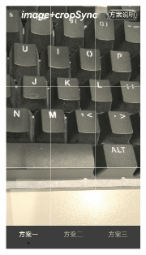

#### 175.多段混合数据展示案例（2025/01/18更新）

本示例介绍了如何使用[WaterFlow](https://developer.huawei.com/consumer/cn/doc/harmonyos-references-V13/ts-container-waterflow-V13)组件展示多列不同数据，通过设置sections属性来配置不同数据的列间距、行间距等信息。[详细说明文档](./CommonAppDevelopment/feature/multicolumndisplay/README.md)


#### 174.3D立方体旋转轮播实现案例（2025/01/17更新）

本示例展示了如何通过使用[Swiper](https://developer.huawei.com/consumer/cn/doc/harmonyos-references-V5/ts-container-swiper-V5)组件的[customContentTransition](https://developer.huawei.com/consumer/cn/doc/harmonyos-references-V5/ts-container-swiper-V5#customcontenttransition12)属性和[rotate](https://developer.huawei.com/consumer/cn/doc/harmonyos-references-V5/ts-universal-attributes-transformation-V5#rotate)属性实现3D立方体旋转轮播效果，增强用户交互体验。每次用户滑动轮播项时，都会展示生动的3D立方体旋转过渡效果。组件支持通过控制器对象动态更新轮播数据，包括添加、删除、替换等操作。[详细说明文档](./CommonAppDevelopment/feature/cuberotateanimation/README.md)


#### 173.人脸指纹解锁案例（2025/01/16更新）

本示例介绍了使用[@ohos.userIAM.userAuth](https://developer.huawei.com/consumer/cn/doc/harmonyos-references-V5/js-apis-useriam-userauth-V5)用户认证服务实现人脸或指纹识别的功能。
该场景多用于需要人脸或指纹识别的安全场景。[详细说明文档](./CommonAppDevelopment/feature/faceandfingerprintunlocking/README.md)

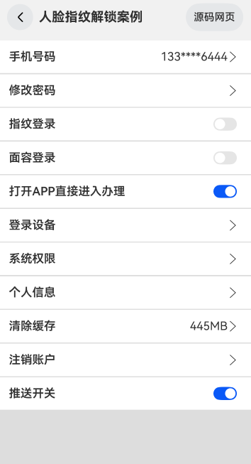

#### 172.限制高度底部弹窗（2025/01/14更新）

本示例介绍了如何实现一个限制高度的底部弹窗，以购物应用的“我的”页面来呈现。当给一个底部弹窗的可滚动区域设置最大高度后，如果弹窗内部视图的高度超过了这个最大高度，弹窗可滚动区域的高度就是这个最大高度，视图内容不会展示完全，需要滚动查看；如果弹窗内部视图的高度没有超过这个最大高度，弹窗可滚动区域高度就是视图的高度，视图内容展示完全。[详细说明文档](./CommonAppDevelopment/feature/limitedheightbottomdialog/README.md)

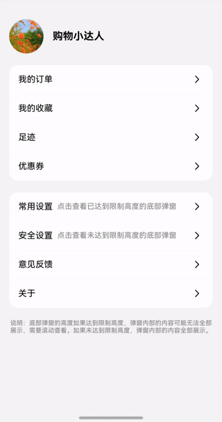

#### 171.多重筛选案例（2025/01/13更新）

本示例主要介绍多重筛选场景，利用数组方法过滤满足条件的数据，利用LazyForEach实现列表信息的渲染以及刷新。[详细说明文档](./CommonAppDevelopment/feature/multiplescreening/README.md)


#### 170.网络状态监听案例（1227更新）

本示例展示如何使用[网络连接管理](https://developer.huawei.com/consumer/cn/doc/harmonyos-references-V5/js-apis-net-connection-V5)接口监听网络状态，实现视频根据不同网络修改播放状态的功能。[详细说明文档](./CommonAppDevelopment/feature/networkstatusobserver/README.md)


#### 169.悬浮工具箱（1228更新）

本示例介绍使用zIndex、gesture等接口实现悬浮工具箱效果。[详细说明文档](./CommonAppDevelopment/feature/toolbox/README.md)

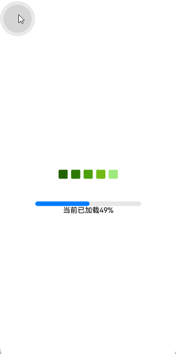

#### 168.直播界面双击效果动画实现案例（1219更新）

本示例展示了如何通过使用[LazyForEach](https://developer.huawei.com/consumer/cn/doc/harmonyos-references-V5/ts-rendering-control-lazyforeach-V5)和[组件内转场 (transition)](https://developer.huawei.com/consumer/cn/doc/harmonyos-references-V5/ts-transition-animation-component-V5)实现双击或连续快速点击时的图标动画效果，增强用户交互体验。每次用户双击或连续快速点击特定区域时，都会动态显示图标并带有生动的动画效果，如图标放大淡出或向上移动淡出等。[详细说明文档](./CommonAppDevelopment/feature/clickanimation/README.md)


#### 167.视频截取gif图（1130更新）

本示例介绍了如何截取视频的一段内容制作gif图片。该场景多出现在长视频类应用。使用FFmpeg命令对视频进行截取gif图。[详细说明文档](./CommonAppDevelopment/feature/videocreategif/README.md)


#### 166.自定义地址选择组件（1125更新）

本示例介绍如何使用bindSheet，changeIndex，onAreaChange实现带切换动效的自定义地址选择组件。[详细说明文档](./CommonAppDevelopment/feature/customaddresspicker/README.md)


#### 165.用户隐私协议案例（1108更新）

本示例介绍使用web组件加载用户协议、隐私协议等场景。该场景多用于应用类协议展示。[详细说明文档](./CommonAppDevelopment/feature/privacyagreement/README.md)

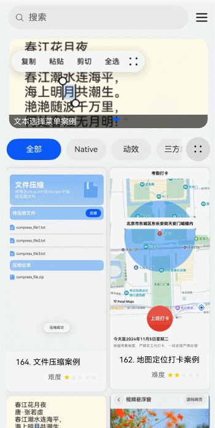

#### 164.文件压缩案例（1108更新）

本示例介绍在[Worker](https://developer.huawei.com/consumer/cn/doc/harmonyos-references-V5/js-apis-worker-V5#onmessage9)子线程使用[@ohos.zlib](https://developer.huawei.com/consumer/cn/doc/harmonyos-references-V5/js-apis-zlib-V5)
提供的zlib.compressfile接口对沙箱目录中的文件进行压缩操作。[详细说明文档](./CommonAppDevelopment/feature/compressfile/README.md)


#### 163.桌面卡片实现案例 （1108更新）

本示例使用[卡片](https://developer.huawei.com/consumer/cn/doc/harmonyos-guides-V5/arkts-ui-widget-V5)详细列举了卡片开发的大部分功能，如使用postCardAction接口快速拉起卡片提供方应用的指定UIAbility，通过message事件刷新卡片内容等，为开发者提供了卡片功能的开发与展示。[详细说明文档](./CommonAppDevelopment/doc/CASES_CARD.md)


#### 162.地图定位打卡案例 （1106更新）

本示例使用[geoLocationManager](https://developer.huawei.com/consumer/cn/doc/harmonyos-references-V5/js-apis-geolocationmanager-V5)进行地理位置定位和地理信息获取，并利用[MapComponent](https://developer.huawei.com/consumer/cn/doc/harmonyos-references-V5/map-mapcomponent-V5)组件展示地图，添加用户位置和打卡范围，通过计算用户位置和打卡中心点的距离判断用户是否处于打卡区域，实现了打卡功能。[详细说明文档](./CommonAppDevelopment/feature/clockin/README.md)

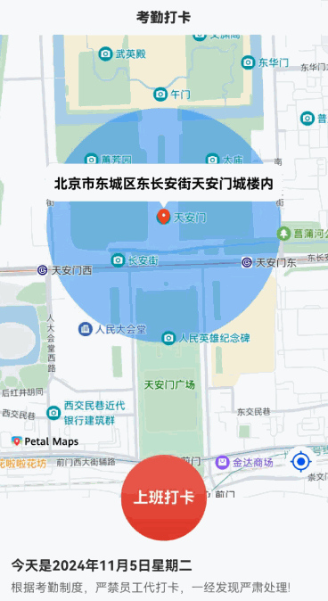

#### 161.视频悬浮窗 （1106更新）

本示例主要介绍视频小窗口播放场景，利用媒体的AVPlayer实现视频播放以及相关操作，利用PiPWindow开启悬浮窗从而实现小窗口播放视频。[详细说明文档](./CommonAppDevelopment/feature/pipwindow/README.md)


#### 160.文本选择菜单案例 （1104更新）

本案例拓展富文本组件文字选择菜单选项，通过富文本组件editMenuOptions属性添加自定义选择菜单，在编辑文字时选择更多选项打开额外菜单栏。[详细说明文档](./CommonAppDevelopment/feature/selecttextmenu/README.md)


#### 159.图片分享案例 （1104更新）

本示例介绍使用[Share Kit](https://developer.huawei.com/consumer/cn/sdk/share-kit/?ha_source=sousuo&ha_sourceId=89000251)和[ShareExtensionAbility](https://developer.huawei.com/consumer/cn/doc/harmonyos-references-V5/js-apis-app-ability-shareextensionability-V5)实现从图库分享图片到应用的场景。该场景多用于聊天类应用。[详细说明文档](./CommonAppDevelopment/feature/shareimagepage/README.md)


#### 158.背景模糊效果的自定义TabBar实现案例 （1104更新）

在一些主页的场景中，为了实现更好的视觉体验，会给TabBar加上透明的背景模糊效果。本示例主要讲解如何使用系统提供的背景设置的能力，实现背景模糊的效果。[详细说明文档](./CommonAppDevelopment/feature/backgroundblur/README.md)


#### 157.Scroll容器嵌套多种组件事件处理案例 （1031更新）

本示例适用于Scroll容器嵌套多组件事件处理场景：当需要一个父容器Scroll内嵌套web、List，当父子的滚动手势冲突时，此时希望父容器的滚动优先级最高，即实现子组件的偏移量都由父容器统一派发，实现滚动任一子组件流畅滚动到父容器顶/底的效果。  
例如本案例的新闻浏览界面，父组件Scroll嵌套了新闻内容与评论区（Web实现新闻内容，List实现评论区），
通过禁用web和list组件滚动手势，再由父组件Scroll统一计算派发偏移量，达到一种web的滚动和list组件滚动能无缝衔接，像同一个滚动组件滚动效果。[详细说明文档](./CommonAppDevelopment/feature/containernestedslide/README.md)


#### 156.沉浸式适配案例 （1030更新）

开发应用沉浸式效果主要指通过调整状态栏、应用界面和导航条的显示效果来减少状态栏导航条等系统界面的突兀感，从而使用户获得最佳的UI体验。本案例分别针对Navigation、列表滑动、Web页、底部弹框等场景实现了沉浸式适配。[详细说明文档](./CommonAppDevelopment/feature/immersive/README.md)


#### 155.多媒体发布 （1016更新）

本示例主要介绍使用[@ohos.file.photoAccessHelper](https://developer.huawei.com/consumer/cn/doc/harmonyos-references-V5/js-apis-photoaccesshelper-V5#photoaccesshelpergetphotoaccesshelper)实现访问系统相册获取媒体资源的多媒体发布场景。 该场景多用于社交软件朋友圈、评论动态发布的场景。[详细说明文档](./CommonAppDevelopment/feature/publishmultimediaupdates/README.md)


#### 154.地图大头针选择位置并显示弹窗组件案例 （1016更新）

本示例提供了大头针选择位置并显示弹窗组件的解决方案。该大头针组件分为三个状态，分别是静止态（地图移动过程中，大头针无动画）、加载态（地图停止移动，等待获取地址信息，大头针展示波纹动画表示数据加载中）、显示态（数据加载完成，弹窗显示地址相关信息）。开发者可根据需要直接引入该组件，根据具体使用场景，传入不同的数据，组件根据传入数据的情况显示不同的状态。由于使用场景中，大头针动画需要随时停止，因此选用[@ohos.animator](https://developer.huawei.com/consumer/cn/doc/harmonyos-references-V5/js-apis-animator-V5)实现大头针的波纹和跳动动画。[详细说明文档](./CommonAppDevelopment/feature/mapthumbtack/README.md)


#### 153.图形锁屏案例 （1015更新）

本示例介绍使用[图案密码锁组件](https://developer.huawei.com/consumer/cn/doc/harmonyos-references-V5/ts-basic-components-patternlock-V5)与[振动接口](https://developer.huawei.com/consumer/cn/doc/harmonyos-references-V5/js-apis-vibrator-V5)实现图形锁屏场景。该场景多用于桌面及系统类应用。[详细说明文档](./CommonAppDevelopment/feature/patternlock/README.md)


#### 152.组件随软键盘弹出避让案例 （1011更新）

本示例介绍使用TextInput组件和LazyForEach实现拉起软键盘组件动态避让场景。[详细说明文档](./CommonAppDevelopment/feature/keyboardavoid/README.md)

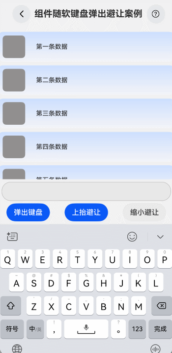

#### 151.自定义动效tab （1009更新）

本示例介绍使用List、Text等组件，以及animateTo等接口实现自定义Tab效果。[详细说明文档](./CommonAppDevelopment/feature/customanimationtab/README.md)

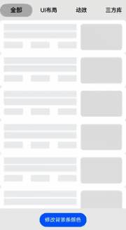

#### 150.人脸识别验证案例 （0930更新）

本示例介绍使用[VisionKit(视觉服务)](https://developer.huawei.com/consumer/cn/doc/harmonyos-references-V5/vision-arkts-V5)实现活体检测，使用[CryptoArchitectureKit(加解密算法框架服务)](https://developer.huawei.com/consumer/cn/doc/harmonyos-references-V5/js-apis-cryptoframework-V5)实现加解密。[详细说明文档](./CommonAppDevelopment/feature/livedetectionandencryptiond/README.md)


#### 149.折叠面板案例 （0930更新）

本示例通过定义层级实现多层折叠面板，并在首页性能文章tab实际使用跳转到对应文章的web页面。[详细说明文档](./CommonAppDevelopment/feature/collapsemenu/README.md)


#### 148.HEIF软解码器案例（0930更新）

本示例介绍将[libheif](https://github.com/strukturag/libheif)编译移植到鸿蒙平台，通过网络库[curl](https://curl.se/)请求HEIF图片资源、libheif软解码HEIF图片，最后在瀑布流中加载解码后的HEIF图片的过程。[详细说明文档](./CommonAppDevelopment/feature/decodeheifimage/README.md)


#### 147.自定义性能脚本测试（0930更新）

本模块通过HarmonyOS平台上的UI自动化测试框架DevEco Testing Hypium执行自定义性能测试脚本。[详细说明文档](./test/performance/custom_test_script_in_python/README.md)


#### 146.启动页实现案例（0930更新）

本示例介绍了使用资源匹配规则实现不同分辨率冷启动应用图标适配和启动广告页的实现。[详细说明文档](./CommonAppDevelopment/doc/WINDOW_SATART_ICON.md)


#### 145.H5页面资源离线缓存案例（0930更新）

本模块通过Web组件的[oninterceptrequest](https://developer.huawei.com/consumer/cn/doc/harmonyos-references-V5/ts-basic-components-web-V5#oninterceptrequest9)接口，结合内存缓存和磁盘缓存实现了一个H5页面资源离线缓存案例。[详细说明文档](./CommonAppDevelopment/feature/h5cache/README.md)


#### 144.AI图片文字智能识别（0930更新）

本示例使用智能识别图片中的文字，并使用[NaturalLanguageKit](https://developer.huawei.com/consumer/cn/doc/harmonyos-references-V5/natural-language-api-V5)自然语言处理工具集将识别的文字智能转换为姓名、手机、地址等信息。多用于购物快递等填写地址场景。[详细说明文档](./CommonAppDevelopment/feature/addressrecognize/README.md)

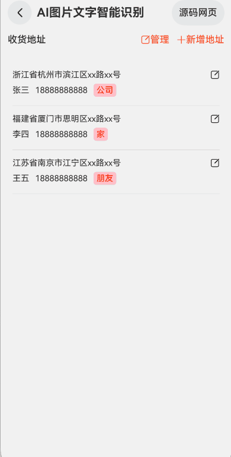

#### 143.群头像拼接案例（0929更新）

本示例主要介绍新建会话的场景，利用嵌套线性布局拼接群头像组件，利用[@ohos.arkui.componentSnapshot (组件截图)](https://developer.huawei.com/consumer/cn/doc/harmonyos-references-V5/js-apis-arkui-componentsnapshot-V5)接口获取群头像组件截图并在会话列表中展示。[详细说明文档](./CommonAppDevelopment/feature/groupavatar/README.md)


#### 142.纵向横向列表联动案例（0929更新）

本案例展示了主要通过[List](https://developer.huawei.com/consumer/cn/doc/harmonyos-references-V2/ts-container-list-0000001477981213-V2)组件绑定[Scroller](https://developer.huawei.com/consumer/cn/doc/harmonyos-references-V2/ts-container-scroll-0000001427902480-V2)滚动控制器和[LazyForEach](https://developer.huawei.com/consumer/cn/doc/harmonyos-guides-V2/arkts-rendering-control-lazyforeach-0000001524417213-V2)数据懒加载来实现纵向横向列表联动，多用于汽车参数对比，股票信息查看。[详细说明文档](./CommonAppDevelopment/feature/verticalhorizontallinkage/README.md)<br>

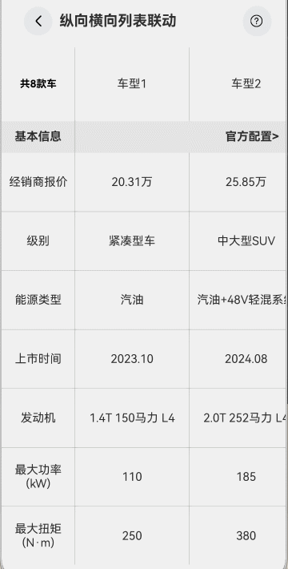

#### 141.状态栏动画实现案例（0928更新）

本案例展示了状态栏的动态交互效果。通过监听页面滚动事件 `onDidScroll`，随着页面的上下滚动，实现状态栏颜色的变化。搜索框会在滚动时流畅地展开或收起，并伴有自然的透明度过渡效果。[详细说明文档](./CommonAppDevelopment/feature/statusbaranimation/README.md)


#### 140.自定义TabBar页签凸起和凹陷案例（0923更新）

本文基于已有的模块[自定义TabBar](/CommonAppDevelopment/feature/customtabbar/README.md)思路，完善了凸起的选择时凸起点交界处的圆滑过度，并扩展了一个凹陷选择时不遮挡原本内容。在此感谢社区贡献者[@NucleusUI](https://gitee.com/NucleusUI)，积极参与开源项目的建设，为大家提供此案例[详细说明文档](/CommonAppDevelopment/feature/customdrawtabbar/README.md)


#### 139.编辑收货地址案例（0923更新）

本示例多用于表单填写场景：其中通过使用TextPicker滑动选择文本内容组件实现三级联动选择省市区，并回填到输入框。[详细说明文档](/CommonAppDevelopment/feature/editaddress/README.md)


#### 138.视频横竖屏切换及进度条热区拖动（0915更新）

本示例介绍了@ohos.multimedia.media组件和@ohos.window接口以及使用触摸热区实现视频横竖屏切换及进度条热区拖动的功能。[详细说明文档](/CommonAppDevelopment/feature/videoscreendirectionswitching/README.md)


#### 137.滑动视频自动播放（0912更新）

本示例主要介绍视频列表滑动到屏幕中间自动播放场景，利用onScrollIndex获取List显示区域内中间子组件索引值的能力来判断播放，利用懒加载场景会预加载List显示区域外cachedCount的内容的能力来实现视频连续播放。[详细说明文档](./CommonAppDevelopment/feature/videolistautoplay/README.md)


#### 136.自定义装饰器（0911更新）

本示例介绍通过自定义装饰器在自定义组件中自动添加[inspector (布局回调)](https://gitee.com/openharmony/docs/blob/master/zh-cn/application-dev/reference/apis-arkui/js-apis-arkui-inspector.md)方法并进行调用。[详细说明文档](./CommonAppDevelopment/feature/customdecoration/README.md)

#### 135.使用ArkUI的FrameNode扩展实现动态布局类框架（0911更新）

本示例是[使用ArkUI的FrameNode扩展实现动态布局类框架](./docs/performance/imperative_dynamic_layouts.md)的示例代码，主要讲解如何使用ArkUI的FrameNode扩展实现动态布局类框架。[详细说明文档](./CommonAppDevelopment/feature/perfermance/imperativedynamiclayouts/README.md)

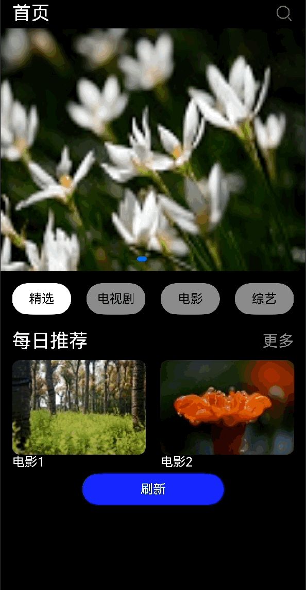

#### 134.蓝牙实现服务端和客户端通讯（0911更新）

本示例分为服务端和客户端两个功能模块。服务端创建蓝牙服务实例，并添加心率跳动服务。客户端以特定服务UUID作为过滤条件扫描服务端，收到服务端该特征值变动的通知消息。[详细说明文档](./CommonAppDevelopment/feature/bluetooth/README.md)

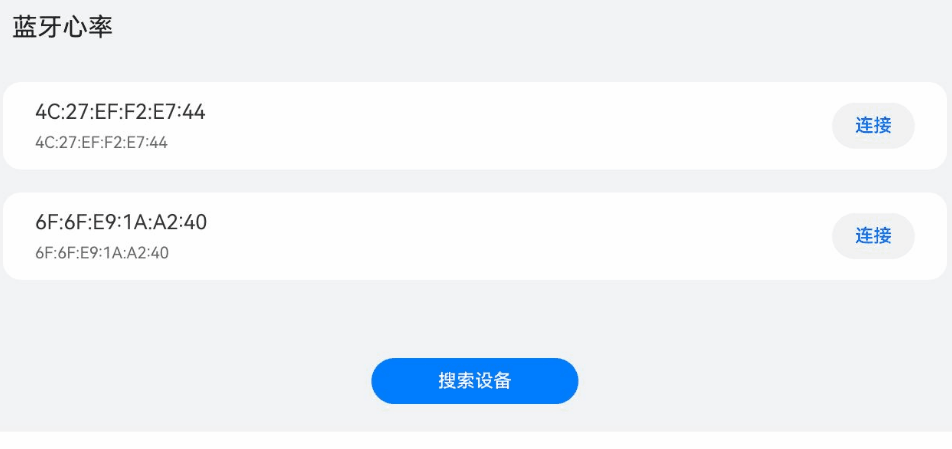

#### 133.橡皮擦案例（0906更新）

本示例通过@ohos.graphics.drawing库和blendMode颜色混合实现了橡皮擦功能，能够根据手指移动轨迹擦除之前绘制的内容，并且可以进行图案的撤销和恢复。[详细说明文档](./CommonAppDevelopment/feature/eraser/README.md)

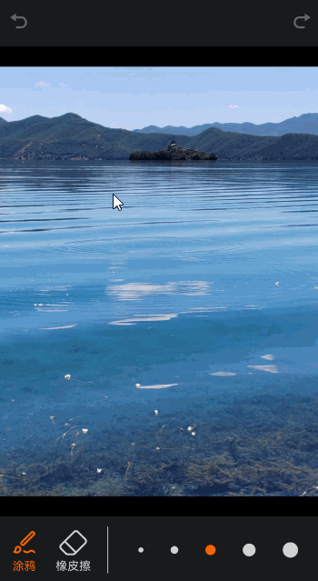

#### 132.日历切换案例（0929更新）

本示例介绍使用Swiper实现自定义日历年视图、月视图、周视图左右滑动切换年、月、周的效果。同时使用Tabs实现年视图、月视图、周视图之间的切换效果。还有使用Calendar Kit日历服务实现日程提醒的功能。[详细说明文档](./CommonAppDevelopment/feature/calendarswitch/README.md)

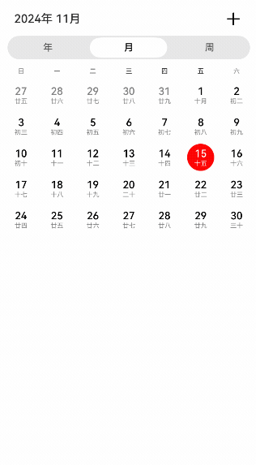

#### 131.图片编辑实现马赛克效果（0831更新）

本示例介绍了图片编辑实现马赛克效果。手指在图片上移动，手指移动的图片区域进行马赛克化绘制。[详细说明文档](./CommonAppDevelopment/feature/imagemosaic/README.md)


#### 130.画笔调色板案例（0827更新）

本示例实现了一个网格渐变的画笔调色板，能够根据给定的 HSL 类型颜色和色阶数，按亮度生成渐变色，用户可以通过调色板选择颜色并在画布上绘制路径。[详细说明文档](./CommonAppDevelopment/feature/palette/README.md)


#### 129.骨架屏实现案例（0824更新）

本示例介绍通过骨架屏提升加载时用户体验的方法。利用网络接口返回的状态改变loadingCollectedStatus值，动态切换页面内容：初始显示骨架屏（LoadingView）；成功且有数据则显示列表页（ListView）；数据为空显示无数据页（NoneContentView）；加载失败则显示失败页（LoadingFailedView）。[详细说明文档](./CommonAppDevelopment/feature/skeletondiagram/README.md)


#### 128.组件集合案例（0812更新）

本示例外层为展开收起的长列表，内层是ArkUI中组件、通用、动画、全局方法的示例代码，主要展示长列表展开收起的使用和多种ArkUI的示例。[详细说明文档](https://gitee.com/openharmony/applications_app_samples/tree/master/code/UI/ArkTsComponentCollection/ComponentCollection)

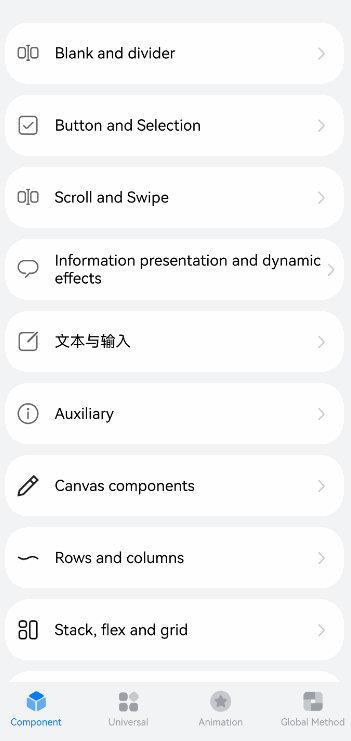

#### 127.发短信案例（0709更新）

本示例介绍如何在应用中调起系统短信，通过startAbility接口中的指定号码并调起系统的发送短信页面。[详细说明文档](./CommonAppDevelopment/feature/sendmessage/README.md)


#### 126.TaskPool线程中操作关系型数据库实现案例（0709更新）

本实例通过列表场景实例讲解，介绍在TaskPool线程中操作关系型数据库的方法，涵盖单条插入、批量插入、删除和查询操作。[详细说明文档](./CommonAppDevelopment/feature/perfermance/operaterdbintaskpool/README.md)

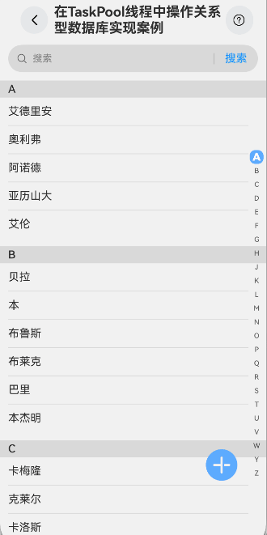

#### 125.全局自定义组件复用实现案例（0709更新）

本示例是[全局自定义组件复用实现](docs/performance/node_custom_component_reusable_pool.md)的示例代码，主要讲解如何通过BuilderNode创建全局的自定义组件复用池，实现跨页面的组件复用。[详细说明文档](./CommonAppDevelopment/feature/perfermance/customreusablepool/README.md)

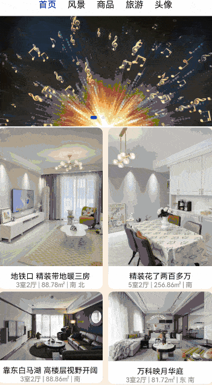

#### 124.H5页面调用自定义输入法案例（0617更新）

本示例介绍了Web场景中使用CustomDialog接口实现H5页面调用自定义输入法的功能。该场景多用于浏览器需要使用安全输入法时。[详细说明文档](./CommonAppDevelopment/feature/customkeyboardtoh5/README.md)


#### 123.NavDestination弹窗（0617更新）

本案例介绍了使用NavDestination组件的Dialog模式实现与前一个页面的联动的评论弹窗。[详细说明文档](./CommonAppDevelopment/feature/navdestinationdialog/README.md)


#### 122.视频卡片和列表区域的联动滚动（0603更新）

本示例使用Scroll和List组件嵌套，通过List组件的滚动控制器和nestedScroll属性实现了视频卡片和列表区域的联动滚动场景。[详细说明文档](./CommonAppDevelopment/feature/videolinkagelist/README.md)


#### 121.合理处理高负载组件的渲染文章示例代码（0603更新）

本示例主要讲解如何通过DisplaySync优化高负载组件的渲染，减少丢帧情况的发生。[详细说明文档](./CommonAppDevelopment/feature/perfermance/highlyloadedcomponentrender/README.md)

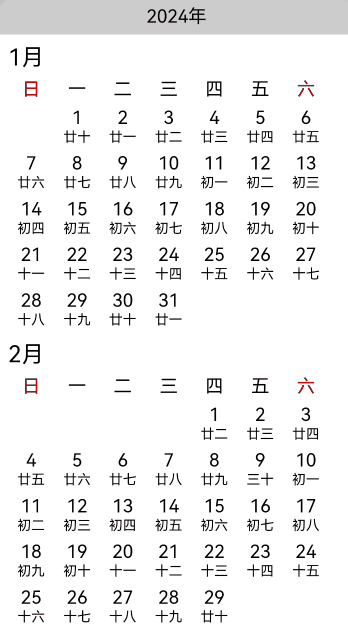

#### 120.搜索框热搜词自动滚动（0527更新）

本示例介绍使用TextInput组件与Swiper组件实现搜索框内热搜词自动切换。[详细说明文档](./CommonAppDevelopment/feature/searchswiper/README.md)

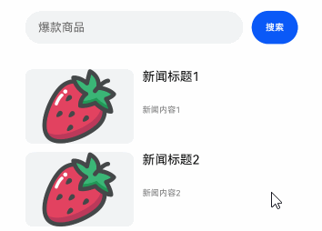

#### 119.自动生成动态路由（0929更新）

本示例将介绍如何使用装饰器和插件，自动生成动态路由表，并通过动态路由跳转到模块中的页面，以及如何使用动态import的方式加载模块。同时将介绍如何自定义装饰器入参支撑常量写法，通过在装饰器中输入文件路径和常量名，实现固定文件管理路由路径常量。[详细说明文档](./CommonAppDevelopment/common/routermodule/README_AUTO_GENERATE.md)

#### 118.使用GTest测试C++案例（0521更新）

本案例介绍如何在HarmonyNext应用中接入GTest测试框架测试C++代码。[详细说明文档](./CommonAppDevelopment/doc/GTEST_ADAPATATION.md)

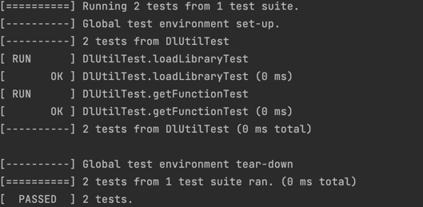

#### 117.自定义Stepper（0516更新）

在许多场景下，我们都需要引导用户按照步骤完成任务，此功能在HarmonyOS Next中可以使用Stepper来实现，但是Stepper的定制化能力较弱，开发者无法定制上下页切换按钮的样式、位置，因此本例介绍了如何基于Swiper实现Stepper的能力。[详细说明文档](./CommonAppDevelopment/feature/customstepper/README.md)

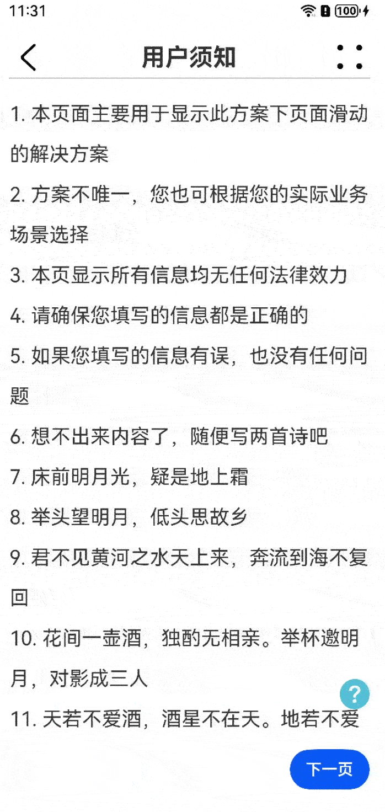

#### 116.边缘渐变实现（0515更新）

本案例介绍组件内容边缘渐变的实现，通常用于提示长列表滑动到边缘的场景。[详细说明文档](./CommonAppDevelopment/feature/fadingedge/README.md)

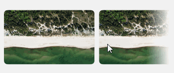

#### 115.textOverflow长文本省略（0515更新）

本示例实现了回复评论时，当回复人的昵称与被回复人的昵称长度都过长时，使用textOverflow和maxLines()实现昵称的长文本省略展示的功能。[详细说明文档](./CommonAppDevelopment/feature/textoverflow/README.md)


#### 114.水印案例（0515更新）

在很多的场景中，如保存图片以及容器封面都能够见到水印，本案例通过Canvas组件以及OffscreenCanvas实现了页面添加水印以及保存图片时添加水印的功能。[详细说明文档](./CommonAppDevelopment/feature/watermark/README.md)


#### 113.边框或背景图片拉伸案例（0513更新）

HarmonyOS上不支持.9资源文件进行安全拉伸。作为替代方案，本案例中商城页面的促销标签边框使用同一张图片资源，通过设置图片的resizable属性，展示不同长度的促销标签效果。[详细说明文档](./CommonAppDevelopment/feature/imageresizable/README.md)


#### 112.文字展开收起案例（0513更新）

本示例介绍了@ohos.measure组件接口实现文字展开收起的功能。该场景多用于图文列表展示等。[详细说明文档](./CommonAppDevelopment/feature/textexpand/README.md)


#### 111.全局弹窗封装案例（0507更新）

本示例介绍两种弹窗的封装案例。一种是自定义弹窗封装成自定义组件的方式，使用一句代码即可控制显示；一种是使用子窗口的方式实现弹窗，使用一句代码即可展示。[详细说明文档](./CommonAppDevelopment/feature/customdialog/README.md)


#### 110.Navigation路由拦截案例（0507更新）

本示例介绍在Navigation中如何完成路由拦截：首次登录时记录登录状态，再次登录时可以直接访问主页无需重复登录，当退出登录时，下次需重新登录。[详细说明文档](./CommonAppDevelopment/feature/navigationinterceptor/README.md)


#### 109.Text实现部分文本高亮和超链接样式（0430更新）

本示例通过自定义Span类型，在Text组件中使用ForEach遍历，根据不同的Span类型生成不同样式和功能的Span组件，实现部分文本高亮和超链接。[详细说明文档](./CommonAppDevelopment/feature/styledtext/README.md)


#### 108.首页下拉进入二楼效果案例（0430更新）

本示例主要介绍了利用position和onTouch来实现首页下拉进入二楼、二楼上划进入首页的效果场景，利用translate和opacity实现动效的移动和缩放，并将界面沉浸式（全屏）显示。[详细说明文档](./CommonAppDevelopment/feature/secondfloorloadanimation/README.md)


#### 107.图片混合案例（0430更新）

本实例主要通过BlendMode属性来实现挂件和图片的混合，通过更改不同的混合参数，能够展示不同的混合效果。[详细说明文档](./CommonAppDevelopment/feature/blendmode/README.md)

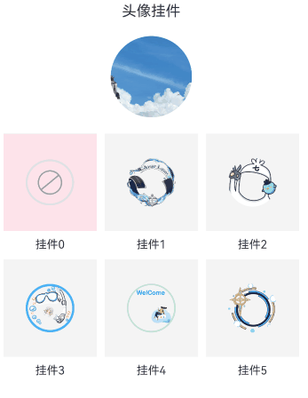

#### 106.通过全局状态保留弹窗实现评论组件案例（0426更新）

评论组件在目前市面上的短视频app中是一种很常见的场景，本案例使用**全局状态保留能力弹窗**来实现评论组件。[详细说明文档](./CommonAppDevelopment/feature/shortvideo/README_COMMENT.md)、[全局状态保留能力弹窗说明文档](./CommonAppDevelopment/common/utils/src/main/ets/component/README.md)


#### 105.网格元素交换案例（0426更新）

直接进行交换和删除元素会给用户带来不好的体验效果，因此需要在此过程中注入一些特色的动画来提升体验效果，本案例通过Grid组件、attributeModifier、以
及animateTo函数实现了拖拽动画，删除动画和添加时的位移动画。[详细说明文档](./CommonAppDevelopment/feature/gridexchange/README.md)


#### 104.下拉展开图片和时间轴效果实现案例（0422更新）

下拉展开图片效果：初始时顶部图片只显示中间部分，其余部分，分别隐藏在屏幕上边缘和时间轴模块下方，随着下拉，图片会逐渐展开。
时间轴效果：位于左边，虚线贯穿整个List，每个内容模块前都有一个时间轴节点。[详细说明文档](./CommonAppDevelopment/feature/refreshtimeline/README.md)

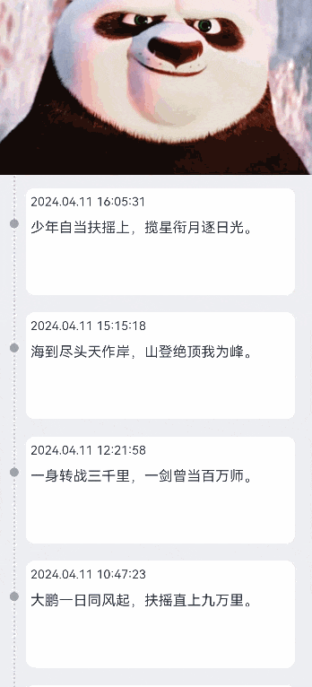

#### 103.定制HAP多目标构建产物（0419更新）

本案例展示如何将工程打包成不同版本，并单独配置资源文件，实现定制多目标构建产物功能。[详细说明文档](./CommonAppDevelopment/doc/MULTI_TARGETS_AND_PRODUCTS.md)

#### 102.表情聊天案例（0419更新）

本示例主要介绍如何在聊天信息中加入表情图片。通过使用CustomDialog创建表情键盘对话框，使用RichEdit接收所选表情的热键字符串，在发送信息时将热键转换为图片后显示在Richtext的聊天信息框中。[详细说明文档](./CommonAppDevelopment/feature/chatwithexpression/README.md)

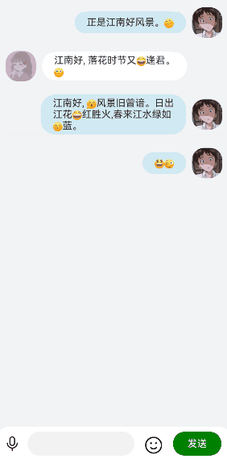

#### 101.页面长截图（1029更新）

本案例实现了Web组件中网页长截图和滚动组件长截图的方案。支持截图后展示大小浮窗预览、保存图片到相册、手势左滑关闭等功能。新增使用Web组件打印前端页面的功能，可以通过print模块调起系统弹窗，与打印机交互进行打印。新增滚动组件长截图功能，支持一键截图整个组件页面、滚动截图至当前页面功能。[详细说明文档](./CommonAppDevelopment/feature/webpagesnapshot/README.md)


#### 100.音乐播放转场一镜到底效果实现（0419更新）

音乐播放的Mini条播放栏在转场时的一镜到底动画是音乐播放器应用开发中常见的需求。本示例将介绍如何实现Mini条的一镜到底动画，如Mini条歌曲封面的缩放动画，Mini条的展开收起动画等。[详细说明文档](./CommonAppDevelopment/feature/miniplayeranimation/README.md)


#### 99.tabContent内容可以在tabBar上显示并响应滑动事件案例（0418更新）

本示例实现了tabContent内容可以在tabBar上显示并且tabBar可以响应滑动事件的功能。[详细说明文档](./CommonAppDevelopment/feature/tabcontentoverflow/README.md)

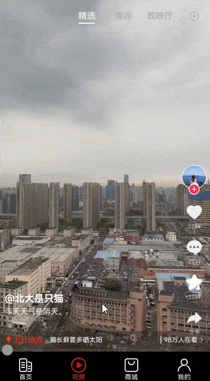

#### 98.使用预渲染实现Web页面瞬开效果实践（0418更新）

本案例集成在应用entry模块中，使用Web预渲染实现了对各个案例的功能介绍。具体细节见[详细说明文档](./CommonAppDevelopment/product/entry/README.md#%E4%BD%BF%E7%94%A8%E9%A2%84%E6%B8%B2%E6%9F%93%E5%AE%9E%E7%8E%B0web%E9%A1%B5%E9%9D%A2%E7%9E%AC%E5%BC%80%E6%95%88%E6%9E%9C%E5%AE%9E%E8%B7%B5)


#### 97.XComponent + Vsync 实现自定义动画（0418更新）

XComponent 提供了应用在 native 侧调用 OpenGLES 图形接口的能力，本文主要介绍如何配合 Vsync 事件，完成自定义动画。在这种实现方式下，自定义动画的绘制不在 UI 主线程中完成，即使主线程卡顿，动画效果也不会受影响。[详细说明文档](./CommonAppDevelopment/feature/xcomponentvsync/README.md)


#### 96.Canvas实现模拟时钟案例（0418更新）

本示例介绍利用Canvas和定时器实现模拟时钟场景，该案例多用于用户需要显示自定义模拟时钟的场景。[详细说明文档](./CommonAppDevelopment/feature/analogclock/README.md)

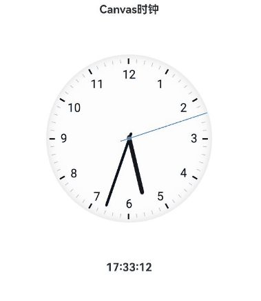

#### 95.Grid和List内拖拽交换子组件位置（0417更新）
本示例分别通过onItemDrop()和onDrop()回调，实现子组件在Grid和List中的子组件位置交换。[详细说明文档](./CommonAppDevelopment/feature/dragandexchange/README.md)

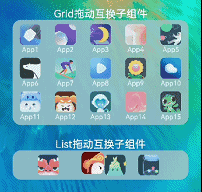

#### 94.视频弹幕功能（0411更新）

本示例介绍如何使用@ohos.danmakuflamemaster和@ohos.gsyvideoplayer开发支持视频弹幕的播放器。可以自定义弹幕样式、占据屏幕宽度，发送弹幕，开关弹幕视图。[详细说明文档](./CommonAppDevelopment/feature/danmakuplayer/README.md)


#### 93.悬浮窗拖拽和吸附动画（0417更新）

本示例使用position绝对定位实现应用内悬浮窗，并且通过animateTo结合curves动画曲线实现悬浮窗拖拽跟手和松手吸附边缘的弹性动画效果。[详细说明文档](./CommonAppDevelopment/feature/floatwindow/README.md)

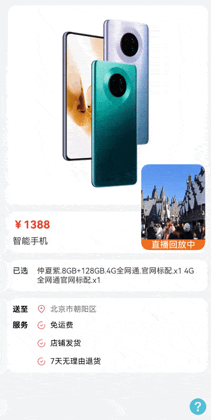

#### 92.Web自定义长按菜单案例（0411更新）

本示例介绍了给Webview页面中可点击元素（超链接/图片）绑定长按/鼠标右击时的自定义菜单的方案。[详细说明文档](./CommonAppDevelopment/feature/webcustompressmenu/README.md)

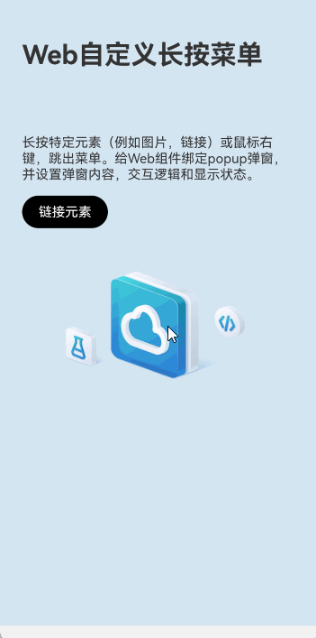

#### 91.阅读翻页方式案例（0411更新）

本示例展示手机阅读时左右翻页，上下翻页，覆盖翻页、文本朗读、字体变小、背景颜色、阅读背景的功能。[详细说明文档](./CommonAppDevelopment/feature/pageflip/README.md)

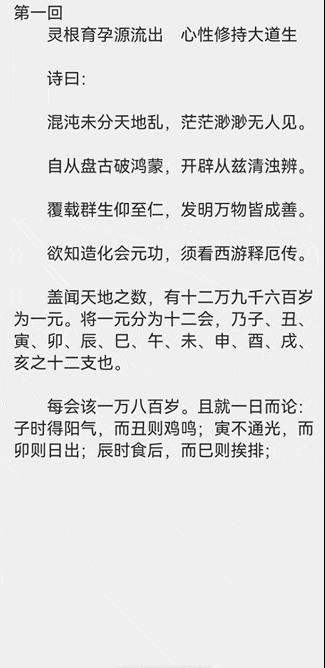

#### 90.语音录制和声音动效实现（0411更新）

本示例使用AVrecord录制音频和AVrecord的getAudioCapturerMaxAmplitude接口获取振幅实现UI动效;使用AVplayer播放音频。[详细说明文档](./CommonAppDevelopment/feature/voicerecordynamiceffect/README.md)


#### 89.底部面板嵌套列表滑动案例（0411更新）

本示例主要介绍了利用panel实现底部面板内嵌套列表，分阶段滑动效果场景。[详细说明文档](./CommonAppDevelopment/feature/bottompanelslide/README.md)

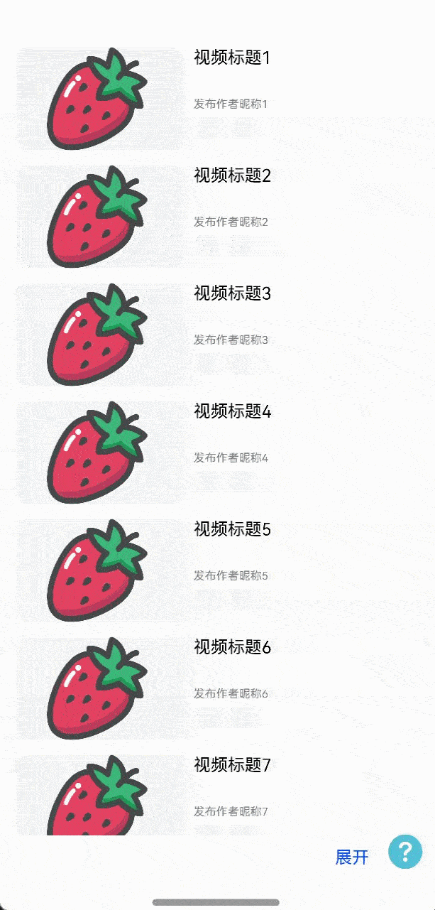

#### 88.列表项交换案例（0411更新）

本案例通过List组件、组合手势GestureGroup、swipeAction属性以及attributeModifier属性等实现了列表项的交换和删除。[详细说明文档](./CommonAppDevelopment/feature/listexchange/README.md)

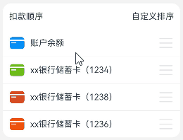

#### 87.动态注册字体案例（0402更新）

本示例介绍利用上传下载模块和注册自定义字体模块实现从网络上下载字体并注册应用字体的功能，该场景多用于由特殊字体要求的场景。[详细说明文档](./CommonAppDevelopment/feature/fontdynamicregistration/README.md)

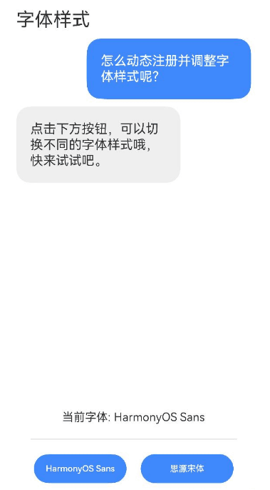

#### 86.边缓存边播放案例（0402更新）

OhosVideoCache是一个支持边播放边缓存的库，只需要将音视频的url传递给OhosVideoCache处理之后再设置给播放器，OhosVideoCache就可以一边下载音视频数据并保存在本地，一边读取本地缓存返回给播放器，使用者无需进行其他操作。[详细说明文档](./CommonAppDevelopment/feature/videocache/README.md)


#### 85.使用colorPicker实现背景跟随主题颜色转换（0402更新）

本示例介绍使用image库以及effectKit库中的colorPicker对目标图片进行取色，将获取的颜色作为背景渐变色，通过swiper组件对图片进行轮播。[详细说明文档](./CommonAppDevelopment/feature/effectKit/README.md)


#### 84.文字识别案例（0402更新）

本示例介绍使用text组件的enableDataDetector属性实现文本特殊文字识别。[详细说明文档](./CommonAppDevelopment/feature/wordrecognition/README.md)

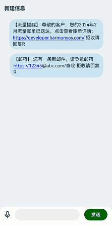

#### 83.根据icon自适应背景颜色（0402更新）

本示例将介绍如何根据图片设置自适应的背景色。[详细说明文档](./CommonAppDevelopment/feature/iconmaincolor/README.md)

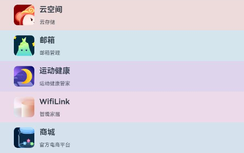

#### 82.折叠屏扫描二维码方案（0402更新）

本示例介绍使用自定义界面扫码能力在折叠屏设备中实现折叠态切换适配。自定义界面扫码使用系统能力customScan，其提供相机流的初始化、启动扫码、识别、停止扫码、释放相机流资源等能力。折叠屏折叠状态通过监听display的foldStatusChange事件实现。[详细说明文档](./CommonAppDevelopment/feature/customscan/README.md)


#### 81.搜索页一镜到底案例（0402更新）

本示例介绍使用bindContentCover、transition、animateTo实现一镜到底转场动画，常用于首页搜索框点击进入搜索页场景。[详细说明文档](./CommonAppDevelopment/feature/searchcomponent/README_transition.md)

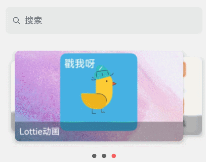

#### 80.自定义Swiper卡片预览效果实现（1031更新）

本方案做的是采用Swiper组件实现容器视图居中完全展示，两边等长露出，并且跟手滑动缩放效果。新增组件内容边缘渐变实现。新增colorPicker实现背景跟随主题颜色。[详细说明文档](./CommonAppDevelopment/feature/cardswiperanimation/README.md)


#### 79.Web组件预览PDF文件实现案例（1130更新）

本案例通过Web组件实现预览PDF文件和Office文件，代码为Tabs组件包含4个页签，分别为预览本地PDF，远程PDF，远程Excel和远程PPT。每个子组件内部构建一个Web组件。通过web组件实现PDF和Office文件的预览效果，预览PPT仅限顶部黑色区域可拖动，待优化。[详细说明文档](./CommonAppDevelopment/feature/webpdfviewer/README.md)

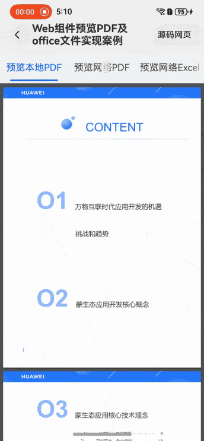

#### 78.Navigation实现多设备适配案例（0326更新）

在应用开发时，一个应用需要适配多终端的设备，使用Navigation的mode属性来实现一套代码，多终端适配。[详细说明文档](./CommonAppDevelopment/doc/MULTIDEVICE_ADAPTATION.md)

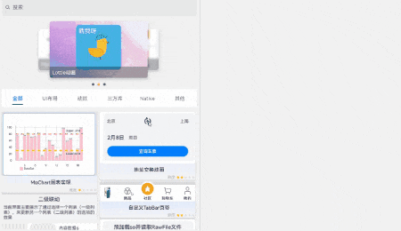

#### 77.PixelMap深拷贝案例（0326更新）

在图片开发过程中经常会涉及到PixelMap的深拷贝，本例通过使用PixelMap的readPixelsToBuffer方法来实现深拷贝。在创建源PixelMap的时候，需要将解码参数设置为BGRA_8888，而在深拷贝创建目标PixelMap的时候需要将解码参数设置为RGBA_8888。[详细说明文档](./CommonAppDevelopment/feature/imagedepthcopy/README.md)

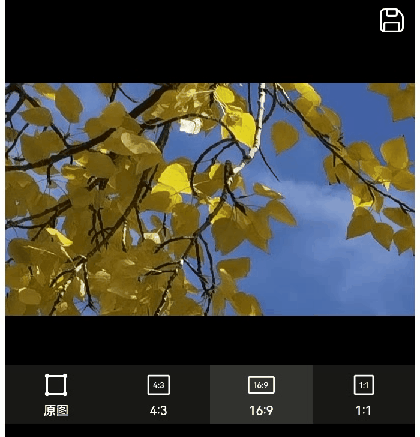

#### 76.跨文件样式复用和组件复用（0326更新）

本示例主要介绍了跨文件样式复用和组件复用的场景。在应用开发中，我们通常需要使用相同功能和样式的ArkUI组件，例如购物页面中会使用相同样式的Button按钮、Text显示文字，我们常用的方法是抽取公共样式或者封装成一个自定义组件到公共组件库中以减少冗余代码。[详细说明文档](./CommonAppDevelopment/feature/dynamicattributes/README.md)


#### 75.图片九宫格封装案例（0321更新）

本示例介绍使用(Flex) 组件实现图片在不同个数情况下的布局效果(默认布局和自定义布局)。该场景多用于社交类应用。[详细说明文档](./CommonAppDevelopment/feature/imagegridlayout/README.md)

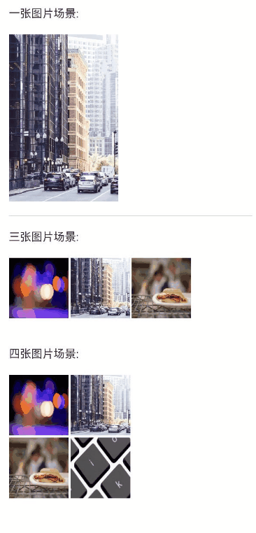

#### 74.数据库版本升级案例（0321更新）

本示例介绍使用关系型数据库的接口来进行数据库升降级场景实现。[详细说明文档](./CommonAppDevelopment/feature/databaseupgrade/README.md)

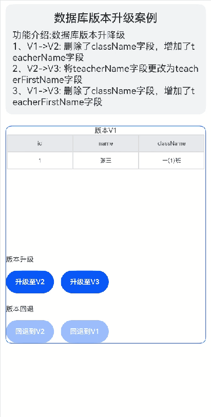

#### 73.应用新功能引导实现案例（0321更新）

本文介绍如何使用high_light_guide三方库完成应用新版本功能导航。通过高亮区域与蒙版背景的明暗度对比，让用户快速锁定重点功能，了解版本变更和业务入口。[详细说明文档](./CommonAppDevelopment/feature/highlightguide/README.md)

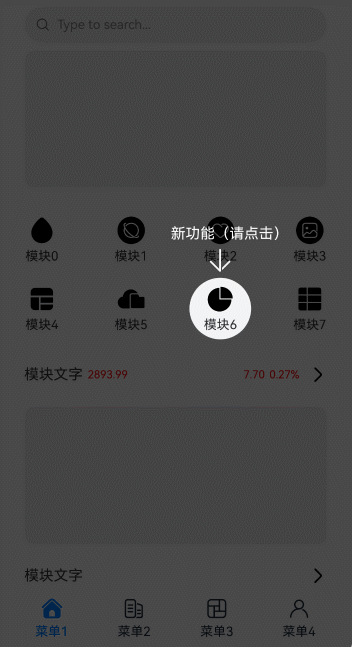

#### 72.监听HiLog日志实现测试用例验证（0321更新）

日常中在进行测试用例验证时，会出现部分场景无法通过判断UI的变化来确认用例是否正常运行，我们可以通过监听日志的方式来巧妙的实现这种场景。本示例通过监听hilog日志的回调，判断指定日志是否打印，来确定测试用例的执行结果是成功还是失败。由于ArkTS没有注册日志回调的接口，示例通过Native来注册日志回调，并在Native的自定义日志处理函数中过滤用户传入的日志内容后回调ArkTS端的回调函数。[详细说明文档](./CommonAppDevelopment/feature/hilogmonitormanagement/README.md)


#### 71.配置ImageKnife请求头实现防盗链功能（0321更新）

本案例使用了第三方库ImageKnife，通过在请求头中添加Referer来获取防盗链图片功能。也可以基于此功能设置请求头中的其他参数，例如User-Agent、Origin甚至ETag等等。[详细说明文档](./CommonAppDevelopment/feature/imagetheft/README.md)

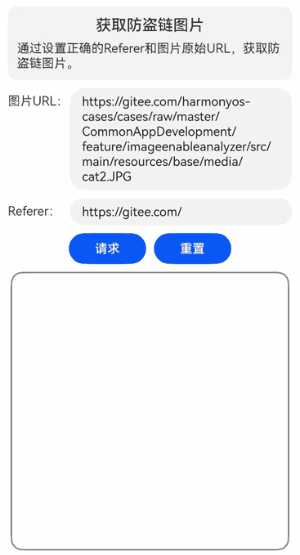

#### 70.手写绘制及保存图片（0319更新）

本示例使用drawing库的Pen和Path结合NodeContainer组件实现手写绘制功能，并通过image库的packToFile和packing接口将手写板的绘制内容保存为图片。[详细说明文档](./CommonAppDevelopment/feature/handwritingtoimage/README.md)

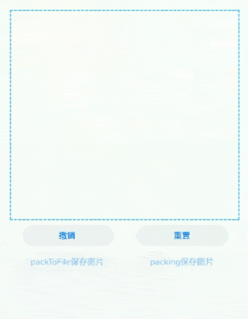

#### 69.多模态页面转场动效实现案例（0319更新）

本示例介绍多模态页面转场动效实现：通过半模态转场实现半模态登录界面，与全屏模态和组件转场结合实现多模态组合登录场景，其中手机验证码登录与账号密码登录都为组件，通过TransitionEffect.move()实现组件间转场达到近似页面转场的效果。[详细说明文档](./CommonAppDevelopment/feature/multimodaltransion/README.md)

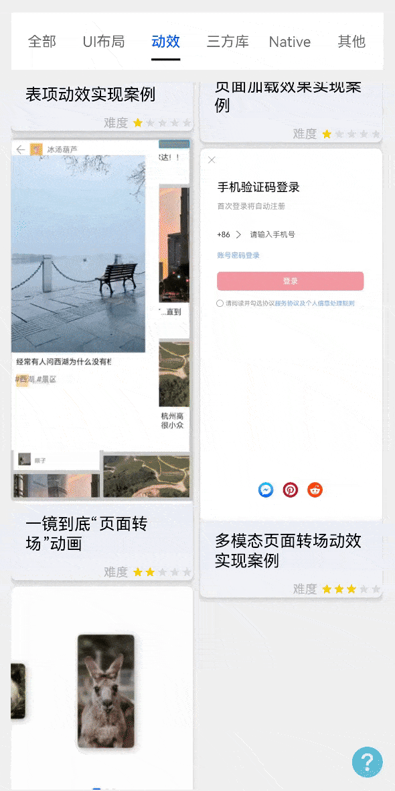

#### 68.页面转场一镜到底动画（0319更新）

本方案做的是页面点击卡片跳转到详情预览的转场动画效果。[详细说明文档](./CommonAppDevelopment/feature/transitionanimation/README.md)


#### 67.swiper指示器导航点位于swiper下方（0319更新）

本示例介绍通过分割swiper区域，实现指示器导航点位于swiper下方的效果。[详细说明文档](./CommonAppDevelopment/feature/indicatorbelowswiper/README.md)


#### 66.侧滑返回事件拦截案例（0319更新）

本示例介绍使用NavDestination组件的onBackPressed回调对返回事件进行拦截，提示用户保存编辑内容，并使用preferences实例持久化保存内容。[详细说明文档](./CommonAppDevelopment/feature/sideslipintercept/README.md)

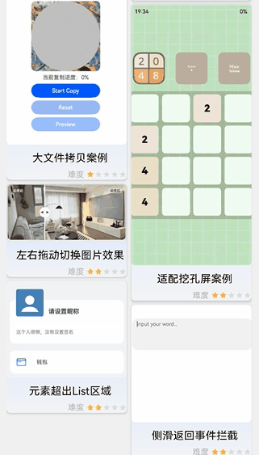

#### 65.NAPI封装ArkTS接口案例（0312更新）

部分应用的主要开发语言为C/C++，但是HarmonyOS的部分接口仅以ArkTS的形式暴露，因此需要将ArkTS的接口封装为Native接口。本例以DocumentViewPicker的Select方法为例，提供了Napi封装ArkTSAPI的通用方法。[详细说明文档](./CommonAppDevelopment/feature/etswrapper/README.md)

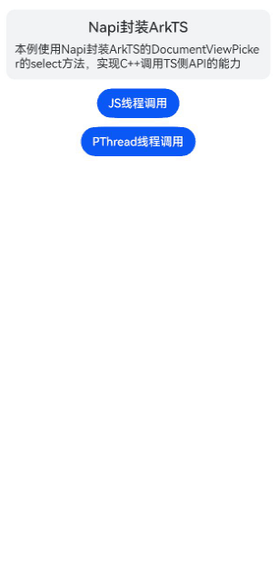

#### 64.ArkWeb同层渲染（0312更新）

该方案展示了ArkWeb同层渲染：将系统原生组件直接渲染到前端H5页面上，原生组件不仅可以提供H5组件无法实现的一些功能，还能提升用户体验的流畅度。[详细说明文档](./CommonAppDevelopment/feature/nativeembed/README.md)

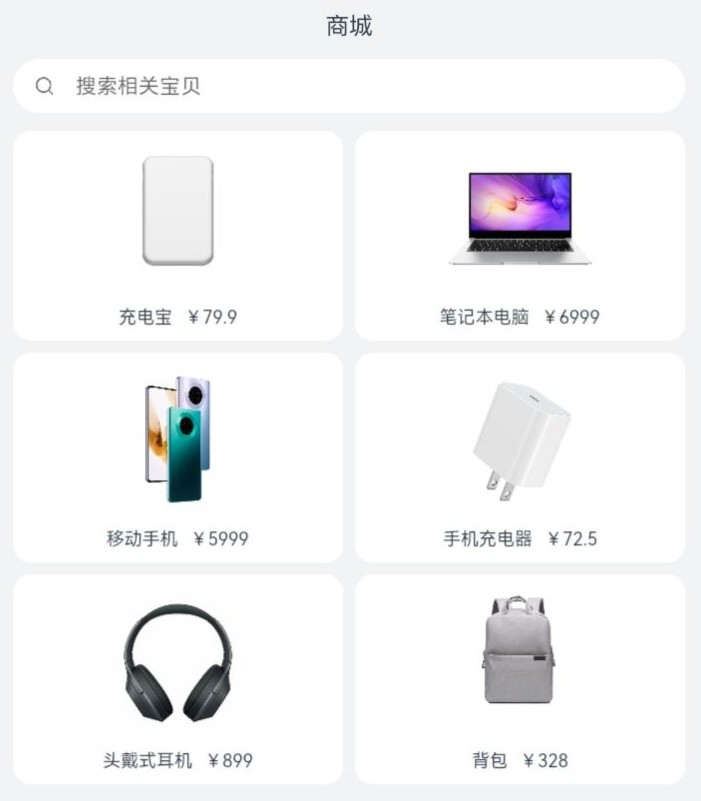

#### 63.页面间共享组件实例的案例（0312更新）

本示例提供组件实例在页面间共享的解决方案：通过Stack容器，下层放地图组件，上层放Navigation组件来管理页面，页面可以共享下层的地图组件，页面中需要显示地图的区域设置为透明，并参考触摸交互控制，设置事件透传及响应区域。[详细说明文档](./CommonAppDevelopment/feature/componentinstancesharedinpages/README.md)


#### 62.多文件下载监听案例（0312更新）

本示例介绍如何使用request上传下载模块实现多文件下载监听，如监听每个文件下载任务的进度，下载暂停，下载完成等文件下载情况。[详细说明文档](./CommonAppDevelopment/feature/multiplefilesdownload/README.md)

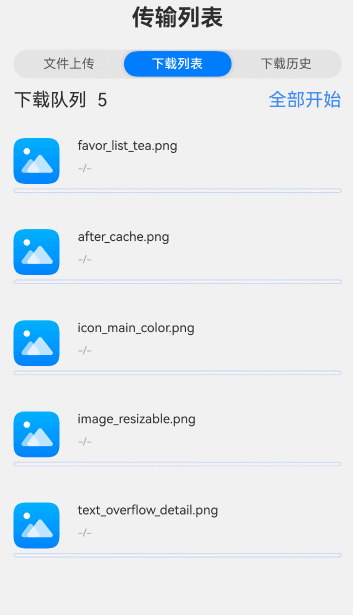

#### 61.自定义安全键盘案例（0312更新）

金融类应用在密码输入时，一般会使用自定义安全键盘。本示例介绍如何使用TextInput组件实现自定义安全键盘场景，主要包括TextInput.customKeyboard绑定自定义键盘、自定义键盘布局和状态更新等知识点。[详细说明文档](./CommonAppDevelopment/feature/customsafekeyboard/README.md)

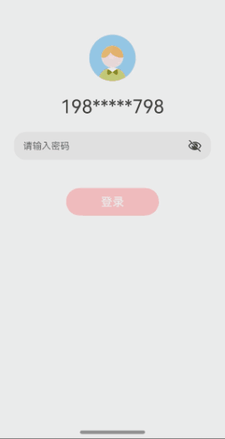

#### 60.适配挖孔屏案例（0312更新）

本示例介绍使用屏幕属性getDefaultDisplaySync、getCutoutInfo接口实现适配挖孔屏。该场景多用于沉浸式场景下。[详细说明文档](./CommonAppDevelopment/feature/diggingholescreen/README.md)

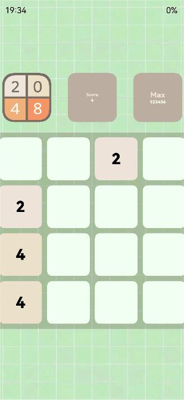

#### 59.自定义路由栈管理（0312更新）

本案例将介绍如何使用路由跳转返回时获取到来源页的模块名以及路径名，在实际场景中同一页面通常会根据不同来源页展示不同的UI。[详细说明文档](./CommonAppDevelopment/common/routermodule/README_ROUTER_REFERRER.md)

#### 58.左右拖动切换图片效果案例（0304更新）

本示例使用滑动手势监听，实时调整左右两侧内容显示区域大小和效果。通过绑定gesture事件中的PanGesture平移手势，实时获取拖动距离。当拖动时，实时地调节左右两个Image组件的宽度，从而成功实现左右拖动切换图片效果的功能。[详细说明文档](./CommonAppDevelopment/feature/dragtoswitchpictures/README.md)

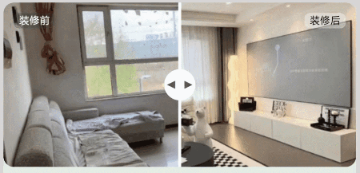

#### 57.投票动效实现案例（0304更新）

本示例介绍使用绘制组件中的Polygon组件配合使用显式动画以及borderRadius实现投票pk组件。[详细说明文档](./CommonAppDevelopment/feature/votingcomponent/README.md)


#### 56.汉字转拼音案例（0304更新）

本示例介绍使用第三方库的pinyin4js组件实现汉字转大写拼音。[详细说明文档](./CommonAppDevelopment/feature/chinesetopinyin/README.md)

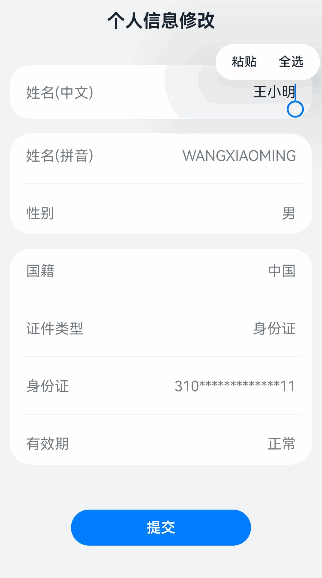

#### 55.底部抽屉滑动效果案例（0304更新）

本示例主要介绍了利用List实现底部抽屉滑动效果场景，并将界面沉浸式（全屏）显示，及背景地图可拖动。[详细说明文档](./CommonAppDevelopment/feature/bottomdrawerslidecase/README.md)


#### 54.MpChart运动健康（0304更新）

MpChart是一个包含各种类型图表的图表库，主要用于业务数据汇总，例如销售数据走势图，股价走势图等场景中使用，方便开发者快速实现图表UI，MpChart主要包括线形图、柱状图、饼状图、蜡烛图、气泡图、雷达图、瀑布图等自定义图表库。 本示例介绍了MpChart图表组件的使用方法。 该组件多用于可视化等场景。[详细说明文档](./CommonAppDevelopment/feature/healthchart/README.md)

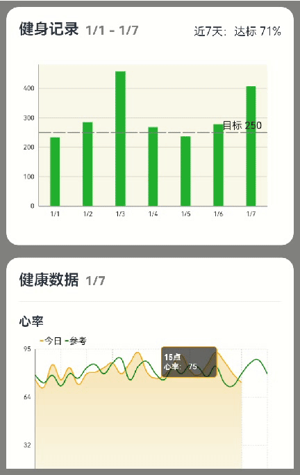

#### 53.大文件拷贝案例（0302更新）

文件拷贝是应用开发中的一个常见场景，通常有两种方式，一是直接读写文件的全部内容，二是使用buffer多次读写。前者的优点在于使用简单，但是在大文件场景下，内存占用较高，影响应用性能；后者的优点在于内存占用较小，但是编程稍显复杂。本例将展示如何使用buffer来将大文件的rawfile复制到应用沙箱。[详细说明文档](./CommonAppDevelopment/feature/bigfilecopy/README.md)

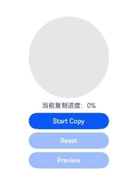

#### 52.Web获取相机拍照图片案例（0302更新）

本示例介绍如何在HTML页面中拉起原生相机进行拍照，并获取返回的图片。[详细说明文档](./CommonAppDevelopment/feature/webgetcameraimage/README.md)


#### 51.元素超出List区域（0302更新）

本示例介绍在List组件内实现子组件超出容器边缘的布局样式的实现方法。[详细说明文档](./CommonAppDevelopment/feature/listitemoverflow/README.md)

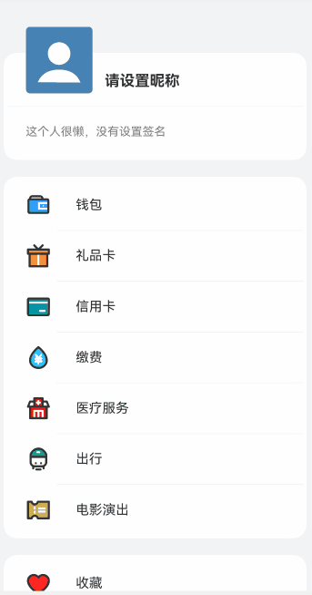

#### 50.数字滚动动效实现（0229更新）

本示例主要介绍了数字滚动动效的实现方案。 该方案多用于数字刷新，例如页面刷新抢票数量等场景。[详细说明文档](./CommonAppDevelopment/feature/digitalscrollanimation/README.md)


#### 49.图片拖拽AI抠图案例（0229更新）

本示例介绍图片AI抠图案例的使用：通过Image.enableAnalyzer(true)实现长按图片抠图并拖拽/复制到其他应用中。[详细说明文档](./CommonAppDevelopment/feature/imageenableanalyzer/README.md)


#### 48.长列表滑动到指定列表项动效实现案例（0229更新）

本示例使用currentOffset方法获取并记录偏移量，然后使用scrollTo方法跳转到上次浏览记录功能，可以流畅滑动到上次列表的位置。[详细说明文档](./CommonAppDevelopment/feature/listslidetohistory/README.md)


#### 47.标题下拉缩放案例（0229更新）

本文以备忘录应用为示例，介绍如何在实现标题展开时继续下拉的动效。[详细说明文档](./CommonAppDevelopment/feature/expandtitle/README.md)


#### 46.使用绘制组件实现自定义进度动画（0229更新）

本示例介绍使用绘制组件中的Circle组件以及Path组件实现实时进度效果。该场景多用于手机电池电量、汽车油量、水位变化等动态变化中。[详细说明文档](./CommonAppDevelopment/feature/paintcomponent/README.md)

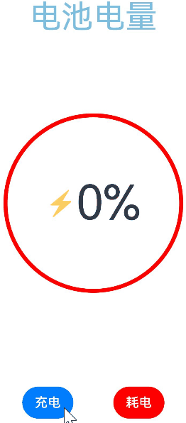

#### 45.图片压缩方案（0229更新）

本示例介绍如何通过packing和scale实现图片压缩，以及把图片压缩成不同格式并保存到图库。[详细说明文档](./CommonAppDevelopment/feature/imagecompression/README.md)

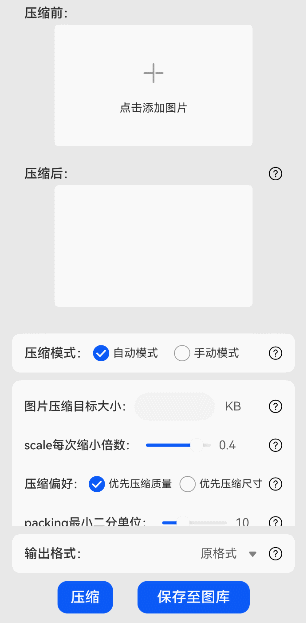

#### 44.Lottie动画（0229更新）

Lottie是一个适用于OpenHarmony的动画库，它可以解析Adobe After Effects软件通过Bodymovin插件导出的json格式的动画，并在移动设备上进行本地渲染，可以在各种屏幕尺寸和分辨率上呈现，并且支持动画的交互性，通过添加触摸事件或其他用户交互操作，使动画更加生动和具有响应性。[详细说明文档](./CommonAppDevelopment/feature/lottieview/README.md)


#### 43.SideBarContainer侧边栏淡入淡出动效实现案例（0229更新）

在pc或平板上，群聊侧边栏是一种较为常用的功能，虽然HarmonyOS已经具备了基本的动效，但是部分情况下开发者可能有定制侧边栏动效的需求，本例主要介绍了如何基于显式动画实现侧边栏的淡入淡出动效。[详细说明文档](./CommonAppDevelopment/feature/sidebaranimation/README.md)

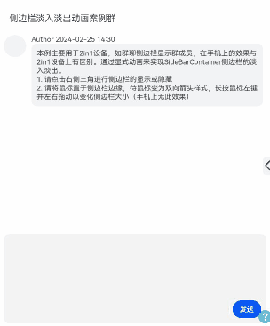

#### 42.页面加载效果实现案例（0229更新）

本示例介绍Stack堆叠组件和LoadingProgress加载组件模拟首次进入页面实现页面加载的效果。使用Canvas播放Lottie动画以及Progress组件实现进度条。加载完成后，LoadingProgress组件会消失并展示加载结果页（即商品页）。[详细说明文档](./CommonAppDevelopment/feature/pageloading/README.md)


#### 41.Native保存图片到应用沙箱（0222更新）

本示例主要介绍Native如何将网络上的图片及Rawfile中的图片保存到应用沙箱中。[详细说明文档](./CommonAppDevelopment/feature/nativesavepictosandbox/README.md)


#### 40.短视频切换（0222更新）

短视频切换在应用开发中是一种常见场景，上下滑动可以切换视频，十分方便。本模块基于Swiper组件和Video组件实现短视频切换功能。[详细说明文档](./CommonAppDevelopment/feature/shortvideo/README.md)

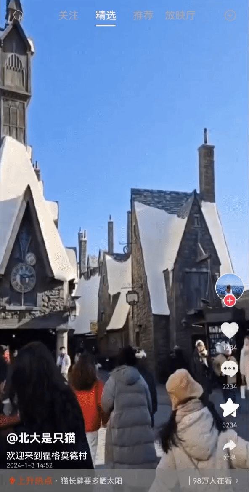

#### 39.城市选择案例（0220更新）

本示例介绍城市选择场景的使用：通过AlphabetIndexer实现首字母快速定位城市的索引条导航。[详细说明文档](./CommonAppDevelopment/feature/citysearch/README.md)

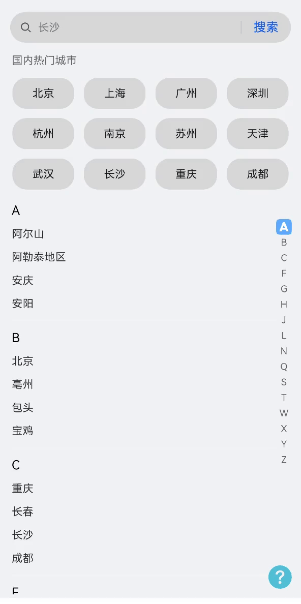

#### 38.多层级轮播图方案（0219更新）

本示例介绍使用ArkUI Stack组件实现多层级轮播图。该场景多用于购物、资讯类应用。[详细说明文档](./CommonAppDevelopment/feature/swipercomponent/README.md)


#### 37.搜索功能实现案例（0219更新）

本示例介绍使用includes方法对数据实现模糊查询。[详细说明文档](./CommonAppDevelopment/feature/searchcomponent/README.md)

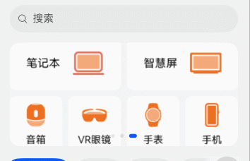

#### 36.Swiper高度可变化效果实现（0219更新）

在很多应用中，swiper组件每一个page的高度是不一致的，所以需要swiper组件下方页面的高度跟着一起变化。[详细说明文档](./CommonAppDevelopment/feature/swipersmoothvariation/README.md)

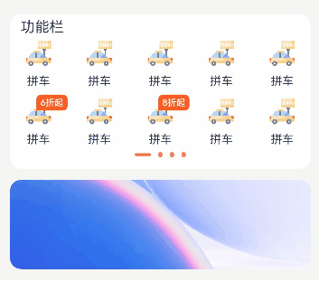

#### 35.听歌识曲水波纹特效案例（0219更新）

本示例介绍水波纹的特效。该场景多用于各种软件的按钮。听歌识曲水波纹特效案例可以参考此[详细说明文档](./CommonAppDevelopment/feature/waterripples/README.md)。


#### 34.自定义日历选择器（0219更新）

日历选择器是出行类应用常见模块。自定义日历选择器案例可以参考[详细说明文档](./CommonAppDevelopment/feature/customcalendarpickerdialog/README.md)。


#### 33.滚动吸顶效果实现案例（0219更新）

本示例介绍运用Stack组件以构建多层次堆叠的视觉效果。通过绑定Scroll组件的onScroll滚动事件回调函数，精准捕获滚动动作的发生。当滚动时，实时地调节组件的透明度、高度等属性，从而成功实现了嵌套滚动效果、透明度动态变化以及平滑的组件切换。其中，搜索框能够实现“吸顶”效果，在用户滚动页面时始终保持在顶部。[详细说明文档](./CommonAppDevelopment/feature/componentstack/README.md)


#### 32.自定义视图实现Tab效果（0219更新）

本示例介绍使用Text、List等组件，添加点击、动画等事件 **onClick** **animateTo** 自定义视图实现类似Tab效果。自定义视图实现Tab效果的方案可以参考此[详细说明文档](./CommonAppDevelopment/feature/customview/README.md)。**此案例有新升级，可以参考[自定义动效tab](./CommonAppDevelopment/feature/customanimationtab/README.md)**


#### 31.Worker子线程中解压文件（0219更新）

本示例介绍在Worker子线程使用@ohos.zlib提供的zlib.decompressfile接口对沙箱目录中的压缩文件进行解压操作，解压成功后将解压路径返回主线程，获取解压文件列表。[详细说明文档](./CommonAppDevelopment/feature/decompressfile/README.md)

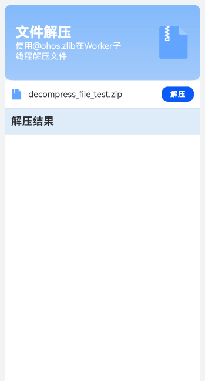

#### 30.折叠屏音乐播放器案例（1114更新）

本示例介绍使用ArkUI中的容器组件FolderStack在折叠屏设备中实现音乐播放器场景，展示当前播放歌曲信息，支持播控中心控制播放和后台播放能力。[详细说明文档](./CommonAppDevelopment/feature/foldablescreencases/README.md)


#### 29.发布图片评论（0219更新）

本示例将通过发布图片评论场景，介绍如何使用startAbilityForResult接口拉起相机拍照，并获取相机返回的数据。[详细说明文档](./CommonAppDevelopment/feature/imagecomment/README.md)


#### 28.视频全屏切换案例（0219更新）

本示例介绍了Video组件和@ohos.window接口实现媒体全屏的功能。该场景多用于首页瀑布流媒体播放等。。[详细说明文档](./CommonAppDevelopment/feature/mediafullscreen/README.md)

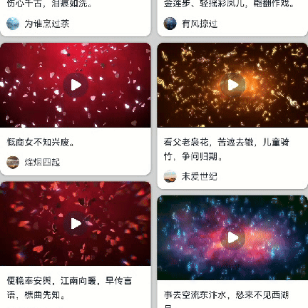

#### 27.Navigation页面跳转对象传递案例（0219更新）

本示例主要介绍在使用Navigation实现页面跳转时，如何在跳转页面得到转入页面传的类对象的方法。实现过程中使用了第三方插件class-transformer，传递对象经过该插件的plainToClass方法转换后可以直接调用对象的方法[详细说明文档](./CommonAppDevelopment/feature/navigationparametertransfer/README.md)


#### 26.动态路由（0219更新）

当前已有新的自动生成动态路由模块，此篇文档后续将不再维护，请移步至新的路由模块文档。详情说明请参考[自动生成动态路由](./CommonAppDevelopment/common/routermodule/README_AUTO_GENERATE.md)。

#### 25.状态栏显隐变化（0204更新）

本示例介绍使用Scroll组件的滚动事件 **onScroll** 实现状态栏显隐变化。该场景多用于各种软件的首页、我的等页面中。状态栏显隐变化的方案可以参考此[详细说明文档](./CommonAppDevelopment/feature/navigationbarchange/README.md)。


#### 24.使用弹簧曲线实现抖动动画及手机振动效果案例（0204更新）

抖动动画和手机振动效果是手机使用时常见的效果。抖动动画及手机振动效果案例可以参考[详细说明文档](./CommonAppDevelopment/feature/vibrateeffect/README.md)。

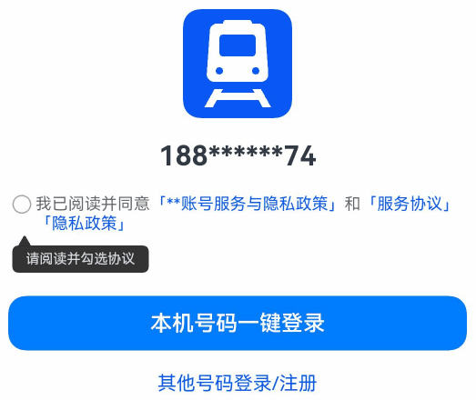

#### 23.验证码布局（0204更新）

本示例介绍如何使用Text组件实现验证码场景，并禁用对内容的选中、复制、光标。[详细说明文档](./CommonAppDevelopment/feature/verifycode/README.md)。

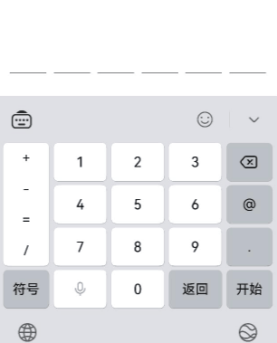

#### 22.在Native侧实现进度通知功能（0204更新）

本示例通过模拟下载场景介绍如何将Native的进度信息实时同步到ArkTS侧。[详细说明文档](./CommonAppDevelopment/feature/nativeprogressnotify/README.md)。


#### 21.翻页动效案例（0204更新）

翻页动效是应用开发中常见的动效场景，常见的有书籍翻页，日历翻页等。本例将介绍如何通过ArkUI提供的显示动画接口animateTo实现翻页的效果。[详细说明文档](./CommonAppDevelopment/feature/pageturninganimation/README.md)。

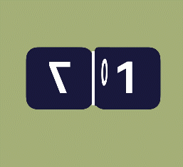

#### 20.下拉刷新与上滑加载案例（0204更新）

本示例介绍使用第三方库的PullToRefresh组件实现列表的下拉刷新数据和上滑加载后续数据。[详细说明文档](./CommonAppDevelopment/feature/pulltorefreshnews/README.md)。


#### 19.跑马灯案例（0204更新）

本示例介绍了文本宽度过宽时，如何实现文本首尾相接循环滚动并显示在可视区，以及每循环滚动一次之后会停滞一段时间后再滚动。[详细说明文档](./CommonAppDevelopment/feature/marquee/README.md)。


#### 18.深色模式案例（0204更新）

本示例介绍在开发应用以适应深色模式时，对于深色和浅色模式的适配方案，采取了多种策略。[详细说明文档](./CommonAppDevelopment/feature/fitfordarkmode/README.md)。

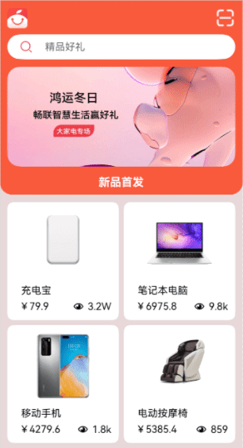

#### 17.应用异常处理案例（0204更新）

本示例介绍了通过应用事件打点hiAppEvent获取上一次应用异常信息的方法，主要分为应用崩溃、应用卡死以及系统查杀三种。[详细说明文档](./CommonAppDevelopment/feature/applicationexception/README.md)。

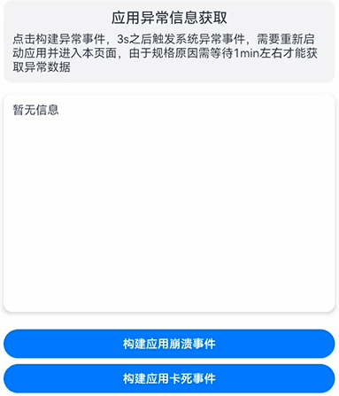

#### 16.图片选择和下载保存案例（20250107更新）

本示例介绍图片相关场景的使用：包含访问手机相册图片、选择预览图片并显示选择的图片到当前页面，下载并保存网络图片到手机相册或到指定用户目录，从web页面保存图片到相册三个场景。[详细说明文档](./CommonAppDevelopment/feature/photopickandsave/README.md)。

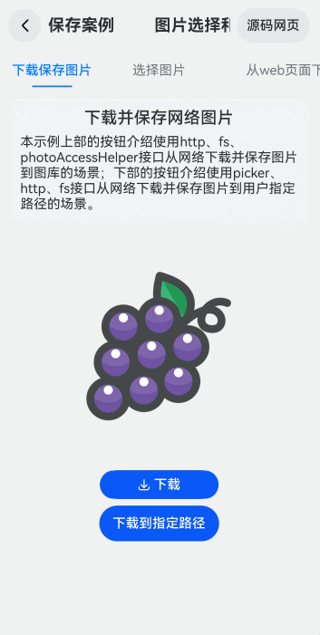

#### 15.多层嵌套类对象监听（0130更新）

对于多层嵌套的情况，比如二维数组，或者数组项class，或者class的属性是class，他们的第二层的属性变化是无法观察到的。@Observed/@ObjectLink装饰器可以解决，
多层嵌套类对象监听方案可以参考[详细说明文档](./CommonAppDevelopment/feature/variablewatch/README.md)。

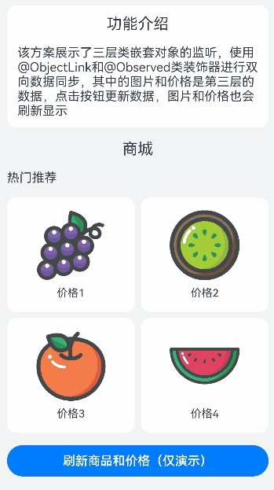

#### 14.使用AKI轻松实现跨语言调用（0130更新）

AKI提供了极简语法糖使用方式，一行代码完成JS与C/C++的无障碍跨语言互调，使用方便。本模块将介绍使用AKI编写C++跨线程调用JS函数场景，为开发者使用AKI提供参考。AKI使用实践可参考此[详细说明文档](./CommonAppDevelopment/feature/akiusepractice/README.md)。

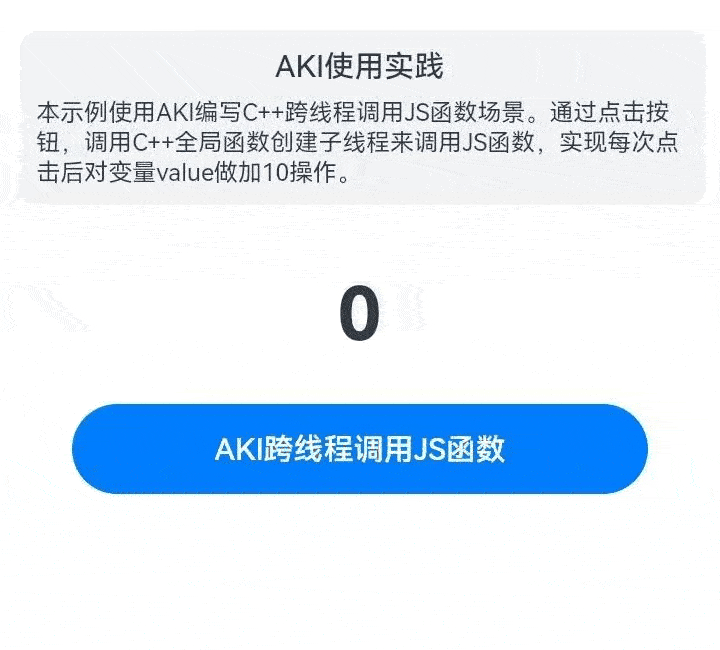

#### 13.Tab组件实现增删Tab标签（0129更新）

本示例介绍使用了Tab组件实现自定义增删Tab页签的功能。该场景多用于浏览器等场景。[详细说明文档](./CommonAppDevelopment/feature/handletabs/README.md)。

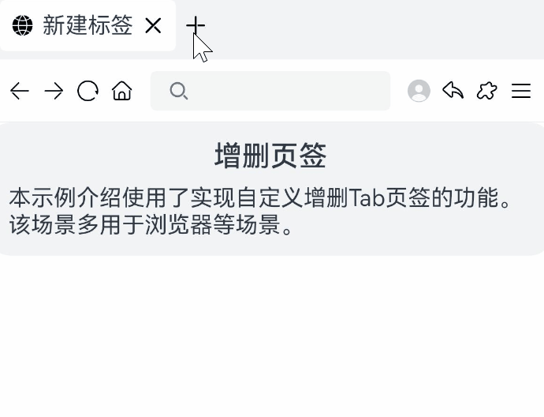

#### 12.GBK文本格式解码（0204更新）

本示例介绍使用第三方库的Axios获取GBK格式的网络数据时，通过util实现GBK转换UTF-8格式。该场景多用于需要转换编码格式的应用。[详细说明文档](./CommonAppDevelopment/feature/gbktranscoding/README.md)。


#### 11.预加载so并读取RawFile文件（0127更新）

使用native从rawfile中文件读取部分内容。具体方案可以参考此[详细说明文档](./CommonAppDevelopment/feature/nativerawfile/README.md)。

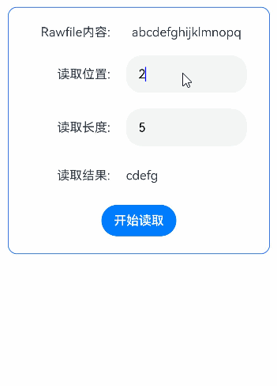

#### 10.列表编辑（0127更新）

列表的编辑模式用途十分广泛，常见于待办事项管理、文件管理、备忘录的记录管理等应用场景。列表编辑实现方案可以参考此[详细说明文档](./CommonAppDevelopment/feature/pendingitems/README.md)。

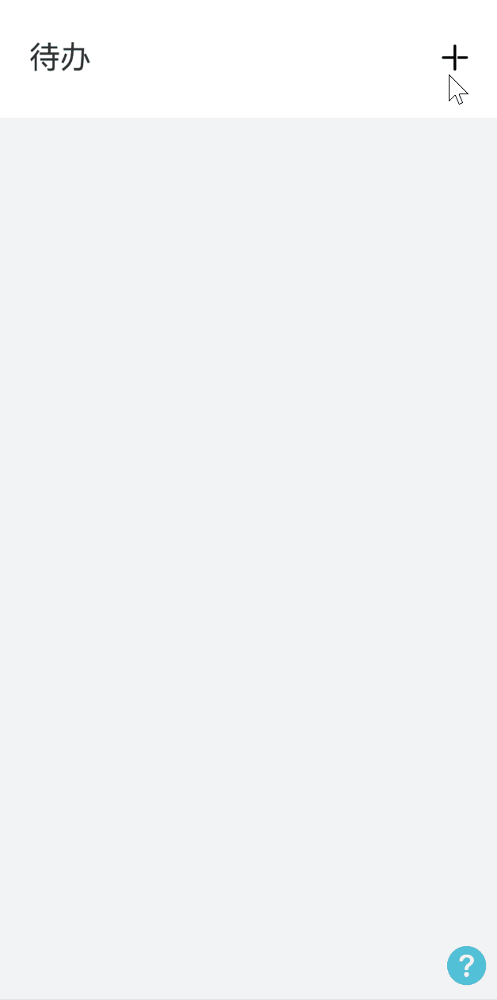

#### 9.列表二级联动（0126更新）

二级联动是指一个列表（一级列表）的选择结果，来更新另一个列表（二级列表）的选项。二级联动的方案可以参考此[详细说明文档](./CommonAppDevelopment/feature/secondarylinkage/README.md)。

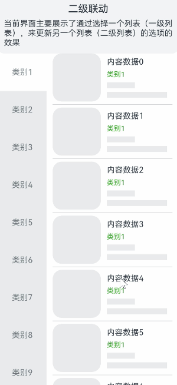

#### 8.阻塞事件冒泡（0126更新）

事件冒泡是指触发子组件事件的时候，事件会传递到父组件，这样会导致父组件的事件也会触发。阻塞事件冒泡的方案可以参考此[详细说明文档](./CommonAppDevelopment/feature/eventpropagation/README.md)。

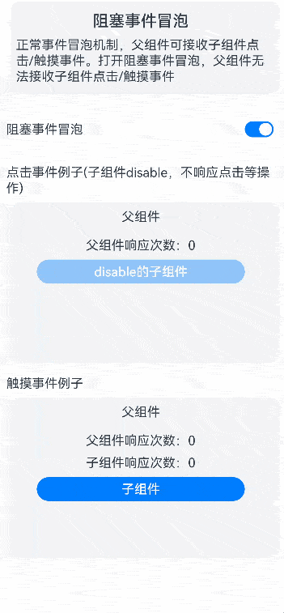

#### 7.图片缩放效果实现（0127更新）

本模块基于Image组件实现了简单的图片预览功能，支持双指捏合等效果。图片预览方案可参考此[详细说明文档](./CommonAppDevelopment/feature/imageviewer/README_PREVIEW_IMAGE.md)。


#### 6.主页瀑布流实现案例（0127更新）

本示例使用WaterFlow+LazyForeEach实现了瀑布流场景。具体方案可以参考[详细说明文档](./CommonAppDevelopment/feature/functionalscenes/README.md)。


#### 5.滑动页面信息隐藏与组件位移效果案例（0129更新）

在很多应用中，向上滑动"我的"页面，页面顶部会有如下变化效果：一部分信息逐渐隐藏，另一部分信息逐渐显示，同时一些组件会进行缩放或者位置移动。向下滑动时则相反。[详细说明文档](./CommonAppDevelopment/feature/slidetohideanddisplace/README.md)。

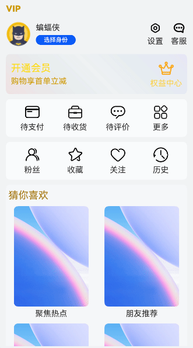

#### 4.MpChart图表实现案例（0126更新）

MpChart是一个包含各种类型图表的图表库，方便开发者快速实现图表UI。使用MpChart可以实现柱状图UI效果，具体方案可以参考此[详细说明文档](./CommonAppDevelopment/feature/barchart/README.md)。

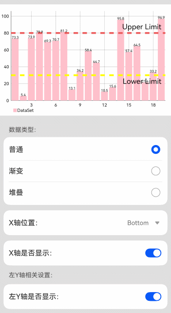

#### 3.全屏登录页面（0129更新）

本例介绍各种应用登录页面。在主页面点击跳转到全屏登录页后，显示全屏模态页面，全屏模态页面从下方滑出并覆盖整个屏幕，模态页面内容自定义，此处分为默认一键登录方式和其他登录方式。[详细说明文档](./CommonAppDevelopment/feature/modalwindow/README.md)。

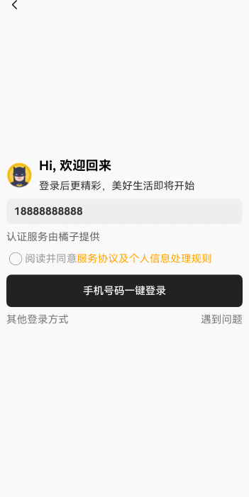

#### 2.自定义TabBar页签案例（0127更新）

TabBar在大部分的APP当中都能够使用到，不同的APP可能存在不一样的TabBar样式，Tab组件自带的TabBar属性对于部分效果无法满足，如页签中间显示一圈圆弧外轮廓等，
因此我们需要去自己定义一个TabBar页签来满足开发的需要。自定义TabBar页签的方案可以参考此[详细说明文档](./CommonAppDevelopment/feature/customtabbar/README.md)。


#### 1.地址交换动画（0127更新）

在出行类订票软件中，一般都有此动画效果，点击交换后，起点和终点互换。地址交换动画的方案可以参考此[详细说明文档](./CommonAppDevelopment/feature/addressexchange/README.md)。

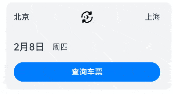

应用通用开发范例App模块化结构如下：

   ```
   common_app_development
   |---AppScope
   |---common                                // 公共能力层
   |   |---utils     
   |   |   |---component                     // 公共布局，如功能介绍布局
   |   |   |---log                           // 日志打印 
   |---feature                               // 基础特性层
   |   |---addressexchange                   // 地址交换动画案例
   |   |---akiusepractice                    // AKI使用实践
   |   |---applicationexception              // 应用异常处理案例
   |   |---barchart                          // MpChart图表实现案例
   |   |---customtabbar                      // 自定义TabBar页签 案例
   |   |---eventpropagation                  // 阻塞事件冒泡案例
   |   |---fitfordarkmode                    // 深色模式适配案例
   |   |---functionalscenes                  // 主页瀑布流实现 
   |   |---gbktranscoding                    // Axios获取网络GBK数据转换UTF-8网络数据
   |   |---handletabs                        // Tab组件实现增删Tab标签案例
   |   |---imageviewer                       // 图片预览方案
   |   |---marquee                           // 跑马灯案例
   |   |---modalwindow                       // 全屏登录页面案例
   |   |---nativeprogressnotify              // Native侧进度通知到ArkTS
   |   |---nativerawfile                     // Native读取Rawfile中文件部分内容
   |   |---navigationparametertransfer       // Navigation页面跳转对象传递案例
   |   |---pageturninganimation              // 翻页动效案例
   |   |---pendingitems                      // 列表编辑实现案例
   |   |---photopickandsave                  // 图片选择和下载保存案例
   |   |---pulltorefreshnews                 // 下拉刷新与上滑加载案例
   |   |---secondarylinkage                  // 二级联动实现案例
   |   |---slidetohideanddisplace            // 滑动页面信息隐藏与组件位移效果案例
   |   |---variablewatch                     // 多层嵌套类对象监听案例
   |   |---verifycode                        // 验证码布局
   |   |---vibrateeffect                     // 基础特性层-抖动动画及手机振动效果
   |   |---customcalendarpickerdialog        // 基础特性层-自定义日历选择器
   |   |---navigationbarchange               // 基础特性层-状态栏显隐变化案例
   |   |---customview                        // 基础特性层-自定义视图实现Tab效果
   |   |---waterripples                      // 基础特性层-听歌识曲水波纹特效案例
   |   |---citysearch                        // 城市选择案例
   |   |---componentstack                    // 滚动吸顶效果实现案例
   |   |---dragandexchange                   // Grid和List内拖拽交换子组件位置案例
   |   |---foldablescreencases               // 折叠屏音乐播放器案例
   |   |---imagecomment                      // 发布图片评论案例
   |   |---mediafullscreen                   // 视频全屏切换案例
   |   |---swipercomponent                   // 多层级轮播图案例
   |   |---swipersmoothvariation             // Swiper高度可变化效果案例
   |   |---decompressfile                    // Worker子线程中解压文件案例
   |   |---paintcomponent                    // 使用绘制组件实现自定义进度动画案例
   |   |---lottieview                        // Lottie
   |   |---imagecompression                  // 图片压缩方案
   |   |---votingcomponent                   // 投票组件
   |   |---webgetcameraimage                 // WebView拉起原生相机案例
   |   |---sidebaranimation                  // SideBarContainer侧边栏淡入淡出动效实现案例
   |   |---imageenableanalyzer               // 图片拖拽AI抠图案例
   |   |---indicatorbelowswiper              // swiper指示器导航点位于swiper下方
   |   |---bigfilecopy                       // 大文件拷贝案例
   |   |---diggingholescreen                 // 适配挖孔屏案例
   |   |---dragtoswitchpictures              // 左右拖动切换图片效果案例
   |   |---listitemoverflow                  // 元素超出List区域
   |   |---multiplefilesdownload             // 多文件下载监听案例
   |   |---searchcomponent                   // 搜索页一镜到底案例
   |   |---dynamicattributes                 // 跨文件样式复用和组件复用
   |   |---etswrapper                        // NAPI封装ArkTS接口案例
   |   |---handwritingtoimage                // 手写绘制及保存图片
   |   |---multimodaltransion                // 多模态页面转场动效实现案例
   |   |---nativeembed                       // ArkWeb同层渲染
   |   |---sideslipintercept                 // 侧滑返回事件拦截案例
   |   |---webpdfviewer                      // Web组件预览PDF文件实现案例
   |   |---listslidetohistory                // 长列表滑动到指定列表项动效实现案例
   |   |---imagetheft                        // 正确配置ImageKnife请求头实现防盗链功能
   |   |---componentinstancesharedinpages    // 页面间共享组件实例的案例
   |   |---fontdynamicregistration           // 动态注册字体案例
   |   |---effectKit                         // 使用colorPicker实现背景跟随主题颜色转换
   |   |---cardswiperanimation               // 自定义Swiper卡片预览效果实现
   |   |---customscan                        // 折叠屏扫描二维码方案
   |   |---imagedepthcopy                    // PixelMap深拷贝案例
   |   |---pageflip                          // 阅读翻页方式案例
   |   |---videocache                        // 边缓存边播放案例
   |   |---iconmaincolor                     // 根据icon自适应背景颜色
   |   |---bottomdrawerslidecase             // 底部抽屉滑动效果案例
   |   |---chinesetopinyin                   // 汉字转拼音案例
   |   |---customsafekeyboard                // 自定义安全键盘案例
   |   |---nativesavepictosandbox            // Native保存图片到应用沙箱
   |   |---shortvideo                        // 短视频切换实现案例
   |   |---digitalscrollanimation            // 数字滚动动效实现
   |   |---expandtitle                       // 标题下拉缩放案例
   |   |---pageloading                       // 页面加载效果实现案例
   |   |---databaseupgrade                   // 数据库版本升级案例
   |   |---hilogmonitormanagement            // 监听HiLog日志实现测试用例验证
   |   |---transitionanimation               // 页面转场一镜到底动画
   |   |---imagegridlayout                   // 图片九宫格封装案例
   |   |---highlightguide                    // 应用新功能引导实现案例
   |   |---wordrecognition                   // 文字识别案例
   |   |---bottompanelslide                  // 底部面板嵌套列表滑动案例
   |   |---danmakuplayer                     // 视频弹幕功能
   |   |---listexchange                      // 列表项交换案例
   |   |---tabcontentoverflow                // tabContent内容可以在tabBar上显示并响应滑动事件案例
   |   |---chatwithexpression                // 表情聊天案例
   |   |---floatwindow                       // 悬浮窗拖拽和吸附动画
   |   |---gridexchange                      // 网格元素交换案例
   |   |---miniplayeranimation               // 音乐播放转场一镜到底效果实现
   |   |---refreshtimeline                   // 下拉展开图片和时间轴效果实现案例
   |   |---webpagesnapshot                   // Web页面长截图
   |   |---blendmode                         // 图片混合案例
   |   |---secondfloorloadanimation          // 首页下拉进入二楼效果案例
   |   |---styledtext                        // Text实现部分文本高亮和超链接样式
   |   |---navigationinterceptor             // Navigation路由拦截案例
   |   |---customdialog                      // 全局弹窗封装案例
   |   |---textexpand                        // 文字展开收起案例
   |   |---imageresizable                    // 边框或背景图片拉伸案例
   |   |---watermark                         // 水印案例
   |   |---textoverflow                      // textOverflow长文本省略
   |   |---fadingedge                        // 边缘渐变实现
   |   |---customstepper                     // 自定义Stepper
   |   |---searchswiper                      // 搜索框热搜词自动滚动
   |   |---perfermance  
   |   |   |---highlyloadedcomponentrender   // 合理处理高负载组件的渲染文章示例代码
   |   |   |---customreusablepool            // 自定义组件复用池文章示例代码
   |   |   |---operaterdbintaskpool          // 在TaskPool线程中操作关系型数据库实现案例
   |   |   |---imperativedynamiclayouts      // 使用ArkUI的FrameNode扩展实现动态布局类框架
   |   |---videolinkagelist                  // 视频卡片和列表区域的联动滚动
   |   |---navdestinationdialog              // NavDestination弹窗
   |   |---customkeyboardtoh5                // H5页面调用自定义输入法案例
   |   |---sendmessage                       // 发短信案例
   |   |---skeletondiagram                   // 骨架屏案例
   |   |---palette                           // 画笔调色板案例
   |   |---imagemosaic                       // 图片编辑实现马赛克效果
   |   |---calendarswitch                    // 日历切换案例
   |   |---eraser                            // 橡皮擦案例
   |   |---bluetooth                         // 蓝牙实现服务端和客户端通讯
   |   |---customdecoration                  // 自定义装饰器
   |   |---videolistautoplay                 // 滑动视频自动播放
   |   |---editaddress                       // 编辑收货地址案例
   |   |---customdrawtabbar                  // 自定义TabBar页签凸起和凹陷案例
   |   |---verticalhorizontallinkage         // 横向纵向列表联动案例
   |   |---livedetectionandencryptiond       // 人脸识别验证案例
   |   |---collapsemenu                      // 折叠面板案例
   |   |---decodeheifimage                   // HEIF软解码器案例
   |   |---h5cache                           // H5页面资源离线缓存案例
   |   |---addressrecognize                  // AI图片文字智能识别案例
   |   |---groupavatar                       // 群头像拼接案例
   |   |---keyboardavoid                     // 组件随软键盘弹出避让案例
   |   |---patternlock                       // 图形锁屏案例
   |   |---componentinstancesharedinpages    // 地图大头针弹窗案例
   |   |---publishmultimediaupdates          // 多媒体发布案例
   |   |---compressfile                      // 文件压缩案例
   |   |---customaddresspicker               // 自定义地址选择案例
   |   |---videocreategif                    // 视频截取gif图
   |   |---clickanimation                    // 直播界面双击效果动画实现案例
   |   |---toolbox                           // 悬浮工具箱
   |   |---networkstatusobserver             // 网络状态监听案例
   |   |---multiplescreening                 // 多重筛选案例
   |   |---limitedheightbottomdialog         // 限制高度底部弹窗
   |   |---faceandfingerprintunlocking       // 人脸指纹解锁案例
   |   |---cuberotateanimation               // 3D立方体旋转轮播实现案例
   |   |---multicolumndisplay                // 多段混合数据展示案例
   |   |---sharebutton                       // 分享二维码按钮案例
   |---libs
   |---product 
   |   |---entry                             // 产品定制层-应用入口
   ```

### 公共能力层

公共功能层用于存放公共基础能力，集中了例如公共UI组件、数据管理、外部交互以及工具库等的共享功能。应用与元服务都可以共享和调用这些公共能力。

公共能力层为上层的基础特性层和产品定制层提供稳定可靠的功能支持，确保整个应用/元服务的稳定性和可维护性。

应用通用开发范例App公共能力层包含以下模块：[**日志打印**](./CommonAppDevelopment/common/utils/src/main/ets/log/Logger.ets)、[**功能介绍布局**](./CommonAppDevelopment/common/utils/src/main/ets/component/FunctionDescription.ets)

## 配套平台

1. 适用最新HarmonyOS Next版本；

2. 适用Stage模型�
