## 一、案例开发——发布流程

&emsp;&emsp;本章主要介绍了从零开始发布案例的流程。

### 1.1. 配置Git环境

&emsp;&emsp;首先需要配置git环境，为后续代码下载与提交奠定基础，具体步骤如下。

&emsp;&emsp;1) 下载git并安装，下载地址：https://git-scm.com/downloads 。

&emsp;&emsp;2) 注册gitee 账号。

&emsp;&emsp;&emsp;&emsp;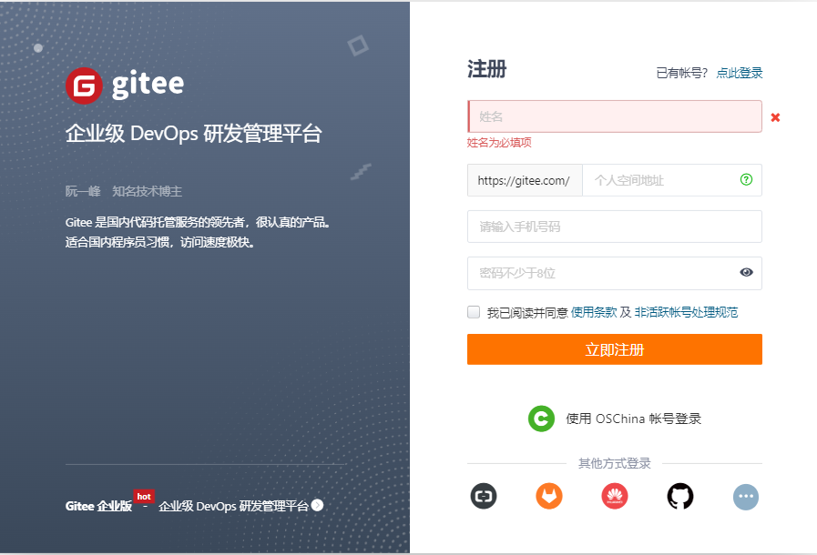

&emsp;&emsp;3) 配置账户邮箱。

&emsp;&emsp;&emsp;&emsp;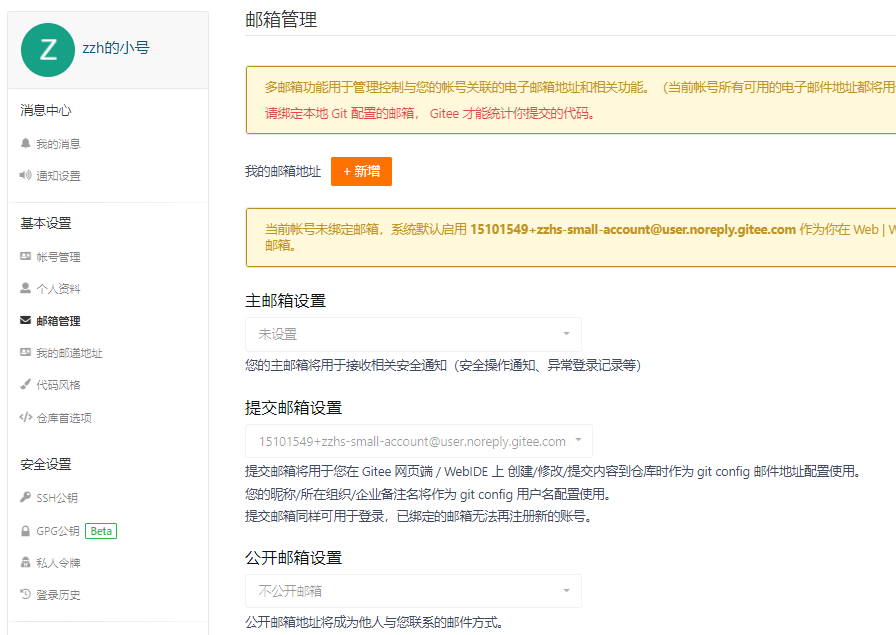

&emsp;&emsp;4) 在gitee 搜索HarmonyOS-Cases，并进入HarmonyOS-Cases/Cases 仓库，仓库地址：https://gitee.com/harmonyos-cases/cases 。

&emsp;&emsp;5) 拉取代码至本地。
```ts
git clone https://gitee.com/harmonyos-cases/cases.git
```

&emsp;&emsp;6) 配置身份信息。
```typescript
git config --global user.name 'gitee 用户名'
git config --global user.email 'gitee 用户邮箱'
```

### 1.2. 代码开发

&emsp;&emsp;1) 进行案例的代码开发，具体内容可见第二章代码开发部分。

&emsp;&emsp;2) 检查开发代码符合第二章内容要求后，可进行案例发布、合入主仓等步骤。

### 1.3. 代码开发

&emsp;&emsp;1) 点击forked将仓库安装到个人仓库中。

&emsp;&emsp;&emsp;&emsp;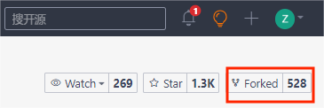

&emsp;&emsp;2) 在git中创建远程仓库关联fork的个人仓库。
```
git remote add remote 个人仓库地址
```

&emsp;&emsp;3) 通过git提交并推送代码至远程仓库
```
1. git add .
2.1 git commit -m "分支名" // 第一次提交使用该命令
2.2 git commit -m "分支名" --amend // 2次及以上提交使用该命令
3. git push remote head:master
```

### 1.4. 检视合入主仓

&emsp;&emsp;1) 在个人仓库中提交PR。

&emsp;&emsp;&emsp;&emsp;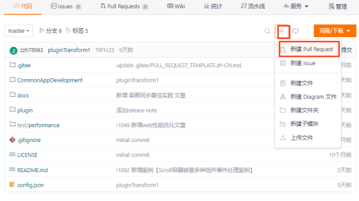

&emsp;&emsp;2) 提供编译通过与codelinter截图。

&emsp;&emsp;&emsp;&emsp;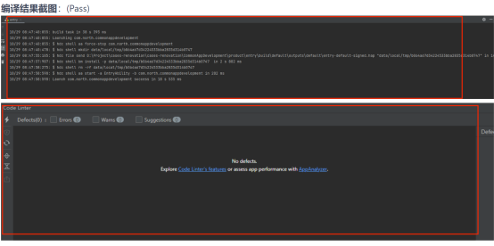

&emsp;&emsp;3) 检查PR的CheckList内容，保证提交代码符合要求。

&emsp;&emsp;&emsp;&emsp;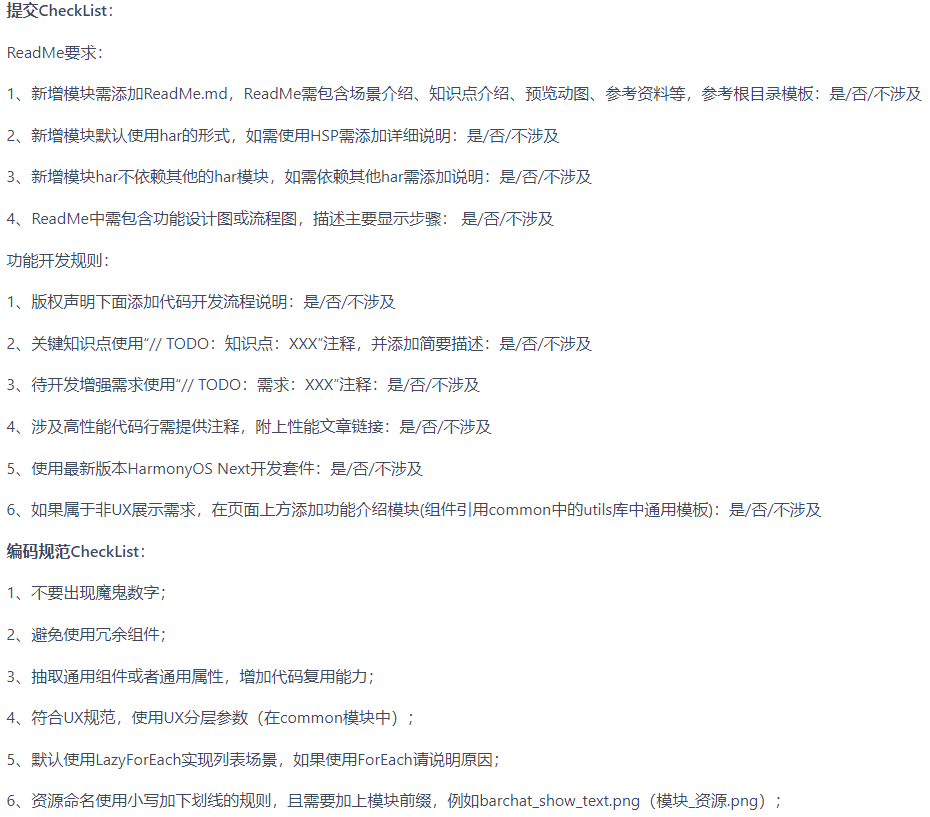

&emsp;&emsp;4) 有必要的话，先进行内部交叉review加分（点赞）。

&emsp;&emsp;5) 通知审核员审核并等待（包括代码规范审核——蒋文赛、测试——孙仁，以及UX审核——李晓艳），修改评论意见。

&emsp;&emsp;6) 如果存在冲突，请先解决冲突。
```
1. git pull --rebase 'https://gitee.com/harmonyos-cases/cases' master
2. git status // 查看冲突文件并修改冲突
3. git add .
4. git rebase --continue
```

&emsp;&emsp;7) 重新提交文件
```
1. git add .
2. git commit -m "分支名" --amend
3. git push remote head:master -f
```

&emsp;&emsp;8) 等待所有检视人员加分（点赞）后，可提醒审核员蒋文赛合入代码至主仓。

### 1.5. 论坛更新

&emsp;&emsp;所有问题闭环并合入主仓以后，找陈永建更新论坛。

## 二、案例开发——代码开发

&emsp;&emsp;本章主要介绍了案例代码开发的流程。

### 2.1. 模块配置

&emsp;&emsp;本节主要介绍了代码开发前的模块配置以及工程文件配置。

&emsp;&emsp;1) 创建har包。右键feature文件夹，New->Module；然后，新建一个static library模块。

&emsp;&emsp;&emsp;&emsp;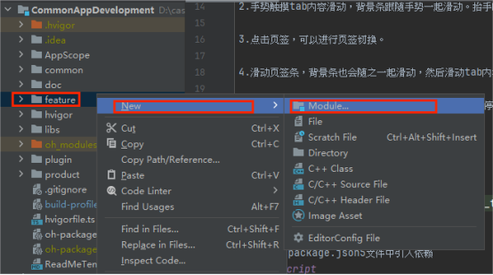

&emsp;&emsp;&emsp;&emsp;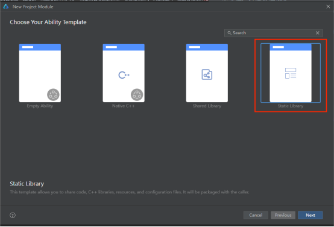

&emsp;&emsp;2) 配置工程build-profile.json5。在工程build-profile.json5文件中的”modules”字段内添加har包路径。（name与har包中的src/main/module.json5的name字段同名）

&emsp;&emsp;&emsp;&emsp;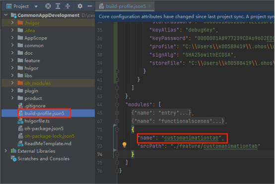

&emsp;&emsp;&emsp;&emsp;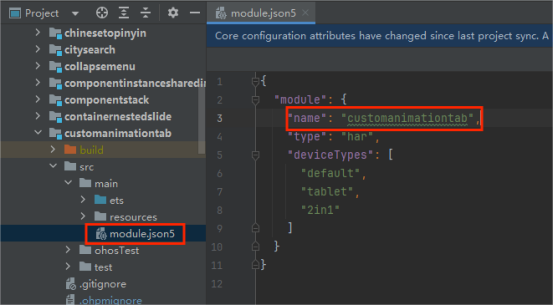

&emsp;&emsp;3) 配置product模块oh-package.json5文件。（字段名格式@ohos/har包名，字段地址为har包地址）

&emsp;&emsp;&emsp;&emsp;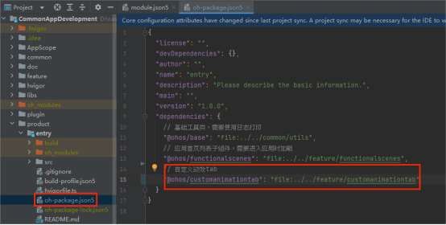

&emsp;&emsp;4) 配置product模块build-profile.json5文件。（填入内容与product模块oh-package.json5文件的字段名保持一致）

&emsp;&emsp;&emsp;&emsp;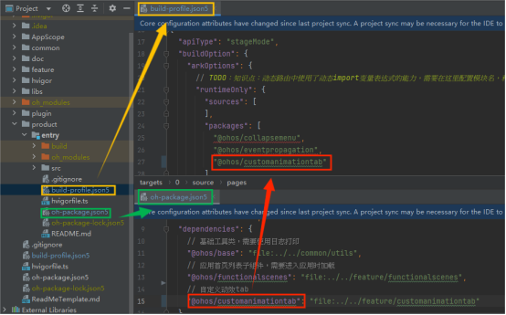

### 2.2. 代码结构

&emsp;&emsp;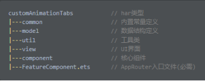

&emsp;&emsp;除了必需的结构，其余结构可以自行定义，也可以按照以上结构定义。

### 2.3. 编写核心组件——案例核心功能实现

&emsp;&emsp;本部分需要实现案例的核心功能，如：地址交换的核心功能就是传入两个组件并可以交换两个组件的位置。后续主要介绍了实现案例核心功能的基本步骤。

#### 2.3.1. 核心组件要求

&emsp;&emsp;本小节主要介绍了编写核心组件时，需要考虑的一些要求。

&emsp;&emsp;**2.3.1.1. 功能自定义**

&emsp;&emsp;功能自定义就是需要实现开发者可以自定义核心组件的一些功能，使核心组件使用起来更具通用性，如：动效自定义；内容自定义；...；

&emsp;&emsp;**2.3.1.2. 对外暴露属性与接口**

&emsp;&emsp;为了实现功能自定义，需要对外暴露一些接口与属性，使开发者可以从外部定义核心组件的一些功能。

&emsp;&emsp;1) 对外暴露属性

&emsp;&emsp;&emsp;&emsp;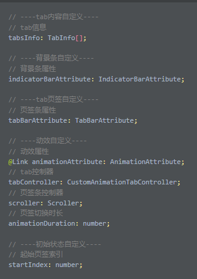

&emsp;&emsp;2) 对外暴露接口

&emsp;&emsp;&emsp;&emsp;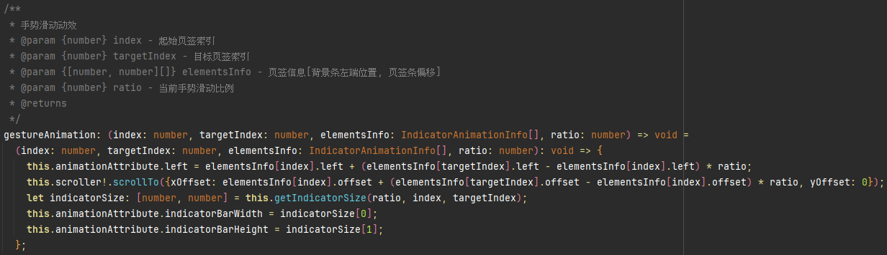

#### 2.3.2. 核心组件注释

&emsp;&emsp;本小节主要介绍了核心组件所需的一些注释，主要分为组件注释和成员变量与函数注释两部分。

&emsp;&emsp;**2.3.2.1. 组件注释**

&emsp;&emsp;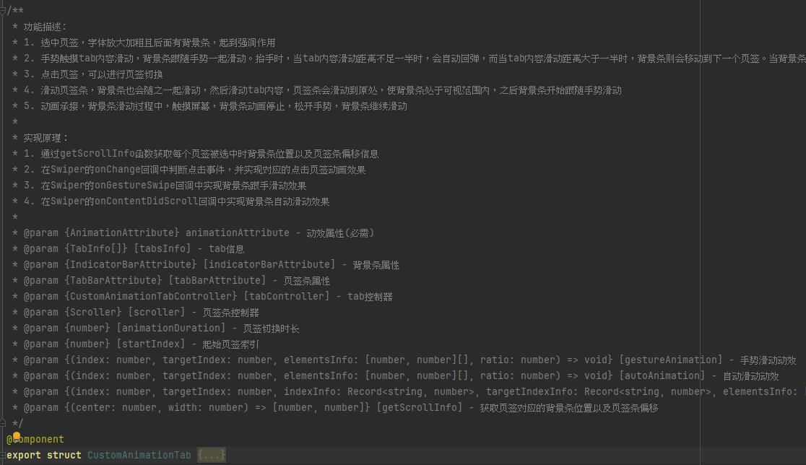

&emsp;&emsp;组件注释主要包括以下三个部分：

&emsp;&emsp;1) 功能描述：核心组件实现的功能有哪些。（以1.；2.；方式罗列）

&emsp;&emsp;2) 实现原理：核心组件是如何实现的。（总结README文档的实现思路部分，以1.；2.；方式罗列）

&emsp;&emsp;3) 对外参数与接口描述：描述对外参数与接口的定义，格式如下：

```
/**
 * @param {必选参数类型} 必选参数名 - 参数含义
 * @param {可选参数类型} [可选参数名] - 参数含义
 */
```

&emsp;&emsp;**2.3.2.2. 组件内成员变量与函数注释**

&emsp;&emsp;1) 成员变量注释：描述成员变量的定义，格式如下：
```
// 参数描述
```

&emsp;&emsp;&emsp;&emsp;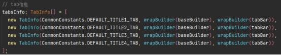

&emsp;&emsp;2) 成员函数注释：描述成员函数的定义，格式如下：
```
/**
 * 函数描述
 * @param {必选参数类型} 必选参数名 - 参数含义
 * @param {可选参数类型} [可选参数名] - 参数含义
 * @returns {返回类型} 返回值含义
 */
 ```

 &emsp;&emsp;&emsp;&emsp;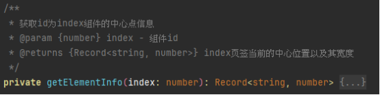

 ### 2.4. 编写UI/样例代码

 &emsp;&emsp;本节主要需要实现UI界面，以展示核心组件的功能，同时为开发者提供使用核心组件的示例。

 #### 2.4.1. UI/样例组件注释

 &emsp;&emsp;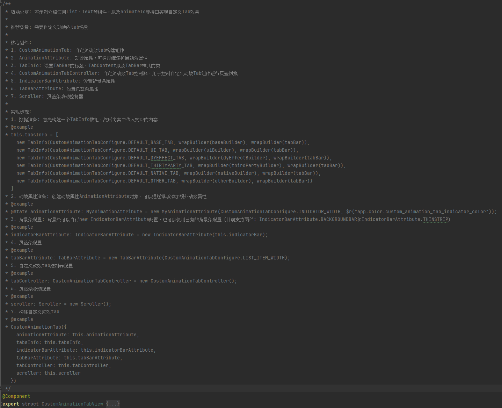

 &emsp;&emsp;UI/样例组件注释主要包括以下四个部分：

 &emsp;&emsp;1) 功能描述：简单介绍实现的样例。（直接使用README的介绍部分）

 &emsp;&emsp;2) 推荐场景：推荐使用核心组件的场景。

 &emsp;&emsp;3) 核心组件：核心组件以及一些核心组件需要的自定义类型。（以1.；2.；方式罗列）

 &emsp;&emsp;4) 实现步骤：核心组件的使用步骤，格式如下。（主要包括核心组件入参的获取等）
```
/**
 * 1. 步骤1
 * @example
 * 代码样例
 * 2. 步骤2
 * @example
 * 代码样例
 */
```

### 2.5. 填写README文件

&emsp;&emsp;在har包目录下填写README文件，除了包括介绍、效果预览图、使用说明、实现思路等字段，还需要额外包括：

&emsp;&emsp;1) 下载安装：如何导入核心组件

&emsp;&emsp;2) 快速使用：介绍如何快速上手使用核心组件

&emsp;&emsp;3) 属性（接口）说明字段：自定义组件/类的接口说明

&emsp;&emsp;具体可参照案例[CustomAnimationTab](https://gitee.com/harmonyos-cases/cases/blob/master/CommonAppDevelopment/feature/customanimationtab/README.md)。


### 2.6. 导入动态路由模块

&emsp;&emsp;在oh-package.json5中导入动态路由模块。

&emsp;&emsp;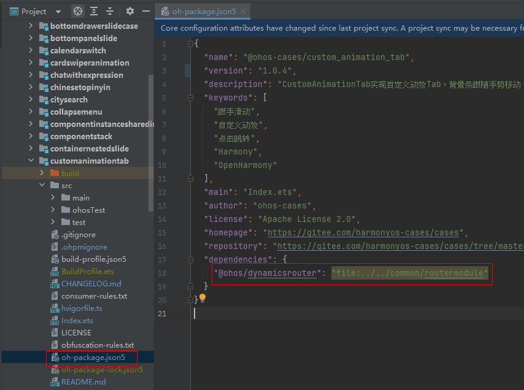

### 2.7. 配置FeatureComponent文件

&emsp;&emsp;删除原有的@AppRouter路由导航（如果有），在ets模块目录下新增FeatureComponent.ets文件, 在内部实现@AppRouter路由导航，并且将UI/样例组件导入进来。（其中@AppRouter的name字段设置为har包名/组件名）

&emsp;&emsp;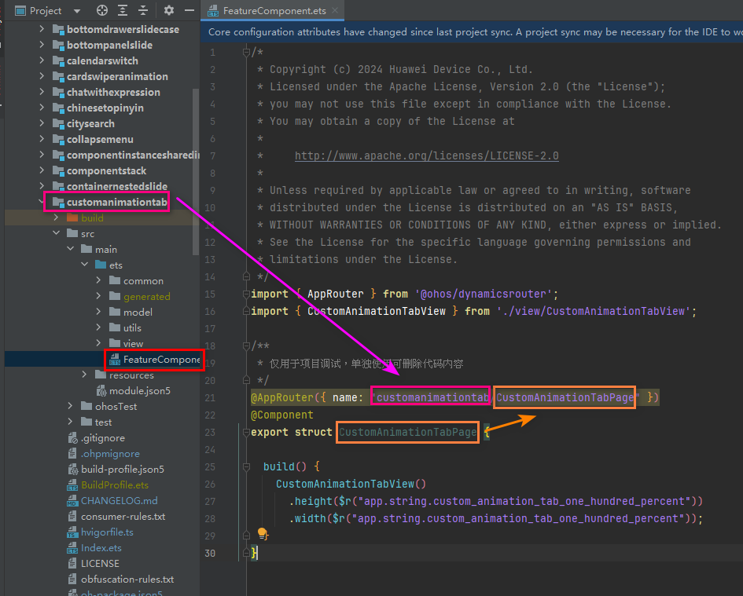

### 2.8. 配置hvigorfile文件

&emsp;&emsp;为hvigorfile文件添加配置，使其能够被动态路由导入。配置后，点击sync now会自动生成一个src/main/ets/generated/RouterBuilder文件。

&emsp;&emsp;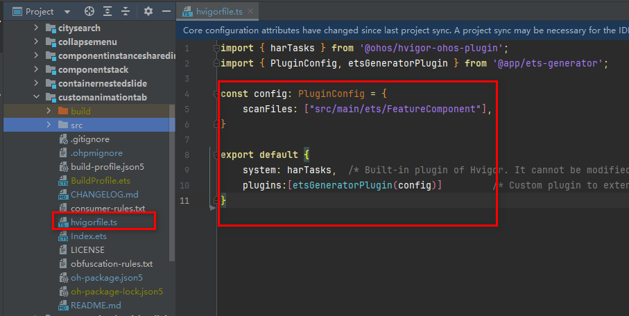

### 2.9. 导出UI/样例组件与RouterBuilder文件内容

&emsp;&emsp;额外将编写的RouterBuilder文件内容、UI/样例组件、核心组件以及自定义组件/类从Index.ets文件中导出。

&emsp;&emsp;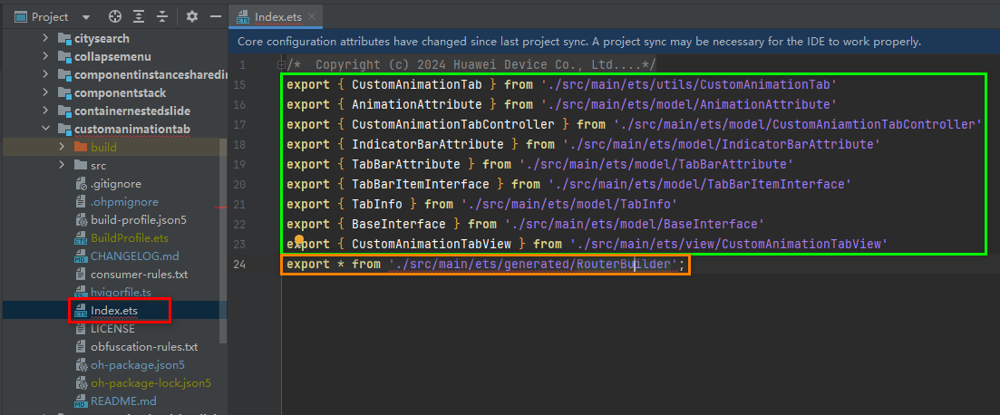

### 2.10. 录制gif并配置WaterFlowData文件

&emsp;&emsp;配置product目录下的WaterFlowData文件。首先录制案例使用的gif，添加到product的media目录下，文件名为har包名。其次，在product的WaterFlowData文件添加对应的配置项，格式如下。

```
new SceneModuleInfo(gif地址, 标题, @AppRouter的name字段, 案例类别, 开发难度)
```

&emsp;&emsp;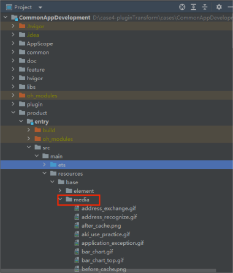

&emsp;&emsp;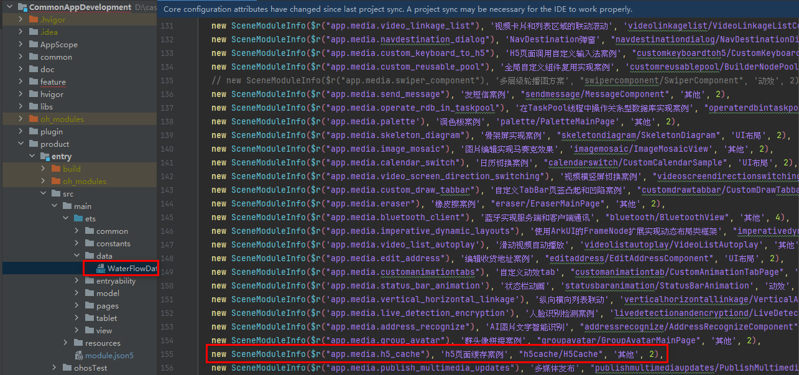

### 2.11. 配置根目录下的config.json文件

&emsp;&emsp;本节主要介绍了如何配置config.json文件，从而使组件可以展示在插件市场中，主要包括以下两个步骤：

&emsp;&emsp;1) 编写案例配置，配置字段如下所示。

```
{
  "name": "案例名称",
  "id": "案例Id(案例编号)",
  "image": "案例gif图case仓地址",
  "description": "案例描述",
  "codeInfo": {
    "casePath": "案例case仓地址",
    "caseRepositoriesInfo": "",
    "insertCode": "UI/样例组件(组件名后面要加上括号)",
    "importCode": "import { UI/样例组件名 } from 'har包名';",
    "codeAnnotation": "/**\n * 功能描述：README的介绍 \n * 参数介绍：一般填无\n * README：README地址\n */",
    "napi": false
  }
}
```

&emsp;&emsp;&emsp;&emsp;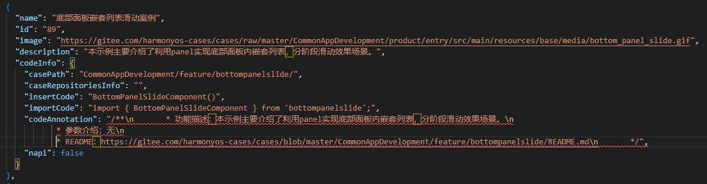

&emsp;&emsp;2) 寻找案例分类并将配置填写到对应类别下的repositoriesInfoList中。

&emsp;&emsp;&emsp;&emsp;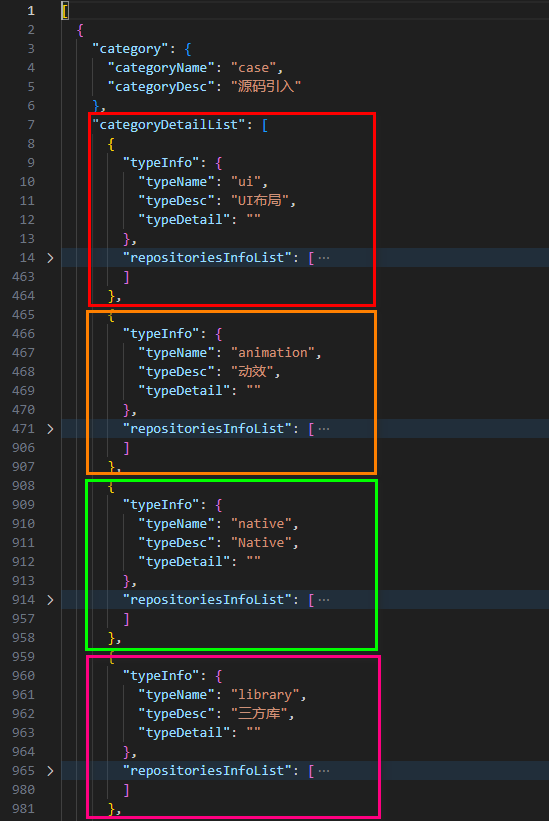

### 2.12. 检查清单

&emsp;&emsp;本节作为最终收尾，列举了案例代码实现后需要做的一些检查操作。

&emsp;&emsp;1) oh-package.json5文件是否引入了本地模块。（动态路由模块除外）

&emsp;&emsp;2) Index.ets文件是否导出了RouterBuilder文件内容、UI/样例组件、核心组件以及自定义组件/类。

&emsp;&emsp;3) 核心功能是否集成在了核心组件中，实现UI与核心功能分离。

&emsp;&emsp;4) 各种注释是否完备。

&emsp;&emsp;5) 核心组件内部是否尽可能初始化了对外暴露参数与接口。

&emsp;&emsp;6) config.json是否配置且正确。

&emsp;&emsp;7) README文件是否填写。

&emsp;&emsp;8) WaterFlowData配置是否正确。

&emsp;&emsp;9) 检查提交分支名是否只有一个。

&emsp;&emsp;10) har包中各种资源的字段名是否以案例名开头。

&emsp;&emsp;&emsp;&emsp;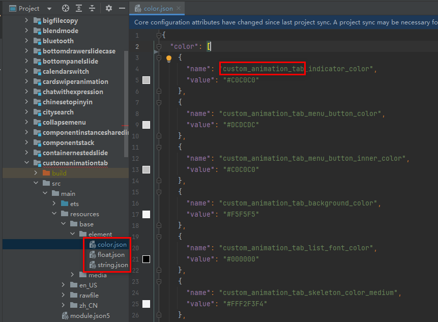