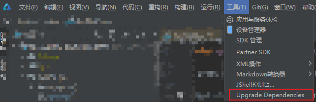
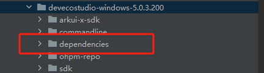
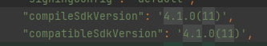
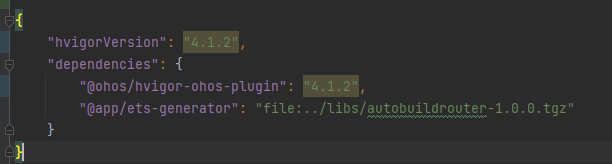
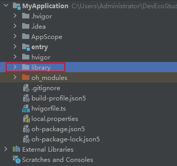
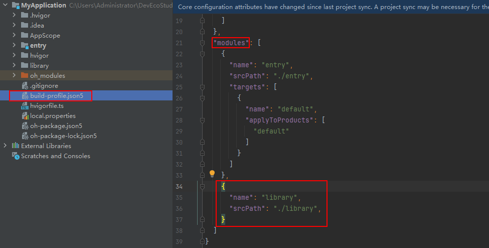
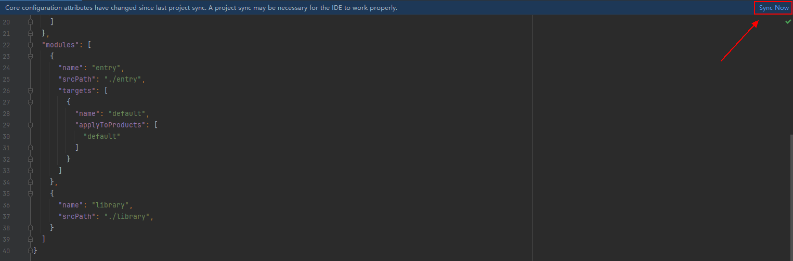
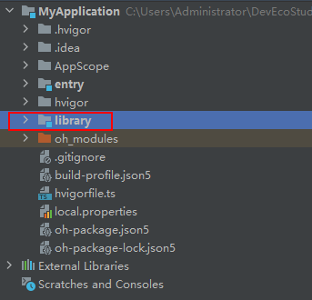
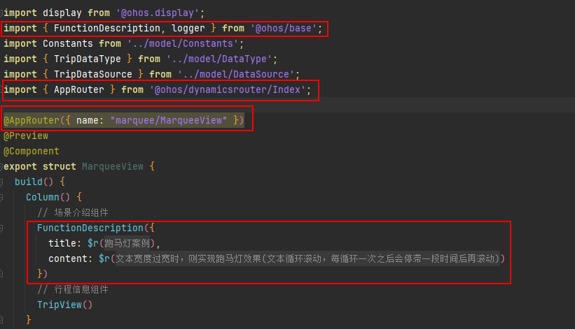
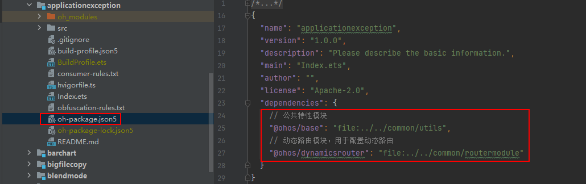

## 高频问题解答

### 环境搭建
#### 1、ENOENT：no such file or directory, open 'D:\cases-master\CommonAppDevelopment\dependencies\hvigor-ohos-plugin-4.1.2.tgz'

该问题原因是 hvigor-config.json5文件中配置文件与dependencies目录下的文件版本不匹配。  
解决办法：点击顶部工具栏的工具 -> UpgradeDependencies  
  
目录选定如下图：  
  
点击 'Upgrade'后可解决

#### 2、案例如何适配5.0.3.300以下版本的IDE?

5.0.3.300版本的IDE与之前版本的IDE都不兼容，需修改如下配置进行适配：  

1. 在build-profile.json5中的product里增加`compileSdkVersion`，如下：
    ```typescript
    {
      "name": "default",
      "signingConfig": "default",
      "compileSdkVersion": '5.0.0(12)',
      "compatibleSdkVersion": '5.0.0(12)',
      "runtimeOS": "HarmonyOS"
    }
    ```
2. 添加hvigorw文件：
    ```
    #!/bin/bash

    # ----------------------------------------------------------------------------
    #  Hvigor startup script, version 1.0.0
    #
    #  Required ENV vars:
    #  ------------------
    #    NODE_HOME - location of a Node home dir
    #    or
    #    Add /usr/local/nodejs/bin to the PATH environment variable
    # ----------------------------------------------------------------------------

    HVIGOR_APP_HOME="`pwd -P`"
    HVIGOR_WRAPPER_SCRIPT=${HVIGOR_APP_HOME}/hvigor/hvigor-wrapper.js
    warn() {
    	echo ""
    	echo -e "\033[1;33m`date '+[%Y-%m-%d %H:%M:%S]'`$@\033[0m"
    }

    error() {
    	echo ""
    	echo -e "\033[1;31m`date '+[%Y-%m-%d %H:%M:%S]'`$@\033[0m"
    }

    fail() {
    	error "$@"
    	exit 1
    }

    # Determine node to start hvigor wrapper script
    if [ -n "${NODE_HOME}" ];then
       EXECUTABLE_NODE="${NODE_HOME}/bin/node"
       if [ ! -x "$EXECUTABLE_NODE" ];then
           fail "ERROR: NODE_HOME is set to an invalid directory,check $NODE_HOME\n\nPlease set NODE_HOME in your environment to the location where your nodejs installed"
       fi
    else
       EXECUTABLE_NODE="node"
       which ${EXECUTABLE_NODE} > /dev/null 2>&1 || fail "ERROR: NODE_HOME is not set and not 'node' command found in your path"
    fi

    # Check hvigor wrapper script
    if [ ! -r "$HVIGOR_WRAPPER_SCRIPT" ];then
    	fail "ERROR: Couldn't find hvigor/hvigor-wrapper.js in ${HVIGOR_APP_HOME}"
    fi

    # start hvigor-wrapper script
    exec "${EXECUTABLE_NODE}" \
    	"${HVIGOR_WRAPPER_SCRIPT}" "$@"
    ```
3. 添加hvigorw.bat文件:
    ```bash
    @if "%DEBUG%" == "" @echo off
    @rem ##########################################################################
    @rem
    @rem  Hvigor startup script for Windows
    @rem
    @rem ##########################################################################

    @rem Set local scope for the variables with windows NT shell
    if "%OS%"=="Windows_NT" setlocal

    set DIRNAME=%~dp0
    if "%DIRNAME%" == "" set DIRNAME=.
    set APP_BASE_NAME=%~n0
    set APP_HOME=%DIRNAME%

    @rem Resolve any "." and ".." in APP_HOME to make it shorter.
    for %%i in ("%APP_HOME%") do set APP_HOME=%%~fi

    set WRAPPER_MODULE_PATH=%APP_HOME%\hvigor\hvigor-wrapper.js
    set NODE_EXE=node.exe

    goto start

    :start
    @rem Find node.exe
    if defined NODE_HOME goto findNodeFromNodeHome

    %NODE_EXE% --version >NUL 2>&1
    if "%ERRORLEVEL%" == "0" goto execute

    echo.
    echo ERROR: NODE_HOME is not set and no 'node' command could be found in your PATH.
    echo.
    echo Please set the NODE_HOME variable in your environment to match the
    echo location of your NodeJs installation.

    goto fail

    :findNodeFromNodeHome
    set NODE_HOME=%NODE_HOME:"=%
    set NODE_EXE_PATH=%NODE_HOME%/%NODE_EXE%

    if exist "%NODE_EXE_PATH%" goto execute
    echo.
    echo ERROR: NODE_HOME is not set and no 'node' command could be found in your PATH.
    echo.
    echo Please set the NODE_HOME variable in your environment to match the
    echo location of your NodeJs installation.

    goto fail

    :execute
    @rem Execute hvigor
    "%NODE_EXE%" "%WRAPPER_MODULE_PATH%" %*

    if "%ERRORLEVEL%" == "0" goto hvigorwEnd

    :fail
    exit /b 1

    :hvigorwEnd
    if "%OS%" == "Windows_NT" endlocal

    :end
    ```
4. 将oh-package.json5中的`"modelVersion": "5.0.0",`删除。

5. 将hvigor/hvigor-config.json5修改为当前工程的本地dependencies依赖（版本号与本地相同）：
    ```
    {
	    "hvigorVersion": "file:../dependencies/hvigor-4.3.0.tgz", 
	    "dependencies": {
	    	"@ohos/hvigor-ohos-plugin": "file:../dependencies/hvigor-ohos-plugin-4.3.0.tgz",
	    	"@app/ets-generator": "file:../libs/autobuildrouter-1.0.0.tgz"
	    }
    }
    ```
6. 根据提示同步hvigor和工程。

#### 3、案例如何适配4.1版本的IDE?

当前的案例适配为5.0.3.300版本的IDE, 使用 4.1.3.700版本的IDE 案例不能正常运行。  
解决方法，先按照2的操作修改，然后进行如下操作：  
build-profile.json5文中修改配置如下图：  
  
hvigor/hvigor-config.json5文件中修改配置如下图：  


### 案例相关

#### 1、如何将开发案例放入自己的构建的项目

当前工程的每一个案例都是一个Har包。如果需要将开发案例放入自己的项目，可在本地以Har包的形式引用，相关的配置项需要根据项目自行修改适配。

可参考如下链接：
https://developer.huawei.com/consumer/cn/doc/harmonyos-guides-V5/arkts-dynamic-import-V5

### 如何快速移植Feature模块

#### 通用场景移植方法

1. 首先需将Feature模块复制粘贴到目标工程子目录下。

   

2. 在工程子目录的**build-profile.json**文件内**modules**数组中添加Feature模块名称和路径。

   

3. 改变**build-profile.json**文件后，会弹出同步提示，请点击右上角的**Sync Now**按钮。

   

4. 可观察项目文件中Feature模块的图标是否变成图中样式，若是则迁移Feature模块成功。

   

#### Case案例移植方法

Case案例中很多Feature模块使用了基础库中的场景介绍模块和路由模块，使用上述方法移植后会出现因缺少引用文件导致编译报错的问题，需要开发者手动删除对基础库的引用。

1. 删除模块中基础库相关组件代码。

   

2. 删除模块根目录**oh-package.json5**文件**dependencies**字段对基础库的引用。

   
