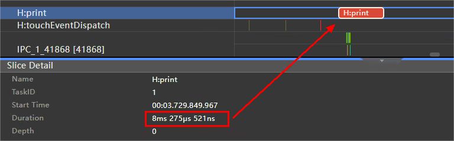
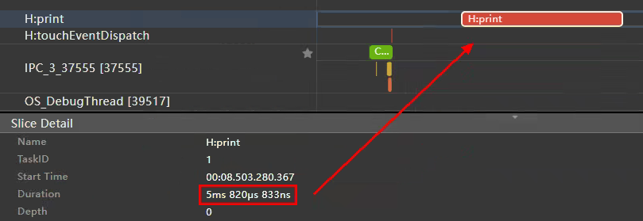

# HarmonyOS NEXT应用开发性能优化入门引导

## 概述

在开发HarmonyOS NEXT应用时，优化应用性能是至关重要的。本文将介绍应用开发过程中常见的一些性能问题，并提供相应的解决方案，配合相关参考示例，帮助开发者解决大部分性能问题。

我们把应用性能分析的方法划分为了**性能分析四板斧**，下面将介绍如何使用性能分析四板斧，解决应用开发过程中的性能问题。

* **第一板斧：合理使用并行化、预加载和缓存**，我们需要合理地使用并行化、预加载和缓存等方法，例如使用多线程并发、异步并发、Web预加载等能力，提升系统资源利用率，减少主线程负载，加快应用的启动速度和响应速度。

* **第二板斧：尽量减少布局的嵌套层数**，在进行页面布局开发时，应该去除冗余的布局嵌套，使用相对布局、绝对定位、自定义布局、Grid、GridRow等扁平化布局，减少布局的嵌套层数，避免系统绘制更多的布局组件，达到优化性能、减少内存占用的目的。

* **第三板斧：合理管理状态变量**，应该合理地使用状态变量，精准控制组件的更新范围，控制状态变量关联组件数量，控制对象级状态变量的成员变量关联组件数，减少系统的组件渲染负载，提升应用流畅度。

* **第四板斧：合理使用系统接口，避免冗余操作**，应该合理使用系统的高频回调接口，删除不必要的Trace和日志打印，避免注册系统冗余回调，减少系统开销。

## 第一板斧：合理使用并行化、预加载和缓存

我们需要合理地使用并行化、预加载和缓存等方法，提升系统资源利用率，减少主线程负载，加快应用的启动速度和响应速度。

### 使用并行化提升启动速度

自定义组件创建完成之后，在build函数执行之前，将先执行aboutToAppear()生命周期回调函数。此时若在该函数中执行耗时操作，将阻塞UI渲染，增加UI主线程负担。因此，应尽量避免在自定义组件的生命周期内执行高耗时操作。在aboutToAppear()生命周期函数内建议只做当前组件的初始化逻辑，对于不需要等待结果的高耗时任务，可以使用多线程处理该任务，通过并发的方式避免主线程阻塞；也可以把耗时操作改为异步并发或延后处理，保证主线程优先处理组件绘制逻辑。

#### 使用多线程执行耗时操作

在日常开发过程中经常会碰到这样的问题：主页的开发场景中有多个Tab页展示不同内容，在首次加载完主页后，切换到第二个Tab页时需要加载和处理网络数据，导致第二个Tab页的页面显示较慢，有较大的完成时延。

碰到此类问题，我们可以在生命周期aboutToAppear中，使用多线程并发、[高效并发编程](efficient-concurrent-programming.md)、[多线程能力场景化示例实践](multi_thread_capability.md)的方法执行第二个Tab页的网络数据访问解析、数据加载等耗时操作，既可以提前完成数据加载，也不会影响主线程UI绘制和渲染。

反例：

```ts
@Component
export struct PageOneCounter {
  @State private text: string = "";
  pathStack: NavPathStack = new NavPathStack();
  @State fontColor: string = '#182431';
  @State selectedFontColor: string = '#007DFF';
  @State currentIndex: number = 0;
  @State selectedIndex: number = 0;
  private controller: TabsController = new TabsController();

  loadPicture(count: number): IconItemSource[] {
    let iconItemSourceList: IconItemSource[] = [];
    // 遍历添加6*count个IconItem的数据
    for (let index = 0; index < count; index++) {
      const numStart: number = index * 6;
      // 此处循环使用6张图片资源
      iconItemSourceList.push(new IconItemSource($r('app.media.bigphoto'), `item${numStart + 1}`));
      iconItemSourceList.push(new IconItemSource($r('app.media.bigphoto'), `item${numStart + 2}`));
      iconItemSourceList.push(new IconItemSource($r('app.media.bigphoto'), `item${numStart + 3}`));
      iconItemSourceList.push(new IconItemSource($r('app.media.bigphoto'), `item${numStart + 4}`));
      iconItemSourceList.push(new IconItemSource($r('app.media.bigphoto'), `item${numStart + 5}`));
      iconItemSourceList.push(new IconItemSource($r('app.media.bigphoto'), `item${numStart + 6}`));
    }
    return iconItemSourceList;
  }
  
  // ...

  build() {
    NavDestination() {
      // ...
      Column() {
        Tabs({ barPosition: BarPosition.Start, index: this.currentIndex, controller: this.controller }) {
          // TabContent
          // ...
        }
		...
        .onContentWillChange((currentIndex, comingIndex) => {
          if (comingIndex == 1) {
            // 耗时操作
            this.loadPicture(100000); // 同步任务
            let context = getContext(this) as Context;
            this.text = context.resourceManager.getStringSync($r('app.string.startup_text'));
          }
          return true
        })
        ...
  }
}
```

正例：

```typescript
// 使用TaskPool进行耗时操作
@Component
export struct PageOnePositive {
  @State private text: string = "";
  pathStack: NavPathStack = new NavPathStack();
  @State fontColor: string = '#182431';
  @State selectedFontColor: string = '#007DFF';
  @State currentIndex: number = 0;
  @State selectedIndex: number = 0;
  private controller: TabsController = new TabsController();

  loadPicture(count: number): IconItemSource[] {
    let iconItemSourceList: IconItemSource[] = [];
    // 遍历添加6*count个IconItem的数据
    for (let index = 0; index < count; index++) {
      const numStart: number = index * 6;
      // 此处循环使用6张图片资源
      iconItemSourceList.push(new IconItemSource($r('app.media.bigphoto'), `item${numStart + 1}`));
      iconItemSourceList.push(new IconItemSource($r('app.media.bigphoto'), `item${numStart + 2}`));
      iconItemSourceList.push(new IconItemSource($r('app.media.bigphoto'), `item${numStart + 3}`));
      iconItemSourceList.push(new IconItemSource($r('app.media.bigphoto'), `item${numStart + 4}`));
      iconItemSourceList.push(new IconItemSource($r('app.media.bigphoto'), `item${numStart + 5}`));
      iconItemSourceList.push(new IconItemSource($r('app.media.bigphoto'), `item${numStart + 6}`));
    }
    return iconItemSourceList;
  }

  requestByTaskPool(): void {
    hiTraceMeter.startTrace("responseTime", 1002);
    // 耗时任务,TaskPool执行
    let iconItemSourceList: IconItemSource[] = [];
    // // 创建Task
    let lodePictureTask: taskpool.Task = new taskpool.Task(loadPicture, 100000);
    // 执行Task，并返回结果
    // 执行Task，并返回结果
    taskpool.execute(lodePictureTask).then((res: object) => {
      iconItemSourceList = res as IconItemSource[];
      iconItemSourceList = [];
      // loadPicture方法的执行结果
    })
    hiTraceMeter.finishTrace("responseTime", 1002);
  }

  // ...

  build() {
    NavDestination() {
      // ...
      Column() {
        Tabs({ barPosition: BarPosition.Start, index: this.currentIndex, controller: this.controller }) {
          // TabContent
          // ...
        }
		...
        .onContentWillChange((currentIndex, comingIndex) => {
          if (comingIndex == 1) {
            this.requestByTaskPool();
            let context = getContext(this) as Context;
            this.text = context.resourceManager.getStringSync($r('app.string.startup_text2'));
          }
          return true
        })
        ...
}
```

| 示例 | 响应时延 |
| :--: | :------: |
| 反例 | 679.8ms  |
| 正例 |  10.3ms  |

其他多线程并发相关文章：

* [利用native的方式实现跨线程调用](native-threads-call-js.md)


#### 使用异步执行耗时操作

问题：在aboutToAppear生命周期函数中，运行了业务数据解析和处理等耗时操作，影响了上一页面点击跳转该页面的响应时延。

可以把耗时操作的执行从同步执行改为异步或者延后执行，[提升应用冷启动速度](improve-application-cold-start-speed.md)，比如使用setTimeOut执行耗时操作。

反例：

```ts
const LARGE_NUMBER: number = 200000;

@Component
export struct PageTwoCounter {
  @State private text: string = "";
  pathStack: NavPathStack = new NavPathStack();
  private count: number = 0;

  aboutToAppear(): void {
    // 1.1反例：在aboutToAppear()、aboutToDisappear()等生命周期中执行耗时操作
    // 耗时操作
    this.computeTask(); // 同步任务
    let context = getContext(this) as Context;
    this.text = context.resourceManager.getStringSync($r('app.string.startup_text3'));
  }

  computeTask(): void {
    hiTraceMeter.startTrace("responseTime", 1002);
    this.count = 0;
    while (this.count < LARGE_NUMBER) {
      this.count++;
      hilog.info(0x0000, 'count', '%{public}s', JSON.stringify(this.count));
    }
    hiTraceMeter.finishTrace("responseTime", 1002);
  }

  build() {
    // 页面布局 
    // ...
  }
}
```

正例：

```typescript
const DELAYED_TIME: number = 100;
const LARGE_NUMBER: number = 200000;

@Component
export struct PageTwoPositive {
  @State message: string = 'Hello World';
  @State private text: string = "";
  pathStack: NavPathStack = new NavPathStack();
  private count: number = 0;

  aboutToAppear(): void {
    // 1.2正例：在aboutToAppear接口中对耗时间的计算任务进行了异步处理。
    // 耗时操作
    this.computeTaskAsync(); // 异步任务
    let context = getContext(this) as Context;
    this.text = context.resourceManager.getStringSync($r('app.string.startup_text4'));
  }

  computeTask(): void {
    hiTraceMeter.startTrace("responseTime", 1002);
    this.count = 0;
    while (this.count < LARGE_NUMBER) {
      this.count++;
      hilog.info(0x0000, 'count', '%{public}s', JSON.stringify(this.count));
    }
    hiTraceMeter.finishTrace("responseTime", 1002);
  }

  // 运算任务异步处理
  private computeTaskAsync(): void {
    setTimeout(() => {
      // 这里使用setTimeout来实现异步延迟运行
      this.computeTask();
    }, DELAYED_TIME)
  }

  build() {
    // 页面布局 
    // ...
  }
}
```

| 示例 | 响应时延 |
| :--: | :------: |
| 反例 |   3.1s   |
| 正例 |  11.3ms  |

### 使用预加载提升页面启动和响应速度

应该合理使用系统的预加载能力，例如Web组件的预连接、预加载、预渲染，使用List、Swiper、Grid、WaterFlow等组件的cachedCount属性实现预加载，使用条件渲染实现预加载）等，提升页面的启动和响应速度。

#### 使用Web组件的预连接、预加载、预渲染能力

当遇到Web页面加载慢的场景，可以使用Web组件的预连接、预加载、预渲染能力，使用[Web组件开发性能提升指导](performance-web-import.md)，在应用空闲时间提前进行Web引擎初始化和页面加载，提升下一页面的启动和响应速度。

反例：

```typescript
@Component
export struct PageThreeCounter {
  pathStack: NavPathStack = new NavPathStack();

  build() {
    NavDestination() {
      // ...
      Column() {
        Button('加载网页')
          .onClick(()=>{
            this.pathStack.pushDestination({ name: 'PageThreeWebComponent' })
          })
      }
      .justifyContent(FlexAlign.Center)
      .height('90%')
      .width('100%')
    }
    ...
  }
}

@Component
export struct PageThreeWebComponent{
  webviewController: webview.WebviewController = new webview.WebviewController();
  build() {
    NavDestination(){
      Web({ src: Constants.SAMPLE_HTML, controller: this.webviewController })
        .javaScriptAccess(true)
        .verticalScrollBarAccess(true)
        .onClick(() => {
          showToast();
        })
    }
    .hideTitleBar(true)

  }
}
```

正例：

```ts
@Component
export struct PageThreePositive {
  pathStack: NavPathStack = new NavPathStack();

  aboutToAppear(): void {
    // Web组件引擎初始化
    webview.WebviewController.initializeWebEngine();
    // 启动预连接，连接地址为即将打开的网址
    webview.WebviewController.prepareForPageLoad(Constants.SAMPLE_HTML, true, 2);
  }

  build() {
    NavDestination() {
      // ...
      Column() {
        Button('加载网页')
          .onClick(()=>{
            this.pathStack.pushDestination({ name: 'PageThreeWebComponent' })
          })
      }
      .justifyContent(FlexAlign.Center)
      .height('90%')
      .width('100%')
    }
    ...
  }
}

@Component
export struct PageThreeWebComponent{
  webviewController: webview.WebviewController = new webview.WebviewController();
  build() {
    NavDestination(){
      Web({ src: Constants.SAMPLE_HTML, controller: this.webviewController })
        .javaScriptAccess(true)
        .verticalScrollBarAccess(true)
        .onClick(() => {
          showToast();
        })
    }
    .hideTitleBar(true)
  }
}
```

| 示例 | 响应时延 |
| :--: | :------: |
| 反例 |  96.4ms  |
| 正例 |  12.6ms  |

#### 使用cachedCount属性实现预加载

推荐在使用List、Swiper、Grid、WaterFlow等组件时，配合使用cachedCount属性实现预加载，详情指导在[WaterFlow高性能开发指导](waterflow_optimization.md)、[Swiper高性能开发指导](swiper_optimization.md)、[Grid高性能开发指导](grid_optimization.md)、[列表场景性能提升实践](list-perf-improvment.md)。

反例：

```typescript
@Component
export struct PageFourCounter {
  @State message: string = 'Hello World';
  private momentData: FriendMomentsData = new FriendMomentsData();
  private readonly LIST_SPACE: number = 18;
  pathStack: NavPathStack = new NavPathStack();

  aboutToAppear(): void {
    this.momentData.getFriendMomentFromRawFile();
  }

  build() {
    NavDestination() {
      // ...
      Column() {
        List({ space: this.LIST_SPACE }) {
          LazyForEach(this.momentData, (moment: FriendMoment) => {
            ListItem() {
              OneMoment({ moment: moment })
            }
          }, (moment: FriendMoment) => moment.id)
        }
        .margin({ top: 8 })
        .width(Constants.LAYOUT_MAX)
        .height(Constants.LAYOUT_MAX)
      }
      ...
  }
}

@Component
export struct OneMoment {
  @Prop moment: FriendMoment;

  build() {
    Column() {
      // 子页面自定义布局
  }
}
```

正例：

```typescript
@Component
export struct PageFourPositive {
  @State message: string = 'Hello World';
  private momentData: FriendMomentsData = new FriendMomentsData();
  private readonly LIST_CACHE_COUNT: number = 5;
  private readonly LIST_SPACE: number = 18;
  pathStack: NavPathStack = new NavPathStack();

  aboutToAppear(): void {
    this.momentData.getFriendMomentFromRawFile();
  }

  build() {
    NavDestination() {
      // ...
      Column() {
        List({ space: this.LIST_SPACE }) {
          LazyForEach(this.momentData, (moment: FriendMoment) => {
            ListItem() {
              OneMoment({ moment: moment })// ReusId is used to control component reuse
                .reuseId((moment.image !== '') ? 'withImage_id' : 'noImage_id')
            }
          }, (moment: FriendMoment) => moment.id)
        }
        .cachedCount(this.LIST_CACHE_COUNT)
        .margin({ top: 8 })
        .width(Constants.LAYOUT_MAX)
        .height(Constants.LAYOUT_MAX)
      }
      ...
}

@Reusable
@Component
export struct OneMoment {
  @Prop moment: FriendMoment;

  build() {
    Column() {
      // 子页面自定义布局
  }
}
```

| 示例 | 帧率     | 丢帧率 |
| ---- | -------- | ------ |
| 反例 | 115.5fps | 3.75%  |
| 正例 | 119.4fps | 0.5%   |


#### 使用条件渲染实现预加载

问题：页面布局复杂度较高，导致跳转该页面的响应时延较高。

可以使用条件渲染的方式进行[合理选择条件渲染和显隐控制](proper-choice-between-if-and-visibility.md)，添加页面的简单骨架图作为默认展示页面，等数据加载完成后再显示最终的复杂布局，加快点击响应速度。

反例：

```typescript
@Component
export struct PageFiveCounter {
  @State loadingCollectedStatus: LoadingStatus = LoadingStatus.OFF;
  @State dataSource: LazyDataSource<Model> = new LazyDataSource();
  pathStack: NavPathStack = new NavPathStack();

  aboutToAppear() {
    this.loadList();
  }

  // 加载网络数据
  loadList() {
    // ...
  }

  build() {
    NavDestination() {
      // ...
      Column() {
        // 加载列表
        ListView({ listData: this.dataSource })
      }
      .justifyContent(FlexAlign.Center)
      .height('90%')
      .width('100%')
    }
    ...
  }
}
```

正例：

```ts
@Component
export struct PageFivePositive {
  @State loadingCollectedStatus: LoadingStatus = LoadingStatus.OFF;
  @State dataSource: LazyDataSource<Model> = new LazyDataSource();
  pathStack: NavPathStack = new NavPathStack();

  aboutToAppear() {
    this.loadList();
  }

  // 加载网络数据
  loadList() {
	// ...
  }

  build() {
    NavDestination() {
      // ...
      Column() {
        // TODO: 知识点：通过状态变量loadingCollectedStatus的变化，动态切换页面内容，显示骨架屏、正常内容、无数据或加载失败提示。
        if (this.loadingCollectedStatus === LoadingStatus.LOADING) {
          // 加载骨架屏
          LoadingView()
        } else if (this.loadingCollectedStatus === LoadingStatus.FAILED) {
          // 网络请求失败
          LoadingFailedView({
            handleReload: () => {
              this.loadList()
            }
          })
        } else if (this.dataSource.totalCount() === 0) {
          // 获取数据为空
          NoneContentView()
        } else {
          // 加载列表
          ListView({ listData: this.dataSource })
        }
      }
      .justifyContent(FlexAlign.Center)
      .height('90%')
      .width('100%')
    }
    ...
  }
}
```

| 示例 | 响应时延 |
| :--: | :------: |
| 反例 |  46.6ms  |
| 正例 |  41.9ms  |

### 使用缓存提升启动速度和滑动帧率

在列表场景中，我们推荐使用LazyForEach+组件复用+缓存列表项的能力，替代Scroll/ForEach实现滚动列表场景的实现，加快页面启动速度，提升滑动帧率；在一些属性动画的场景下，可以使用renderGroup缓存提升属性动画性能；也可以使用显隐控制对页面进行缓存，加快页面的显示响应速度。

#### 组件复用

HarmonyOS应用框架提供了组件复用能力，可复用组件从组件树上移除时，会进入到一个回收缓存区。后续创建新组件节点时，会复用缓存区中的节点，节约组件重新创建的时间。

若业务实现中存在以下场景，并成为UI线程的帧率瓶颈，推荐使用组件复用，具体指导在[组件复用实践](component-recycle.md)、[列表场景性能提升实践](list-perf-improvment.md)、[组件复用总览](component-reuse-overview.md)：

* 列表滚动（本例中的场景）：当应用需要展示大量数据的列表，并且用户进行滚动操作时，频繁创建和销毁列表项的视图可能导致卡顿和性能问题。在这种情况下，使用列表组件的组件复用机制可以重用已经创建的列表项视图，提高滚动的流畅度。
* 动态布局更新：如果应用中的界面需要频繁地进行布局更新，例如根据用户的操作或数据变化动态改变视图结构和样式，重复创建和销毁视图可能导致频繁的布局计算，影响帧率。在这种情况下，使用组件复用可以避免不必要的视图创建和布局计算，提高性能。
* 地图渲染：在地图渲染这种场景下，频繁创建和销毁数据项的视图可能导致性能问题。使用组件复用可以重用已创建的视图，只更新数据的内容，减少视图的创建和销毁，能有效提高性能。

反例：

```typescript
@Component
export struct PageSixCounter {
  @State loadingCollectedStatus: LoadingStatus = LoadingStatus.OFF;
  @State dataSource: LazyDataSource<Model> = new LazyDataSource();
  pathStack: NavPathStack = new NavPathStack();

  aboutToAppear() {
    this.loadList();
  }

  // 加载网络数据
  loadList() {
    // ...
  }

  build() {
    NavDestination() {
      // ...
      Column() {
        // 加载列表
        ListView({ listData: this.dataSource })
      }
      .justifyContent(FlexAlign.Center)
      .height('90%')
      .width('100%')
    }
	...
  }
}

@Component
export struct ListView {
  @Link listData: LazyDataSource<Model>;
  @State selectedId: number = -1; // 刚加载完成无选中状态

  build() {
    Column() {
      List({ space: CommonConstants.SPACE_12 }) {
        LazyForEach(this.listData, (item: Model) => {
          ListItem() {
            ItemView({ item: item, isSelected: this.selectedId === item.id })
          }
          .onClick(() => {
            this.selectedId = item.id;
            promptAction.showToast({ message: $r('app.string.ske_prompt_text') });
          })
        }, (item: Model) => item.id.toString())
      }
	  ...
    }
  }
}
    
@Component
export struct ItemView {
  @Prop item: Model;
  @Prop isSelected: boolean = false;

  // ...

  build() {
    // TODO: 知识点：相对布局组件，用于复杂场景中元素对齐的布局，容器内子组件区分水平方向，垂直方向子组件可以将容器或者其他子组件设为锚点。
    RelativeContainer() {
      Row() {
        Column() {
          // 列表item布局
        }
      }
    }
    ...
  }
}
```

正例：

```ts
@Component
export struct PageSixPositive {
  @State loadingCollectedStatus: LoadingStatus = LoadingStatus.OFF;
  @State dataSource: LazyDataSource<Model> = new LazyDataSource();
  pathStack: NavPathStack = new NavPathStack();

  aboutToAppear() {
    this.loadList();
  }

  // 加载网络数据
  loadList() {
    // ...
  }

  build() {
    NavDestination() {
      // ...
      Column() {
        ReusableListView({ listData: this.dataSource })
      }
      .justifyContent(FlexAlign.Center)
      .height('90%')
      .width('100%')
    }
	...
  }
}
    
@Component
export struct ReusableListView {
  @Link listData: LazyDataSource<Model>;
  @State selectedId: number = -1; // 刚加载完成无选中状态

  build() {
    Column() {
      List({ space: CommonConstants.SPACE_12 }) {
        LazyForEach(this.listData, (item: Model) => {
          ListItem() {
            ReusableItemView({ item: item, isSelected: this.selectedId === item.id })
          }
          .onClick(() => {
            this.selectedId = item.id;
            promptAction.showToast({ message: $r('app.string.ske_prompt_text') });
          })
        }, (item: Model) => item.id.toString())
      }
	  ...
    }
  }
}

@Reusable
@Component
export struct ReusableItemView {
  @State item: Model | undefined = undefined;
  @State isSelected: boolean = false;

  aboutToReuse(params: ESObject): void {
    this.item = params.item;
    this.isSelected = params.isSelected;
  }
  
  // ...

  build() {
    // TODO: 知识点：相对布局组件，用于复杂场景中元素对齐的布局，容器内子组件区分水平方向，垂直方向子组件可以将容器或者其他子组件设为锚点。
    RelativeContainer() {
      Row() {
        Column() {
          // 列表item布局
        }
      }
    }
    ...
  }
}
```

| 示例 | 懒加载时BuildLazyItem平均时间 |
| :--: | :---------------------------: |
| 反例 |             3.5ms             |
| 正例 |              2ms              |

#### 使用renderGroup缓存提升属性动画性能

页面响应时，可能大量使用属性动画和转场动画，当复杂度达到一定程度之后，就有可能出现卡顿的情况。[renderGroup](reasonable-using-renderGroup.md)是组件通用方法，它代表了渲染绘制的一个组合。

具体原理是在首次绘制组件时，若组件被标记为启用renderGroup状态，将对组件及其子组件进行离屏绘制，将绘制结果合并保存到缓存中。此后当需要重新绘制相同组件时，就会优先使用缓存而不必重新绘制了，从而降低绘制负载，进而加快响应速度。

反例：

```typescript
@Component
export struct PageSevenCounter {
  pathStack: NavPathStack = new NavPathStack();
  private iconItemSourceList: IconItemSource[] = [];

  aboutToAppear() {
    // 遍历添加60个IconItem的数据
  }

  build() {
    NavDestination() {
      // ...
      Column() {
        ...
        // IconItem放置在grid内
        GridRow({
          // ...
        }) {
          ForEach(this.iconItemSourceList, (item: IconItemSource) => {
            GridCol() {
              IconItem({ renderGroupFlag: false, image: item.image, text: item.text })
                .transition(
                  TransitionEffect.scale({ x: 0.5, y: 0.5 })
                    .animation({ duration: 3000, curve: Curve.FastOutSlowIn, iterations: -1 })
                    .combine(TransitionEffect.rotate({ z: 1, angle: 360 })
                      .animation({ duration: 3000, curve: Curve.Linear, iterations: -1 }))
                )
            }
            ...
  }
}

@Component
export struct IconItem {
  renderGroupFlag: boolean = false;
  image: string | Resource = '';
  text: string | Resource = '';

  build() {
    Flex({
      direction: FlexDirection.Column,
      justifyContent: FlexAlign.Center,
      alignContent: FlexAlign.Center
    }) 
    ...
    //  在IconItem内调用renderGroup，true为开启，false为关闭
    .renderGroup(this.renderGroupFlag)
  }
}
```

正例：

```ts
@Component
export struct PageSevenPositive {
  pathStack: NavPathStack = new NavPathStack();
  private iconItemSourceList: IconItemSource[] = [];

  aboutToAppear() {
    // 遍历添加60个IconItem的数据
  }

  build() {
    NavDestination() {
      // ...
      Column() {
		// ...
        // IconItem放置在grid内
        GridRow({
          // ...
        }) {
          ForEach(this.iconItemSourceList, (item: IconItemSource) => {
            GridCol() {
              IconItem({ renderGroupFlag: true, image: item.image, text: item.text })
                .transition(
                  TransitionEffect.scale({ x: 0.5, y: 0.5 })
                    .animation({ duration: 3000, curve: Curve.FastOutSlowIn, iterations: -1 })
                    .combine(TransitionEffect.rotate({ z: 1, angle: 360 })
                      .animation({ duration: 3000, curve: Curve.Linear, iterations: -1 }))
                )
            }
            ...
  }
}
                  
@Component
export struct IconItem {
  renderGroupFlag: boolean = false;
  image: string | Resource = '';
  text: string | Resource = '';

  build() {
    Flex({
      direction: FlexDirection.Column,
      justifyContent: FlexAlign.Center,
      alignContent: FlexAlign.Center
    }) 
    ...
    //  在IconItem内调用renderGroup，true为开启，false为关闭
    .renderGroup(this.renderGroupFlag)
  }
}
```

| 示例 | 丢帧率 | CPU使用率 | GPU使用率 |
| :--: | :----: | :-------: | :-------: |
| 反例 | 52.3%  |  17.22%   |    55%    |
| 正例 |   0%   |  10.86%   |    16%    |


#### 使用显隐控制进行页面缓存

控制元素显示与隐藏是一种常见的场景，使用Visibility.None、if条件判断等都能够实现该效果。其中if条件判断控制的是组件的创建、布局阶段，Visibility属性控制的是元素在布局阶段是否参与布局渲染。使用时如果使用的方式不当，将引起性能上的问题。
如果会频繁响应显示与隐藏的交互效果，建议使用切换Visibility.None和Visibility.Visible来[合理控制元素显示与隐藏](proper-choice-between-if-and-visibility.md)，在组件无需展示的时候进行缓存，提高性能。

反例：

```typescript
@Component
export struct PageEightCounter {
  pathStack: NavPathStack = new NavPathStack();
  @State isVisible: boolean = true;
  private data: Resource[] = [];

  build() {
    NavDestination() {
      // ...
      Column() {
        Button('显隐切换')
          .onClick(() => {
            this.isVisible = !(this.isVisible);
          })
          .width('100%')
        if (this.isVisible) { // 使用条件渲染切换，会频繁创建与销毁组件
          Scroll() {
            Column() {
              ForEach(this.data, (item: Resource) => {
                Image(item)
              }, (item: number, index: number) => (item + index).toString())
            }
          }
        }
      }
      ...
  }
}
```

正例：

```ts
@Component
export struct PageEightPositive {
  pathStack: NavPathStack = new NavPathStack();
  @State isVisible: boolean = true;
  private data: Resource[] = [];

  build() {
    NavDestination() {
      // ...
      Column() {
        Button('显隐切换')
          .onClick(() => {
            this.isVisible = !(this.isVisible);
          })
          .width('100%')
        Scroll() {
          Column() {
            ForEach(this.data, (item: Resource) => {
              Image(item)
            }, (item: number, index: number) => (item + index).toString())
          }
        }
        .visibility(this.isVisible ? Visibility.Visible : Visibility.None)
      }
      ...
  }
}
```

| 示例 | 核心函数ForEach耗时 |
| :--: | :-----------------: |
| 反例 |         1s          |
| 正例 |         2ms         |


## 第二板斧：尽量减少布局的嵌套层数

在进行页面布局开发时，应该去除冗余的布局嵌套，使用相对布局、绝对定位、自定义布局、Grid、GridRow等扁平化布局，减少布局的嵌套层数，避免系统绘制更多的布局组件，达到[优化布局性能](reduce-view-nesting-levels.md)、减少内存占用的目的。

### 移除冗余节点

应该删除冗余的布局嵌套，例如build最外层的无用容器嵌套、无用的Stack或Column嵌套等，减少布局层数。

#### 删除无用的Stack/Column/Row嵌套

例如可能会在Row容器包含一个同样也是Row容器的子级。这种嵌套实际是多余的，并且会给布局层次结构造成不必要的开销。

反例：

```typescript
@Component
export struct PageNineCounter {
  pathStack: NavPathStack = new NavPathStack();
  private data: number[] = [];

  build() {
    NavDestination() {
      // ...
      Column() {
        Column() {
          Column() {
            Row() {
              Row() {
                ForEach(this.data, (item: number) => {
                  Text(item.toString())
                })
              }
              ForEach(this.data, (item: number) => {
                Text(item.toString())
              })
            }
          }
        }
      }
      ...
  }
}
```

正例：

```ts
@Component
export struct PageNinePositive {
  pathStack: NavPathStack = new NavPathStack();
  private data: number[] = [];

  build() {
    NavDestination() {
      // ...
      Column() {
        Row() {
          ForEach(this.data, (item: number) => {
            Text(item.toString())
          })
          ForEach(this.data, (item: number) => {
            Text(item.toString())
          })
        }
      }
 	  ...
  }
}
```

| 示例 | ArkUI Inspector层数 |
| :--: | :-----------------: |
| 反例 |          6          |
| 正例 |          3          |


#### 删除build函数中最外层无用容器嵌套

在开发过程中，布局的实现往往嵌套使用大量的自定义组件，build中冗余的最外层无用容器会大大增强嵌套层级，应该删除。

反例代码如下：

```typescript
@Component
struct SubComponent {
  build() {
    Column() {
      Text('这是子组件');
    }
  }
}

@Component
export struct PageTenCounter {
  pathStack: NavPathStack = new NavPathStack();

  build() {
    NavDestination() {
      // ...
      Column() {
        SubComponent()
      }
      .width('100%')
      .height('100%')
      .alignItems(HorizontalAlign.Center)
    }
    ...
  }
}
```

正例代码如下：

```typescript
@Component
struct SubComponent {
  build() {
    Text('这是子组件');
  }
}

@Component
export struct PageTenPositive {
  pathStack: NavPathStack = new NavPathStack();

  build() {
    NavDestination() {
      // ...
      Column() {
        SubComponent()
      }
      .width('100%')
      .height('100%')
      .alignItems(HorizontalAlign.Center)
    }
    ...
  }
}
```

| 示例 | ArkUI Inspector层数 |
| :--: | :-----------------: |
| 反例 |          4          |
| 正例 |          3          |

### 使用扁平化布局减少节点数

#### 使用Column/Row替代Flex构建线性布局

由于Flex本身带来的二次布局的影响，Flex的性能明显低于Column和Row容器，因此推荐使用Column/Row替代Flex构建线性布局，具体指导在[Flex布局性能提升使用指导](flex-development-performance-boost.md)。

反例代码如下：

```typescript
@Component
export struct PageElevenCounter {
  pathStack: NavPathStack = new NavPathStack();

  build() {
    NavDestination() {
      // ...
      Column() {
        Flex({ direction: FlexDirection.Column }) {
          Flex().width(300).height(200).backgroundColor(Color.Pink)
          Flex().width(300).height(200).backgroundColor(Color.Yellow)
          Flex().width(300).height(200).backgroundColor(Color.Grey)
        }
      }
      .width('100%')
      .height('100%')
      .alignItems(HorizontalAlign.Center)
    }
    ...
  }
}
```

正例代码如下：

```typescript
@Component
export struct PageElevenPositive {
  pathStack: NavPathStack = new NavPathStack();

  build() {
    NavDestination() {
      // ...
      Column() {
        Column() {
          Row().width(300).height(200).backgroundColor(Color.Pink)
          Row().width(300).height(200).backgroundColor(Color.Yellow)
          Row().width(300).height(200).backgroundColor(Color.Grey)
        }
      }
      .width('100%')
      .height('100%')
      .alignItems(HorizontalAlign.Center)
    }
    ...
  }
}
```

| 示例 |           measure时间           |
| :--: | :-----------------------------: |
| 反例 | 227.6μs（Flex组件measure时间）  |
| 正例 | 49.5μs（Column组件measure时间） |


#### 使用Flex、List、Grid、RelativeContainer、绝对布局和自定义布局等构建复杂布局

复杂布局提供了场景化的能力，[优化布局性能](reduce-view-nesting-levels.md)可解决一种或者多种布局场景：

* 使用Flex构建弹性布局；
* List既具备线性布局的特点，同时支持懒加载和滑动的能力；
* Grid/GridItem提供了宫格布局的能力，同时也支持懒加载和滑动能力；
* RelativeContainer是一种相对布局，通过描述各个内容组件间相互关系来指导内容元素的布局过程，可从横纵两个方面进行布局描述，是一种二维布局算法。

反例代码如下：

```typescript
@Component
export struct PageTwelveCounter {
  pathStack: NavPathStack = new NavPathStack();
  @State children: Number[] = Array.from(Array<number>(900), (v, k) => k);
  
  build() {
    NavDestination() {
      // ...
      Column() {
        Scroll() {
          Grid() {
            ForEach(this.children, (item: Number[]) => {
              GridItem() {
                Stack() {
                  Stack() {
                    Stack() {
                      Text(item.toString())
                    }.size({ width: "100%"})
                  }.backgroundColor(Color.Yellow)
                }.backgroundColor(Color.Pink)
              }
            }, (item: string) => item)
          }
          .columnsTemplate('1fr 1fr 1fr 1fr')
          .columnsGap(0)
          .rowsGap(0)
          .size({ width: "100%", height: "100%" })
        }
      }
      ...
  }
}
```

正例代码如下：

```typescript
@Component
export struct PageTwelvePositive {
  pathStack: NavPathStack = new NavPathStack();
  @State children: Number[] = Array.from(Array<number>(900), (v, k) => k);
  
  build() {
    NavDestination() {
      // ...
      Column() {
        Scroll() {
          Grid() {
            ForEach(this.children, (item: Number[]) => {
              GridItem() {
                Text(item.toString())
              }.backgroundColor(Color.Yellow)
            }, (item: string) => item)
          }
          .columnsTemplate('1fr 1fr 1fr 1fr')
          .columnsGap(0)
          .rowsGap(0)
          .size({ width: "100%", height: "100%" })
        }
      }
      ...
  }
}
```

| 示例 | 响应时延 |
| :--: | :------: |
| 反例 | 424.2ms  |
| 正例 | 233.2ms  |


## 第三板斧：合理管理状态变量

应该合理地使用状态变量，[精准控制组件的更新范围](precisely-control-render-scope.md)，控制状态变量关联组件数量上限，控制对象级状态变量的成员变量关联组件数，减少系统的组件渲染负载，提升应用流畅度。

### 精准控制组件的更新范围

在复杂页面开发的场景下，精准控制组件更新的范围对提高应用运行性能尤为重要。应该避免状态变量的滥用引起的容器组件的刷新，进而影响帧率。

#### 使用指定宽高的容器限制刷新范围

当在一个同时指定宽高的容器里改变容器内部的布局，那么只会在该容器内部做布局和测量更新，不会扩散影响到容器外面的组件。

反例代码如下：

```typescript
@Component
export struct PageThirteenCounter {
  pathStack: NavPathStack = new NavPathStack();
  @State isVisible: boolean = true;
  @State data: Number[] = Array.from(Array<number>(10), (v, k) => k);

  build() {
    NavDestination() {
      // ...
      Column() {
        Button('Switch Hidden and Show').onClick(() => {
          this.isVisible = !this.isVisible;
        })

        Stack() {
          if (this.isVisible) {
            Text('New Page').width(100).height(30).backgroundColor(0xd2cab3)
          }
        }.width(100) // 本案例以Stack容器为例，只指定了宽，会触发父容器组件重新布局计算，引起ForEach中文本测量。

        ForEach(this.data, (item: number) => { // 由于Stack容器没有同时指定宽高，会扩散影响到这一层，引起Text的测量更新。
          Text(`Item value: ${item}`)
            .fontSize(20)
            .width('100%')
            .textAlign(TextAlign.Center)
        }, (item: number) => item.toString())
      }
      ...
  }
}
```

正例代码如下：

```typescript
@Component
export struct PageThirteenPositive {
  pathStack: NavPathStack = new NavPathStack();
  @State isVisible: boolean = true;
  @State data: Number[] = Array.from(Array<number>(10), (v, k) => k);

  build() {
    NavDestination() {
      // ...
      Column() {
        Button('Switch Hidden and Show').onClick(() => {
          this.isVisible = !this.isVisible;
        })

        Stack() {
          if (this.isVisible) {
            Text('New Page').width(100).height(30).backgroundColor(0xd2cab3)
          }
        }.width(100).height(30) // 在指定宽高的Stack容器内，内部的Text组件变化只会在容器内部做布局和测量更新，不会影响到容器外ForEach中的Text组件。
        ForEach(this.data, (item: number) => { // Stack容器指定了宽高，不会影响到这一层兄弟节点
          Text(`Item value: ${item}`)
            .fontSize(20)
            .width('100%')
            .textAlign(TextAlign.Center)
        }, (item: number) => item.toString())
      }
	  ...
  }
}
```
反例代码中最外层Column会重新计算绘制，正例代码中只重新绘制了Stack。

| 示例 | measure+layout |
| :--: | :------------: |
| 反例 |    813.5μs     |
| 正例 |     88.5μs     |

#### 减少不必要的参数层次传递

@State+@Prop、@State+@Link、@State+@Observed+@ObjectLink三种方案的实现方式是逐级向下传递状态，当共享状态的组件间层级相差较大时，会出现状态层层传递的现象。对于没有使用该状态的中间组件而言，这是“额外的消耗”。因此，对于跨越多层的状态变量传递，使用@Provide+@Consume方案更为合理。

反例代码如下：

```typescript
// 子组件
@Component
struct componentSon{
  // 获取传递参数
  @Prop data: Data;

  build() {
    Column() {
      Text(this.data.text)
      componentGrandSon({ data: this.data })
    }
  }
}

@Component
struct componentGrandSon{
  // 获取传递参数
  @Prop data: Data;

  build() {
    Column() {
      Text(this.data.text)
    }
  }
}

@Component
export struct PageFourteenCounter {
  pathStack: NavPathStack = new NavPathStack();
  @State data: Data = {
    text: '需要传递的数据'
  };

  build() {
    NavDestination() {
      // ...
      Column() {
        componentSon({ data: this.data })
      }
      .width('100%')
      .height('100%')
      .alignItems(HorizontalAlign.Center)
    }
    ...
  }
}
```

正例代码如下：

```typescript
// 子组件
@Component
struct componentSon{
  // 获取传递参数
  @Consume("data") data: Data;

  build() {
    Column() {
      Text(this.data.text)
      componentGrandSon()
    }
  }
}

@Component
struct componentGrandSon{
  // 获取传递参数
  @Consume("data") data: Data;

  build() {
    Column() {
      Text(this.data.text)
    }
  }
}

@Component
export struct PageFourteenPositive {
  pathStack: NavPathStack = new NavPathStack();
  @Provide('data') data: Data = {
    text: '需要传递的数据'
  };

  build() {
    NavDestination() {
      // ...
      Column() {
        componentSon()
      }
      .width('100%')
      .height('100%')
      .alignItems(HorizontalAlign.Center)
    }
    ...
  }
}
```

| 示例 | builder方法耗时 |
| :--: | :-------------: |
| 反例 |      1.1ms      |
| 正例 |      547μs      |

#### 避免滥用@Provide+@Consume

在父子组件关联的场景下，@Provide+@Consume开销要大于@State+@Prop/@Link，因此在该场景下推荐使用@State+@Prop/@Link的组合。

反例代码如下：

```typescript
// 子组件
@Component
struct componentSon{
  // 获取传递参数
  @Consume("data") data: Data;

  build() {
    Column() {
      Text(this.data.text)
    }
  }
}

@Component
export struct PageFifteenCounter {
  pathStack: NavPathStack = new NavPathStack();
  @Provide("data") data: Data = {
    text: '需要传递的数据'
  };

  build() {
    NavDestination() {
      // ...
      Column() {
        componentSon()
      }
      .width('100%')
      .height('100%')
      .alignItems(HorizontalAlign.Center)
    }
    ...
  }
}
```

正例代码如下：

```typescript
// 子组件
@Component
struct componentSon {
  // 获取传递参数
  @Prop data: Data;

  build() {
    Column() {
      Text(this.data.text)
    }
  }
}

@Component
export struct PageFifteenPositive {
  pathStack: NavPathStack = new NavPathStack();
  @State data: Data = {
    text: '需要传递的数据'
  };

  build() {
    NavDestination() {
      // ...
      Column() {
        componentSon({ data: this.data })
      }
      .width('100%')
      .height('100%')
      .alignItems(HorizontalAlign.Center)
    }
    ...
  }
}
```

| 示例 | builder方法耗时 |
| :--: | :-------------: |
| 反例 |      973μs      |
| 正例 |      572μs      |

### 精准控制状态变量关联组件数量

应该控制状态变量关联的组件数量，如果一个状态关联过多的组件，当这个变量更新时会引起过多的组件重新绘制渲染，建议关联数量限制在20个以内，达到[精准控制组件的更新范围](precisely-control-render-scope.md)。

#### 控制状态变量关联组件数量

反例代码如下：

```typescript
@Observed
class Translate {
  translateX: number = 20;
}

@Component
struct Title {
  @ObjectLink translateObj: Translate;

  build() {
    Row() {
      Image($r('app.media.startIcon'))
        .translate({
          x: this.translateObj.translateX // this.translateObj.translateX used in two component both in Row
        })
        .height(200)
        .width(200)
      Text("Title")
        .translate({
          x: this.translateObj.translateX
        })
    }
  }
}

@Component
export struct PageSixteenCounter {
  pathStack: NavPathStack = new NavPathStack();
  @State translateObj: Translate = new Translate();

  build() {
    NavDestination() {
      // ...
      Column() {
        Column() {
          Title({
            translateObj: this.translateObj
          })
          Stack() {
          }
          .translate({
            x: this.translateObj.translateX // this.translateObj.translateX used in two components both in Column
          })

          Button("move")
            .translate({
              x: this.translateObj.translateX
            })
            .onClick(() => {
              animateTo({
                duration: 50
              }, () => {
                this.translateObj.translateX = (this.translateObj.translateX + 50) % 150
              })
            })
        }
      }
      ...
  }
}
```

正例代码如下：

```typescript
@Observed
class Translate {
  translateX: number = 20;
}
@Component
struct Title {
  build() {
    Row() {
      Image($r('app.media.startIcon'))
        .height(200)
        .width(200)
      Text("Title")
    }
  }
}

@Component
export struct PageSixteenPositive {
  pathStack: NavPathStack = new NavPathStack();
  @State translateObj: Translate = new Translate();

  build() {
    NavDestination() {
      // ...
      Column() {
        Column() {
          Title()
          Stack() {
          }
          Button("move")
            .onClick(() => {
              animateTo({
                duration: 50
              }, () => {
                this.translateObj.translateX = (this.translateObj.translateX + 50) % 150
              })
            })
        }
        .translate({ // the component in Column shares the same property translate
          x: this.translateObj.translateX
        })
      }
      ...
  }
}
```

| 示例 | FlushDirtyNodeUpdate耗时 | CustomNodeUpdate次数 |
| :--: | :----------------------: | :------------------: |
| 反例 |         856.7μs          |          2           |
| 正例 |          238μs           |          1           |


#### 控制对象级状态变量成员数量

应该控制对象级状态变量的成员变量关联的组件数量。开发者封装一个数据结构类用于进行状态变量关联时，应该避免过多的成员变量关联大量ArkUI组件，这种情况下，当这个大对象的一个成员变量更新时，会导致所有关联这个大对象的组件都同时进行刷新，造成不必要的性能损耗，从而影响帧率。

反例代码如下：

```typescript
@Observed
class AnimationParams {
  translateX: number = 0;
  translateY: number = 0;
  alpha: number = 1;
  rotationX: number = 0;
  rotationY: number = 0;
  centerX: number = 0;
  centerY: number = 0;
  angle: number = 0;
  scaleX: number = 1;
  scaleY: number = 1;
}

@Component
export struct PageSeventeenCounter {
  pathStack: NavPathStack = new NavPathStack();
  @State animationParam: AnimationParams = new AnimationParams();

  build() {
    NavDestination() {
      // ...
      Column() {
        Column() {
          Row() {
            Image($r('app.media.startIcon'))
              .translate({
                x: this.animationParam.translateX,
                y: this.animationParam.translateY
              })
              .rotate({
                x: this.animationParam.rotationX,
                y: this.animationParam.translateY,
                centerX: this.animationParam.centerX,
                centerY: this.animationParam.centerY,
                angle: this.animationParam.angle
              })
              .opacity(this.animationParam.alpha)
              .scale({
                x: this.animationParam.scaleX,
                y: this.animationParam.scaleY,
                centerX: this.animationParam.centerX,
                centerY: this.animationParam.centerY
              })
              .animation({
                duration: 3000
              })
              .height(200)
              .width(200)
          }

          Button('点击播放动画')
            .onClick(() => {
              this.animationParam.translateX = 300;
              this.animationParam.translateY = 200;
              this.animationParam.rotationX = 90;
              this.animationParam.rotationY = 90;
              this.animationParam.centerX = 20;
              this.animationParam.centerY = 20;
              this.animationParam.angle = 270;
              this.animationParam.alpha = 0.5;
              this.animationParam.scaleX = 3;
              this.animationParam.scaleY = 3;
            })
        }
      }
      .width('100%')
      .height('100%')
      .alignItems(HorizontalAlign.Center)
    }
    ...
  }
}
```

正例代码如下：

```typescript
@Observed
class RotationAnimationParams {
  rotationX: number = 0;
  rotationY: number = 0;
  centerX: number = 0;
  centerY: number = 0;
  angle: number = 0;
}

@Observed
class TranslateAnimationParams {
  translateX: number = 0;
  translateY: number = 0;
}

@Observed
class AlphaAnimationParams {
  alpha: number = 1;
}

@Observed
class ScaleAnimationParams {
  scaleX: number = 1;
  scaleY: number = 1;
  centerX: number = 0;
  centerY: number = 0;
}


@Component
export struct PageSeventeenPositive {
  pathStack: NavPathStack = new NavPathStack();
  @State rotationAnimation: RotationAnimationParams = new RotationAnimationParams();
  @State translateAnimation: TranslateAnimationParams = new TranslateAnimationParams();
  @State alphaAnimation: AlphaAnimationParams = new AlphaAnimationParams();
  @State scaleAnimation: ScaleAnimationParams = new ScaleAnimationParams();

  build() {
    NavDestination() {
      // ...
      Column() {
        Column() {
          Row() {
            Image($r('app.media.startIcon'))
              .translate({
                x: this.translateAnimation.translateX,
                y: this.translateAnimation.translateY
              })
              .rotate({
                x: this.rotationAnimation.rotationX,
                y: this.rotationAnimation.rotationY,
                centerX: this.rotationAnimation.centerX,
                centerY: this.rotationAnimation.centerY,
                angle: this.rotationAnimation.angle
              })
              .opacity(this.alphaAnimation.alpha)
              .scale({
                x: this.scaleAnimation.scaleX,
                y: this.scaleAnimation.scaleY,
                centerX: this.scaleAnimation.centerX,
                centerY: this.scaleAnimation.centerY
              })
              .animation({
                duration: 3000
              })
              .height(200)
              .width(200)
          }

          Button('点击播放动画')
            .onClick(() => {
              this.rotationAnimation.rotationX = 90;
              this.rotationAnimation.rotationY = 90;
              this.rotationAnimation.centerX = 20;
              this.rotationAnimation.centerY = 20;
              this.rotationAnimation.angle = 270;

              this.translateAnimation.translateX = 300;
              this.translateAnimation.translateY = 200;

              this.alphaAnimation.alpha = 0.5;

              this.scaleAnimation.scaleX = 3;
              this.scaleAnimation.scaleY = 3;
              this.scaleAnimation.centerX = 20;
              this.scaleAnimation.centerY = 20;
            })
        }
      }
      .width('100%')
      .height('100%')
      .alignItems(HorizontalAlign.Center)
    }
    ...
  }
}
```

| 示例 | 响应时延 |
| ---- | -------- |
| 反例 | 32.8ms   |
| 正例 | 17.7ms   |


### 避免不必要的创建和读取状态变量

避免不必要的创建和读取状态变量，减少性能损耗。

#### 删除冗余的状态变量标记

状态变量的管理有一定的开销，应在合理场景使用，普通的变量用状态变量标记可能会导致性能劣化

反例：
```typescript
@Observed
class Translate {
  translateX: number = 20;
}

@Component
export struct PageEighteenCounter {
  pathStack: NavPathStack = new NavPathStack();
  @State realState1: Array<number> = [4, 1, 3, 2]; // 使用状态变量装饰器
  @State realState2: Array<number> = [4, 1, 3, 2];
  @State realState3: Array<number> = [4, 1, 3, 2];
  @State realState4: Array<number> = [4, 1, 3, 2];
  @State realState5: Array<number> = [4, 1, 3, 2];
  @State realState6: Array<number> = [4, 1, 3, 2];
  @State realState7: Array<number> = [4, 1, 3, 2];
  @State realState8: Array<number> = [4, 1, 3, 2];
  @State realState9: Array<number> = [4, 1, 3, 2];
  @State realState10: Array<number> = [4, 1, 3, 2];
  @State realStateColor: Color = Color.Yellow;

  build() {
    NavDestination() {
      // ...
      Column() {
        Button("执行未关联组件的状态变量装饰器")
          .fontSize(18)
          .onClick(() => {
            hiTraceMeter.startTrace('StateVariable', 1);
            // 改变realState不会触发UI视图更新
            this.realState1.push(this.realState1[this.realState1.length-1] + 1);
            this.realState2.push(this.realState2[this.realState2.length-1] + 1);
            this.realState3.push(this.realState3[this.realState3.length-1] + 1);
            this.realState4.push(this.realState4[this.realState4.length-1] + 1);
            this.realState5.push(this.realState5[this.realState5.length-1] + 1);
            this.realState6.push(this.realState6[this.realState6.length-1] + 1);
            this.realState7.push(this.realState7[this.realState7.length-1] + 1);
            this.realState8.push(this.realState8[this.realState8.length-1] + 1);
            this.realState9.push(this.realState9[this.realState9.length-1] + 1);
            this.realState10.push(this.realState10[this.realState10.length-1] + 1);
            hiTraceMeter.finishTrace('StateVariable', 1);
            // 改变realStateColor触发UI视图更新
            this.realStateColor = this.realStateColor == Color.Yellow ? Color.Red : Color.Yellow;
          })
      }
      .width('100%')
      .height('100%')
      .alignItems(HorizontalAlign.Center)
    }
    ...
  }
}
```
以上示例中变量translateObj没有关联任何UI组件，不应该定义为状态变量，否则读写状态变量都会影响性能；变量buttonMsg仅有读取操作，没有修改过，不应该定义为状态变量，否则读状态变量也会影响性能。

正例代码如下：
```typescript
@Observed
class Translate {
  translateX: number = 20;
}

@Component
export struct PageEighteenPositive {
  pathStack: NavPathStack = new NavPathStack();
  realState1: Array<number> = [4, 1, 3, 2]; // 未使用状态变量装饰器
  realState2: Array<number> = [4, 1, 3, 2];
  realState3: Array<number> = [4, 1, 3, 2];
  realState4: Array<number> = [4, 1, 3, 2];
  realState5: Array<number> = [4, 1, 3, 2];
  realState6: Array<number> = [4, 1, 3, 2];
  realState7: Array<number> = [4, 1, 3, 2];
  realState8: Array<number> = [4, 1, 3, 2];
  realState9: Array<number> = [4, 1, 3, 2];
  realState10: Array<number> = [4, 1, 3, 2];
  @State realStateColor: Color = Color.Yellow;

  build() {
    NavDestination() {
      // ...
      Column() {
        Button("删除未关联组件的状态变量装饰器")
          .fontSize(18)
          .onClick(() => {
            hiTraceMeter.startTrace('StateVariable', 2);
            // 改变realState不会触发UI视图更新
            this.realState1.push(this.realState1[this.realState1.length-1] + 1);
            this.realState2.push(this.realState2[this.realState2.length-1] + 1);
            this.realState3.push(this.realState3[this.realState3.length-1] + 1);
            this.realState4.push(this.realState4[this.realState4.length-1] + 1);
            this.realState5.push(this.realState5[this.realState5.length-1] + 1);
            this.realState6.push(this.realState6[this.realState6.length-1] + 1);
            this.realState7.push(this.realState7[this.realState7.length-1] + 1);
            this.realState8.push(this.realState8[this.realState8.length-1] + 1);
            this.realState9.push(this.realState9[this.realState9.length-1] + 1);
            this.realState10.push(this.realState10[this.realState10.length-1] + 1);
            hiTraceMeter.finishTrace('StateVariable', 2);
            // 改变realState2不会触发UI视图更新
            this.realStateColor = this.realStateColor == Color.Yellow ? Color.Red : Color.Yellow;
          })
      }
      ...
  }
}
```
没有关联任何UI组件的状态变量和没有修改过的状态变量不应该定义为状态变量，直接使用一般变量即可，否则会影响性能。

| 示例 |  耗时  |
| :--: | :----: |
| 反例 | 6.7ms  |
| 正例 | 42.7μs |

#### 避免在For/while等循环函数中重复读取状态变量

状态变量的读取耗时远大于普通变量的读取耗时，因此要避免重复读取状态变量，而是应该放在循环外面读取，例如在打印For/while循环中打印状态变量的日志信息

反例代码如下：

```typescript
@Component
export struct PageNineteenCounter {
  pathStack: NavPathStack = new NavPathStack();
  @State message: string = '';

  build() {
    NavDestination() {
      // ...
      Column() {
        Button('点击打印日志')
          .onClick(() => {
            hiTraceMeter.startTrace('print', 1);
            for (let i = 0; i < 10; i++) {
              console.info(this.message);
            }
            hiTraceMeter.finishTrace('print', 1);
          })
      }
      ...
  }
}
```
抓取Trace图如下：    
  

正例代码如下：

```typescript
@Component
export struct PageNineteenPositive {
  pathStack: NavPathStack = new NavPathStack();
  @State message: string = '';

  build() {
    NavDestination() {
      // ...
      Column() {
        Button('点击打印日志')
          .onClick(() => {
            hiTraceMeter.startTrace('print', 1);
            let logMessage: string = this.message;
            for (let i = 0; i < 10; i++) {
              console.info(logMessage);
            }
            hiTraceMeter.finishTrace('print', 1);
          })
      }
      ...
  }
}
```
抓取Trace图如下：  


由此可见，使用普通变量代替状态变量在For/while循环中读取，可以减少耗时，因此在For/while循环中频繁读取变量时，可使用普通变量代替状态变量。

| 示例 | 耗时  |
| ---- | ----- |
| 反例 | 8.2ms |
| 正例 | 5.8ms |


## 第四板斧：合理使用系统接口，避免冗余操作

应该合理使用系统的高频回调接口，删除不必要的Trace和日志打印，避免冗余操作，减少系统开销，[避免开发过程中的冗余操作](avoiding-redundant-operations.md)。

### 避免在系统高频回调用进行冗余和耗时操作

应该避免在onDidScroll、onAreaChange等系统高频的回调接口中进行冗余和耗时操作，这些接口在系统的每一帧绘制中都会执行回调操作，因此在这些接口中进行冗余和耗时操作会大量消耗系统资源，影响应用运行性能。

#### 避免在系统高频回调用打印Trace

Trace的打印是会额外消耗系统性能的，因此应该避免在这些系统高频回调接口中打印Trace。

反例：

```typescript
@Component
export struct PageTwentyCounter {
  pathStack: NavPathStack = new NavPathStack();
  private arr: number[] = [1, 2, 3, 4, 5, 6, 7, 8, 9, 10];

  build() {
    NavDestination() {
      // ...
      Column() {
        Scroll() {
          // ...
        }
        .width('100%')
        .height('100%')
        .onDidScroll(() => {
          hiTraceMeter.startTrace("ScrollSlide", 1002);
          // 业务逻辑
          hiTraceMeter.finishTrace("ScrollSlide", 1002);
        })
      }
      ...
  }
}
```

正例：

```ts
@Component
export struct PageTwentyPositive {
  pathStack: NavPathStack = new NavPathStack();
  private arr: number[] = [1, 2, 3, 4, 5, 6, 7, 8, 9, 10];

  build() {
    NavDestination() {
      // ...
      Column() {
        Scroll() {
          // ...
        }
        .width('100%')
        .height('100%')
        .onDidScroll(() => {
          // 业务逻辑

        })
      }
      ...
  }
}
```

| 示例 | ScrollSlide标签平均耗时 | ScrollSlide标签触发次数 |
| :--: | :---------------------: | :---------------------: |
| 反例 |          9.7μs          |           635           |
| 正例 |           NA            |           NA            |

#### 避免在系统高频回调用打印日志

日志的打印是会额外消耗系统性能的，特别是有些日志还读取了状态变量的信息，会加剧资源开销，因此应该避免在这些系统高频回调接口中打印日志。

反例：

```typescript
@Component
export struct PageTwentyOneCounter {
  pathStack: NavPathStack = new NavPathStack();
  private arr: number[] = [1, 2, 3, 4, 5, 6, 7, 8, 9, 10];

  build() {
    NavDestination() {
      // ...
      Column() {
        Scroll() {
          // ...
        }
        .width('100%')
        .height('100%')
        .onDidScroll(() => {
          hiTraceMeter.startTrace('print', 1);
          hilog.info(1002, 'Scroll', 'TextItem');
          hiTraceMeter.finishTrace('print', 1);
          // 业务逻辑
          // ...
        })
      }
      ...
  }
}
```

正例：

```ts
@Component
export struct PageTwentyOnePositive {
  pathStack: NavPathStack = new NavPathStack();
  private arr: number[] = [1, 2, 3, 4, 5, 6, 7, 8, 9, 10];

  build() {
    NavDestination() {
      // ...
      Column() {
        Scroll() {
          // ...
        }
        .width('100%')
        .height('100%')
        .onDidScroll(() => {
          // 业务逻辑
          // ...
        })
      }
      ...
  }
}
```

| 示例 | print标签平均耗时 | print标签触发次数 |
| ---- | ----------------- | ----------------- |
| 反例 | 52.4μs            | 1044              |
| 正例 | 8.4μs             | 899               |

上一个示例中已经说明打印Trace标签会有额外的系统消耗，此处正例添加Trace标签是为了方便进行数据比较。

### 删除冗余Trace和日志打印

Trace和日志打印会比较消耗系统性能，因此应该避免冗余的Trace和日志打印。推荐在Release版本中，尽量删除所有Trace信息，删除Debug日志，减少额外的系统开销。

#### 在Release版本中删除Trace

Trace会比较消耗系统性能，建议在Release版本删除Trace打印。

反例代码如下：

```typescript
@Component
export struct PageTwentyTwoCounter {
  pathStack: NavPathStack = new NavPathStack();
  private arr: number[] = [1, 2, 3, 4, 5, 6, 7, 8, 9, 10];

  aboutToAppear(): void {
    hiTraceMeter.startTrace("HITRACE_TAG_APP", 1003);
    // 业务代码
    // ...
    hiTraceMeter.finishTrace("HITRACE_TAG_APP", 1003);
  }

  build() {
    // 页面布局
  }
}
```

正例代码如下：

```typescript
@Component
export struct PageTwentyTwoPositive {
  pathStack: NavPathStack = new NavPathStack();
  private arr: number[] = [1, 2, 3, 4, 5, 6, 7, 8, 9, 10];

  build() {
    // 页面布局
  }
}
```

| 示例 | 耗时 |
| ---- | ---- |
| 反例 | 9us  |
| 正例 | NA   |

#### 在Release版本中删除Debug日志

虽然在Release版本中不会打印debug级别日志，但是如果在日志的入参中进行了参数拼接，字符串拼接的逻辑还会执行，会有冗余开销，因此为了[避免开发过程中的冗余操作](avoiding-redundant-operations.md)，建议在Release版本删除Debug日志打印。

反例代码如下：

```typescript
@Component
export struct PageTwentyThreeCounter {
  pathStack: NavPathStack = new NavPathStack();
  private arr: number[] = [1, 2, 3, 4, 5, 6, 7, 8, 9, 10];
  @State string1: string = 'a';
  @State string2: string = 'b';

  aboutToAppear(): void {
    hiTraceMeter.startTrace('print', 1);
    hilog.debug(1004, 'Debug', (this.string1 + this.string2));
    hiTraceMeter.finishTrace('print', 1);
  }

  build() {
    // 页面布局
  }
}
```

正例代码如下：

```typescript
@Component
export struct PageTwentyThreePositive {
  pathStack: NavPathStack = new NavPathStack();
  private arr: number[] = [1, 2, 3, 4, 5, 6, 7, 8, 9, 10];

  build() {
    // 页面布局
  }
}
```

| 示例 | 耗时   |
| ---- | ------ |
| 反例 | 34.6μs |
| 正例 | NA     |


### 避免设置冗余系统回调监听

冗余的系统回调监听，会额外消耗系统开销去做计算和函数回调消耗。比如设置了onAreaChange，就算回调中没有任何逻辑，系统也会在C++侧去计算该组件的大小和位置变化情况，并且把结果回调到TS侧，额外消耗了系统开销。

反例代码如下：

```typescript
@Component
export struct PageTwentyFourCounter {
  pathStack: NavPathStack = new NavPathStack();

  build() {
    NavDestination() {
      // ...
      Column() {
        Button('Click', { type: ButtonType.Normal, stateEffect: true })
          .onClick(() => {
            // 业务代码
            // ...
          })
          .onAreaChange((oldValue: Area, newValue: Area) => {
            // 无任何代码
          })
      }
      ...
  }
}
```

正例代码如下：

```typescript
@Component
export struct PageTwentyFourPositive {
  pathStack: NavPathStack = new NavPathStack();

  build() {
    NavDestination() {
      // ...
      Column() {
        Button('Click', { type: ButtonType.Normal, stateEffect: true })
          .onClick(() => {

          })
      }
      ...
  }
}
```

| 示例 | 响应时延 | Button是否重新绘制 |
| :--: | :------: | :----------------: |
| 反例 |  33.6ms  |         是         |
| 正例 |  18.6ms  |         否         |


## 使用性能工具分析和定位问题

学会合理使用工具进行问题分析和定位，提升问题解决效率。

### 学会使用IDE的Profier工具定位问题

通过使用Profier工具，定位应用开发过程中的各种性能问题，详细的使用方法可以参考文章：[性能分析工具CPU Profiler](application-performance-analysis.md)。

### 使用SmartPerf-Host分析应用性能

[SmartPerf-Host](performance-optimization-using-smartperf-host.md)是一款深入挖掘数据、细粒度展示数据的性能功耗调优工具，可采集CPU调度、频点、进程线程时间片、堆内存、帧率等数据，采集的数据通过泳道图清晰地呈现给开发者，同时通过GUI以可视化的方式进行分析。工具当前为开发者提供了五个分析模板，分别是帧率分析、CPU/线程调度分析、应用启动分析、TaskPool分析、动效分析。

### 使用状态变量组件定位工具分析状态变量关联信息

开发者可以使用[状态变量组件定位工具](state_variable_dfx_pratice.md)获取状态管理相关信息，例如自定义组件拥有的状态变量、状态变量的同步对象和关联组件等，了解状态变量影响UI的范围，写出高性能应用代码。

### 使用常用trace使用指导协助定位性能问题

node_custom_component_reusable_pool本文旨在介绍[常用trace使用指导](common-trace-using-instructions.md)，解释它们的含义和用途，并阐述如何通过这些Trace来识别潜在的性能问题。同时，还将详细介绍Trace的工作原理，帮助开发者更好地理解这些Trace及如何实现性能数据的采集和分析。通过本文的阅读，开发者将对Trace有一个深入的了解，为应用程序性能优化提供有力支持。

## 性能文章总览

- [性能优化概览](performance-overview.md)
  - ArkTS高性能编程
    - [高性能编程规范](high-performance-programming.md)
    - [高效并发编程](efficient-concurrent-programming.md)
    - [N-API高效开发指导](develop-Native-modules-using-NAPI-safely-and-efficiently.md)
    - [多线程能力场景化](multi_thread_capability.md)
    - [利用native的方式实现跨线程调用](native-threads-call-js.md)
    - [避免开发过程中的冗余操作](avoiding-redundant-operations.md)
    - [使用AOT进行性能优化](performance-optimization-using-aot.md) 
    - [高负载场景下线程优先级设置防止关键线程被打断](qos-protect-critical-threads.md)
    - [性能优化实操宝典](performance-optimization-practical-guidance.md)
  - 减少卡顿丢帧
    - [正确使用LazyForEach优化](lazyforeach_optimization.md)
    - [组件复用实践](component-recycle.md)
    - [组件复用四板斧](component_recycle_case.md)
    - [组件复用总览](component-reuse-overview.md)
    - [WaterFlow高性能开发指导](waterflow_optimization.md)
    - [Swiper高性能开发指导](swiper_optimization.md)
    - [状态管理合理使用开发指导](properly-use-state-management-to-develope.md)
    - [合理进行状态管理](proper_state_management.md)
    - [精准控制组件的更新范围](precisely-control-render-scope.md)
    - [合理使用renderGroup](reasonable-using-renderGroup.md)
    - [合理使用动画](reasonable-using-animation.md)
    - [合理使用多线程共享内存](thread_memory_shared.md)
    - [Grid高性能开发指导](grid_optimization.md)
    - [状态管理优秀实践](arkts-state-management-best-practices.md)
    - [合理处理高负载组件的渲染](reasonably-dispose-highly-loaded-component-render.md)
    - [合理使用自定义组件冻结功能](custom_component_freeze.md)
    - [避免在滑动场景的高频回调接口中处理耗时操作](avoid_high_frequency_callback_execute_lengthy_operation.md)
    - [避免在主线程中执行耗时操作](avoid_time_consuming_operations_in_mainthread.md)
    - [合理使用系统接口](reasonable_using_system_interfaces.md)
    - [图像模糊动效优化：静态模糊与动态模糊的性能对比解析](fuzzy_scene_performance_optimization.md)
    - [复杂绘制场景下使用Native Drawing自绘制能力替代Canvas提升性能](native_drawing_substitute_canvas.md)
    - [视频通话横竖屏切换黑屏优化](horizontal-vertical-black-screen-optimize.md)
    - [图片适配DMA开发实践](dma-memory-technology-optimization.md)
    - [应用闪屏问题解决方案](screen_flicker_solution.md)
    - [高效利用HWC的低功耗设计](utilize_hwc_effiently.md)
  - 提升应用启动和响应速度
    - [提升应用冷启动速度](improve-application-cold-start-speed.md)
    - [提升应用响应速度](improve-application-response.md)
    - [Flex布局性能提升使用指导](flex-development-performance-boost.md)
    - [优化布局性能](reduce-view-nesting-levels.md)
    - [合理选择条件渲染和显隐控制](proper-choice-between-if-and-visibility.md)
    - [合理使用IPC通信](reasonable-using-ipc.md)
    - [文件上传下载性能提升指导](improve-file-upload-and-download-performance.md)
    - [减少首帧绘制时的冗余操作](reduce-redundant-operations-when-render-first-frame.md)
    - [列表场景性能提升实践](list-perf-improvment.md)
    - [动效能力实践](animation_practice.md)
    - [性能提升的其他方法](arkts-performance-improvement-recommendation.md)
    - [运行时动态加载页面提升性能](performance-dynamic-import.md)
    - [合理运行后台任务](reasonable-running-backgroundTask.md)
    - [Web组件开发性能提升指导](performance-web-import.md)
    - [使用同层渲染在Web上渲染原生组件](webview-render-app-components.md)
    - [减小应用包大小](reduce-package-size.md)
    - [全局自定义组件复用实现](node_custom_component_reusable_pool.md)
    - [ArrayBuffer的线程间数据传输方法实现](thread_data_transfer.md)
    - [主线程和子线程的通信](thread_communication.md)
    - [在线短视频流畅切换](performance-quick-switch-short-video.md)
    - [合理使用缓存提升性能](reasonable_using_cache_improve_performance.md)
    - [滑动白块问题解决指导](resolve_sliding_white_blocks.md)
    - [相机分段式拍照性能提升实践](performance-camera-shot2see.md)
    - [小程序场景性能优化开发指导](performance-optimization-miniapp.md)
    - [在线视频播放卡顿优化实践](online_video_playback_lags_practice.md)
    - [音画同步最佳实践](audio-video-synchronization.md)
    - [使用ArkUI的FrameNode扩展实现动态布局类框架](imperative_dynamic_layouts.md)
    - [延迟加载lazy-import使用指导](lazy-import-instructions.md)
  - 优化应用内存
    - [优化应用内存占用问题](optimize-application-memory.md)
  - 性能工具
    - [性能分析工具CPU Profiler](application-performance-analysis.md)
    - [页面布局检查器ArkUI Inspector](arkUI-inspector.md)
    - [内存分析器Allocation Profiler](profiler-allocation.md)
    - [帧率分析工具 Frame Profiler](profiler-frame.md)
    - [启动分析工具Launch Profiler](profiler-launch.md)
    - [内存快照Snapshot Profiler](profiler-snapshot.md)
    - [耗时分析器Time Profiler](profiler-time.md)
    - [性能测试工具SmartPerf Editor](smartperf-editor.md)
    - [性能优化工具HiDumper](performance-optimization-using-hidumper.md)
    - [性能优化工具SmartPerf-Host](performance-optimization-using-smartperf-host.md)
    - [常用trace使用指导](common-trace-using-instructions.md)
    - [状态变量组件定位工具实践](state_variable_dfx_pratice.md)
    - [应用滑动场景帧率问题分析实践](long-frame-optimization.md)
    - [Web性能问题分析案例](web-analyse.md)
    - [时延类性能问题分析实践](delay_related_performance.md)
    - [跨线程序列化耗时点分析工具使用指导](cross-thread-serialization-time-consumption-analysis.md)
    - [应用性能问题分析指导](application-performance-guide.md)
