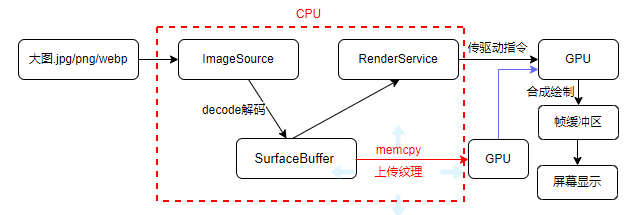
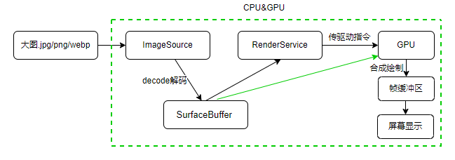

# 图片适配DMA开发实践

## 场景介绍

应用在图片浏览(尤其是图片较大)时，由于通常使用的是共享内存，存在从CPU到GPU的图片纹理上传，因此时常会出现丢帧的情况。    
相较于共享内存，直接内存访问DMA（Direct Memory Access），则不会出现PixelMap纹理上传，可以很好的解决图片纹理上传丢帧的问题。  
另外在使用DMA方案处理图片的时候会存在stride补齐的问题，本文就PixelMap图片拷贝、OpenCV、OpenGL场景下，图片在接入DMA时如何适配并处理这一问题作了简单的介绍。

## 原理介绍 
**共享内存方案：**         
  
- CPU不同进程之间的图片内存已共享         
- **CPU到GPU需要做纹理上传，存在一次拷贝**        

**DMA方案：**        
    
- 解码容器SurfaceBuffer兼容软解和硬解     
- 解码容器SurfaceBuffer不区分解码图片格式（jpeg/png/webp等）       
- 位图零拷贝，**GPU无需上传纹理，只需绑定纹理**         
- SurfaceBuffer线性内存（兼容CPU写），非GPU友好型内存（线性），大图（512以上）收益大     

以上是共享内存方案和DMA方案原理图。从中可以看到共享内存方案存在从CPU到GPU纹理上传这一位图拷贝步骤，而DMA内存方案则只需绑定纹理而无需上传纹理，因此性能上有一定优势。在具体实践中，使用DMA内存方案，大图（2k以上）绘制耗时优化程度可达80%+。  
DMA方案在具有性能优势的同时也存在一些代价，主要有以下两点：  
1、DMA图片内存行256字节对齐后，部分大图片场景动态内存占用会略有增加，增加的是每行末尾padding的stride补齐区域。  
2、CPU编辑场景（读写像素）需要考虑padding区域，否则可能会导致花屏。    
针对上述问题，在适配DMA内存方案时，需要做以下处理：   
1、获取像素数据的stride值  
   可通过OhosPixelMapInfos结构体中的rowSize属性，获取每行的stride值（单位：字节）。      
2、处理stride    
  在进行数据构造或渲染时，传入对应的stride值即可，需要考虑单位(部分三方库的stride单位为像素)。


## 场景示例一：图片数据拷贝
前端传入PixelMap图片，调用Native侧的DmaMemCopy接口。  
```typescript
Button('ImageMemCopy')
  .onClick(() => {
    if (!this.pixelMap) {
      return;
    }
    const result = testNapi.DmaMemCopy(this.pixelMap);
      promptAction.showToast({ message: result ? 'DmaMemCopy success' : 'DmaMemCopy fail' })
  })
```
Native侧实现PixelMap图片数据拷贝。    
1、将前端传入的PixelMap初始化Native侧的NativePixelMap对象。      

```c++
napi_value argValue[1] = {0};
size_t argCount = 1;
napi_get_cb_info(env, info, &argCount, argValue, &thisVar, nullptr);
NativePixelMap *nativePixelMap = OH_PixelMap_InitNativePixelMap(env, argValue[0]);
```
2、获取OhosPixelMapInfos结构体，通过该结构图获取rowSize属性，以便获取每行的stride值。      

```c++
struct OhosPixelMapInfos pixelMapInfo;
int32_t res = OH_PixelMap_GetImageInfo(nativePixelMap, &pixelMapInfo);
if (res != OHOS::Media::OHOS_IMAGE_RESULT_SUCCESS) {
  return result;
}
const int RGBA_PIXEL_BYTES = 4;  // 每一个像素包括R\G\B\透明度 4字节
uint32_t rowByteCount = pixelMapInfo.width * RGBA_PIXEL_BYTES; // 每行的实际像素字节数（不含padding）
uint32_t rowAllocationByteCount = pixelMapInfo.rowSize;        // 每行字节数(含padding)，等同于行跨距
uint32_t len = rowByteCount * pixelMapInfo.height;
```
3、通过OH_PixelMap_AccessPixels获取pixelMap对象数据的内存地址，并锁定该内存。          

```c++
void *pixelAddr = nullptr;
OH_PixelMap_AccessPixels(nativePixelMap, &pixelAddr);
```
4、将图片的每一行数据拷贝到data中，同时逐行处理图像拷贝中的stride。             

```c++
void *data = malloc(len);
if (!data) {
  return result;
}
uint8_t *dataRow = static_cast<uint8_t *>(data);
for (int i = 0; i < pixelMapInfo.height; i++) {
  memcpy(dataRow, static_cast<uint8_t *>(pixelAddr) + i * rowAllocationByteCount, rowByteCount);
  dataRow += rowByteCount;
}
```

5、释放 PixelMap对象数据的内存锁。               
```c++
OH_PixelMap_UnAccessPixels(nativePixelMap);
```

## 场景示例二：OpenCV(Open Source Computer Vision Library，即：计算机视觉处理开源软件库)        
在使用 OH_AccessPixels 获取到图像对象的内存地址后，转为opencv::Mat进行数组运算。由于为DMA内存，需要补齐lineStride，从而避免构造mat时数据读取错位。      

```c++  
OHOS::Media::OhosPixelMapInfo bitmap;
if (OH_GetImageInfo(env,args[0], &bitmap) < 0) {
  LOGGE(TAG, "ontain user bitmap fail");
  return napiErrorCode;
}
int width = bitmap.width;
int height = bitmap.height;
int rowSize = bitmap.rowSize;     //  LineStride
```
将以上rowSize以lineStride参数传入。
```c++  
ImageInfo Bitmap2Mat(OHOS::Media::OhosPixelMapInfo& bitmap, void *imagePixels, int lineStride)
{
   // convert bitmat to opencv mat
   timeval tvBegin;
   BenchStart(&tvBegin);
   cv::Mat src(bitmap.height, bitmap.width, CV_8UC4, imagePixels, lineStride);
   cv::Mat dst(bitmap.height, bitmap.width, CV_8UC3);
   
   cv::cvtColor(src, dst, CV_RGBA2RGB);
   BenchEnd(tvBegin, "cvtColor time");
   return ImageInfo(dst, bitmap.width, bitmap.height);
}
```
## 场景示例三：OpenGL(Open Graphics Library) 即：开放图形库   
前端解码逻辑如下：
```c++  
const file = await fs.open(uri, fs.OpenMode.READ_ONLY);
const imageSource = image.createImageSource(file.fd);
const size = imageSource.getImageInfoSync(0).size;
// 图像解码
const pixelMap = await imageSource.createPixelMap({desiredPixelFormat : image.PixelMapFormat.RGBA_8888});
```
C++侧创建纹理逻辑如下：
```c++  
// 获取图片内存地址
auto createPixelStatus = OHOS::Media::OH_AccessPixels(env, pixelMap, &data);
if(createPixelStatus != OHOS::Media::OHOS_IMAGE_RESUIT_SUCCESS) {
   OH_LOG_INFO(LOG_APP, "create Texture Fail");
   return 0;
}
GLuint texture = 0;
glGenTextures(1, &texture);
glBindTexture(GL_TEXTURE_2D, texture);
glTexParameterf(GL_TEXTURE_2D, GL_TEXTURE_MAG_FILTER, GL_LINEAR);
glTexParameterf(GL_TEXTURE_2D, GL_TEXTURE_MIN_FILTER, GL_LINEAR);
glTexParameterf(GL_TEXTURE_2D, GL_TEXTURE_WARP_S, GL_CLAMP_TO_EDGE);
glTexParameterf(GL_TEXTURE_2D, GL_TEXTURE_WARP_T, GL_CLAMP_TO_EDGE);
// 生成2D纹理
glTexImage2D(GL_TEXTURE_2D, 0, GL_RGBA, width, height, 0, GL_RGBA, GL_UNSIGNED_TYTE, data);
glBindTexture(GL_TEXTURE_2D, 0);
```
在做绑定纹理前，需要指定stride，调用glPixelStorei(GL_UNPACK_ALIGNMENT, stride)。此时stride单位为像素，需要对OhosPixelMapInfos结构体中的rowSize属性（单位为字节）进行后处理，需要除以单位像素字节数。


