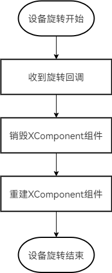
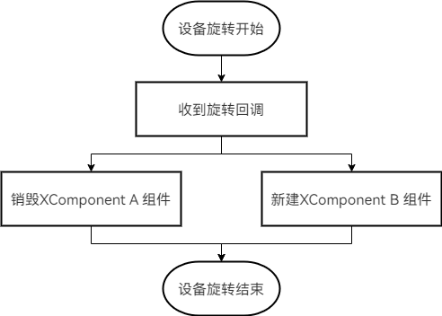

# 视频通话横竖屏切换黑屏优化

视频通话应用将视频流通过XComponent组件显示，假如远端设备无网络、网络状况差，可能导致本端设备接受不到新的视频流，此时进行横竖屏切换的操作，可能会出现画面卡顿、视频比例失调的问题。此时可选择重建XComponent组件更正视频比例，重建过程中调用接口刷新远端画面。由于接口获取远端画面受网络状况影响，当网络状况差时重建XComponent会因未及时获取新的视频流而出现黑屏。本文将针对这一场景给出解决方案。

## 使用场景

视频通话应用监听屏幕尺寸，变化时进行横竖屏切换。假如在切换时远端网络状况差，画面停留在之前的比例，切换后画面被拉伸，无法展示正确比例。因此在屏幕旋转时重建XComponent组件，在切换动效完成后展示新的XComponent组件，更新画面比例，解决切换前后比例失调问题。



```typescript
import { display, window } from '@kit.ArkUI';

@Entry
@Component
struct Index {
  @State private showSurface: boolean = true; // 视频画面显示标志位，用于控制视频画面组件XComponent显示与否
  private surfaceId: string = '';
  private xComponentController: XComponentController = new XComponentController();
  private timeoutId: number = -1;
  private originRotation: number = 0;
  
  // 窗口尺寸变化监听的回调
  private windowSizeChange: Callback<window.Size> = (windowSize) => {
    // 判断旋转角度是否发生变化，如果没有则return
    if (display.getDefaultDisplaySync().rotation === this.originRotation) {
      return;
    }
    // 更新旋转角度
    this.originRotation = display.getDefaultDisplaySync().rotation;
    // 销毁XComponent
    this.showSurface = false;
    this.timeoutId = setTimeout(async () => {
      // 10ms后重建XComponent
      this.showSurface = true;
    },10)
  }
  
  aboutToAppear(): void {
    // 注册窗口变化的监听
    window.on(this.windowSizeChange);
    clearTimeout(this.timeoutId);
  }
  
  aboutToDisappear(): void {
    // 解除注册窗口变化的监听
    window.off(this.windowSizeChange);
  }
  
  build() {
    if(this.showSurface) {
      XComponent({
        id:'',
        type:'surface',
        controller:this.xComponentController
      })
        .key('VideoCall_Surface_XComponent')
        .onLoad(() => {
          this.xComponentController.setXComponentSurfaceSize({
            surfaceWidth: 1080,
            surfaceHeight: 1920
          });
          this.surfaceId = this.xComponentController.getXComponentSurfaceId();
          // 获取视频流
          // ...
        })
    }
  }
}
```

## 优化方法

视频流使用两个XComponent组件交替显示画面，在横竖屏切换时销毁旧组件、创建新组件，使用if-else组件控制XComponent的销毁与重建同时进行，两个XComponent组件因if条件变化而来回切换，规避黑屏现象，提升用户体验。



```typescript
import { display, window } from '@kit.ArkUI';

@Entry
@Component
struct Index {
  @State private showSurface: boolean = true; // 视频画面显示标志位，用于控制视频画面组件XComponent来回切换
  private surfaceId: string = '';
  // 旋转前的XComponent
  private oldXComponentController: XComponentController = new XComponentController();
  // 旋转后的XComponent
  private newXComponentController: XComponentController = new XComponentController();
  private originRotation: number = 0;
  
  // 窗口尺寸变化监听的回调
  private windowSizeChange: Callback<window.Size> = (windowSize) => {
    // 判断旋转角度是否发生变化，如果没有则return
    if (display.getDefaultDisplaySync().rotation === this.originRotation) {
      return;
    }
    // 更新旋转角度
    this.originRotation = display.getDefaultDisplaySync().rotation;
    // 在旋转屏幕时利用if组件销毁原来的XComponent，重建新组件
    this.showSurface = !this.showSurface;
  }
  
  aboutToAppear(): void {
    // 注册窗口变化的监听
    window.on(this.windowSizeChange);
    clearTimeout(this.timeoutId);
  }
  
  aboutToDisappear(): void {
    // 解除注册窗口变化的监听
    window.off(this.windowSizeChange);
  }
  
  // 自定义视频XComponent组件
  @Builder VideoCallSurface(xController:XComponentController) {
    XComponent({
      id:'',
      type:'surface',
      controller:xController
    })
      .key('VideoCall_Surface_XComponent')
      .onLoad(() => {
        this.XComponentController.setXComponentSurfaceSize({
          surfaceWidth: 1080,
          surfaceHeight: 1920
        });
        this.surfaceId = this.XComponentController.getXComponentSurfaceId();
        // 获取视频流
        // ...
      })
  }
  
  build() {
    // 使用if-else组件控制组件更替
    if(this.showSurface) {
      this.VideoCallSurface(this.oldXComponentController)
    } else {
      this.VideoCallSurface(this.newXComponentController)
    }
  }
}
```

## 优化效果

| 优化前                                                                    | 优化后                                                                  |
|------------------------------------------------------------------------|----------------------------------------------------------------------|
|  |  |