# 应用滑动场景帧率问题分析实践

## 概要

当应用在运行时出现明显的延迟或不流畅的情况，会影响用户体验，开发者需要定位、分析、解决应用超长帧问题。本文先简单介绍应用流畅度评测指标，然后基于Trace数据，介绍超长帧问题分析思路，并结合案例实践，实操定位分析并优化卡顿问题。

本文主要是以Trace数据作为切入点进行分析，相应的工具可以使用SmartPerf Host或DevEco Stdio内置的Frame等。若开发者需要补充SmartPerf Host工具和Trace相关知识，可以分别参考《[性能优化工具SmartPerf-Host](https://docs.openharmony.cn/pages/v4.1/zh-cn/application-dev/performance/performance-optimization-using-smartperf-host.md)》和《[常用trace使用指导](https://docs.openharmony.cn/pages/v4.1/zh-cn/application-dev/performance/common-trace-using-instructions.md)》等应用开发文档。

## 性能指标

应用运行时的流畅度，涉及人因要素，不完全等同于应用系统性能。其中帧率问题，可以从如下几个指标进行衡量。

**丢帧率**

丢帧率是衡量动效过程中界面刷新的平均丢帧比例。

**最大丢帧数**

最大丢帧数是指从页面开始有响应变化到页面结束刷新的过程中，由于显示器画面刷新频率低于预设的画面帧率而未能正常呈现的最大连续帧数。

一般而言，当连续值超过3时，用户可以明显感知到卡顿掉帧，数值越大卡顿时间越长。最大连续丢帧数越接近于0，用户流畅体验越好。

## 问题分析流程

针对应用运行时出现明显的延迟或不流畅，可以通过抓取Trace或双击退出全屏模式切入，分析帧率问题。

### 信息准备

#### 确定问题现象

- 应用运行环境版本、数据量是怎样？
- 应用运行时做了什么操作？
- 是否可以本地复现？复现概率如何？

#### 确认验收标准

处理应用程序前首先需要和应用及测试确认当前问题场景的静态标准：

- 和应用方确认问题场景是否认可该标准，如不认可，相关问题需评审关闭。
- 和测试方确认是否按照静态标准执行的测试，测试步骤和性能衡量是否准确。

#### 准备可观测性信息

处理应用程序时，可以优先查看操作录屏，宣誓操作场景，能否发现一些有助于定位的信息。然后针对性获取HiTrace、HiPerf、cpuProfiler、常规log等各种可观测数据。

**Trace抓取**

抓取Trace前，可以打开ArkUI的一些debug开关。这样会增加一些详细的trace信息，比如显示具体引起组件标脏的变量、增加布局相关的信息、展示布局过程中所有涉及的组件层级等等。打开的方式，是连接设备后，通过hdcd shell进入命令行交互模式，输入下表中所需命令。

| 开关命令                                          | 开关信息                                     |
| ------------------------------------------------- | -------------------------------------------- |
| param set persist.ace.debug.enabled 1             | 一些调试的Trace开关，包括状态变更更新的Trace |
| param set persist.ace.trace.enabled 1             | ArkUI全局的Trace开关                         |
| param set persist.ace.layout.enabled true         | 节点树布局的详细过程的Trace                  |
| param set persist.ace.property.build.enabled      | 属性设置构建的开关（仅限root镜像）          |
| param set const.security.developermode.state true | 开发者模式的开关（仅限root镜像）           |

在设备相关debug开关打开后，通过Frame或SmartPerf Host等工具抓取场景Trace，开发者在抓取时，应结合问题现象，使Trace短小而有针对性，以方便后续问题定位。

### 问题分析

滑动帧率问题的通用定位思路为先确认抛锚的起止点，然后看抛锚过程中最大连续帧率，如果大于0，则根据Trace信息进一步确认问题点，确认责任任务域并对齐处理，处理流程如下图：

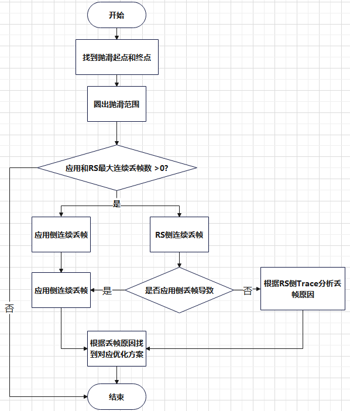

#### 确认起止点

针对滑动场景，以大于300ms/s的速度，连续5次滑动，每次半屏，抓取滑动过程Trace，查着Frame轨道中应用进程和RenderService进程的最大连续丢帧数。

例如，针对List组件长列表滑动，为了将实际动作与Trace数据打点的时间相结合，开发者可以通过应用进程中，如下三个泳道标识辅助问题的分段与对齐定位。

| 泳道                 | 描述                                                         |
| -------------------- | ------------------------------------------------------------ |
| H:APP_LIST_FLING     | 应用滑动列表打点，从手指按下开始拖动到抬手后的惯性滚动及最后尾动效的抛滑全过程 |
| H:touchEventDispatch | 手指滑动打点，拖滑阶段，从手指开始拖动到抬起                 |
| H:TRAILING_ANIMATION | 抛滑尾动效阶段                                               |

而性能衡量的起点为第一次抛滑开始，衡量的终点为第三次抛滑的结束点。

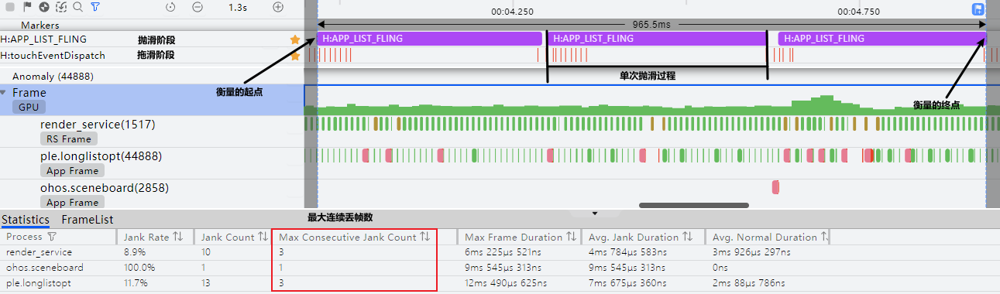

#### 定位问题点

##### 判断丢帧进程

首先通过Frame泳道判断丢帧进程，其中绿色代表没有丢帧，其他颜色均为丢帧。其中“粉红色”代表丢帧的期望时间，“红色”标记超时部分。

- 应用进程丢帧

  如下图，应用进程连续丢了3帧，可以看到只有101帧、102帧、103帧耗时较长，因此只分析这3帧即可。另外发现最后一帧序号也是103，这是因为前一帧耗时较长，导致该帧和前一帧都交给了RS的103帧上，应用帧上的序号是被提交给的RS帧序号相对应的。

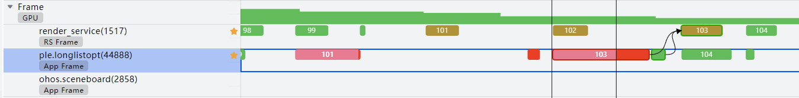

- RS进程丢帧

  RS进程丢帧可能是应用进程导致的，如上图RS侧丢了3帧，但可以看到RS侧103帧丢帧原因是由于应用进程的103帧耗时较长，提交较晚导致。所以这种情况只分析应用测丢帧原因即可。

  如果是应用进程中没有丢帧且每帧耗时均较均衡，但是RS侧发生丢帧，则说明不是应用导致丢帧，此时只分析RS进程丢帧原因即可。

##### 定位丢帧Trace

选中Frame泳道，点击Statistics下面的应用进程右侧图标进入Frame List。过滤Jank Type为AppDeadLineMissed类型的帧，点击跳转应用进程。

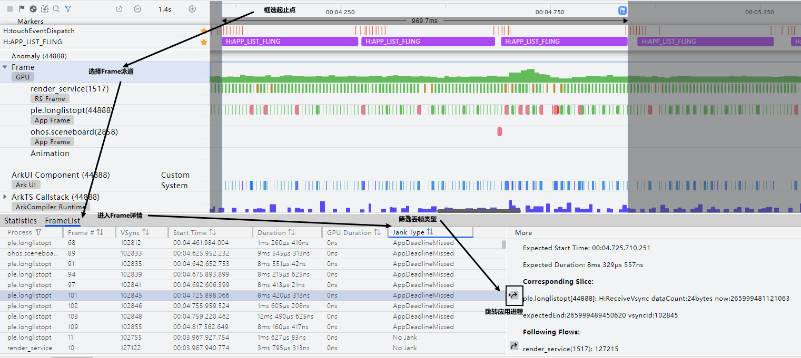

跳转后，详细分析丢帧初Trace。

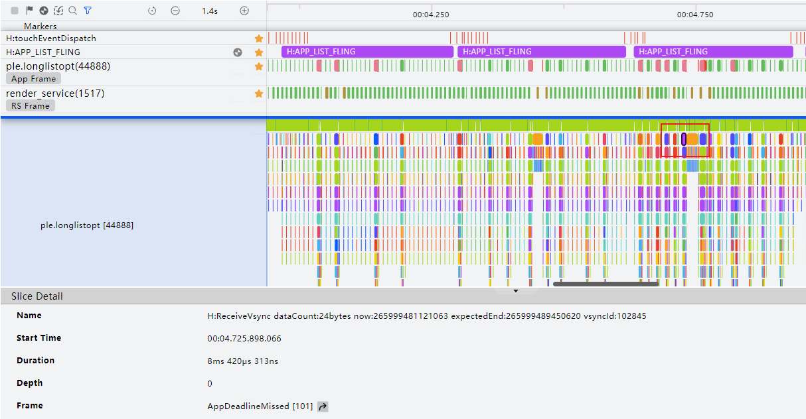

#### 问题根因分析

应用测的渲染流程如下图所示，了解ArkUI的渲染流程有助于开发者定位应用侧的卡顿问题出现在哪个环节。

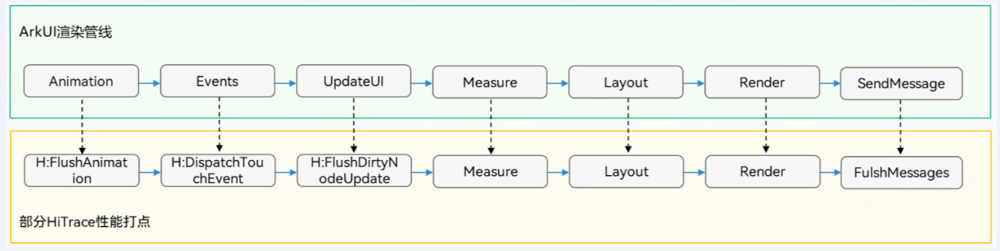

| 阶段        | 描述                                                         |
| ----------- | ------------------------------------------------------------ |
| Animation   | 动画阶段，在动画过程中会对对应的组件标记脏区                 |
| Events      | 事件处理阶段，比如手势事件处理。在手势处理过程中也会对组件标记脏区 |
| UpdateUI    | 组件在首次创建或状态量变更时会标记为需要rebuild状态，在下一次VSync过来时会通过View的方法生成相应的组件结构和属性样式修改任务 |
| Measure     | 执行组件的大小测算任务                                       |
| Layout      | 执行组件的布局任务                                           |
| Render      | 执行绘制任务，执行完成后会标记请求刷新RSNode绘制             |
| SendMessage | 将绘制数据提交到RS，请求刷新界面绘制                         |

##### 应用进程丢帧分析

根据Trace图，初步分析耗时较长阶段。101帧由于组件复用耗时长导致丢帧。

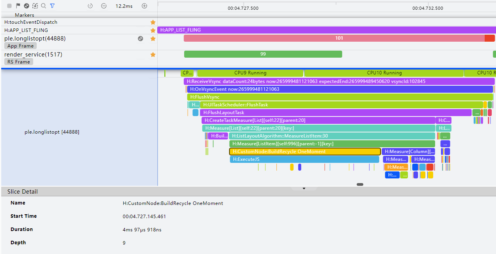

| 序号 | 所属     | Trace点                                                      | 描述                                               |
| ---- | -------- | ------------------------------------------------------------ | -------------------------------------------------- |
| 1    | 应用进程 | H:LazyForEach predict                                        | LazyForEach预处理                                  |
| 2    | 应用进程 | H:CustomNode:BuildRecycle 自定义组件名                       | 自定义定义组件的复用，包含执行aboutToReuse方法的时 |
| 3    | 应用进程 | H:CreateTaskMeasure[组件名]\[self:组件名][parent:父组件名] & H:Measure[组件名]\[self:组件名][parent:父组件名] | 执行组件的布局测量任务                             |

通过ArkTS CallStack泳道，可以看到应用侧具体调用链，进一步分析定位问题原因。

如下图通过调用栈可以分析出：组件复用时会组件树进行递归，这个过程耗时较长，可以看下组件数是否组件嵌套层级过深；updateDirtyElement耗时长，应用侧可以分析下是否存在冗余节点被触发更新；aboutToReuse耗时长可以看下应用侧该回调中是否存在耗时逻辑。

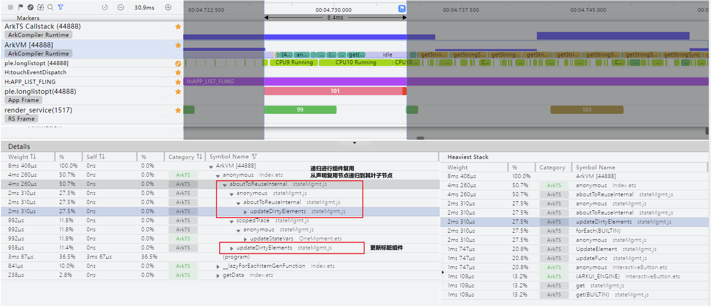

**经验总结**：应用程序卡顿通常由组件结构嵌套层次深、耗时应用业务逻辑复杂或UI线程等问题导致。如果是UI结构复杂问题可以允许通过减少嵌套层次、使用组件复用等方式优化。如果是有耗时业务逻辑，则可以通过将耗时的逻辑放到Taskpool或Worker中优化。

##### RS进程卡顿分析

RS进程卡顿一般是由界面结构过于复杂或者GPU负载过大等原因导致的。如果应用侧没有卡顿且每帧耗时比较平均，则可以初步判断应用没有问题，同时也可以通过应用侧Trace中`H:SendCommands`下的`H:MarshRSTransactionData cmdCount`查看应用提交的绘制指令树是否过多。

如下图RS侧卡顿原因是由RS的`H:RSUniRender:FlushFrame`阶段耗时较长，此时可能是系统绘制机制引起的丢帧。

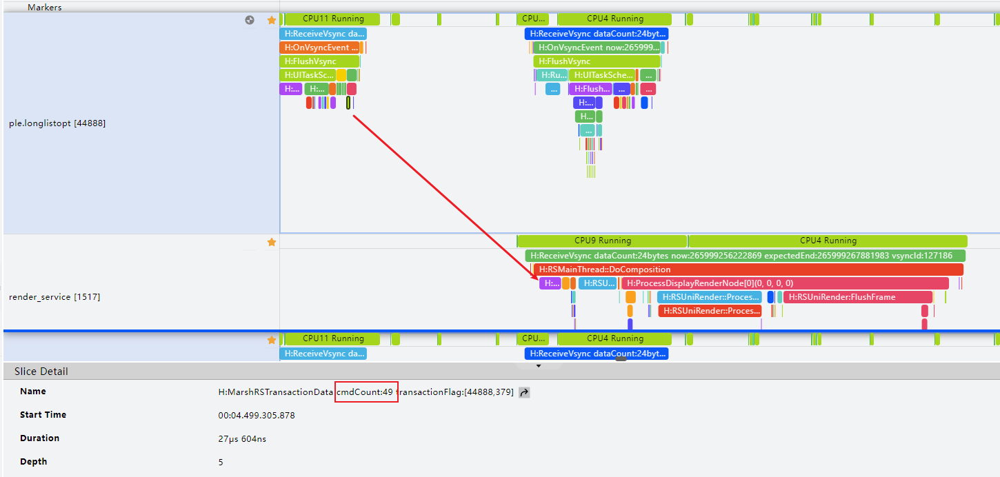

**经验总结**：RenderService侧卡顿通常是应用UI线程阻塞提交绘制指令较慢导致，此时应当初步定位应用侧耗时长原因。如果应用侧无阻塞情况，绘制指令正常提交，则可能是系统绘制机制引起的丢帧，并不是应用问题。

## 典型问题

### 耗时任务阻塞UI主线程

Stage模型中的线程主要有三类：主线程、TaskPool、Worker。主线程主要用于执行UI绘制、处理应用代码逻辑，TaskPool和Worker的作用是为应用程序提供一个多线程的运行环境，用于处理耗时的计算任务或其他CPU密集型任务。

当主线程存在耗时的计算任务时，会阻塞主线程，导致应用卡顿。

#### 问题根因分析

应用进程中间有一段大段“空白”，UI线程未提交任何绘制指令，期间有CPU处于Running状态，表示此时应用正在执行ArkTS的业务代码。

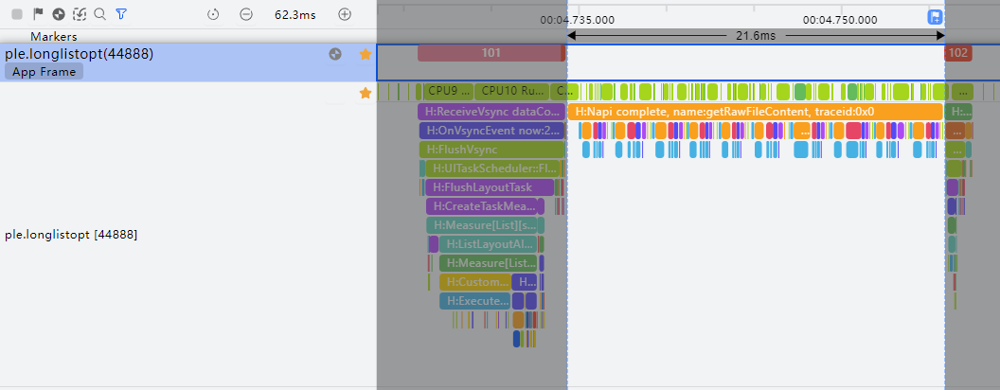

通过ArkTS Callstack泳道，可以看到耗时点主要在三个文件：Index.ets、BasicDataSource.ets。

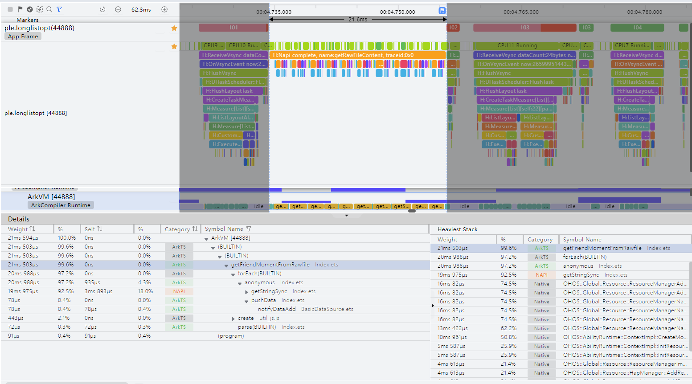

#### 优化方案

在List滑动过程中对数据进行处理耗时较长，占用大量CPU资源，导致主线程被阻塞，这部分数据处理的相关业务逻辑与UI绘制无关，但却长时间占用CPU资源，导致UI线程被阻塞丢帧。可以将该数据处理逻辑放到TaskPool中利用多核并行化处理优化。从图中可以看到，getRawFileContent运行在TaskWorker线程中，耗时极大缩短，并且不会影响到UI线程的绘制。

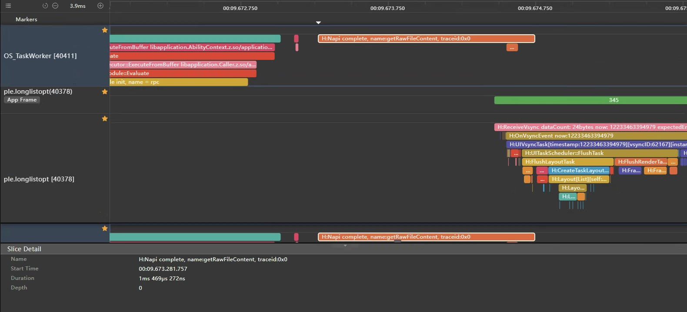

除应用侧的耗时逻辑外，某些与UI绘制无关的耗时系统接口调用也可以放到TaskPool中优化。详细可参考[其他主线程优化思路-使用多线程能力](https://developer.huawei.com/consumer/cn/doc/best-practices-V5/bpta-time-optimization-of-the-main-thread-V5#section32971936174416)。

### @Prop传参深层拷贝耗时长

#### 问题根因分析

观察应用Trace发现Measure阶段的H:CustomNode:BuildItem [OneMoment]和H:CustomNode:BuildItem [InteractiveButton]耗时较长约合3ms。

通过观察ArkUI Component调用栈得出自定义组件OneMoment和InteractiveButton构建耗时较长。

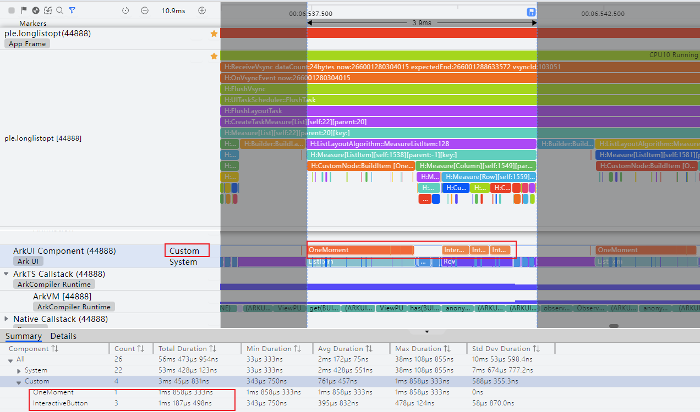

通过ArkTS CallStack观察应用ArkTS调用栈，其中resetLocalValue、copyObject、deepCopyObject、deepCopyObjectInternal为@Prop接收参数时，拷贝数据的相关调用栈。

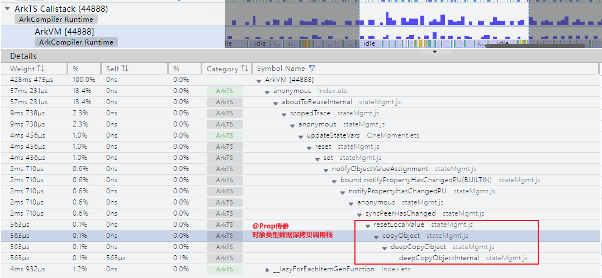

#### 优化方案

@Prop装饰器存在性能问题，@Prop装饰的变量会对父组件传入状态值进行深拷贝，如果@Prop装饰器装饰的变量为复杂Object、class或其类型数组时，会增加 状态创建时间以及占用大量内存。

如果需要观察某个对象的深层次属性变化，推荐选择@State+@Observed+@ObjectLink组合方案。详细可参考[使用@Link/@ObjectLink替代@Prop减少深拷贝，提升组件创建速度](component_recycle_case.md#2使用linkobjectlink替代prop减少深拷贝提升组件创建速度)。

### UI复杂导致单帧超长

#### 问题根源分析

##### 冗杂状态变量

追踪该帧并筛选Trace点：H:ViewPU.ViewPropertyHasChanged，该Trace点表示状态变量发生了更新，其中后三个参数分别为自定义组件名、自定义的状态变量名、该状态变量更新后影响的组件数量。可以发现这里有大量为"0"的TracePoint，表示该状态变量更新时未触发任何组件刷新，即该状态变量未绑定UI组件，因此可以将其替换为普通变量。

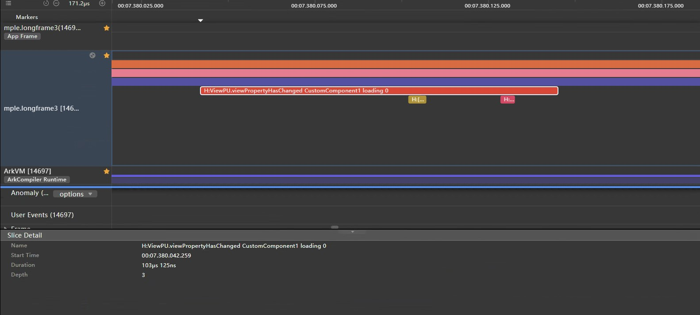

##### 组件复用失效

可以观察Trace发现，在ListItem的Measure阶段，出现了大量的H:CustomNode:BuildItem，说明此时发生了大量自定义组件重新创建，而没有被复用。

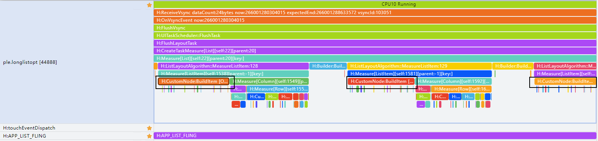

##### 嵌套层级深

通过DevEco Studio中的ArkUI Inspector观察组件结构，可以排查自定义组件的\__Common__节点、容器之间组件冗余嵌套的情况。冗余的嵌套会带来不必要的组件节点，加深组件树的层级，在创建和布局阶段会产生较大的性能开销。

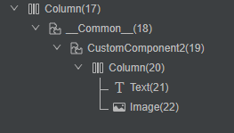

#### 优化方案

##### 冗余的状态变量优化

将没有UI组件绑定的状态变量改为普通变量。@State、@Prop等装饰器修饰的状态变量在创建、Set时都会产生耗时，因此应该尽量减少冗余的状态变量，避免性能损耗。详细可参考[删除冗余的状态变量标记](https://developer.huawei.com/consumer/cn/doc/best-practices-V5/bpta-status-management-V5#section2674939304)。

##### 组件复用失败优化

根据[组件复用的约束和限制](https://developer.huawei.com/consumer/cn/doc/best-practices-V5/bpta-component-reuse-V5#section1048675564013)，正确使用组件复用，如给需要复用的自定义组件添加@Reusable装饰器、设置正确的reuseId等。详细可参考[[长列表加载性能优化-组件复用性能分析]](https://developer.huawei.com/consumer/cn/doc/best-practices-V5/bpta-best-practices-long-list-V5#section36781044162218)。

##### 嵌套层级优化

**方案一**：当自定义组件设置通用属性后，UI组件树就会产生Common节点，可以通过动态属性设置（Modifier）解决。详细可参考[自定义组件引起新增节点](reduce-view-nesting-levels.md#自定义组件引起新增节点)。

**方案二**：避免多余的联套，对于这类多余的容器，应尽量优化，减少联套深度。建议采用相对布局`RelativeContainer`进行扁平化布局，有效减少容器的联套层次，减少组件的创建时间。详细可参考[优化布局时间](reduce-view-nesting-levels.md#优化布局时间)。

**方案三**：使用`Builder`代替`Component`定义组件。通过`@Component`声明的组件在创建时会产生额外耗时，建议尽量使用`@Builder`声明组件。详细可参考[优先使用@Builder方法代替自定义组件](https://developer.huawei.com/consumer/cn/doc/best-practices-V5/bpta-ui-component-performance-optimization-V5#section18773182614502)。

## 总结回顾 

文章针对应用卡顿问题，总结滑动场景帧率问题分析思路，大致如下： 

1. 信息准备：确定问题现象、确定验收标准、准备相关可观测性信息
2. 问题分析：确定起始点、定位问题点、问题原因分析

并在典型问题中，罗列了常见问题的定位方式与优化方案。

##  附录：List滑动场景通用Trace说明 

在问题根因分析过程中，开发者需要了解通用List滑动场景的Trace标签信息。 

### 基础List滑动场景

####  拖拽阶段

| 序号 | Trace                                                        | 描述                                                         | 参数说明                                         |
| ---- | ------------------------------------------------------------ | ------------------------------------------------------------ | ------------------------------------------------ |
| 1    | H:client dispatch touchId:32903                              | 系统派发touch事件                                            | 事件id                                           |
| 2    | H:OnVsyncEvent now: [时间戳]                                 | 收到Vsync信号，渲染流开始                                    | 时间戳（纳秒级）                                 |
| 3    | H:Flush Vsync                                                | 处理用户输入、刷新视图同步事件、计算帧信息、提交绘制渲染等   |                                                  |
| 4    | H:DispatchTouchEvent id=0, pointX=[x坐标], pointY=[y坐标], type=2 | 处理拖拽手势事件                                             | 触摸点的xy坐标信息，type=2表示手势时间类型为移动 |
| 5    | H:HandleDragUpdate                                           | 执行拖拽更新任务                                             |                                                  |
| 6    | H:AddDirtyLayoutNode[List]\[self:7]\[parent:6]               | 标记List组件为脏区                                           | 组件名、组件ID、父组件ID                         |
| 7    | H:UIThreadScheduler::FlushTask                               | 刷新UI界面，包括布局计算、渲染和提交等                       |                                                  |
| 8    | H:FlushLayoutTask                                            | 执行布局任务                                                 |                                                  |
| 9    | H:CreateTaskMeasure[List]\[self:7]\[parent:6] Measure[List]\[self:7]\[parent:6] | 执行List组件的布局测量任务                                   | 组件名、组件ID、父组件ID                         |
| 10   | H:ListLayoutAlgorithm::MeasureListItem:27  H:Measure[ListItem]\[ListItem][self:10]\[parent:7] | 计算ListItem列表项的布局尺寸                                 | 列表项索引、组件名、组件ID、父组件ID             |
| 11   | H:SkipMeasure                                                | 组件大小布局未发生变化，跳过measure过程                      |                                                  |
| 12   | H:CreateTaskLayout[List]\[self:7]\[parent:6]  H:Layout[ListI]\[self:7]\[parent:6] | 执行List组件的布局任务                                       | 组件名、组件ID、父组件ID                         |
| 13   | H:Layout[ListItem]\[self:10]\[parent:7]\[key:]               | 执行ListItem组件的布局任务                                   | 组件名、组件ID、父组件ID                         |
| 14   | H:SyncGeometryNode[List]\[self:7]\[parent:6]                 | 同步几何节点                                                 | 组件名、组件ID、父组件ID                         |
| 15   | H:FlushRenderTask 1 FrameNode[List]\[id:7]::RenderTask  | 执行渲染绘制任务                                             | 当前页面需要绘制的节点数、需绘制的节点名和ID     |
| 16   | H:FlushMessages & SendCommands                               | 通知图形侧进行渲染                                           |                                                  |
| 17   | MarshRSTransferData cmdCount: 14 transactionFlag: [24390, 75] | 向图形侧发送绘制指令                                         | 绘制指令数量、应用进程号、指令序列号             |
| 18   | H:OnIdle, targetTime: 222549467458334                        | Vsyc中的空闲时间，一般会用来做预加载之类的操作，当H:OnVsyncEvent时间小于某值时触发该事件 | 时间戳                                           |

#### 惯性滑动阶段

| 序号 | Trace                                         | 描述                                                  | 参数说明                                         |
| ---- | --------------------------------------------- | ----------------------------------------------------- | ------------------------------------------------ |
| 1    | H:RunningCustomAnimation num:[1]              | 自定义动画，RSModifierManager管理的在UI线程运行的动画 | num表示动画的数量，如果大于0，则表示有动画在运行 |
| 2    | H:AddDirtyLayoutNode[List]\[self:7][parent:6] | 标记List组件为脏区                                    | 组件名、组件ID、父组件ID                         |
| 3    | H:FlushDirtyNodeUpdate                        | 更新被标注的节点                                      |                                                  |

#### 尾动效阶段

尾动效阶段相较其他两阶段的区别点在于尾动效阶段如果移动距离小于1像素则不会向RS提交`H：SendCommands`。

选取一个应用进程未提帧，放大后可以看到H：SendCommands下方并无H：MarshRSTransactionData的Trace点。该Trace点说明ArkUI中没有需要绘制的内容，因此没有提交绘制指令到RenderService侧。

### List懒加载场景滑动

List懒加载场景滑动的Trace点与上文基础List基本一致，其区别点主要在于懒加载的滑动场景下会出现组件创建和销毁过程，因此这里主要介绍创建和销毁组件的关键Trace点。

#### 创建组件

当List组件的cached Count属性设为0时，ListItem的创会发生在H：FlushLayoutTask阶段。如果不为0，则会在H：OnIdle阶段预创建组件。

| 序号 | Trace                                              | 描述                              | 参数说明                       |
| ---- | -------------------------------------------------- | --------------------------------- | ------------------------------ |
| 1    | H:Builder:BuildLazyItem[4]                         | 创建一个Lazyitem项目              | 创建的项目索引                 |
| 2    | H:Create[Child]\[self:28]                          | 创建一个自定义组件                | 自定义组件名、组件ID           |
| 3    | H:CustomNode:OnAppear H:aboutToAppear         | 执行自定义组件的aboutToAppear方法 |                                |
| 4    | H:CustomNode:BuildItem[Child]\[self:28][parent:27] | 执行自定义组件的build方法         | 自定义组件名、组件ID、父组件ID |
| 5    | H:Create[Text]\[self:31]                           | 创建一个Text组件                  | 组件名、组件ID                 |
| 6    | H:Measure[Text]\[self:31][parent:27]               | 计算Text组件布局                  | 组件名、组件ID、父组件ID       |
| 7    | H:LazyForeach predict                              | LazyForEach预处理                 |                                |
| 8    | H:List predict                                     | List组件预处理                    |                                |

#### 销毁组件

组件销毁只会发生在h:onIdle空闲阶段。

| 序号 | Trace                   | 描述                                  | 参数说明 |
| ---- | ----------------------- | ------------------------------------- | -------- |
| 1    | H:LazyFor_each[predict] | LazyForEach预处理创建一个Lazyitem项目 |          |
| 2    | H:aboutToDisappear      | 执行自定义组件的aboutToDisappear方法  |          |
| 3    | H:aboutToBeDeleted      | 删除组件                              |          |

### List组件复用场景滚动

与懒加载场景相比，在滚动过程中不会发生组件的销毁和创建，而是会在组件将要销毁时，将其放入缓存池中，在需要创建时再从缓存池中取出，并重赋值。因此这里里介绍ReUse阶段和Recycle阶段关键Trace点。

#### ReUse阶段

| 序号 | Trace                               | 描述                                 | 参数说明                 |
| ---- | ----------------------------------- | ------------------------------------ | ------------------------ |
| 1    | H:CustomNode:BuildRecycle Child     | 自定义组件复用，执行aboutToReuse方法 | 复用的组件名             |
| 2    | H:Create[Text]\[self:12]            | 创建Text组件                         | 组件名、组件ID           |
| 3    | H:Measure[Text]\[self:12][parent:0] | 标记ListItem为脏区                   | 组件名、组件ID、父组件ID |

#### Recycle阶段

| 序号 | Trace                           | 描述                                             | 参数说明 |
| ---- | ------------------------------- | ------------------------------------------------ | -------- |
| 1    | H:LazyForEach predict           | LazyForEach预处理                                |          |
| 2    | H:aboutToRecycleInternal        | 标识组件进入复用池并调用组件的aboutToRecycle方法 |          |
| 3    | H:ViewFunctions::ExecuteRecycle | 执行组件回收                                     |          |
