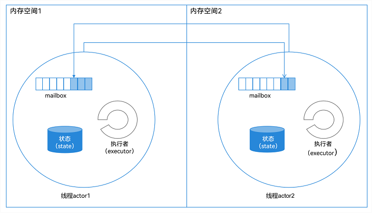
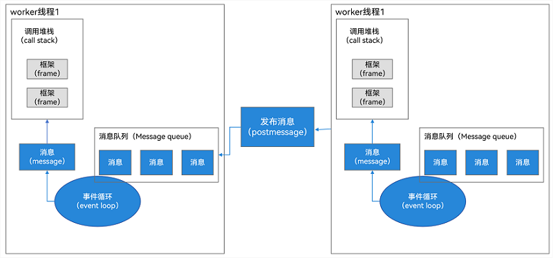
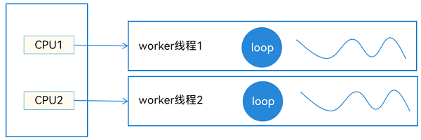
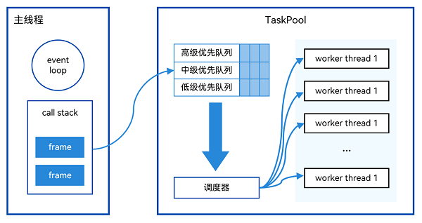
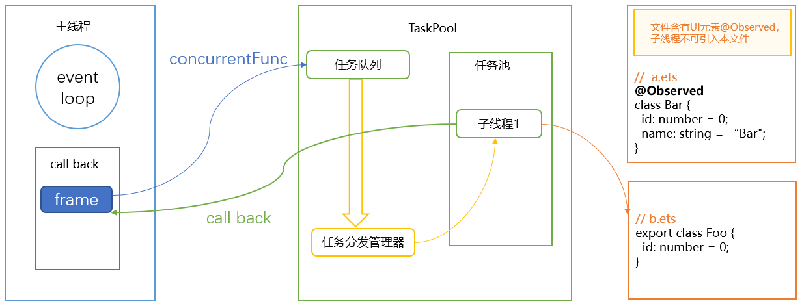
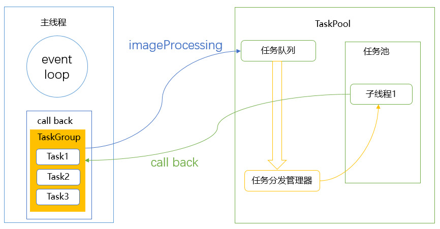
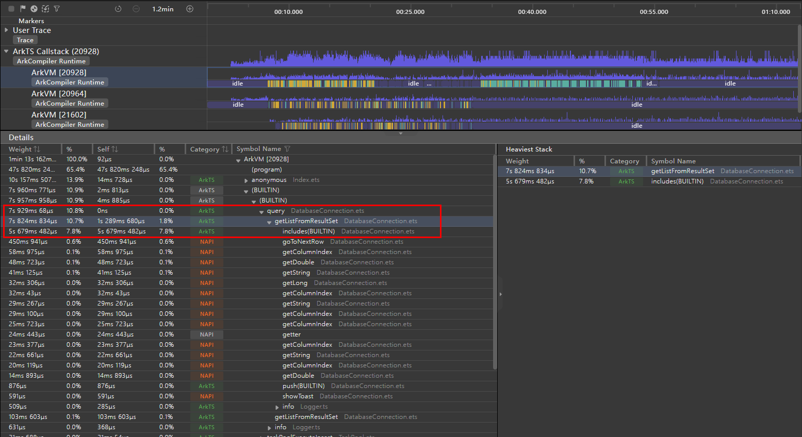
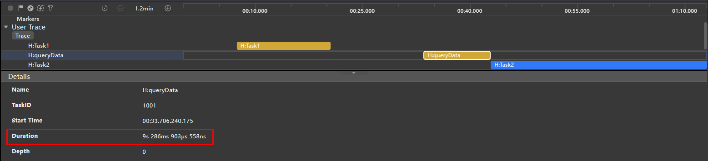
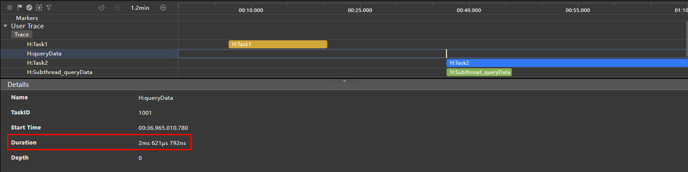
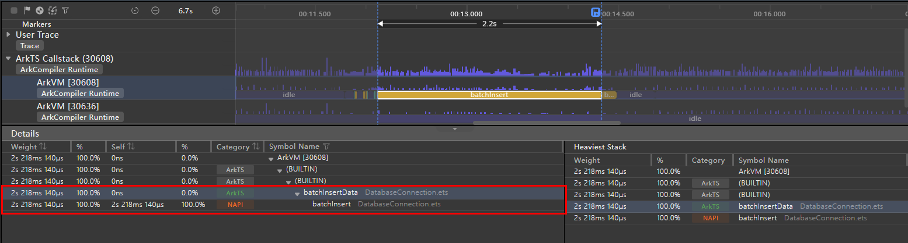

# 多线程能力场景化示例实践

## 简介

应用中的每个[进程](https://docs.openharmony.cn/pages/v4.1/zh-cn/application-dev/application-models/process-model-stage.md)都会有一个主线程，主线程主要承担执行UI绘制操作、管理ArkTS引擎实例的创建和销毁、分发和处理事件、管理Ability生命周期等职责，具体可参见[线程模型概述](https://docs.openharmony.cn/pages/v4.1/zh-cn/application-dev/application-models/thread-model-stage.md)。因此，开发应用时应当尽量避免将耗时的操作放在主线程中执行。ArkTS提供了**Worker**和**TaskPool**两种多线程并发能力，多线程并发允许在同一时间段内同时执行多段代码，这两个并发的基本能力可参见[TaskPool和Worker的对比](https://docs.openharmony.cn/pages/v4.1/zh-cn/application-dev/arkts-utils/taskpool-vs-worker.md)。

在介绍**Worker**和**TaskPool**的详细使用方法前，我们先简单介绍并发模型的相关概念，以便于大家的理解。

## 并发模型概述

并发的意思是多个任务同时执行。并发模型分为两大类：基于内存共享的并发模型和基于消息传递的并发模型。

在基于内存共享的并发模型中，并发线程通过读写内存中的共享对象来进行交互。基于共享内存的并发编程需要满足三条性质：

- 原子性：指一个操作是不可中断的，要么全部执行成功要么全部执行失败。

- 有序性：指程序执行的顺序必须符合预期，不能出现乱序的情况。

- 可见性：指当一个线程修改了共享变量后，其他线程能够立即得知这个修改。

现代程序语言一般通过锁、内存屏障、原子指令来满足这三条性质。基于内存共享的并发模型与底层硬件接近，在能正确撰写并发代码的情况下，可以最大发挥底层硬件性能，实现性能优秀的多线程程序。但是这种并发模型难以掌握，即使资深的程序员也非常容易犯错。典型的基于内存共享并发模型的程序语言有C++ 、Swift和Java等。

在基于消息传递的并发模型中，并发线程的内存相互隔离，需要通过通信通道相互发送消息来进行交互。典型的基于消息传递的并发模型一般有两种：CSP和Actor。

CSP（Communicating Sequential Processes，通信顺序进程）中的计算单元并不能直接互相发送信息。需要通过通道（Channel）作为媒介进行消息传递：发送方需要将消息发送到Channel，而接收方需要从Channel读取消息。与CSP不同，在Actor模型中，每个Actor可以看做一个独立的计算单元，并且相互之间内存隔离，每个Actor中存在信箱（Mail Box），Actor之间可以直接进行消息传递，如下图所示：  

**图1**  Actor消息传递示意图  



CSP与Actor之间的主要区别：

- Actor需要明确指定消息接收方，而CSP中处理单元不用关心这些，只需要把消息发送给Channel，而接收方只需要从Channel读取消息。

- 由于在默认情况下Channel是没有缓存的，因此对Channel的发送（Send）动作是同步阻塞的，直到另外一个持有该Channel引用的执行块取出消息，而Actor模型中信箱本质是队列，因此消息的发送和接收可以是异步的。

典型的基于消息传递的并发模型的程序语言有：Dart、JS和ArkTS。当前系统中Worker和TaskPool都是基于Actor并发模型实现的并发能力。

## Worker

### 基本概念和运作原理

当前系统中的Worker是一个独立的线程，基本概念可参见[TaskPool和Worker的对比](https://docs.openharmony.cn/pages/v4.1/zh-cn/application-dev/arkts-utils/taskpool-vs-worker.md)。Worker拥有独立的运行环境，每个Worker线程和主线程一样拥有自己的内存空间、消息队列（MessageQueue）、事件轮询机制（EventLoop）、调用栈（CallStack）等。线程之间通过消息（Massage）进行交互，如下图所示：  

**图2**  线程交互示意图



在多核的情况下（下图中的CPU 1和CPU 2同时工作），多个Worker线程（下图中的worker thread1和worker thread2）可以同时执行，因此Worker线程做到了真正的并发，如下图所示：  

**图3**  Worker线程并发示意图  



### 使用场景和开发示例

对于Worker，有以下适用场景：

- 运行时间超过3分钟的任务，需要使用Worker。

- 有关联的一系列同步任务，例如数据库增、删、改、查等，要保证同一个句柄，需要使用Worker。

以视频解压的场景为例，点击右上角下载按钮，该示例会执行网络下载并监听，下载完成后自动执行解压操作。当视频过大时，可能会出现解压时长超过3分钟耗时的情况，因此我们选用该场景来说明如何使用Worker。

场景预览图如下所示：  

**图4**  场景预览图


使用步骤如下：

1. 宿主线程创建一个Worker线程。通过`new worker.ThreadWorker()`创建Worker实例，示例代码如下：
   
   ```typescript
   // 引入worker模块
   import worker, { MessageEvents } from '@ohos.worker';
   import type common from '@ohos.app.ability.common';
   
   let workerInstance: worker.ThreadWorker = new worker.ThreadWorker('entry/ets/pages/workers/worker.ts', { 
     name: 'FriendsMoments Worker'
   });
   ```

2. 宿主线程给Worker线程发送任务消息。宿主线程通过postMessage方法来发送消息给Worker线程，启动下载解压任务，示例代码如下：   
   
   ```typescript
   // 请求网络数据
   let context: common.UIAbilityContext = getContext(this) as common.UIAbilityContext;
   // 参数中mediaData和isImageData是根据开发者自己的业务需求添加的，其中mediaData为数据路径、isImageData为判断图片或视频的标识
   workerInstance.postMessage({ context, mediaData: this.mediaData, isImageData: this.isImageData });
   ```

3. Worker线程监听宿主线程发送的消息。Worker线程在onmessage中接收到宿主线程的postMessage请求，执行下载解压任务，示例代码如下：
   
   ```typescript
   // 引入worker模块
   import worker, { MessageEvents } from '@ohos.worker';
   
   let workerPort = worker.workerPort;
   // 接收宿主线程的postMessage请求
   workerPort.onmessage = (e: MessageEvents): void => {
     // 下载视频文件
     let context: common.UIAbilityContext = e.data.context;
     let filesDir: string = context.filesDir;
     let time: number = new Date().getTime();
     let inFilePath: string = `${filesDir}/${time.toString()}.zip`;
     let mediaDataUrl: string = e.data.mediaData;
     let urlPart: string = mediaDataUrl.split('.')[1];
     let length: number = urlPart.split('/').length;
     let fileName: string = urlPart.split('/')[length-1];
     let options: zlib.Options = {
       level: zlib.CompressLevel.COMPRESS_LEVEL_DEFAULT_COMPRESSION
     };
     request.downloadFile(context, {
       url: mediaDataUrl,
       filePath: inFilePath
     }).then((downloadTask) => {
       downloadTask.on('progress', (receivedSize: number, totalSize: number) => {
         Logger.info(`receivedSize:${receivedSize},totalSize:${totalSize}`);
       });
       downloadTask.on('complete', () => {
         // 下载完成之后执行解压操作
         zlib.decompressFile(inFilePath, filesDir, options, (errData: BusinessError) => {
           if (errData !== null) {
             ...
             // 异常处理
           }
           let videoPath: string = `${filesDir}/${fileName}/${fileName}.mp4`;
           workerPort.postMessage({ 'isComplete': true, 'filePath': videoPath });
         })
       });
       downloadTask.on('fail', () => {
         ...
         // 异常处理
       });
     }).catch((err) => {
       ...
       // 异常处理
     });
   };
   ```

4. 宿主线程监听Worker线程发送的信息。宿主线程通过onmessage接收到Worker线程发送的消息，并执行下载的结果通知。

5. 释放Worker资源。在业务完成或者页面销毁时，调用workerPort.close()接口主动释放Worker资源，示例代码如下所示：
   
   ```typescript
   workerInstance.onmessage = (e: MessageEvents): void => {
     if (e.data) {
       this.downComplete = e.data['isComplete'];
       this.filePath = e.data['filePath'];
       workerInstance.terminate();
       setTimeout(() => {
         this.downloadStatus = false;
       }, LOADING_DURATION_OPEN);
     }
   };
   ```

## TaskPool

### 基本概念和运作原理

相比使用Worker实现多线程并发，TaskPool更加易于使用，创建开销也少于Worker，并且Worker线程有个数限制，需要开发者自己掌握，TaskPool的基本概念可参见[TaskPool和Worker的对比](https://docs.openharmony.cn/pages/v4.1/zh-cn/application-dev/arkts-utils/taskpool-vs-worker.md)。TaskPool作用是为应用程序提供一个多线程的运行环境。TaskPool在Worker之上实现了调度器和Worker线程池，TaskPool根据任务的优先级，将其放入不同的优先级队列，调度器会依据自己实现的调度算法（优先级，防饥饿），从优先级队列中取出任务，放入TaskPool中的Worker线程池，执行相关任务，流程图如下所示：

**图5**  TaskPool流程示意图



TaskPool有如下的特点：

- 轻量化的并行机制。

- 降低整体资源的消耗。

- 提高系统的整体性能。

- 无需关心线程实例的生命周期。

- 可以使用TaskPool API创建后台任务（Task），并对所创建的任务进行如任务执行、任务取消的操作。

- 根据任务负载动态调节TaskPool工作线程的数量，以使任务按照预期时间完成任务。

- 可以设置任务的优先级。

- 可以设置任务组（TaskGroup）将任务关联起来。

### 使用场景和开发示例

TaskPool的适用场景主要分为如下三类：

- 需要设置优先级的任务。

- 需要频繁取消的任务。

- 大量或者调度点较分散的任务。

因为朋友圈场景存在不同好友同时上传视频图片，在频繁滑动时将多次触发下载任务，所以下面将以使用朋友圈加载网络数据并且进行解析和数据处理的场景为例，来演示如何使用TaskPool进行大量或调度点较分散的任务开发和处理。场景的预览图如下所示：  

**图6**  朋友圈场景预览图  


使用步骤如下：

1. 首先import引入TaskPool模块，TaskPool的API介绍可参见[@ohos.taskpool（启动TaskPool）](https://docs.openharmony.cn/pages/v4.1/zh-cn/application-dev/reference/apis/js-apis-taskpool.md)。
   
   ```typescript
   import taskpool from '@ohos.taskpool';
   ```

2. new一个task对象，其中传入被调用的方法和参数。
   
   ```typescript
   ... 
   // 创建task任务项，参数1.任务执行需要传入函数 参数2.任务执行传入函数的参数 （本示例中此参数为被调用的网络地址字符串）
   let task: taskpool.Task = new taskpool.Task(getWebData, jsonUrl);
   ...
   
   // 获取网络数据
   @Concurrent
   async function getWebData(url: string): Promise<Array<FriendMoment>> {
     try {
       let webData: http.HttpResponse = await http.createHttp().request(
         url,
         { header: {
             'Content-Type': 'application/json'
         },
           connectTimeout: 60000, readTimeout: 60000
         })
       if (typeof (webData.result) === 'string') {
         // 解析json字符串
         let jsonObj: Array<FriendMoment> = await JSON.parse(webData.result).FriendMoment;
         let friendMomentBuckets: Array<FriendMoment> = new Array<FriendMoment>();
         // 下方源码省略，主要为数据解析和耗时操作处理
         ...
         return friendMomentBuckets;
       } else {
         // 异常处理
         ...
       }
     } catch (err) {
       // 异常处理
       ...
     }
   }
   ```

3. 之后使用taskpool.execute执行TaskPool任务，将待执行的函数放入TaskPool内部任务队列等待执行。execute需要两个参数：创建的任务对象、等待执行的任务组的优先级，默认值是Priority.MEDIUM。在TaskPool中执行完数据下载、解析和处理后，再返回给主线程中。
   
   ```typescript
   let friendMomentArray: Array<FriendMoment> = await taskpool.execute(task, taskpool.Priority.MEDIUM) as Array<FriendMoment>;
   ```

4. 将新获取的momentData通过AppStorage.setOrCreate传入页面组件中。
   
   ```typescript
   // 获取页面组件中的momentData对象，其中是组件所需的username、image、video等数据
   let momentData = AppStorage.get<FriendMomentsData>('momentData');
   // 循环遍历对象并依次传入momentData
   for (let i = 0; i < friendMomentArray.length; i++) {
     momentData.pushData(friendMomentArray[i]);
   }
   // 将更新的momentData返回给页面组件
   AppStorage.setOrCreate('momentData', momentData);
   ```
       
### TaskPool使用规范和常见问题      

[任务池（TaskPool）](https://developer.huawei.com/consumer/cn/doc/harmonyos-guides-V5/taskpool-introduction-V5)基于池化思想和任务机制，提供了一系列并发API，旨在充分发挥多核CPU的优势，降低主线程负载，提高程序性能。使用TaskPool进行开发需遵守一些规范，并综合业务和并发特性，细分场景使用。违反这些规范可能会导致性能劣化，引起稳定性或者其他非预期的问题。  
本文就TaskPool错误使用导致的一些诸如应用报错、业务异常、资源消耗过大等问题进行了分析，并总结出了一些使用规范，以帮助开发者更好的使用TaskPool进行应用开发。     

#### TaskPool使用规范   

**1.根据业务场景合理划分项目结构，避免在子线程中直接或间接引入UI**     

在工程中导入文件和HAR时，某些文件使用了如@Observed、AppStorage等UI装饰器或状态变量，这些UI装饰器或状态变量即使没有被显式调用也可能会被解析执行。然而目前子线程并不支持UI属性，当解析到这些UI装饰器或状态变量时，会抛出异常并返回，导致本模块的解析会被中断。访问这些包含UI的文件中的某些变量时可能会抛出错误：xxx is not initialized ，导致功能失效甚至crash。如下图所示：  

</img>    
另外在一些复杂项目中，即使本模块未发生改动，也可能由于SDK或其他依赖模块发生变更而导致该问题。此类问题排查起来较为困难，因此推荐在开发和迭代阶段就做好相应的约束和验证。   

**反例：**      
```typescript
// a.ets
import { hilog } from '@kit.PerformanceAnalysisKit';
@Observed
class Foo {
  constructor() {
    hilog.info(0xFF00, "sampleTag", "this is class Foo");
  }
}

export class Bar {
  constructor() {
    hilog.info(0xFF00, "sampleTag", "this is class Bar");
  }
}
```  

```typescript
// Sample1.ets
import { Bar } from './wrong/a';
import { BusinessError } from '@ohos.base';
import { taskpool } from '@kit.ArkTS';
import { hilog } from '@kit.PerformanceAnalysisKit';

@Concurrent
function wrongConcurrentFunc() {
  try {
    let bar: Bar = new Bar;
  } catch (e) {
    let error: BusinessError = e;
    hilog.error(0xFF00, 'sampleTag', 'error occur: ' + error.message);
  }
}

taskpool.execute(wrongConcurrentFunc);
```   
本例中，在a.ets中声明了2个class（Foo和Bar），其中class Foo被@Observed修饰。当在子线程中尝试new Bar时，解析执行到@Observed会抛出异常，并不会继续执行class Bar的逻辑，导致Bar属于未定义变量，访问时会抛出异常: Bar is not initialized。  
  
**正例：**  
```typescript
// a.ets
@Observed
export class Bar {
  id: number = 0;
  name: string = "Bar";
}
```     
```typescript
// b.ets
export class Foo {
  id: number = 0;
}
```   
```typescript
// Sample1.ets
@Concurrent
function correctConcurrentFunc() {
  let foo: Foo = new Foo;
} 

taskpool.execute(correctConcurrentFunc);
```     
将原先涉及UI的class（此处为Bar）剥离到单独的文件中，子线程再去导入不涉及UI的class（此处为Foo），这样就能确保应用正确运行。这样划分结构有利于提高程序正确性、执行效率和可维护性。


**2.在长时任务中注册监听事件，避免在非长时任务中使用带有监听性质的接口**      
   
通常监听接口具有长时属性，当在子线程注册监听接口并执行回调事件时，即使当该任务执行返回后，监听接口仍然会生效，并且触发时间不确定。由于TaskPool使能了负载均衡机制，对于非长时任务，会在任务执行完成后尝试回收空闲线程。     
如果注册了监听接口的子线程已经被释放，而此时其他线程又向该子线程发送事件则会导致功能异常或者未定义行为，比如crash。
因此，当开发者有监听需求时，推荐使用长时任务，主动管理任务所在线程的生命周期。

</img>   

**反例：**   
```typescript
// Sample2.ets
import { http } from '@kit.NetworkKit';
import { taskpool } from '@kit.ArkTS';
import { hilog } from '@kit.PerformanceAnalysisKit';

@Concurrent
function concurrentFunc() {
  let httpRequest = http.createHttp();
  httpRequest.on('headersReceive', (header: Object) => {
    hilog.info(0xFF00, 'sampleTag', 'header: ' + JSON.stringify(header));
  });

  httpRequest.on('dataEnd', () => {
    hilog.info(0xFF00, 'sampleTag', 'No more data in response, data receive end');
  });
}

taskpool.execute(concurrentFunc);
```   
如在上述反例中，在concurrentFunc()中使用了http API，其中on接口监听headersReceive事件，当相关事件到来时调用回调。从concurrentFunc()的角度来说，注册完on接口，该任务的逻辑也就完成和返回了。回调如果不调用，执行该任务的线程就一直处于空闲状态。一段时间后，该线程可能会被释放，如果此时headersReceive事件再次到来，就会引起非预期行为。  
  
**正例：**  
```typescript
// Sample2.ets
import { http } from '@kit.NetworkKit';
import { taskpool } from '@kit.ArkTS';
import { hilog } from '@kit.PerformanceAnalysisKit';

@Concurrent
function concurrentFunc() {
  let httpRequest = http.createHttp();
  httpRequest.on('headersReceive', (header: Object) => {
    hilog.info(0xFF00, 'sampleTag', 'header: ' + JSON.stringify(header));
  });

  httpRequest.on('dataEnd', () => {
    hilog.info(0xFF00, 'sampleTag', 'No more data in response, data receive end');
  });
}

let task: taskpool.LongTask = new taskpool.LongTask(concurrentFunc);
taskpool.execute(task).then(() => {
  hilog.info(0xFF00, 'sampleTag', 'receive http msg success.');
  taskpool.terminateTask(task);
})
```     
需要根据业务诉求合理选择任务类型。像http类的监听性质的接口适合使用长时任务，同时主动管理任务所在线程的生命周期，在具体逻辑执行完成后调用terminateTask()接口(通常在拿到结果时调用，即await之后或then逻辑里)，释放资源，避免造成执行长时任务的线程长时间不释放。  

**3.使用emitter和LongTask()的组合实现回调场景的通信诉求，避免在回调函数中使用SendData()**       
   
TaskPool提供了支持TaskPool子线程和宿主线程通信的接口[SendData()](https://developer.huawei.com/consumer/cn/doc/harmonyos-references-V5/js-apis-taskpool-V5#senddata11)。作为TaskPool提供的原生接口，SendData()能够安全的将子线程的数据传输到宿主线程。    
然而SendData()接口依赖于Task，生命周期同Task一致。考虑到微任务和异步事件的特性，回调函数可能在TaskPool任务结果返回后才会被处理。此时Task可能已经被销毁，如果再去调用依赖Task的接口SendData()是不合理和不安全的。TaskPool在这种情况下会抛出异常，如果这种异常是在任务返回后调用抛出的，还将会遗留在线程中不被处理，因此需避免在回调函数中使用SendData()。    
如果有需要，推荐使用emitter，emitter能够方便地实现宿主线程和子线程之间的双向通信。另外emitter的on接口具有监听性质，在没有取消注册的情况下，能在任意时间被触发，因此需要在LongTask()中注册。     

</img>    

**反例：**   
```typescript
// Sample3.ets
@Concurrent
function wrongConcurrentFunc() {
  let promise = Promise.resolve();
  promise.then(() => {
    taskpool.Task.sendData();
  })
}

let task: taskpool.Task = new taskpool.Task(wrongConcurrentFunc);
task.onReceiveData(() => {
  hilog.info(0xFF00, 'sampleTag', "onReceiveData has been called");
})
taskpool.execute(task);
```   
在上述反例中，使用了异步接口，并在then中使用了SendData()。从执行流来看，wrongConcurrentFunc()会先调用Promise.resolve()生成并返回一个promise。此时，并没有其他可执行逻辑，因此会直接返回，即出了wrongConcurrentFunc()的作用域。之后在执行微任务队列时，then中的回调逻辑会被执行，且不在wrongConcurrentFunc()的作用域中执行，因此会抛出异常：SendData is not called in the concurrent function。 

**正例：**   
```typescript
// Sample3.ets
@Concurrent
function correctConcurrentFunc() {
  let promise = Promise.resolve();
  promise.then(() => {
    emitter.emit("1", {data: {name: "anonymous"}});
  })
}

let task: taskpool.LongTask = new taskpool.LongTask(correctConcurrentFunc);
emitter.on("1", (data: emitter.EventData) => {
  hilog.info(0xff00, 'sampleTag', "name is : " + data.data?.name);
  emitter.off("1")
  taskpool.terminateTask(task)
})
taskpool.execute(task);
```     
正例中仍使用了Promise then的用法，区别于反例，在then的逻辑里使用了emitter来代替SendData()接口。同时将correctConcurrentFunc()这个任务声明为LongTask()，并使用terminateTask()手动管理生命周期，在实现功能的同时也能够保证程序的正确性。    

**4.根据业务场景和性能数据控制并发度**        
   
使用TaskPool存在一定执行成本，对于耗时长的任务（同步或者异步回调阶段耗时）可以抛到TaskPool中去执行，而耗时十分短的任务则可以直接放在主线程执行。   
同时合理划分业务粒度，对于一组相关联的任务，可以使用任务组TaskGroup。等待所有子任务都处理完再继续向下处理，从而保证业务代码整体性和可维护性。对于某些不紧急的查询任务，则可以将这些任务收集起来，在一些较为空闲的时间段再抛到任务池中执行。  
在合适的场景下也可以使用[SequenceRunner](https://developer.huawei.com/consumer/cn/doc/harmonyos-references-V5/js-apis-taskpool-V5#sequencerunner-11)等API，以避免短时间内大量任务连续进入任务池，使线程数瞬间提升到最大。主线程连续处理大量任务密集返回时的回调和微任务会阻塞UI，影响用户体验。   

</img>    

```typescript 
// Sample4.ets
import { taskpool } from '@kit.ArkTS';

@Concurrent
function imageProcessing(dataSlice: ArrayBuffer): ArrayBuffer {
  // 步骤1: 具体的图像处理操作及其他耗时操作
  return dataSlice;
}

function histogramStatistic(pixelBuffer: ArrayBuffer): void {
  // 步骤2: 分成三段并发调度
  let number: number = pixelBuffer.byteLength / 3;
  let buffer1: ArrayBuffer = pixelBuffer.slice(0, number);
  let buffer2: ArrayBuffer = pixelBuffer.slice(number, number * 2);
  let buffer3: ArrayBuffer = pixelBuffer.slice(number * 2);

  let group: taskpool.TaskGroup = new taskpool.TaskGroup();
  group.addTask(imageProcessing, buffer1);
  group.addTask(imageProcessing, buffer2);
  group.addTask(imageProcessing, buffer3);

  taskpool.execute(group, taskpool.Priority.HIGH).then((ret: Object) => {
    // 步骤3: 结果数组汇总处理
  })
}

let buffer: ArrayBuffer = new ArrayBuffer(24);
histogramStatistic(buffer);
```     
上例是一段处理图片的代码。在示例中将图片buffer分成3段，使用TaskPool的TaskGroup接口分发一组任务到多个子线程计算，同时接收多个结果，再返回UI线程展示。   

**5.正确处理业务逻辑异常情况，避免Task损耗**        
   
在TaskPool并发场景下，调用接口需要保证匹配，例如open()接口和close()接口要对应，使用了setInterval()后也需要调用clearInterval()。如果接口不匹配，在退出阶段可能会有些句柄未正常关闭，这将会导致线程不能被释放。当线程较多时，这种情况对常驻内存会有较大影响。   
推荐使用try...catch...来处理业务逻辑可能出现的异常。例如当taskpool.execute()传入的参数可能发生异常时，使用外层try...catch...及时捕获，当子线程中的task可能出现异常时，则可以使用.catch进行捕获。    
**例1：**   
```typescript
// Sample5.ets
@Concurrent
function correctConcurrentFunc() {
  let count: number = 0;
  let id = setInterval(() => {
    count++;
    if (count === 10) {
      hilog.info(0xFF00, 'sampleTag', "the value has reached the threshold");
      clearInterval(id);
    }
  }, 1000);
}

let task: taskpool.Task = new taskpool.Task(correctConcurrentFunc);
taskpool.execute(task);
```     
在子线程使用定时器setInterval()模拟了一个定时任务，当定时条件满足条件后，主动使用clearInterval()将定时器取消，能够保证线程在空闲时能被正常释放。   

**例2：**   
```typescript
// Sample5.ets
@Observed
class Foo {
  id: number = 0;
  name: string = "foo"
}

@Concurrent
function correctConcurrentFunc1(foo: Foo) {
  console.info("the id is: " + foo.id);
}

try {
  let foo = new Foo();
  taskpool.execute(correctConcurrentFunc1, foo);
} catch (e) {
  let error: ErrorEvent = e;
  hilog.error(0xFF00, 'sampleTag', "error info: " + error.message);
}
```     
在创建并执行Task时，模拟误传入标注了@Observed的class Foo，构建序列化错误场景。通常对于taskpool抛出的异常，会使用.catch的形式来捕获。但对于taskpool.execute()的序列化逻辑，此时Promise还未被创建，所以也无法被.catch捕获，因此此处使用外层的try...catch...来捕获异常。       


**例3：**   
```typescript
// Sample5.ets
@Concurrent
function correctConcurrentFunc2() {
  let error: Error = new Error("TaskPoolThread error");
  throw error;
}

taskpool.execute(correctConcurrentFunc2).catch((error: BusinessError) => {
  hilog.error(0xFF00, 'sampleTag', "error info: " + error.message);
})
```     
例3中对于子线程抛出的异常，使用了.catch的方式，异常能被正确捕获，打印也符合预期。        

**6.ArkTS线程间传递对象遵守序列化**              
    
目前序列化支持的数据类型有[普通对象](https://developer.huawei.com/consumer/cn/doc/harmonyos-guides-V5/normal-object-V5)、[ArrayBuffer对象](https://developer.huawei.com/consumer/cn/doc/harmonyos-guides-V5/arraybuffer-object-V5)、[SharedArrayBuffer对象](https://developer.huawei.com/consumer/cn/doc/harmonyos-guides-V5/shared-arraybuffer-object-V5)、[Transferable对象（NativeBinding对象）](https://developer.huawei.com/consumer/cn/doc/harmonyos-guides-V5/transferabled-object-V5)、[Sendable对象](https://developer.huawei.com/consumer/cn/doc/harmonyos-guides-V5/sendable-object-V5)五种，不支持代理和Promise等类型。因为序列化导致的失败，日志中会有“taskpool: failed to serialize arguments.”或者 "taskpool: failed to serialize result.”，可以通过过滤ArkCompiler Error日志查看具体类型报错，并根据类型排查代码（返回值的传递同样不支持这些类型）。    
**反例1：**   
```typescript
// Sample6.ets
@Concurrent
async function returnModule() {
  let module = await import('./a');
  return module;
} 

taskpool.execute(returnModule).catch((e: BusinessError) => {
  hilog.error(0xFF00, 'sampleTag', "error info: " + e.message);
})
```       
反例1中尝试动态import加载一个模块，返回到主线程使用，因module不支持序列化，出现报错。    
**反例2：**   
```typescript
// Sample6.ets
@Concurrent
async function returnPromise() {
  let promise = new Promise<void>((resolve) => {
    setTimeout(() => {
      resolve();
    }, 1000);
  })
  return promise;
}

taskpool.execute(returnPromise).catch((e: BusinessError) => {
  hilog.error(0xFF00, 'sampleTag', "error info: " + e.message);
})
```    
反例2中尝试返回一个pending状态的promise，会被拦截，需要在当前线程完成对promise的操作。    

#### 常见问题     

**1.使用TaskPool时不遵循最小化导入原则有什么影响**       
根据ECMA规范，导入方法和变量的时候，JavaScript运行时会根据开发者指定的入口文件开始深度遍历import链上的每个文件，并先从叶子节点执行文件。每个文件只会运行一次，然后存放在线程缓存中，后续加载可直接获取。    
对于TaskPool中的ConcurrentFunction()，虽然使能了精准import机制，在ConcurrentFunction()的最顶层仅会导入当前执行所需要的模块。但是对于较大的模块或在当前模块内依赖导入的其他模块，在系统侧是无法优化的。    

```typescript
import { a } from './a'
import { b } from './b'
import { c } from './c'

@Concurrent
function concurrentFunc() {
  hilog.info(0xFF00, 'sampleTag', 'value: ' + a);
}
```         
如上面的例子，模块a、b、c虽然都被引用了，但ConcurrentFunction()中仅仅使用了模块a，因此在TaskPool中执行concurrentFunc()函数，仅有模块a会被解析执行。但a中所有依赖的模块仍然都会被解析执行。         
另一种常见的情形是导入HAR包，当使用 import { case } from '@ohos/commom' 导入时，前端会翻译成 import { case } from '@ohos/commom/index'。由于index文件是整个HAR包导出的接口，虽然开发者可能只是想使用其中一个接口，但实际上却执行了整个HAR包(包括HAR包中导入的文件)，导致较大的耗时。虽然这部分耗时在子线程，但是也会对任务的执行耗时和内存产生较大影响。        
一般来说，在子线程中导入HAR包通常仅是使用其中某些独立的方法，在这种情况下，采用精准导入的方法可以带来比较明显的收益。比如使用import { case } from '@ohos/commom/xxx/xxx/case' 来导入具体文件(需要考虑可操作性)，或者将这个方法封装到一个全新的文件，这样仅解析这个单独的文件即可。       
因此在使用TaskPool时应该遵循最小化导入原则，尤其避免在独立的任务中引入大量不相关文件或者HAR。   


**2.子线程使用同步接口和异步接口有什么差异 ，使用哪种接口比较合适**     
TaskPool线程池线程的最大数量是有限的，当前策略是maxThreads=CPU核数 -1，因此基于当前的设备，正常情况下线程数上限为11个。当所有线程都被占用时，后续的任务可能不会被及时调度。因此，在工作线程中推荐使用异步接口而非同步接口，在等待I/O时能够及时处理新入队的任务，避免任务池阻塞。     
以文件系统copy为例，以下提供了同步和异步两种接口。由于文件拷贝比较耗时，推荐在子线程使用异步接口。         
**同步：**     
```typescript
// sync
let srcPath = pathDir + "/srcDir/test.txt";
let dstPath = pathDir + "/dstDir/test.txt";
fs.copyFileSync(srcPath, dstPath);
```              
**异步：**     
```typescript
// async
import { BusinessError } from '@kit.BasicServicesKit';
let srcPath = pathDir + "/srcDir/test.txt";
let dstPath = pathDir + "/dstDir/test.txt";
fs.copyFile(srcPath, dstPath, 0).then(() => {
  hilog.info(0xFF00, 'sampleTag', 'copy file succeed');
}).catch((err: BusinessError) => {
  hilog.error(0xFF00, 'sampleTag', 'copy file failed with error message: ' + err.message + ', error code: ' + err.code);
});
```         

**3.使用Sendable传输数据与使用深拷贝传输数据有什么差异**         
默认情况下，Sendable数据被分配在共享堆SharedHeap中，其在ArkTS并发实例间是通过引用传递数据。区别于深拷贝的方式，在trace上的直观表现是序列化和反序列化的时间明显减少，因此非常适用于性能敏感的场景。      
比如从网络数据库获取数据，可以将获取数据的逻辑改造到子线程中，并将期望获取的业务模型声明为Sendable。子线程中获取到JSON数据、转换并生成模型数据后，通过Sendable以引用的方式传回到主线程，这样能显著减少主线程的负载。      
另外由于子线程不支持UI属性，放入子线程的数据需要同UI剥离出来，返回的数据需要使用合理的方式同UI结合并渲染。对于这种Sendable对象和UI的组合使用可以参考ArkUI的新特性[makeObserved](https://developer.huawei.com/consumer/cn/doc/harmonyos-guides-V5/arkts-new-makeobserved-V5)。将makeObserved和@Sendable配合使用满足了应用开发中，在子线程做大数据处理，在UI线程做ViewModel的显示和观察数据的需求。     
此外，Sendable特性支持共享模块。对于一些工具类单例，由于线程隔离的特性，需要在子线程调用时使用Init重新初始化一次。在使用共享模块后，可以保证多线程内共享一个单例，优化写法，提升易用性。对一些耗时的SDK，如果能使用共享模块，也可以将初始化阶段下沉到子线程，主线程使用的时候将不用重新初始化相关模块，能够有效提升性能。   


**4.Napi回调耗时长如何处理**        
ArkTS的执行是在单线程中进行的，这意味着异步函数不会自己创建线程。 即使用了TaskPool，任务在任务池的子线程执行，但是结果逻辑是需要返回到任务的宿主线程处理的。       
一般来说，对于异步任务，开发者在ArkTS线程调用接口，对应接口会返回promise并挂起，异步逻辑则在工作线程中执行。异步逻辑执行完成后，通过线程间通信机制把结果返回到ArkTS线程。回到ArkTS线程后对应的Trace表示为Napi complete，在这一阶段会调用napi_resolve_deferred。      
当Promise状态变为Fulfield之后会执行微任务队列，即执行开发者定义的await之后的逻辑或者then的逻辑。这段耗时和微任务的逻辑和数量密切相关，Napi complete的Trace也会统计这段耗时。这段耗时并不是系统造成的，而是开发者自己的代码的耗时。如果耗时较长，例如在forEach里对返回的数据做复杂的加工处理，渲染UI等，可能会有掉帧的风险。    


[代码示例](../../test/performance/taskpool_practice/)


## 其他场景示例和方案思考

在日常开发过程中，我们还会碰到一些其他并发场景问题，下面我们介绍了常用并发场景的示例方案推荐。

### Worker线程调用主线程类型的方法

我们在主线程中创建了一个对象，假如类型为MyMath，我们需要把这个对象传递到Worker线程中，然后在Worker线程中执行该类型中的一些耗时操作方法，比如Math中的compute方法，类结构示例代码如下：

```typescript
class MyMath {
  a: number = 0;
  b: number = 1;

  constructor(a: number, b: number) {
    this.a = a;
    this.b = b;
  }

  compute(): number {
    return this.a + this.b;
  }
}
```

主线程代码：

```typescript
private math: MyMath = new MyMath(2, 3); // 初始化a和b的值为2和3
private workerInstance: worker.ThreadWorker;

this.workerInstance = new worker.ThreadWorker("entry/ets/worker/MyWorker.ts");
this.workerInstance.postMessage(this.math); // 发送到Worker线程中，期望执行MyMath中的compute方法，预期值是2+3=5
```

MyMath对象在进行线程传递后，会丢失类中的方法属性，导致我们只是在Worker线程中可以获取到MyMath的数据，但是无法在子系统中直接调用MyMath的compute方法，示意代码如下：

```typescript
const workerPort = worker.workerPort;
workerPort.onmessage = (e: MessageEvents): void => {
  let a = e.data.a;
  let b = e.data.b;
}
```

这种情况下我们可以怎么去实现在Worker线程中调用主线程中类的方法呢？

首先，我们尝试使用强制转换的方式把Worker线程接收到数据强制转换成MyMath类型，示例代码如下：

```typescript
const workerPort = worker.workerPort;
workerPort.onmessage = (e: MessageEvents): void => {
  let math = e.data as MyMath; // 方法一：强制转换
  console.log('math compute:' + math.compute()); // 执行失败，不会打印此日志
}
```

强制转换后执行方法失败，不会打印此日志。因为序列化传输普通对象时，仅支持传递属性，不支持传递其原型及方法。接下来我们尝试第二种方法，根据数据重新初始化一个MyMath对象，然后执行compute方法，示例代码如下：

```typescript
const workerPort = worker.workerPort;
workerPort.onmessage = (e: MessageEvents): void => {
  // 重新构造原类型的对象
  let math = new MyMath(0, 0);
  math.a = e.data.a;
  math.b = e.data.b;
  console.log('math compute:' + math.compute()); // 成功打印出结果：5
}
```

第二种方法成功在Worker线程中调用了MyMath的compute方法。但是这种方式还有弊端，比如每次使用到这个类进行传递，我们就得重新进行构造初始化，而且构造的代码会分散到工程的各处，很难进行维护，于是我们有了第三种改进方案。

第三种方法，我们需要构造一个接口类，包含了我们需要线程间调用的基础方法，这个接口类主要是管理和约束MyMath类的功能规格，保证MyMath类和它的代理类MyMathProxy类在主线程和子线程的功能一致性，示例代码如下：

```typescript
interface MyMathInterface {
  compute():number;
}
```

然后，我们把MyMath类继承这个方法，并且额外构造一个代理类，继承MyMath类，示例代码如下：

```typescript
class MyMath implements MyMathInterface {
  a: number = 0;
  b: number = 1;

  constructor(a: number, b: number) {
    console.log('MyMath constructor a:' + a + ' b:' + b)
    this.a = a;
    this.b = b;
  }

  compute(): number {
    return this.a + this.b;
  }
}

class MyMathProxy implements MyMathInterface {
  private myMath: MyMath;
  constructor(math: MyMath) {
    this.myMath = new MyMath(math.a, math.b);
  }  
  // 代理MyMath类的compute方法
  compute(): number {
    return this.myMath.compute();
  }
}
```

我们在主线程构造并且传递MyMath对象后，在Worker线程中转换成MyMathProxy，即可调用到MyMath的compute方法了，并且无需在多处进行初始化构造，只要把构造逻辑放到MyMathProxy或者MyMath的构造函数中，Worker线程中的示例代码如下：

```typescript
const workerPort = worker.workerPort;
workerPort.onmessage = (e: MessageEvents): void => {
  // 方法三：使用代理类构造对象
  let proxy = new MyMathProxy(e.data)
  console.log('math compute:' + proxy.compute()); // 成功打印出结果：5
}
```

大家可以根据实际场景选择第二种或者第三种方案。

### 在TaskPool线程操作关系型数据库

#### 场景问题

使用移动设备时，核心应用界面（如信息流、历史记录、项目列表）滑动操作频繁出现滞后与卡顿，影响功能访问与操作效率，降低用户体验。滑动性能下降源于潜在的后台耗时任务、资源管理问题等，导致界面帧率下降与反馈失真。亟需对系统或应用进行排查优化。

#### 原因分析

在应用程序运行过程中，由于主线程执行数据库查询操作耗时过长，且频繁进行多次此类查询，导致主线程负担加重，无法及时完成界面渲染任务。由此引发的后果是，界面的更新与展示严重受阻，出现明显的卡顿现象，严重影响了用户交互体验与应用程序的整体性能表现。

如下图所示，在对3000条数据进行查询的过程中，整个任务总耗时接近8秒。其中，`getListFromResultSet`函数负责查询结果数据格式化，其执行时间超过1秒；而用于检测数据库元素是否存在重复的`includes`方法，其运行时间超过5秒，这两项操作的显著耗时，成为导致滑动操作卡顿的关键因素。



#### 解决方案

为解决主线程因执行全量联系人查询操作而导致的界面渲染阻塞问题，采取以下优化措施：

- 将全量联系人的查询任务移交给TaskPool子线程处理，使其与主线程解耦，确保查询过程不影响主线程的界面更新工作；

- 减少因过度监听事件而引发的不必要的重复数据库查询，从而降低系统资源消耗，提升数据查询效率。
  
  这两项举措旨在协同改善应用程序性能，确保畅连界面的流畅渲染，提升用户使用体验。

#### 代码实现

**1.taskPool线程池实现**

- taskPool子线程执行数据库新增操作

该函数`taskPoolExecuteInsert` 是异步函数，用于使用任务池 (`taskPool`) 执行联系人数据库的数据新增操作。函数接收 `common.Context` 类型的 `context` 和 `Contact` 类型的 `contact` 参数。函数内部创建一个 `taskPool.Task` 实例，封装插入操作（`insert` 函数）、上下文信息（`context`）和待插入的联系人数据（`contact`）。随后，函数使用 `await` 关键字调用 `taskPool.execute(task)` 异步执行插入任务。如果执行过程中出现错误，函数通过 `catch` 语句捕获异常并使用 `Logger.error` 记录错误日志。

```ts
/**
 * 使用taskPool执行联系人数据库相关的数据新增操作
 */
export async function taskPoolExecuteInsert(context: common.Context, contact: Contact): Promise<void> {
  try {
    let task: taskPool.Task = new taskPool.Task(insert, context, contact); // insert函数调用 需使用装饰器@Concurrent
    await taskPool.execute(task);
  } catch (err) {
    Logger.error(TAG, 'insert error:' + `${err}`);
  }
}
```

- taskPool子线程执行数据库批量新增操作

该函数`taskPoolExecuteBatchInsert`为异步操作，利用`taskPool`执行批量添加联系人至数据库的任务。它接受`common.Context`类型的`context`参数和`Array<Contact>`类型的`array`参数。内部，通过创建`taskPool.Task`实例包括`batchInsert`执行函数、`context`及待插入的联系人数据`array`，并利用`await taskPool.execute(task)`异步执行此任务。遇错误，则在`catch`块中捕获并使用`Logger.error`记录日志。

```ts
export async function taskPoolExecuteBatchInsert(context: common.Context, array: Array<Contact>): Promise<void> {
  try {
    let task: taskPool.Task = new taskPool.Task(batchInsert, context, array); // batchInsert函数调用 需使用装饰器@Concurrent
    await taskPool.execute(task);
  } catch (err) {
    Logger.error(TAG, 'batch insert error:' + `${err}`);
  }
}
```

- taskPool子线程执行数据库查询操作

该异步函数`taskPoolExecuteQuery`接收`common.Context`参数`context`，利用任务池 (`taskPool`)执行联系人数据库的查询操作。其过程包括：创建`taskPool.Task`实例（封装查询操作与传递上下文参数`context`），通过`taskPool.execute`执行该任务，将结果断言为`Array<Contact>`并返回。若执行时发生错误，记录错误日志并返回空的`Contact`数组。

```ts
/**
 * 使用taskPool执行联系人数据库相关的查询操作
 */
export async function taskPoolExecuteQuery(context: common.Context): Promise<Array<Contact>> {
  try {
    let task: taskPool.Task = new taskPool.Task(query, context); // query函数调用 需使用装饰器@Concurrent
    let result: Array<Contact> = await taskPool.execute(task) as Array<Contact>;
    return result;
  } catch (err) {
    Logger.error(TAG, 'query error:' + `${err}`);
    return [];
  }
}
```

**2.relationalStore数据库实现**

- relationalStore数据库新增方法

该异步函数`insertData`用于执行数据库新增操作，接收`common.Context`参数`context`与`Contact`对象。执行流程如下：

1. 检查`context`是否为空或未定义，若满足条件则记录相应日志。

2. 检查`predicates`（返回带有和表名`TABLE_NAME`匹配的Rdb谓词）是否为空或未定义，若满足条件则记录相应日志。

3. 若`this.rdbStore`未初始化，则异步调用`initRdbStore(context)`进行初始化。

4. 提取`Contact`对象中的各项属性（name、gender、phone、remark、age），构建`ValuesBucket`对象。

5. 若`this.rdbStore`已定义，执行以下操作：
   
   a. 使用`this.rdbStore.insert`方法向表`TABLE_NAME`插入数据，冲突解决策略为`ON_CONFLICT_REPLACE`。 
   
   b. 记录日志，显示插入操作完成及返回结果。

综上，该函数主要负责根据提供的`Contact`信息，确保数据库连接后向指定表中插入新数据，并在关键环节记录日志。

```ts
/**
 * 数据库新增操作
 */
public async insertData(context: common.Context,  Contact: Contact): Promise<void> {
  Logger.info(TAG, 'insert begin');
  if (!context) {
    Logger.info(TAG, 'context is null or undefined');
  }
  if (predicates === null || predicates === undefined) {
    Logger.info(TAG, 'predicates is null or undefined');
  }
  if (!this.rdbStore) {
    await this.initRdbStore(context);
  }
  let value1 = Contact.name;
  let value2 = Contact.gender;
  let value3 = Contact.phone;
  let value4 = Contact.remark;
  let value5 = Contact.age;
  const valueBucket: ValuesBucket = {
    'name': value1,
    'gender': value2,
    'phone': value3,
    'remark': value4,
    'age': value5,
  }
  if (this.rdbStore != undefined) {
    let ret = await this.rdbStore.insert(TABLE_NAME, valueBucket, rdb.ConflictResolution.ON_CONFLICT_REPLACE);
    Logger.info(TAG, `insert done:${ret}`);
  }
}
```

- relationalStore数据库批量新增方法

该异步函数`batchInsertData`用于执行数据库批量新增操作，接收`common.Context`参数`context`与`Array<Contact>`类型的`array`参数。执行流程如下：

1. 检查`context`是否为空或未定义，若满足条件则记录相应日志。

2. 检查`predicates`（返回带有和表名`TABLE_NAME`匹配的Rdb谓词）是否为空或未定义，若满足条件则记录相应日志。

3. 若`this.rdbStore`未初始化，则异步调用`initRdbStore(context)`进行初始化。

4. 提取`Array<Contact>`数组中Contact对象中的各项属性（name、gender、phone、remark、age），构建`ValuesBucket`对象并添加到`ValuesBuckets` 数组当中。

5. 若`this.rdbStore`已定义，执行以下操作：
   
   a. 使用`this.rdbStore.batchInsert`方法向表`TABLE_NAME`批量插入数据。
   
   b. 记录日志，显示插入操作完成及返回结果。

综上，该函数主要负责根据提供的`Array<Contact>`信息，确保数据库连接后向指定表中批量插入新数据，并在关键环节记录日志。

```ts
/**
   * 批量插入数据库
   */
  public async batchInsertData(context: common.Context, array: Array<Contact>): Promise<void> {
    Logger.info(TAG, 'batch insert begin');
    if (!context) {
      Logger.info(TAG, 'context is null or undefined');
    }

    if (predicates === null || predicates === undefined) {
      Logger.info(TAG, 'predicates is null or undefined');
    }

    if (!this.rdbStore) {
      await this.initRdbStore(context);
    }

    let valueBuckets: Array<ValuesBucket> = [];
    for (let index = 0; index < array.length; index++) {
      let Contact = array[index] as Contact;
      let value1 = Contact.name;
      let value2 = Contact.gender;
      let value3 = Contact.phone;
      let value4 = Contact.remark;
      let value5 = Contact.age;

      const valueBucket: ValuesBucket = {
        'name': value1,
        'gender': value2,
        'phone': value3,
        'remark': value4,
        'age': value5,
      }
      valueBuckets.push(valueBucket);
    }

    if (this.rdbStore != undefined) {
      let ret = await this.rdbStore.batchInsert(TABLE_NAME, valueBuckets)
      Logger.info(TAG, `batch insert done:${ret}`)
    }
  }
```

- relationalStore数据库查询方法

该函数`query`负责执行数据库查询操作，接收`common.Context`参数`context`，返回Promise封装的`Contact`数组。执行流程如下：

1. 检查`context`是否为空或未定义，若满足条件则记录相应日志并直接返回空数组。

2. 检查`predicates`（返回带有和表名`TABLE_NAME`匹配的Rdb谓词）是否为空或未定义，若满足条件则记录相应日志并直接返回空数组。

3. 通过`rdb.getRdbStore(context, STORE_CONFIG)`获取或创建数据库连接（`rdbStore`）。若未成功获取到连接，则异步调用`initRdbStore(context)`进行初始化。

4. 若成功获取到`rdbStore`，执行以下操作： 
   
   a. 使用`this.rdbStore.query(predicates, this.columns)`方法根据给定的查询条件`predicates`与列名列表`this.columns`执行查询，获取`rdb.ResultSet`实例。 
   
   b. 调用`this.getListFromResultSet(resultSet)`方法处理查询结果集，将其转化为`Contact`数组并返回。

综上，该函数主要负责根据提供的`context`与查询条件`predicates`（若已定义），确保数据库连接后执行查询操作，处理结果并返回`Contact`数组。在关键环节记录日志，若出现输入参数问题或无法成功建立数据库连接，则返回空数组。

```ts
/**
 * 数据库查询操作
 */
public async query(context: common.Context): Promise<Array<Contact>> {
  Logger.info(TAG, 'query begin');
  if (!context) {
    Logger.info(TAG, 'context is null or undefined');
    return [];
  }
  if (predicates === null || predicates === undefined) {
    Logger.info(TAG, 'predicates is null or undefined');
    return [];
  }
  this.rdbStore = await rdb.getRdbStore(context, STORE_CONFIG);
  if (!this.rdbStore) {
    await this.initRdbStore(context);
  } else {
    // 默认查询所有列
    let resultSet: rdb.ResultSet = await this.rdbStore.query(predicates, this.columns);
    Logger.info(TAG, 'result is ' + JSON.stringify(resultSet.rowCount))
    // 处理查询到的结果数组
    return this.getListFromResultSet(resultSet);
  }
  return [];
}
```

- relationalStore数据库查询结果处理方法

该函数`getListFromResultSet`用于将给定的`rdb.ResultSet`对象解析为`Contact`数组。首先初始化空数组`contacts`，然后逐行遍历结果集。对于每一行，提取各列数据并构建一个`Contact`对象，通过检查数组中是否存在具有相同ID的联系人来防止重复添加。遍历结束后，关闭结果集以释放资源，最后返回包含所有联系人信息的数组。

```ts
/**
 * 处理数据格式
 */
getListFromResultSet(resultSet: rdb.ResultSet): Array<Contact> {
  // 声明结果变量
  let contacts: Array<Contact> = [];
  // 进入结果集的第一行
  resultSet.goToFirstRow();
  // 如果没有结束就继续遍历
  while (!resultSet.isEnded) {
    // 读取各个属性，初始化临时变量contact
    let contact: Contact = {
      'id': resultSet.getDouble(resultSet.getColumnIndex('id')),
      'name': resultSet.getString(resultSet.getColumnIndex('name')),
      'gender': resultSet.getDouble(resultSet.getColumnIndex('gender')),
      'phone': resultSet.getString(resultSet.getColumnIndex('phone')),
      'age': resultSet.getLong(resultSet.getColumnIndex('age')),
      'remark': resultSet.getString(resultSet.getColumnIndex('remark'))
    }
    if (!contacts.includes(contact)) {
      // 如果数据集合中没有这条数据就添加进去
      contacts.push(contact);
    }
    // 进入下一行
    resultSet.goToNextRow();
  }
  // 数据整合完毕就释放资源
  resultSet.close();
  // 返回整合的联系人数据
  return contacts;
}
```

**3.方法调用**

- 插入数据库方法调用
  
  创建Button按钮，点击该按钮时，依次执行3000次数据库插入操作。每次循环中，内部计数器`this.count`递增，其值经JSON.stringify处理后作为`phone`字段值，附着在对象`contact`上，通过`taskPoolExecuteInsert`函数将更新后的`contact`插入到数据库中，同时传入`context`上下文。

```ts
Button('insert', { type: ButtonType.Normal, stateEffect: true })
  .borderRadius(8)
  .backgroundColor(0x317aff)
  .width(120)
  .height(40)
  .onClick(() => {
    for (let index = 0; index < 3000; index++) {
      this.count++
      contact.phone = JSON.stringify(this.count);
      // 插入数据库
      taskPoolExecuteInsert(context, contact));
    }
  })
```

- 批量插入数据库方法调用
  
  创建Button按钮，会执行以下操作：`this.sourceData`是一个包含3000个`Contact`对象的数组，通过调用`taskPoolExecuteBatchInsert`异步函数，将这3000条联系人数据批量插入至数据库中，同时传入`context`上下文。

```ts
Button('batchInsert', { type: ButtonType.Normal, stateEffect: true })
  .borderRadius(8)
  .backgroundColor(0x317aff)
  .width(120)
  .height(40)
  .onClick(() => {
     // 批量插入数据库
     taskPoolExecuteBatchInsert(context, this.sourceData));
  })
```

- 查询数据库方法调用
  
  创建Button按钮，点击该按钮时，触发异步数据库查询操作，通过`taskPoolExecuteQuery`函数并传入`context`。查询结果（类型为`Array<Contact>`）返回后，利用`.then()`将所得数据与组件内`dataArray`合并更新。

```ts
Button('query', { type: ButtonType.Normal, stateEffect: true })
  .borderRadius(8)
  .backgroundColor(0x317aff)
  .width(120)
  .height(40)
  .onClick(async  () => {
     // 查询数据库
     taskPoolExecuteQuery(context).then((contact: Array<Contact>) => {
     this.dataArray = this.dataArray.concat(contact);
     }); 
   })
```

#### 分析比对

**数据库查询操作**

- 主线程中执行查询任务

如下图所示，在主线程的调度中，包含Task1、查询数据库（queryData）以及Task2这三个相继执行的任务。查询数据库操作耗时逾9秒，延缓了后续Task2的启动，从而对主线程的及时响应与整体流畅性产生影响。



- 子线程中执行查询任务

如下图所示，在主线程的任务调度中，原先是Task1、查询数据库操作(queryData)，以及紧随其后的Task2。为优化性能，现已将查询数据库的操作移至一个单独的子线程Subthread_queryData中执行。此调整后，数据库查询方法的调用仅耗时2毫秒，且Task2与子线程Subthread_queryData得以并行执行，彼此互不干扰。此举有效避免了查询任务对主线程造成的任何阻塞，确保了主线程操作的流畅无阻。



**数据库批量插入操作**

根据下图展示的批量插入数据库操作追踪详情，处理3000条记录耗时大约2.2秒，大数据批量写入任务的时间消耗。为确保应用程序的流畅操作与即时响应能力，优化策略建议将批量插入操作部署至子线程执行。减轻主线程负担，避免阻塞情况发生，增强用户体验，提高应用运行效率。



#### 结论

运用taskpool线程池技术创建子线程执行数据库查询任务，可有效避免主线程阻塞，确保其专注于关键操作如界面渲染和用户交互，提升应用流畅度与用户体验。查询结果通过`.then()`异步返回，实现非阻塞处理与列表数据刷新，既充分利用系统资源、加快响应速度，又保持代码结构清晰、易于维护，是一种兼顾效率与可读性的数据库查询优化策略。

同理，数据库的其他操作，包括单条数据插入、批量插入、数据修改及删除等，建议在子线程中执行，以维持应用的流畅互动性。在处理大数据量插入或批量插入任务时，多线程存在线程间通信耗时问题，用[@Sendable](https://developer.huawei.com/consumer/cn/doc/harmonyos-guides-V5/arkts-sendable-0000001861886489-V5)装饰器获取性能提升。该装饰器标记的子线程返回类对象，促使系统采取共享内存策略来处理这些对象，大大减少了反序列化的成本，进一步提升了效率。具体可参考[《避免在主线程中执行耗时操作》](./avoid_time_consuming_operations_in_mainthread.md)。  


