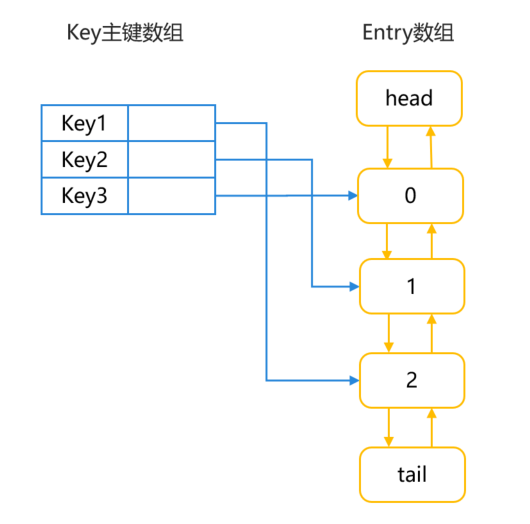
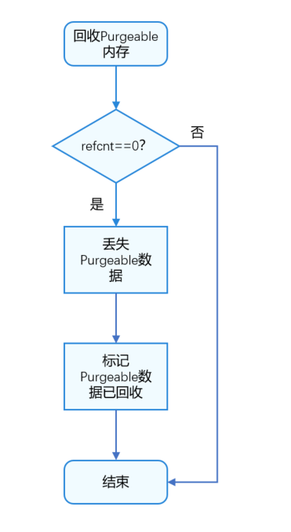
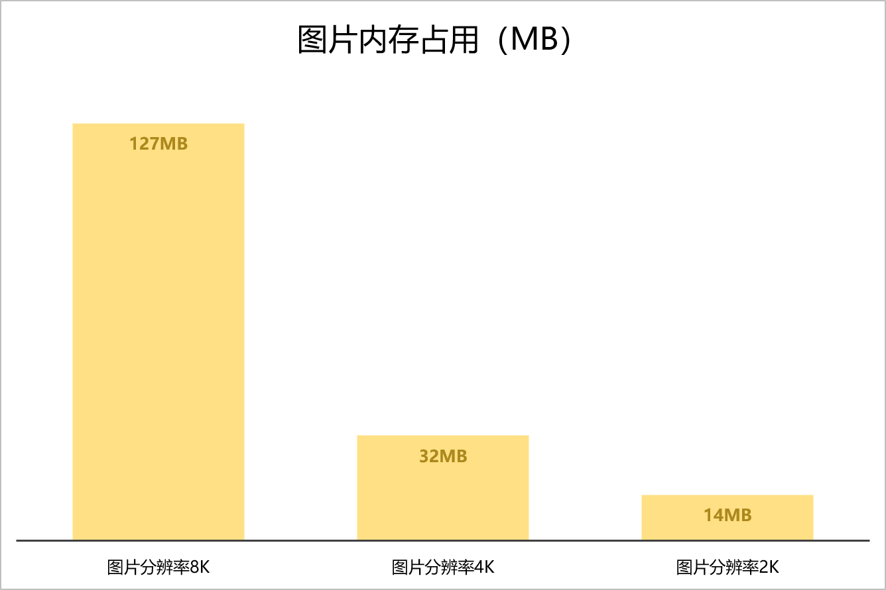
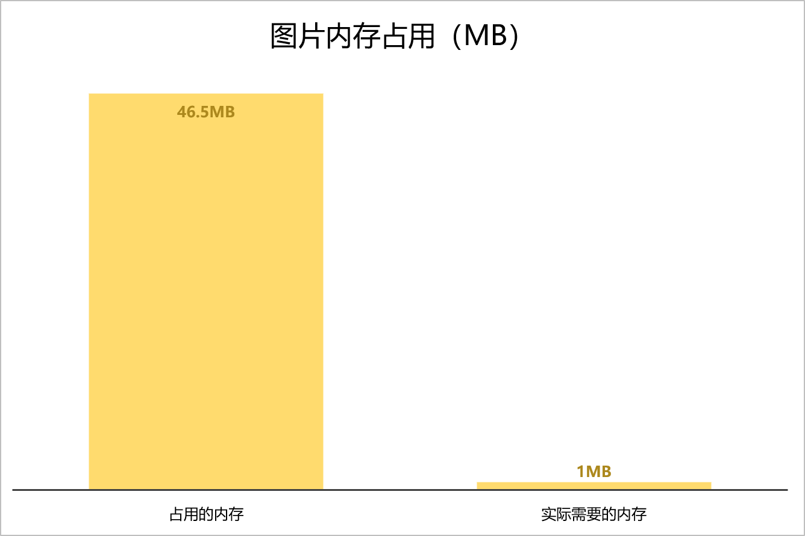

# 优化应用内存占用问题

## 概述

用户功能的不断增强，应用越来越复杂，占用的内存也在不断膨胀，而内存作为系统的稀缺资源比较有限，当应用程序占用过多内存时，系统可能会频繁进行内存回收和重新分配，导致应用程序的性能下降，甚至出现崩溃和卡顿的情况。因此，主动减少应用内存的占用对于整个系统至关重要。通过减少应用内存的占用，可以有效提高应用的性能和响应速度，节省系统资源，让设备的运行效率更高，延长设备的续航时间。开发者应该在应用开发过程中注重内存管理，积极采取措施来减少内存占用，以优化应用程序的性能和用户体验。

OpenHarmony提供了一些内存管理的工具和接口，帮助开发者有效地管理内存资源：
* onMemoryLevel接口：开发者可通过该接口监听系统内存的变化，并做根据系统内存的实时情况，动态地调整应用程序的内存，以避免内存过度占用导致的性能问题。
* LRUCache：LRUCache用于在缓存空间不够的时候，将近期最少使用的数据替换为新数据。
* 生命周期管理：在生命周期管理中，可以释放不再使用的系统资源，包括应用内存、监听事件、网络句柄等。
* Purgeable Memory内存管理机制：在该机制中，开发者可以通过使用相关接口创建PurgeableMemory对象，从而管理Purgeable内存。
* 图片加载和渲染：在使用Image组件加载和渲染图片时，开发者可以手动调整图片源文件的尺寸大小，使其与组件大小一致。这样可以避免图片过大或过小导致的显示问题，并提高应用程序的用户体验。
  本文将从这五个方面来介绍如何优化应用内存占用问题。

## 使用onMemoryLevel监听内存变化

onMemoryLevel是OpenHarmony提供监听系统内存变化的接口，开发者可以通过onMemoryLevel监听内存变化，从而调整应用的内存。onMemoryLevel回调包括三种方式，分别为[AbilityStage](https://developer.huawei.com/consumer/cn/doc/harmonyos-references-V5/js-apis-app-ability-abilitystage-V5#abilitystageonmemorylevel)、[UIAbility](https://developer.huawei.com/consumer/cn/doc/harmonyos-references-V5/js-apis-app-ability-ability-V5#abilityonmemorylevel)、[EnvironmentCallback](https://developer.huawei.com/consumer/cn/doc/harmonyos-references-V5/js-apis-app-ability-environmentcallback-V5#environmentcallbackonmemorylevel)。

* AbilityStage：当HAP中的代码首次被加载到进程中的时候，系统会先创建AbilityStage实例，系统决定调整内存时，再回调AbilityStage实例的onMemoryLevel方法。
* UIAbility：Ability是UIAbility的基类，在Ability中，提供系统内存变化的回调方法。
* EnvironmentCallback：EnvironmentCallback模块提供应用上下文ApplicationContext对系统环境变化监听回调的能力。

MemoryLevel分为MEMORY_LEVEL_MODERATE、MEMORY_LEVEL_LOW和MEMORY_LEVEL_CRITICAL三种。其中，MEMORY_LEVEL_MODERATE代表当前系统内存压力适中，应用可以正常运行而不会受到太大影响，MEMORY_LEVEL_LOW代表当前系统的内存已经比较低了，应用应该释放不必要的内存资源，避免造成系统卡顿，MEMORY_LEVEL_CRITICAL代表当前所剩的系统内存非常紧张，应用应该尽可能释放更多的资源，以确保系统的稳定性和性能。开发人员应该根据不同的内存级别来采取相应的措施，如释放资源、优化内存使用等，以确保应用在不同内存状态下都能正常运行。MemoryLevel具体等级定义如下所示：

| 等级                    | 值 | 说明                                                                      |
|:----------------------|:--|:------------------------------------------------------------------------|
| MEMORY_LEVEL_MODERATE | 0 | 系统内存适中。系统可能会开始根据LRU缓存规则杀死进程。                                            |
| MEMORY_LEVEL_LOW      | 1 | 系统内存比较低。此时应该去释放掉一些不必要的资源以提升系统的性能。                                       |
| MEMORY_LEVEL_CRITICAL | 2 | 系统内存很低。此时应当尽可能地去释放任何不必要的资源，因为系统可能会杀掉所有缓存中的进程，并且开始杀掉应当保持运行的进程，比如后台运行的服务。 |

* 说明：后台已冻结的应用，AbilityStage、UIAbility、EnvironmentCallback的onMemoryLevel都不可以进行回调。

## 使用LRUCache优化ArkTS内存

LRU（Least Recently Used， 最近最少使用）是一种常见的算法，其核心思想是基于时间局部性原理，即如果一个数据在最近被访问过，那么它在未来被访问的概率也会比较高。

[LRUCache](https://developer.huawei.com/consumer/cn/doc/harmonyos-references-V5/js-apis-util-V5#lrucache9)是ArkTS中常用的工具函数，是基于LRU实现的缓存工具，常用于缓存一些频繁访问的数据，例如常用的图片、网络请求的结果等。LRUCache通过维护一个缓存空间来存储数据，当缓存空间不足时，会根据LRU算法将最近最少使用的数据替换掉，以保证缓存空间的有效利用。因此，LRUCache会根据数据的访问顺序来进行数据替换，优先淘汰最久未被访问的数据。

### 原理介绍

LRUCache通过LinkedHashMap来实现LRU的，LinkedHashMap继承于HashMap，HashMap用于快速查找数据，LinkedHashMap双向链表用于记录数据的顺序关系。所以，对于get、put、remove等操作，LinkedHashMap除了包含HashMap的功能，还需要实现调整Entry顺序链表的工作。其数据结构如下图所示：

**图1** LRUCache的LinkedHashMap数据结构图



LruCache中将LinkedHashMap的顺序设置为LRU顺序，链表头部的对象为近期最少用到的对象。常用的方法及其说明如下所示：

* 调用get方法：根据key查询对应，如果没有查到则返回null。查询到对应对象后，将该对象移到链表的尾端，并返回查询的对象。
* 调用put方法：会添加key-value的键值对到缓存中，也是将新对象存储在链表尾端。当内存缓存达到设定的最大值时，将链表头部的对象移除。如果key已经存在，则更新当前key对应的value。
* 调用remove方法：删除key对应的缓存value，如果key对应的value不在，则返回为null，否则，返回已删除的key-value键值对。
* 调用updateCapacity方法：设置缓存存储的容量，如果新设置的容量newCapacity小于之前的容量capacity，则只保存newCapacity大小的数据。

### 参考案例

缓存工具类可以被设计成一个工具类，其中包含LRUCache单例以及一些操作LRUCache的方法，如添加数据、获取数据、删除数据等。通过创建一个静态方法来获取LRUCache实例，并在内部进行实例化，可以保证全局只有一个LRUCache对象。通过缓存工具类，各组件之间可以方便地共享缓存数据，避免重复创建缓存实例和数据冗余。这样不仅可以提高系统的性能和效率，还可以减少内存占用和提升数据访问速度。

```javascript
import { util } from '@kit.ArkTS';

export class LRUCacheUtil {
  private static instance: LRUCacheUtil;
  private lruCache: util.LRUCache<string, Object>;

  private constructor() {
    this.lruCache = new util.LRUCache(64);
  }

  // 获取LRUCacheUtil的单例
  public static getInstance(): LRUCacheUtil {
    if (!LRUCacheUtil.instance) {
      LRUCacheUtil.instance = new LRUCacheUtil();
    }
    return LRUCacheUtil.instance;
  }

  // 判断lruCache缓存是否为空
  public isEmpty(): boolean {
    return this.lruCache.isEmpty();
  }

  // 获取lruCache的容量
  public getCapacity(): number {
    return this.lruCache.getCapacity();
  }

  // 重新设置lruCache的容量
  public updateCapacity(newCapacity: number) {
    this.lruCache.updateCapacity(newCapacity);
  }

  // 添加缓存到lruCache中
  public putCache(key: string, value: Object) {
    this.lruCache.put(key, value);
  }

  // 删除key对应的缓存
  public remove(key: string) {
    this.lruCache.remove(key);
  }

  // 获取key对应的缓存
  public getCache(key: string): Object | undefined {
    return this.lruCache.get(key);
  }

  // 判断是否包含key对应的缓存
  public contains(key: string): boolean {
    return this.lruCache.contains(key);
  }

  // 清除缓存数据，并重置lruCache的大小
  public clearCache() {
    this.lruCache.clear();
    this.lruCache.updateCapacity(64);
  }
}
```

在对应的组件中设置缓存，示例代码如下所示：

```javascript
import { LRUCacheUtil } from '../utils/LRUCacheUtil';

@Entry
@Component
struct Index {
  @State message: string = 'Hello World';

  aboutToAppear(): void {
    let lruCache = LRUCacheUtil.getInstance();
    // 添加一个<key, value>到lrucache
    lruCache.putCache('nation',10); 
    // 再添加一个<key, value>到lrucache
    lruCache.putCache('menu',8); 
    // 通过key查询value
    let result0 = lruCache.getCache('2') as number;  
    console.log('result0:' + result0);
    // 从当前缓冲区中删除指定的键及其关联的值
    let result1 = lruCache.remove('2');  
    console.log('result1:' + result1);
    // 检查当前缓冲区是否包含指定的对象
    let result2 = lruCache.contains('1');  
    console.log('result2:' + result2);
    // 设置新的容量大小
    let result4 = lruCache.updateCapacity(110);  
    console.log('result4:' + result4);
  }

  build() {
    Row() {
      Column() {
        Text(this.message)
          .fontSize(50)
          .fontWeight(FontWeight.Bold)
      }
      .width('100%')
    }
    .height('100%')
  }
}
```

同时，可以通过onMemoryLevel监听内存的变化，进而设置对应清理缓存的机制，示例代码如下所示：

```javascript
import { AbilityConstant, UIAbility, Want } from '@kit.AbilityKit';
import { hilog } from '@kit.PerformanceAnalysisKit';
import { window } from '@kit.ArkUI';
import { LRUCacheUtil } from '../utils/LRUCacheUtil';

export default class EntryAbility extends UIAbility {
  // 监听内存的变化
  onMemoryLevel(level: AbilityConstant.MemoryLevel): void {
    // 根据内存的变化执行内存管理策略
    if (level === AbilityConstant.MemoryLevel.MEMORY_LEVEL_CRITICAL) {
      console.log('The memory of device is critical, release memory.');
      if (!LRUCacheUtil.getInstance().isEmpty()) {
        LRUCacheUtil.getInstance().clearCache();
      }
    }
  }
  
  onCreate(want: Want, launchParam: AbilityConstant.LaunchParam): void {
    hilog.info(0x0000, 'testTag', '%{public}s', 'Ability onCreate');
  }

  onDestroy(): void {
    hilog.info(0x0000, 'testTag', '%{public}s', 'Ability onDestroy');
  }
  ...
};
```

## 使用生命周期管理优化ArkTS内存

组件的生命周期，指的是组件自身的一些可自执行的方法，这些方法会在特殊的时间点或遇到一些特殊页面行为时被自动触发而执行。

### 原理介绍

在开发过程中，开发人员可以通过管理对象的生命周期来释放资源、销毁对象、优化ArkTS内存。

* 在UIAbility组件生命周期中，调用对应生命周期的方法，创建或销毁资源。如在Create或Foreground方法中创建资源，在Background、Destroy方法中销毁对应的资源。
* 在页面生命周期中，调用对应生命周期的方法，创建或销毁资源。如在[onPageShow](https://developer.huawei.com/consumer/cn/doc/harmonyos-references-V5/ts-custom-component-lifecycle-V5#onpageshow)方法中创建资源，在[onPageHide](https://developer.huawei.com/consumer/cn/doc/harmonyos-references-V5/ts-custom-component-lifecycle-V5#onpagehide)方法中销毁对应的资源。
* 在组件生命周期中，调用对应生命周期的方法，创建或销毁资源。如在[aboutToAppear](https://developer.huawei.com/consumer/cn/doc/harmonyos-references-V5/ts-custom-component-lifecycle-V5#abouttoappear)方法中创建资源，在[aboutToDisappear](https://developer.huawei.com/consumer/cn/doc/harmonyos-references-V5/ts-custom-component-lifecycle-V5#abouttodisappear)方法中销毁不再使用的对象、注销不再使用的订阅事件。
* 调用组件自带的方法，创建、销毁组件。如调用XComponent的[onDestroy](https://developer.huawei.com/consumer/cn/doc/harmonyos-references-V5/ts-basic-components-xcomponent-V5#ondestroy)方法。

### aboutToDisappear中销毁订阅事件

aboutToDisappear函数会在组件析构销毁之前执行。如下案例所示，在使用完网络管理的网络连接模块后，取消订阅默认网络状态变化的通知。

```javascript
import { connection } from '@kit.NetworkKit';
import { BusinessError } from '@kit.BasicServicesKit';
import { CommonConstant as Const } from '../common/Constant';
import { promptAction } from '@kit.ArkUI';
import { Logger } from '../utils/Logger';

@Entry
@Component
struct Index {
  @State networkId: string = Const.NETWORK_ID;
  @State netMessage: string = Const.INIT_NET_MESSAGE;
  @State connectionMessage: string = Const.INIT_CONNECTION_MESSAGE;
  @State netStateMessage: string = '';
  @State hostName: string = '';
  @State ip: string = '';
  private controller: TabsController = new TabsController();
  private netHandle: connection.NetHandle | null = null;
  private netCon: connection.NetConnection | null = null;
  scroller: Scroller = new Scroller();

  aboutToDisappear(): void {
    this.unUseNetworkRegister;
  }

  build() {
    Column() {
      Text($r('app.string.network_title'))
        .fontSize($r('app.float.title_font_size'))
        .fontWeight(FontWeight.Bold)
        .textAlign(TextAlign.Start)
        .margin({ left: Const.WebConstant_TEN_PERCENT })
        .width(Const.WebConstant_FULL_WIDTH)

      Column() {
        Row() {
          Text(Const.MONITOR_TITLE)
            .fontSize($r('app.float.font_size'))
            .margin($r('app.float.md_padding_margin'))
            .fontWeight(FontWeight.Medium)
          Blank()
          Toggle({ type: ToggleType.Switch, isOn: false })
            .selectedColor(Color.Blue)
            .margin({ right: $r('app.float.md_padding_margin') })
            .width($r('app.float.area_width'))
            .height(Const.WebConstant_BUTTON_HEIGHT)
            .onChange((isOn) => {
              if (isOn) {
                this.useNetworkRegister();
              } else {
                this.unUseNetworkRegister();
              }
            })
        }
        .height($r('app.float.button_height'))
        .borderRadius($r('app.float.md_border_radius'))
        .margin({ left: $r('app.float.md_padding_margin'), right: $r('app.float.md_padding_margin') })
        .width(Const.WebConstant_NINETY_PERCENT)
        .backgroundColor($r('app.color.text_background'))

        TextArea({ text: this.netStateMessage })
          .fontSize($r('app.float.font_size'))
          .width(Const.WebConstant_NINETY_PERCENT)
          .height(Const.WebConstant_FIVE_HUNDRED)
          .margin($r('app.float.md_padding_margin'))
          .borderRadius($r('app.float.md_border_radius'))
          .textAlign(TextAlign.Start)
          .focusOnTouch(false)

        Button($r('app.string.clear'))
          .fontSize($r('app.float.font_size'))
          .width(Const.WebConstant_NINETY_PERCENT)
          .height($r('app.float.area_height'))
          .margin({
            left: $r('app.float.md_padding_margin'),
            right: $r('app.float.md_padding_margin'),
            bottom: $r('app.float.xxl_padding_margin')
          })
          .onClick(() => {
            this.netStateMessage = '';
          })
        Blank()
      }
      .height(Const.WebConstant_FULL_HEIGHT)
      .justifyContent(FlexAlign.Start)
    }
    .width(Const.WebConstant_FULL_WIDTH)
  }

  getConnectionProperties() {
    connection.getDefaultNet().then((netHandle: connection.NetHandle) => {
      connection.getConnectionProperties(netHandle, (error: BusinessError, connectionProperties: connection.ConnectionProperties) => {
        if (error) {
          this.connectionMessage = Const.CONNECTION_PROPERTIES_ERROR;
          Logger.error('getConnectionProperties error:' + error.code + error.message);
          return;
        }
        this.connectionMessage = Const.CONNECTION_PROPERTIES_INTERFACE_NAME + connectionProperties.interfaceName
          + Const.CONNECTION_PROPERTIES_DOMAINS + connectionProperties.domains
          + Const.CONNECTION_PROPERTIES_LINK_ADDRESSES + JSON.stringify(connectionProperties.linkAddresses)
          + Const.CONNECTION_PROPERTIES_ROUTES + JSON.stringify(connectionProperties.routes)
          + Const.CONNECTION_PROPERTIES_LINK_ADDRESSES + JSON.stringify(connectionProperties.dnses)
          + Const.CONNECTION_PROPERTIES_MTU + connectionProperties.mtu + '\n';
      })
    });
  }

  useNetworkRegister() {
    this.netCon = connection.createNetConnection();
    this.netStateMessage += Const.REGISTER_NETWORK_LISTENER;
    this.netCon.register((error) => {
      if (error) {
        Logger.error('register error:' + error.message);
        return;
      }
      promptAction.showToast({
        message: Const.REGISTER_NETWORK_LISTENER_MESSAGE,
        duration: 1000
      });
    })
    this.netCon.on('netAvailable', (netHandle) => {
      this.netStateMessage += Const.NET_AVAILABLE + netHandle.netId + '\n';
    })
    this.netCon.on('netBlockStatusChange', (data) => {
      this.netStateMessage += Const.NET_BLOCK_STATUS_CHANGE + data.netHandle.netId + '\n';
    })
    this.netCon.on('netCapabilitiesChange', (data) => {
      this.netStateMessage += Const.NET_CAPABILITIES_CHANGE_ID + data.netHandle.netId
        + Const.NET_CAPABILITIES_CHANGE_CAP + JSON.stringify(data.netCap) + '\n';
    })
    this.netCon.on('netConnectionPropertiesChange', (data) => {
      this.netStateMessage += Const.NET_CONNECTION_PROPERTIES_CHANGE_ID + data.netHandle.netId
        + Const.NET_CONNECTION_PROPERTIES_CHANGE_CONNECTION_PROPERTIES + JSON.stringify(data.connectionProperties) + '\n';
    })
  }

  unUseNetworkRegister() {
    if (this.netCon) {
      this.netCon.unregister((error: BusinessError) => {
        if (error) {
          Logger.error('unregister error:' + error.message);
          return;
        }
        promptAction.showToast({
          message: Const.UNREGISTER_NETWORK_LISTENER_MESSAGE,
          duration: 1000
        });
        this.netStateMessage += Const.UNREGISTER_NETWORK_LISTENER;
      })
    } else {
      this.netStateMessage += Const.UNREGISTER_NETWORK_LISTENER_FAIL;
    }
  }
}
```

## 使用purgeable优化C++内存

[Purgeable Memory](https://developer.huawei.com/consumer/cn/doc/harmonyos-references-V5/purgeable__memory_8h-V5)是HarmonyOS中native层常用的内存管理机制，可用于图像处理的Bitmap、流媒体应用的一次性数据、图片等。应用可以使用Purgeable Memory存放其内部的缓存数据，并由系统根据淘汰策略统一管理全部的purgeable内存。当系统内存不足时，系统可以通过丢弃purgeable内存快速回收内存资源，以释放更多的内存资源给其他应用程序使用，实现全局高效的缓存数据管理。这种机制可以帮助系统更有效地管理内存，提高系统的稳定性和流畅性。

在使用Purgeable内存时，开发者可以调用接口释放Purgeable内存，但需要注意在适当的时机释放Purgeable内存，以确保内存资源能够得到有效管理，避免内存占用过高导致的性能问题和内存泄漏的情况。通过合理使用Purgeable内存，开发者可以更好地管理应用程序的内存，提高用户体验。

### 原理介绍

Purgeable内存访问流程图如下图所示，在访问Purgeable内存时，首先需要判断当前Purgeable内存的数据是否已经被回收，如果Purgeable内存已经被回收了，那么需要先重建数据再使用。在访问Purgeable内存的数据时，Purgeable内存对应的引用计数refcnt加1，在访问Purgeable结束后，其引用计数refcnt会减1，当引用计数为0的时候，该Purgeable内存可以被系统回收。

**图2** Purgeable内存访问流程图


Purgeable内存回收流程图如下所示，当引用计数为0时，丢弃掉Purgeable内存中的数据，并标识Purgeable内存已回收。

**图3** Purgeable内存回收流程图



### 参考案例

在CMakeLists.txt文件中引入Purgeable对应的动态链接库libpurgeable_memory_ndk.z.so，具体如下所示：

```c
# the minimum version of CMake.
cmake_minimum_required(VERSION 3.4.1)
project(MyNativeApplication)
set(NATIVERENDER_ROOT_PATH ${CMAKE_CURRENT_SOURCE_DIR})
if(DEFINED PACKAGE_FIND_FILE)
    include(${PACKAGE_FIND_FILE})
endif()
include_directories(${NATIVERENDER_ROOT_PATH}
                    ${NATIVERENDER_ROOT_PATH}/include)
add_library(entry SHARED napi_init.cpp)
# 引入libpurgeable_memory_ndk.z.so动态链接库
target_link_libraries(entry PUBLIC libace_napi.z.so libpurgeable_memory_ndk.z.so)
```

引入purgeable_memory文件，并声明创建PurgeableMemory对象需要使用的ModifyFunc函数，调用OH_PurgeableMemory_Create创建PurgeableMemory对象。

在读取PurgeableMemory对象的内容时，需要调用OH_PurgeableMemory_BeginRead，读取结束时，需要调用OH_PurgeableMemory_EndRead。其中，OH_PurgeableMemory_GetContent可以获取PurgeableMemory对象的内存数据。

在修改PurgeableMemory对象的内容时，需要调用OH_PurgeableMemory_BeginWrite，读取结束时，需要调用OH_PurgeableMemory_EndWrite。其中，OH_PurgeableMemory_AppendModify可以更新PurgeableMemory对象重建规则。

```c
#include "napi/native_api.h"
#define DATASIZE (4 * 1024 * 1024)
#include "purgeable_memory/purgeable_memory.h"

bool ModifyFunc(void *data, size_t size, void *param) {
    data = param;
    return true;
}
// 业务定义对象类型
class ReqObj;
static napi_value Add(napi_env env, napi_callback_info info)
{
    size_t requireArgc = 2;
    size_t argc = 2;
    napi_value args[2] = {nullptr};
    napi_get_cb_info(env, info, &argc, args , nullptr, nullptr);
    napi_valuetype valuetype0;
    napi_typeof(env, args[0], &valuetype0);
    napi_valuetype valuetype1;
    napi_typeof(env, args[1], &valuetype1);
    double value0;
    napi_get_value_double(env, args[0], &value0);
    double value1;
    napi_get_value_double(env, args[1], &value1);
    double result = value0 + value1;
    // 创建一个PurgeableMemory对象
    OH_PurgeableMemory *pPurgmem = OH_PurgeableMemory_Create(DATASIZE, ModifyFunc, &result);
    // 读取对象
    OH_PurgeableMemory_BeginRead(pPurgmem);
    // 获取PurgeableMemory对象大小
    size_t size = OH_PurgeableMemory_ContentSize(pPurgmem);
    // 获取PurgeableMemory对象内容
    ReqObj *pReqObj = (ReqObj *)OH_PurgeableMemory_GetContent(pPurgmem);
    // 读取PurgeableMemory对象结束
    OH_PurgeableMemory_EndRead(pPurgmem);

    // 修改PurgeableMemory对象
    OH_PurgeableMemory_BeginWrite(pPurgmem);
    // 声明扩展创建函数的参数
    double newResult = value0 + value0;
    // 更新PurgeableMemory对象重建规则
    OH_PurgeableMemory_AppendModify(pPurgmem, ModifyFunc, &newResult);
    // 修改PurgeableMemory对象结束
    OH_PurgeableMemory_EndWrite(pPurgmem);
    // 销毁对象
    OH_PurgeableMemory_Destroy(pPurgmem);
    napi_value sum;
    napi_create_double(env, result, &sum);
    return sum;
}
EXTERN_C_START
static napi_value Init(napi_env env, napi_value exports)
{
    napi_property_descriptor desc[] = {
        { "add", nullptr, Add, nullptr, nullptr, nullptr, napi_default, nullptr }
    };
    napi_define_properties(env, exports, sizeof(desc) / sizeof(desc[0]), desc);
    return exports;
}
EXTERN_C_END

static napi_module demoModule = {
    .nm_version = 1,
    .nm_flags = 0,
    .nm_filename = nullptr,
    .nm_register_func = Init,
    .nm_modname = "entry",
    .nm_priv = ((void*)0),
    .reserved = { 0 },
};
extern "C" __attribute__((constructor)) void RegisterEntryModule(void)
{
    napi_module_register(&demoModule);
}
```

## 使用合理尺寸的图片优化应用内存

### 原理介绍

应用在定义界面时，对于使用不同类型的组件，在定义界面时需要绘制不同的内容。图片组件主要用来加载和显示图片，而组件本身也需要占用内存。ArkTS目前采用引用计数的机制来管理内存。引用计数是一种简单而高效的内存管理方式，它通过记录每个对象被引用的次数来确定何时释放对象。需要注意的是，如果组件没有正确释放，即使其他地方不再使用该组件，对应的引用链接上的资源也不会被释放，可能会导致内存泄漏问题。

一张全屏的图片，不同分辨率的内存占用大小如下：



由上图可以看出，对于一些页面多、图片多、效果多的资源密集型应用，内存很容易达到较高水平。当应用的内存占用超过系统设定的阈值（如4G，其中4G只是示例，不同系统的阈值不同）时，系统可能会认为应用存在严重的内存问题，并可能会强制杀死该应用进程，以保证设备系统的稳定性和性能。为了避免应用被系统杀死，开发者可以考虑以下两点：

* 优化资源使用：通过合理设置图片源文件大小，合理使用内存资源，减少图片所占应用内存。
* [优化布局性能](./reduce-view-nesting-levels.md)：通过减少布局嵌套层级，减少过度绘制可以产生较大的性能收益。

本文主要指导开发者通过合理设置图片源文件大小，合理使用内存资源，减少图片所占应用内存。

### 避免加载超过显示尺寸的图片

```javascript
Column() {
  Image($r('app.media.image'))
    .width("500px")
    .height("500px")
}
```

如上代码示例中，使用500 * 500尺寸大小的Image组件加载一张尺寸为4032 * 3024的RGBA格式图片时（每个像素占用4个字节），图片申请了约46.5M的内存。这是因为图片的原始尺寸较大，加载到Image组件中时需要将其缩放到500 * 500的尺寸，这个过程会占用一定的内存空间。

可使用公式计算出来纹理图片内存大小 = imageWidth x imageHeight x format（4032 * 3024 * 4 = 48771072 bytes ≈ 46.5M）。

但是实际上，组件只需要500 * 500的尺寸。也就是说，实际需要的内存 = 500 * 500 * 4 ≈ 1M。



因此当一张图片比控件显示的区域要大，最终会被裁剪或者缩放。大量的裁剪和缩放不仅导致视图效果变差，还会浪费内存，引起严重的功耗问题。为了最大程度地节省内存，开发者可以手动调整源文件的尺寸大小，使其与组件的大小保持一致。这样可以避免不必要的内存浪费，并提高应用程序的性能和效率。开发者可以使用图像处理工具来调整图像的尺寸大小，从而进一步节省内存空间。

## 其他方法

在日常开发中，常见的其他减少内存方式有如下几种：

* 使用虚引用（Weak Reference）：在HarmonyOS应用开发中，可以使用虚引用（Weak Reference）来避免内存泄漏。通过使用Weak Reference，可以避免循环引用导致的内存泄漏问题，确保对象在不再需要时能够被正确释放。
* 使用Sendable：符合Sendable协议的数据可以在ArkTS并发实例间传递，从而减少拷贝的开销及其内存。关于Sendable的详细内容可参考[《Sendable开发指导》](https://developer.huawei.com/consumer/cn/doc/harmonyos-guides-V5/arkts-sendable-V5)。
* 使用可共享对象：共享对象SharedArrayBuffer，拥有固定长度，可以存储任何类型的数据，包括数字、字符串等。共享对象传输指SharedArrayBuffer支持在多线程之间传递，传递之后的SharedArrayBuffer对象和原始的SharedArrayBuffer对象指向同一块内存，进而达到内存共享的目的。详细内容可参考[《SharedArrayBuffer对象》](https://developer.huawei.com/consumer/cn/doc/harmonyos-guides-V5/shared-arraybuffer-object-V5)。