# 小程序场景性能优化开发指导

## 简介

小程序是一种轻量级的应用，它不需要下载、安装即可使用，用户可以通过扫描二维码或者搜索直接打开使用。小程序运行在特定的平台上，平台提供了小程序的运行环境（运行容器）和一些基础服务（小程序API）。

小程序的架构设计使得它具有快速开发、易于部署、用户使用门槛低等特点，非常适用于实现一些轻量级的应用场景。

图1 经典小程序的双线程架构

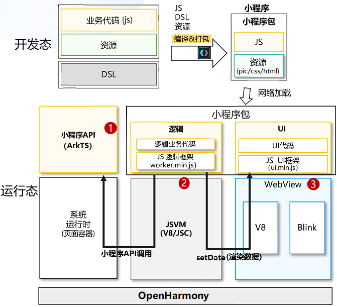

小程序的架构如图1所示，其重要组成结构包括小程序API、JSVM Worker、Webview Render三个部分：

**小程序API：** 它定义了小程序与外部系统或服务交互的方式。小程序平台提供了丰富的API，包括但不限于网络请求、本地存储、设备信息、媒体处理等。开发者可以通过调用这些API来实现小程序的各种功能，如获取用户位置、播放音乐、访问网络资源等。

**JSVM Worker：** 简称Worker，指的是小程序中逻辑层，它允许开发者在不阻塞主线程的情况下执行耗时的操作，如数据的上传下载、大量数据处理等。比如小程序中的Worker是一个运行在JS线程中的 JavaScript 环境，它与主线程并行执行，互不干扰。

**Webview Render：** 简称Render， 通常指的是小程序的视图层或渲染层，即小程序的界面是如何被渲染到屏幕上的。小程序的渲染层由小程序框架提供，开发者通过编写WXML（类似 HTML 的标记语言）和WXSS（类似 CSS 的样式表）来定义界面的布局和样式。小程序的渲染引擎会将WXML和WXSS解析并渲染成用户可以看到的界面。


## 典型业务场景

### 典型场景

根据人因体验指标，总结当前小程序性能体验的场景如下：

| **场景分类** | **场景名称**  | **简述** |
| ------ | ------------------- | ------------------------------------- |
| 小程序页面加载  | 页面加载 | 从原生页面启动小程序，从抬手到小程序首页完全加载完成。 |
| 小程序页面中上下滑动浏览场景  | 滑动帧率 | 用户在小程序页面中上下滑动，浏览页面中信息。如用户在外卖小程序页面，上下滑动浏览商家信息。 |
| 点击跳转场景  | 点击响应 | 点击跳转，从抬手到页面变化第一帧 |


### 场景优化方案

从小程序的场景出发，通过剖析小程序运行时的性能瓶颈， 发现小程序的性能主要体现在以下几个方面：

1. 组件启动性能：指小程序中各个组件(JSVM、ArkWeb)从初始化到可用状态所需的时间。
2. 加载性能：涉及小程序从网络或本地加载资源（如页面、图片、脚本等）的速度。
3. 执行性能：小程序代码执行的效率，包括脚本解析、执行和逻辑处理的速度。
4. 调用性能：小程序API调用的响应速度和效率，包括与操作系统或硬件交互的性能。
5. 渲染性能：小程序界面元素渲染到屏幕上的速度和流畅度，直接影响用户体验。

针对各个场景的特征和性能瓶颈，设计了高性能方案，小程序容器可以通过接入高性能方案来解决性能问题。

| **场景分类** | **场景名称**  | **优化方案** |
| ------ | ------- | ------- |
| 小程序页面加载  | 页面加载 | 小程序容器预热<br>同步JSBridge&AsyncJSB<br>字节码CodeCache加速<br>小程序公共资源加载加速<br>JSVM性能优化<br>小程序API性能优化 |
| 小程序页面中上下滑动浏览场景  | 滑动帧率 | 同步JSBridge&AsyncJSB<br>JSVM性能优化<br>小程序API性能优化 |
| 点击跳转场景  | 点击响应 | 小程序容器预热<br>同步JSBridge&AsyncJSB<br>字节码CodeCache加速<br>小程序公共资源加载加速<br>JSVM性能优化<br>小程序API性能优化 |


## 小程序容器预热


### 原理介绍

小程序启动时，需要创建一个JavaScript引擎，用来执行小程序的逻辑代码，再创建一个WebView，用来渲染小程序的视图。

如果小程序启动时，每次都新创建小程序的运行时环境，其加载性能不可避免的会受到影响，造成用户体验下降。

小程序启动大致流程如图2所示：

图2 小程序启动时序示意图

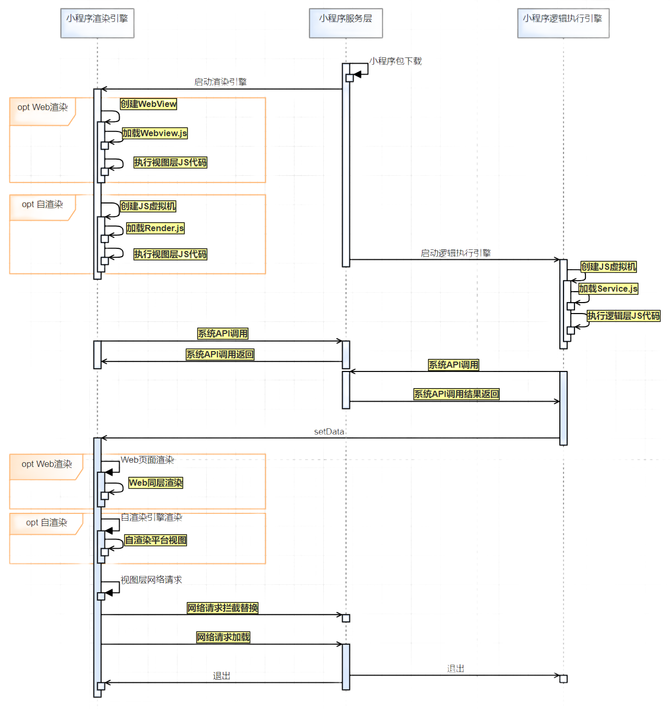

小程序在启动过程中，包含Worker的启动和Render的启动、小程序框架(render.js&service.js)的初始化等步骤，且每个小程序的启动过程都是重复的，因此可以将小程序容器提前创建好，并将公共资源注入到容器中，在小程序启动时，只需要加载小程序的业务代码即可。


### 场景优化关键点

1. **预热WebView：** 创建离线WebView，并注入小程序视图层的公共资源，并初始化小程序的视图框架。

2. **预热JSVM：** 创建JSVM，并注入小程序逻辑层的公共资源，并初始化小程序逻辑框架。

上述2个关键优化点能带来显著的性能提升。由于所有的关键点都是建立在预热的思路上，提前深度预热小程序运行时容器。下表对各关键点的效果、代价和建议场景进行对比。

| **关键点** | **收益**  | **代价** |
| ------ | ------- | ------------------------------------- |
| 预热Webview  | 小程序启动性能提升 | 建一个空WebView，多消耗约10M内存 |
| 预热JSVM  | 小程序启动性能提升 | 建一个空JSVM，多消耗约5M内存 |


JSVM的创建与预热较为简单，不涉及UI的复杂状态转换，详细案例可参考[《使用JSVM-API接口创建多个引擎执行JS代码并销毁》](https://developer.huawei.com/consumer/cn/doc/harmonyos-guides-V5/use-jsvm-runtime-task-V5)。


### WebView预热方案

#### 鸿蒙化实现方案

本方案适用于WebView预热场景。开发者创建一个新的ArkWeb组件，并在后台注入小程序的公共资源，组件状态为Hidden和InActive，开发者可以在后续使用中按需动态让WebView挂载到ArkUI树上，进行显示。详情请参考[《Web组件开发性能提升指导-预渲染优化》](https://developer.huawei.com/consumer/cn/doc/best-practices-V5/bpta-web-develop-optimization-V5#section172031338172719)。

  > 说明  
  > Web组件数量限制：WebView创建会消耗更多的内存、算力，小程序创建离线WebView组件数量要求小于200个。
  >
  > 性能建议：WebView同样提供了CAPI，推荐在C++侧对WebView进行操作。


通过提前创建WebView控件，进行WebView组件的预热，还可以更进一步，结合后续章节中离线资源免拦截注入，可以实现对小程序框架的预热。


## 同步JSBridge与异步JSBridge

### JSBridge优化解决方案

#### 原理描述

本方案适用于ArkWeb应用侧通信场景，开发者可根据应用架构选择合适的业务通信机制（以下简称JSBridge）：

1. 应用使用ArkTS语言开发，推荐使用ArkWeb在ArkTS提供的runJavaScriptExt接口实现应用侧至前端页面的通信，同时使用registerJavaScriptProxy实现前端页面至应用侧的通信。

2. 应用使用ArkTS、C++语言混合开发，或本身应用结构较贴近于小程序架构，自带C++侧环境，推荐使用ArkWeb在NDK侧提供的OH_NativeArkWeb_RunJavaScript及OH_NativeArkWeb_RegisterJavaScriptProxy接口实现JSBridge功能。


图3 小程序数据通信架构示意图

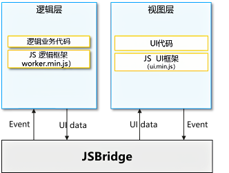

图3为具有普适性的小程序一般架构，其中逻辑层需要应用自带JavaScript运行时，本身已存在C++环境，通过NDK接口可直接在C++环境中完成与视图层（ArkWeb作为渲染器）的通信，无需再返回ArkTS环境调用JSBridge相关接口。

图4 NDK JSBridge方案示意图
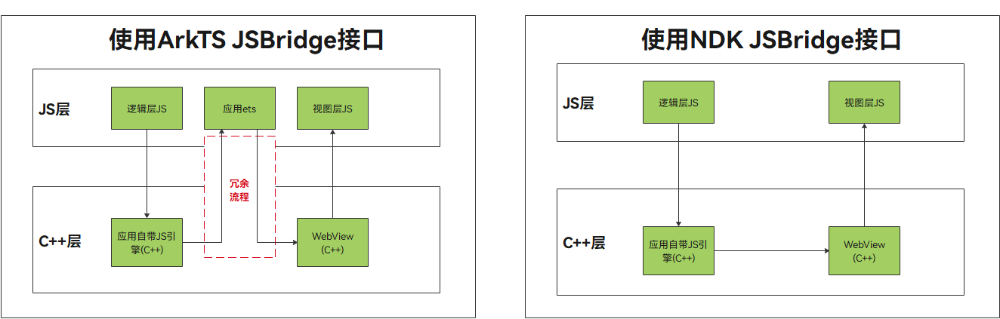

NDK JSBridge方案可以解决ArkTS环境的冗余切换，同时允许回调在非UI线程上报，避免造成UI阻塞，如图4所示。

ArkTS侧JSBridge详细使用指南，可参考[《应用侧调用前端页面函数》](https://developer.huawei.com/consumer/cn/doc/harmonyos-guides-V5/web-in-app-frontend-page-function-invoking-V5)、[《前端页面调用应用侧函数》](https://developer.huawei.com/consumer/cn/doc/harmonyos-guides-V5/web-in-page-app-function-invoking-V5)。


#### 实践案例

**【场景一】** 使用ArkTS接口实现JSBridge通信

具体实践场景请参考[《Web组件开发性能提升指导-JSBridge优化案例一》](https://developer.huawei.com/consumer/cn/doc/best-practices-V5/bpta-web-develop-optimization-V5#section16140548175117)。


**【场景二】** 使用NDK接口实现JSBridge通信

图5 使用NDK接口实现JSBridge通信核心流程图

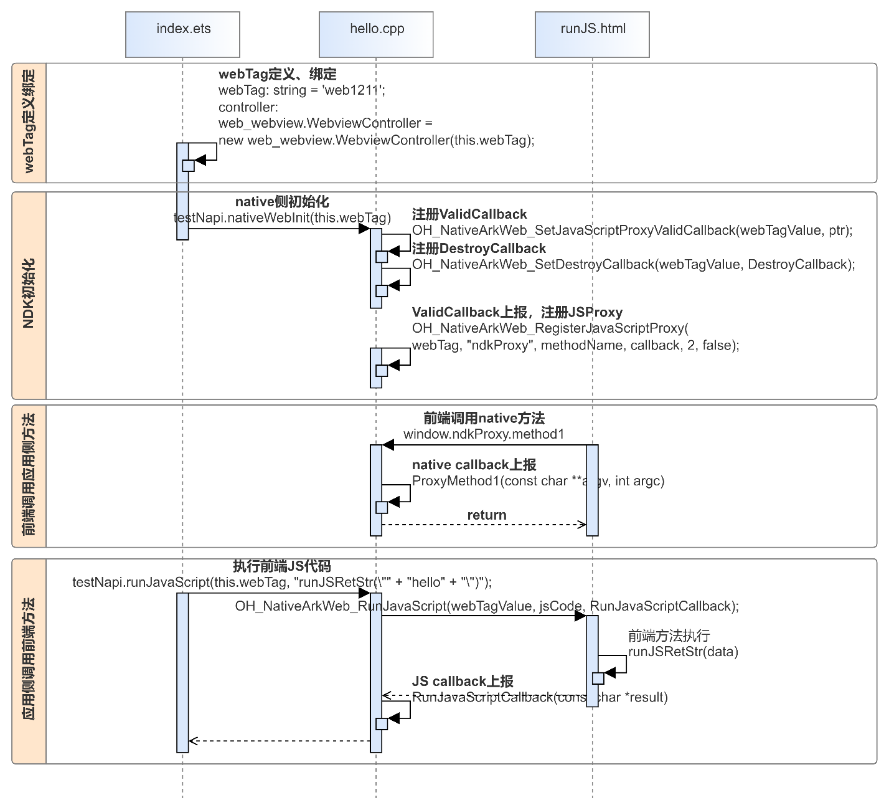

具体实现场景请参考[《Web组件开发性能提升指导-JSBridge优化案例二》](https://developer.huawei.com/consumer/cn/doc/best-practices-V5/bpta-web-develop-optimization-V5#section16140548175117)。


### 异步JSBridge调用

#### 原理描述

本方案用于ArkWeb侧调用系统能力场景下，将开发者指定的JSBridge接口调用抛出后，不等待执行结果，以避免在应用主线程负载重时，JSBridge同步调用可能导致Web线程等待IPC时间过长，造成调用阻塞的问题。


| **优化前** | **优化后**  |
| :----: | :-----: |
| 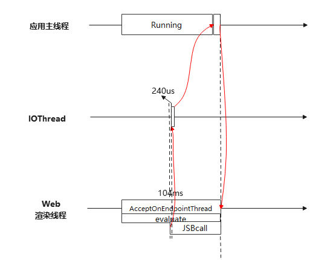  | 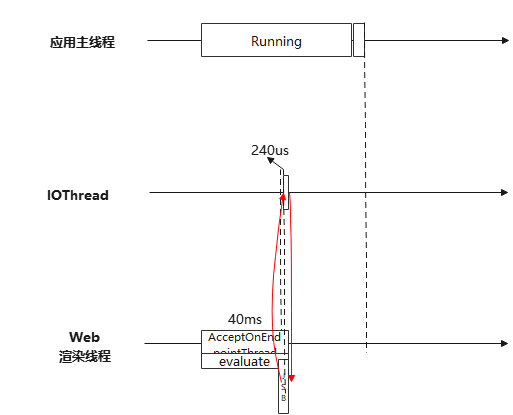 |


**优化前：** JSBCall调用应用主线程上运行的业务功能函数时，Web渲染线程需要停下来，等待应用主线程上执行完业务功能函数，才能返回Web渲染线程，Web渲染线程才能继续往下执行。当应用主线程繁忙时，JSB调用需要排队才能得到执行，这时Web渲染线程阻塞的时间变长，性能劣化非常严重。

**优化后：** JSBCall调用应用主线程上运行的业务功能函数时，Web渲染线程无需等待应用主线程执行业务功能函数，可以继续往下执行，当应用主线程繁忙时，性能提升非常明显。


#### 实践案例

具体实践场景及方案关键点请参考[《Web组件开发性能提升指导-异步JSBridge调用》](https://developer.huawei.com/consumer/cn/doc/best-practices-V5/bpta-web-develop-optimization-V5#section25281659132214)。


## CodeCache加速

### ArkWeb支持预编译JavaScript生成字节码缓存（Code Cache）

#### 原理描述

本方案用于在页面加载之前提前将即将使用到的JavaScript文件编译成字节码并缓存到本地，在页面首次加载时节省编译时间。


图6 预编译JavaScript核心流程图

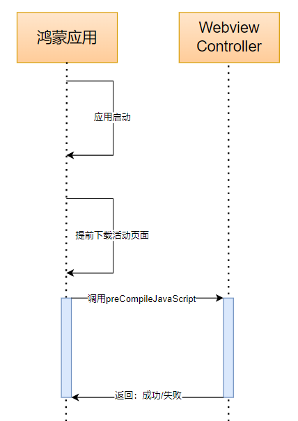


#### 实践案例

具体实践场景及方案关键点请参考[《Web组件开发性能提升指导-预编译JavaScript生成字节码缓存（Code Cache）》](https://developer.huawei.com/consumer/cn/doc/best-practices-V5/bpta-web-develop-optimization-V5#section563844632917)。


### ArkWeb支持自定义协议的JavaScript生成字节码缓存（Code Cache）

#### 原理描述

本方案用于在页面加载时存在自定义协议的JavaScript，支持其生成字节码缓存到本地，在页面非首次加载时节省编译时间。


#### 实践案例

具体实践场景及方案关键点请参考[《Web组件开发性能提升指导-支持自定义协议的JavaScript生成字节码缓存（Code Cache）》](https://developer.huawei.com/consumer/cn/doc/best-practices-V5/bpta-web-develop-optimization-V5#section16135512174319)。


### JSVM支持JavaScript生成字节码缓存（Code Cache）

#### 原理描述

V8引擎在执行JavaScript代码之前需要将JavaScript代码先编译成ByteCode，再执行代码逻辑，而这个编译的耗时，一般占JS执行时间的20~30%，因此，提供JavaScript文件编译成ByteCode的接口，可以加速JSVM的执行速度。

**API说明**

| **接口** | **优功能说明**  |
| ---- | ------------------------- |
| OH_JSVM_CompileScript | 编译JavaScript代码并返回绑定到当前环境的编译脚本 |
| OH_JSVM_CompileScriptWithOrigin | 编译JavaScript代码并返回绑定到当前环境的编译脚本，同时传入包括 sourceMapUrl 和源文件名在内的源代码信息，用于处理sourcemap信息 |
| OH_JSVM_CreateCodeCache | 为编译脚本创建code cache |


#### 实践案例

编译及执行JavaScript代码(创建vm，注册function，执行JavaScript，销毁vm)：

```c
#include <cstring>
#include <fstream>
#include <string>
#include <vector>

// 依赖libjsvm.so
#include "ark_runtime/jsvm.h"

using namespace std;

static JSVM_Value Hello(JSVM_Env env, JSVM_CallbackInfo info) {
  JSVM_Value output;
  void* data = nullptr;
  OH_JSVM_GetCbInfo(env, info, nullptr, nullptr, nullptr, &data);
  OH_JSVM_CreateStringUtf8(env, (char*)data, strlen((char*)data), &output);
  return output;
}

static JSVM_CallbackStruct hello_cb = { Hello, (void*)"Hello" };

static string srcGlobal = R"JS(
const concat = (...args) => args.reduce((a, b) => a + b);
throw new Error("exception triggered")
)JS";

static void RunScript(JSVM_Env env, string& src,
                       bool withOrigin = false,
                       const uint8_t** dataPtr = nullptr,
                       size_t* lengthPtr = nullptr) {
  JSVM_HandleScope handleScope;
  OH_JSVM_OpenHandleScope(env, &handleScope);

  JSVM_Value jsSrc;
  OH_JSVM_CreateStringUtf8(env, src.c_str(), src.size(), &jsSrc);

  const uint8_t* data = dataPtr ? *dataPtr : nullptr;
  size_t length = lengthPtr ? *lengthPtr : 0;
  bool cacheRejected = true;
  JSVM_Script script;
  // 编译js代码
  if (withOrgin) {
    JSVM_ScriptOrigin origin {
      // 以包名 helloworld 为例, 假如存在对应的 sourcemap, source map 的的路径可以是 /data/app/el2/100/base/com.example.helloworld/files/index.js.map
      .sourceMapurl = "/data/app/el2/100/base/com.example.helloworld/files/index.js.map",
      // 源文件名字
      .resourceName = "index.js",
      // scirpt 在源文件中的起始行列号
      .resourceLineOffset = 0,
      .resourceColumnOffset = 0,
    }
    OH_JSVM_CompileScriptWithOrigin(env, jsSrc, data, length, true, &cacheRejected, origin, &script);
  } else {
    OH_JSVM_CompileScript(env, jsSrc, data, length, true, &cacheRejected, &script);
  }
  printf("Code cache is %s\n", cacheRejected ? "rejected" : "used");

  JSVM_Value result;
  // 执行js代码
  OH_JSVM_RunScript(env, script, &result);

  char resultStr[128];
  size_t size;
  OH_JSVM_GetValueStringUtf8(env, result, resultStr, 128, &size);
  printf("%s\n", resultStr);
  if (dataPtr && lengthPtr && *dataPtr == nullptr) {
    // 将js源码编译出的脚本保存到cache，可以避免重复编译，带来性能提升
    OH_JSVM_CreateCodeCache(env, script, dataPtr, lengthPtr);
    printf("Code cache created with length = %ld\n", *lengthPtr);
  }

  OH_JSVM_CloseHandleScope(env, handleScope);
}
```


## 小程序公共资源加载加速

### ArkWeb离线资源免拦截注入

#### 原理描述

本方案用于在页面加载之前提前将即将使用到的图片、样式表和脚本资源注入到WebView内存缓存中，在页面首次加载时节省网络请求时间。


图7 资源加速核心流程图

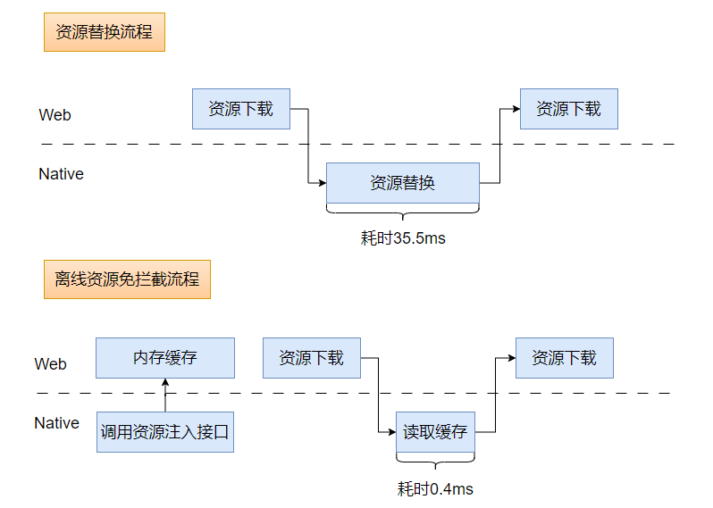


#### 实践案例

具体实践场景及方案关键点请参考[《Web组件开发性能提升指导-离线资源免拦截注入》](https://developer.huawei.com/consumer/cn/doc/best-practices-V5/bpta-web-develop-optimization-V5#section166720457447)。


### ArkWeb资源拦截替换加速

#### 原理描述

本方案在原本的资源拦截替换接口基础上新增支持了ArrayBuffer格式的入参，开发者无需在应用侧进行ArrayBuffer到String格式的转换，可直接使用ArrayBuffer格式的数据进行拦截替换，**避免格式转换和内存拷贝影响性能**。


#### 实践案例

具体实践场景及方案关键点请参考[《Web组件开发性能提升指导-资源拦截替换加速》](https://developer.huawei.com/consumer/cn/doc/best-practices-V5/bpta-web-develop-optimization-V5#section1638162365115)。


## JSVM性能优化

Harmony JSVM-API是基于标准JavaScript引擎提供的一套稳定的ABI，为开发者提供了较为完整的JavaScript引擎能力，包括创建和销毁引擎，执行JavaScript代码，JavaScript/C++交互等关键能力。

开发者可以在应用运行期间直接执行一段动态加载的JavaScript代码。也可以选择将一些对性能、底层系统调用有较高要求的核心功能用C/C++实现并将C++方法注册到JavaScript侧，在JavaScript代码中直接调用，提高应用的执行效率。

**创建JSVM Snapshot：** 在JSVM预热完成之后，将JSVM的状态保存在磁盘上，第二次加载时，如果小程序的框架代码没有发生变化，直接加载Snapshot文件，无需再次执行小程序框架初始化的动作，提升性能的同时还有降低功耗的效果。


### JSVM Snapshot

#### 原理描述

Script虚拟机（JSVM）的快照创建功能，将当前运行时的JavaScript程序状态保存为一个快照文件，这个快照文件包含了当前的堆内存、执行上下文、函数闭包等信息。

**动快照：** 虚拟机在某个特定时间点的状态快照，包含了当前虚拟机的所有内部状态和数据。通过创建一个启动快照，可以在之后的时间点恢复虚拟机到相同的状态。

机启动快照可以简化一些复杂的编程任务，使得在JSVM中管理和维护虚拟机更加便捷，使程序更加灵活与稳定。


#### 实践案例

**API：** JVM_CreateSnapshot

```c
#include "napi/native_api.h"
#include "ark_runtime/jsvm.h"
#include <hilog/log.h>
#include <fstream>

// CreateAndUseSnapshot注册回调
static JSVM_CallbackStruct param[] = {
  {.data = nullptr, .callback = CreateAndUseSnapshot},
};
static JSVM_CallbackStruct *method = param;
// CreateAndUseSnapshot方法别名，供JS调用
static JSVM_PropertyDescriptor descriptor[] = {
  {"createAndUseSnapshot", nullptr, method++, nullptr, nullptr, nullptr, JSVM_DEFAULT},
};

static const int MAX_BUFFER_SIZE = 128;
// CreateHelloString()函数需绑定到JSVM虚拟机, 用于OH_JSVM_CreateSnapshot虚拟机快照的正常创建
static JSVM_Value CreateHelloString(JSVM_Env env, JSVM_CallbackInfo info)
{
  JSVM_Value outPut;
  OH_JSVM_CreateStringUtf8(env, "Hello world!", JSVM_AUTO_LENGTH, &outPut);
  return outPut;
}
// 提供外部引用的方式以便JavaScript环境可以调用绑定的函数
static JSVM_CallbackStruct helloCb = {CreateHelloString, nullptr};
// 外部引用
static intptr_t externals[] = {
  (intptr_t)&helloCb,
  0,
};

static JSVM_Value RunVMScript(JSVM_Env env, std::string &src)
{
  // 打开handleScope作用域
  JSVM_HandleScope handleScope;
  OH_JSVM_OpenHandleScope(env, &handleScope);
  JSVM_Value jsStr = nullptr;
  OH_JSVM_CreateStringUtf8(env, src.c_str(), src.size(), &jsStr);
  // 编译JavaScript代码
  JSVM_Script script;
  OH_JSVM_CompileScript(env, jsStr, nullptr, 0, true, nullptr, &script);
  // 执行JavaScript代码
  JSVM_Value result = nullptr;
  OH_JSVM_RunScript(env, script, &result);
  // 关闭handleScope作用域
  OH_JSVM_CloseHandleScope(env, handleScope);
  return result;
}
// OH_JSVM_CreateSnapshot的样例方法
static void CreateVMSnapshot() {
  // 创建JavaScript虚拟机实例,打开虚拟机作用域
  JSVM_VM vm;
  JSVM_CreateVMOptions vmOptions;
  memset(&vmOptions, 0, sizeof(vmOptions));
  // isForSnapshotting设置该虚拟机是否用于创建快照
  vmOptions.isForSnapshotting = true;
  OH_JSVM_CreateVM(&vmOptions, &vm);
  JSVM_VMScope vmScope;
  OH_JSVM_OpenVMScope(vm, &vmScope);
  // 创建JavaScript环境,打开环境作用域
  JSVM_Env env;
  // 将native函数注册成JavaScript可调用的方法
  JSVM_PropertyDescriptor descriptor[] = {
    {"createHelloString", nullptr, &helloCb, nullptr, nullptr, nullptr, JSVM_DEFAULT},
  };
  OH_JSVM_CreateEnv(vm, 1, descriptor, &env);
  JSVM_EnvScope envScope;
  OH_JSVM_OpenEnvScope(env, &envScope);
  // 使用OH_JSVM_CreateSnapshot创建虚拟机的启动快照
  const char *blobData = nullptr;
  size_t blobSize = 0;
  JSVM_Env envs[1] = {env};
  JSVM_Status status = OH_JSVM_CreateSnapshot(vm, 1, envs, &blobData, &blobSize);
  if (status == JSVM_OK) {
    OH_LOG_INFO(LOG_APP, "Test JSVM OH_JSVM_CreateSnapshot success, blobSize = : %{public}ld", blobSize);
  }
  // 将snapshot保存到文件中
  // 保存快照数据，/data/storage/el2/base/files/test_blob.bin为沙箱路径
  // 以包名为com.example.jsvm为例，实际文件会保存到/data/app/el2/100/base/com.example.jsvm/files/test_blob.bin
  std::ofstream file("/data/storage/el2/base/files/test_blob.bin",
                      std::ios::out | std::ios::binary | std::ios::trunc);
  file.write(blobData, blobSize);
  file.close();
  // 关闭并销毁环境和虚拟机
  OH_JSVM_CloseEnvScope(env, envScope);
  OH_JSVM_DestroyEnv(env);
  OH_JSVM_CloseVMScope(vm, vmScope);
  OH_JSVM_DestroyVM(vm);
}
static void RunVMSnapshot() {
  // blobData的生命周期不能短于vm的生命周期
  // 从文件中读取snapshot
  std::vector<char> blobData;
  std::ifstream file("/data/storage/el2/base/files/test_blob.bin", std::ios::in | std::ios::binary | std::ios::ate);
  size_t blobSize = file.tellg();
  blobData.resize(blobSize);
  file.seekg(0, std::ios::beg);
  file.read(blobData.data(), blobSize);
  file.close();
  OH_LOG_INFO(LOG_APP, "Test JSVM RunVMSnapshot read file blobSize = : %{public}ld", blobSize);
  // 使用快照数据创建虚拟机实例
  JSVM_VM vm;
  JSVM_CreateVMOptions vmOptions;
  memset(&vmOptions, 0, sizeof(vmOptions));
  vmOptions.snapshotBlobData = blobData.data();
  vmOptions.snapshotBlobSize = blobSize;
  OH_JSVM_CreateVM(&vmOptions, &vm);
  JSVM_VMScope vmScope;
  OH_JSVM_OpenVMScope(vm, &vmScope);
  // 从快照中创建环境env
  JSVM_Env env;
  OH_JSVM_CreateEnvFromSnapshot(vm, 0, &env);
  JSVM_EnvScope envScope;
  OH_JSVM_OpenEnvScope(env, &envScope);
  // 执行js脚本，快照记录的env中定义了createHelloString()
  std::string src = "createHelloString()";
  JSVM_Value result = RunVMScript(env, src);
  // 环境关闭前检查脚本运行结果
  if (result == nullptr) {
    OH_JSVM_ThrowError(env, nullptr, "Test JSVM RunVMSnapshot-RunVMScript result is nullptr");
    return;
  }
  char str[MAX_BUFFER_SIZE];
  OH_JSVM_GetValueStringUtf8(env, result, str, MAX_BUFFER_SIZE, nullptr);
  OH_LOG_INFO(LOG_APP, "Test JSVM RunVMSnapshot-RunVMScript result is: %{public}s", str);
  // 关闭并销毁环境和虚拟机
  OH_JSVM_CloseEnvScope(env, envScope);
  OH_JSVM_DestroyEnv(env);
  OH_JSVM_CloseVMScope(vm, vmScope);
  OH_JSVM_DestroyVM(vm);
  return;
}

static JSVM_Value CreateAndUseSnapshot(JSVM_Env env, JSVM_CallbackInfo info)
{
  // OH_JSVM_Init(&initOptions)需在开发流程中的RunJsVm()中第一次初始化（只能初始化一次）
  // JSVM_InitOptions initOptions 赋值是在开发流程中完成的
  // 创建虚拟机快照并将快照保存到文件中
  CreateVMSnapshot();
  // snapshot可以记录下特定的js执行环境，可以跨进程通过snapshot快速还原出js执行上下文环境
  RunVMSnapshot();
  JSVM_Value result = nullptr;
  OH_JSVM_CreateInt32(env, 0, &result);
  return result;
}
```

### JSVM CodeCache

见**JSVM支持JavaScript生成字节码缓存（Code Cache）**章节


## 小程序运行时优化

### 小程序核心线程接入QoS

为了避免小程序核心线程被其他线程打断或者强占，可以通过接入QoS来提高小程序线程的优先级，具体参考[QoS 开发指导](https://docs.openharmony.cn/pages/v5.0/zh-cn/application-dev/napi/qos-guidelines.md)


## 小程序API性能优化

### 小程序API背景介绍

小程序API是各家大厂小程序生态控制点，通过JS框架解耦对系统的依赖，按照小程序的约束，开发者只能在Worker中调用小程序API。


### 小程序API性能trace点建议


| **指标类别** | **缩略语**  | **全称** | **中文名称** | **解释** |
| ------ | ------ | ------ | ------ | ------ |
| 逻辑层  | JSS | JS engine Startup | JavaScript引擎启动耗时 | 执行JavaScript引擎创建的耗时。 |
| 渲染层  | RS | Render Startup | Web引擎启动耗时 | Webview实例创建的耗时。 |
| 逻辑层和渲染层  | PLT | Pkg Load Time | 包加载时间/资源准备耗时 | 把小程序包下载下来，再注入到JavaScript引擎和渲染引擎中的耗时。 |
| 逻辑层  | FFC | First Frame Calculate | 首帧计算耗时 | 从开始执行小程序的逻辑到发送给Webview第一帧数据之前的耗时。 |
| 渲染层  | FP | First Paint | 首次绘制 | Webview页面首个像素点开始绘制的时刻，无论是否绘制了文本、图片。 |
| 渲染层  | FR | First Render | 首帧渲染耗时 | 从接收到第一帧渲染数据到渲染完成时间的耗时。 |
| 渲染层  | LCP | Largest Contentful Paint | 最大有内容绘制 | Webview渲染面积最大的文本/图片的时刻。 |
| 渲染层  | FFSP | First Full Screen Paint | 首次全屏完整绘制 | 从小程序启动到首屏元素铺满的耗时，页面加载结束前最后一次渲染。 |
| JSAPI  | SIW | Sync Invoke Wait | 同步调用等待耗时 | 同步调用等待，如getSystemInfoSync等待线程处理的时间。 |
| JSAPI  | SIE | Sync Invoke Execute | 同步调用执行耗时 | 同步调用执行耗时，如getSystemInfoSync API的执行时间。 |
| JSAPI  | AIW | Async Invoke Wait | 异步调用等待耗时 | 如request请求等待线程处理的时间。 |
| JSAPI  | AIC | ASync Invoke Complete | 异步调用完成耗时 | 如request API执行时间，从发送到接收完网络数据的时间。 |
| 通信  | RJS | Run JavaScript | 执行JS时间 | 调用Webview RunJavaScript接口的耗时。 |
| 通信  | JSB | JSB Invoke | JSBridge 调用耗时 | Webview通过JSBridge调用ArkTS/Native API耗时。 |


通过上述Trace点，可以非常方便的查找出小程序性能的逻辑层、小程序API调用和渲染层瓶颈点。


### 小程序API架构建议

小程序API从功能上分类主要有媒体、设备、基础、界面、网络、画布等几百上千不等的API，每个小程序在启动、滑动过程中，Worker有大量并发的小程序API调用，如果将这些API都实现在应用主线程上，将给小程序的性能带来严重的影响，如图8所示。


图8 小程序API调用逻辑

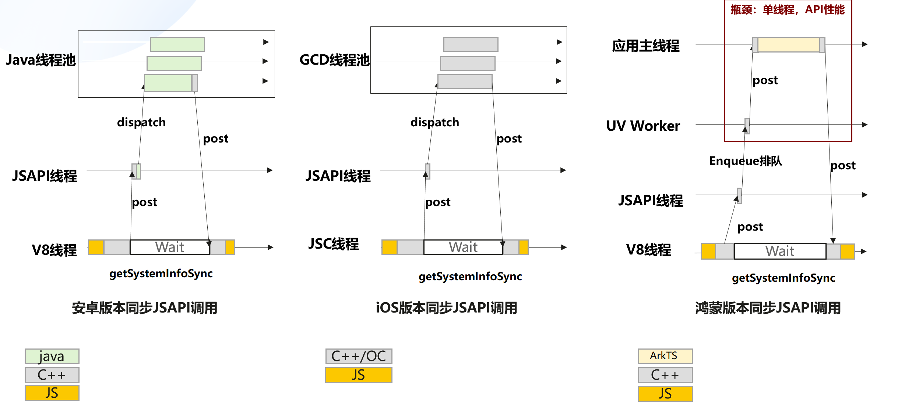


在鸿蒙上，将所有的小程序API转发给应用主线程之后，将会造成严重的API调用拥塞的情况。如图9所示：

图9 小程序API调用顺序

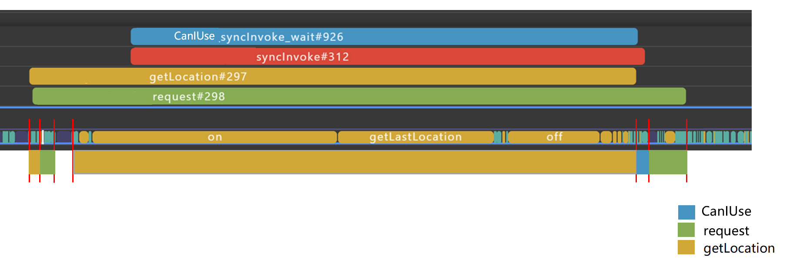

整理一下小程序API调用顺序：

1. 定位getLocation#297异步API调用发起

2. 网络Request#298请求异步API调用发起

3. CanIUse#296同步API调用发起


正常情况下， CanIUse接口耗时1ms，但是在主线程拥塞的情况下，同步调用等待了127ms，等待getLocation执行完成才有机会执行。

因此，建议JSAPI的架构设计如图10所示：

图10 JSAPI调用架构优化示意图

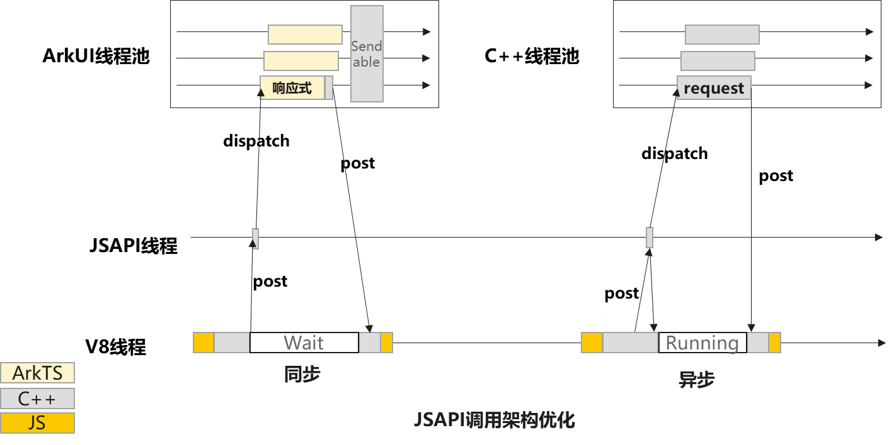


### 小程序API使用ArkTS编程的注意点

鸿蒙应用采用的声明式编程范式，采用数据驱动的方式改变应用的行为，与android和iOS上的命令式编程范式有很大的区别，鸿蒙上提供了on接口对系统属性进行监听，不必重复调用系统接口获取信息，采用on接口进行监听的方式，在提升性能的同时降低功耗。

如图11与图12所示，每次调用系统接口获取信息，性能劣化严重：

图11 API耗时占比图-函数trace数据

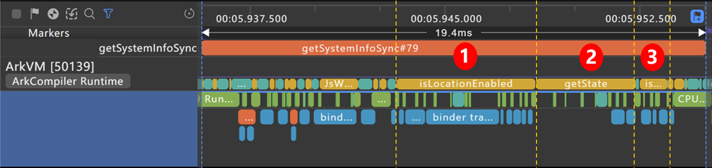

图12 API耗时占比图-函数耗时数据

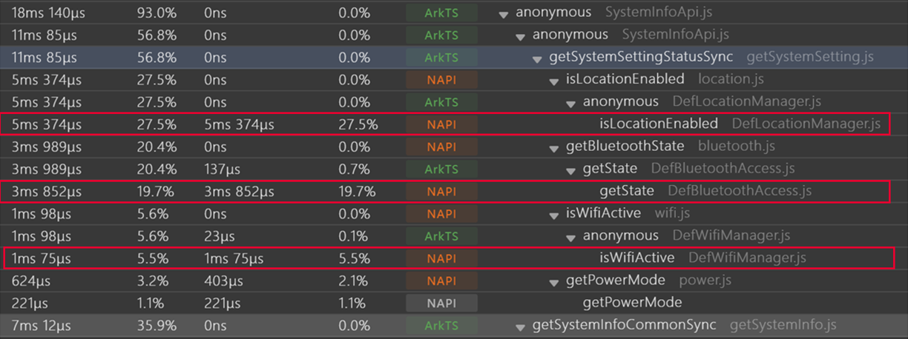


针对上图中的三个耗时最大的API：

1. [geoLocationManager.isLocationEnabled](https://developer.huawei.com/consumer/cn/doc/harmonyos-references-V5/js-apis-geolocationmanager-V5#geolocationmanagerislocationenabled)

2. [access.getState](https://developer.huawei.com/consumer/cn/doc/harmonyos-references-V5/js-apis-bluetooth-access-V5#accessgetstate)

3. [wifiManager.isWifiActive](https://developer.huawei.com/consumer/cn/doc/harmonyos-references-V5/js-apis-wifimanager-V5#wifimanageriswifiactive9)

通过查询官方文档，这三个接口都可以通过on接口监听系统变化，如果没有变化，小程序API直接用缓存结果即可，如果有变化，系统会回调应用的监听处理函数，修改缓存值。

因此，在小程序API实现时，应该关注小程序API实现中使用的系统API是否有对应的on接口函数，如果有对应的on接口函数，应该采用on函数优化小程序API性能。


### 高频小程序API实现方案推荐


| **异步API名称** | **实现方向**  |
| ------ | ------------------- |
| request  | 在C侧实现 |
| getStorage  | 在C侧实现 |
| getStorageInfo  | 在C侧实现 |
| removeStorage  | 在C侧实现 |
| getScreenBrightness  | ArkTS主线程实现 |
| getSetting  | on响应式改造 |
| getNetworkType  | on响应式改造 |
| getSystemInfo  | on响应式改造 |
| getBatteryInfo  | on响应式改造 |
| getLocation  | getLocation |

| **同步API名称** | **实现方向**  |
| ------ | ------------------- |
| getSystemInfoSync  | on响应式改造 |
| getStorageSync  | 在C侧实现 |
| setStorageSync  | 在C侧实现 |
| getAccountInfoSync  | ArkTS主线程实现 |


## 参考

### 关键参考资料

**鸿蒙ArkWeb组件API：**[ArkWeb（方舟Web）](https://developer.huawei.com/consumer/cn/doc/harmonyos-references-V5/arkweb-api-V5)

**JSVM资料：**[JSVM-API支持的数据类型和接口](https://developer.huawei.com/consumer/cn/doc/harmonyos-guides-V5/jsvm-data-types-interfaces-V5)

**NAPI资料：**[NDK开发导读](https://developer.huawei.com/consumer/cn/doc/harmonyos-guides-V5/ndk-development-overview-V5)

**Web场景性能优化指导：**[Web场景性能优化指导](https://developer.huawei.com/consumer/cn/doc/best-practices-V5/bpta-web-develop-optimization-V5)
