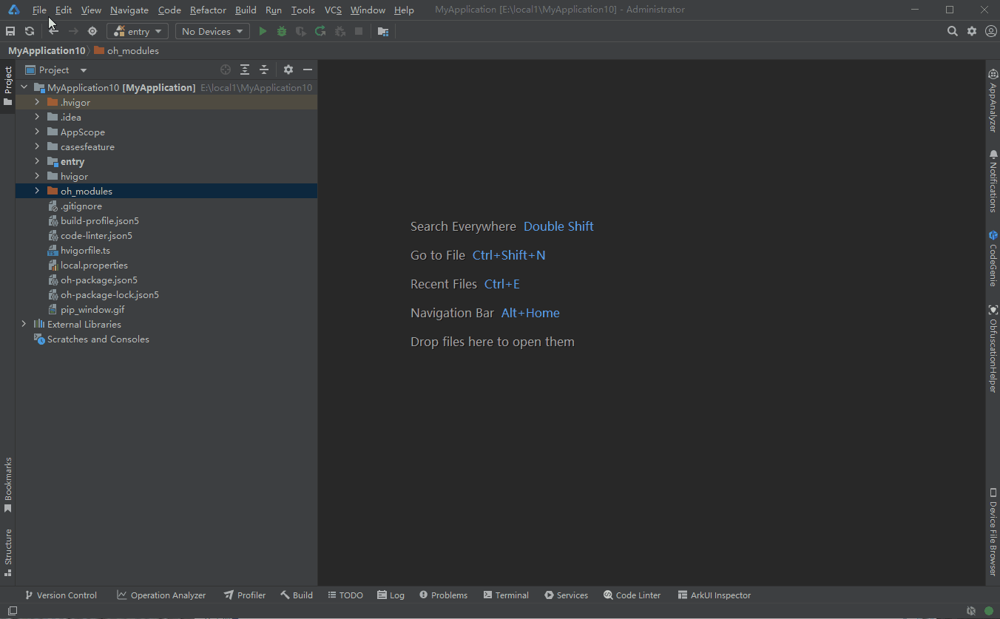
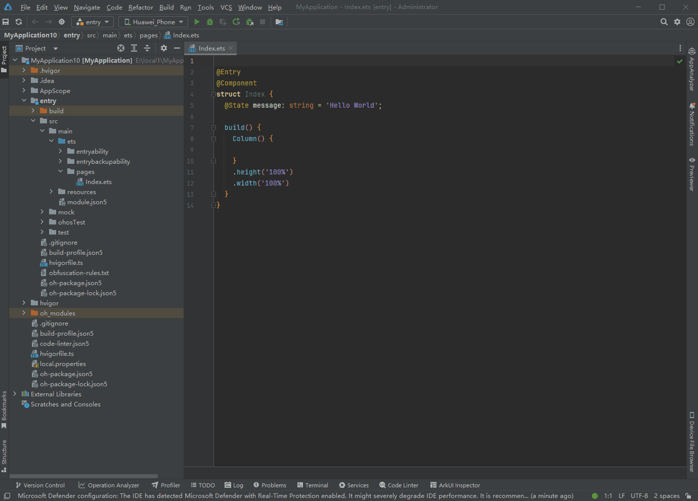
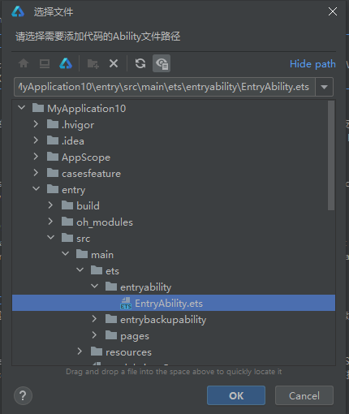
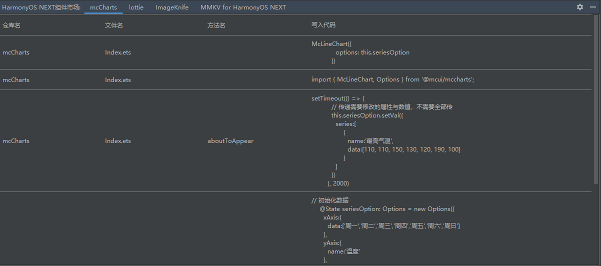

# HarmonyOS NEXT组件市场

## 介绍

本插件可在DevEco Studio中安装使用，提供case仓案例，可拉取case仓案例源代码到本地直接引用。

## 使用说明

### 安装插件

**在线安装**

1. 安装DevEco Studio 5.0.7.200版本。

2. 在DevEco Studio中点击File->Settings。

3. 点击Plugins->Marketplace。

4. 搜索HarmonyOS NEXT Component Market。

5. 点击Install按钮进行下载安装。

6. 安装成功后重启DevEco Studio即可使用插件。

   

**本地安装**

1. 通过[下载地址](case_plugin-1.0.10-Alpha.zip)下载插件zip，无需解压。

2. 在DevEco Studio中，选择左上角File→Setting。

3. 找到Plugins，点击齿轮图标，选择Install Plugin from Disk。

4. 选择插件所在路径，进行安装。

5. 安装成功后点击OK按钮，即可通过鼠标右键使用插件。

   

### 自动获取case仓案例源代码

1. 在光标处点击鼠标右键，选择Import HarmonyOS Case。

2. 弹出对话框，选择源代码。

3. 选择需要下载的案例，点击OK，等待源代码下载完成。

4. 点击右上角Sync Now按钮，同步工程。

5. 同步结束后，编译安装即可查看效果。

   

### 自动添加三方库及示例代码

1. 在光标处点击鼠标右键，选择Import HarmonyOS Case。

2. 弹出对话框，选择三方库。

3. 选择需要使用的三方库，点击确定。

4. 如果三方库需要在Ability中添加示例代码，会提示选择Ability文件路径。

   

5. 点击右上角Sync Now按钮，同步工程。

6. 如果添加示例代码后有错误提示，可以通过点击Ctrl+鼠标左键，查看三方库源码文件，返回后错误即可消失。

7. 通过下方的HarmonyOS Next组件市场标签，可以查看代码添加的文件名和方法名。

   

8. 同步结束后，编译安装即可查看效果。

   	

**注意：**

​    **1. 部分三方库需要根据提示自行替换资源文件才可正常编译。**

​    **2. 部分三方库没有组件显示，需要在Log标签中查看运行结果。**

##  约束限制条件

1. 需要在DevEco Studio中安装使用。
2. 需要连接互联网下载插件、源代码、三方库。

## 版本号

2025/3/24：v1.0.10-Alpha

2025/2/28：v1.0.9-Alpha

2025/2/17：v1.0.8-Alpha

2025/1/10：v1.0.7-Alpha

2024/11/6：v1.0.4-Alpha

2024/11/2：v1.0.3-Alpha

2024/10/26：v1.0.2-Alpha

## Releate Note

v1.0.10-Alpha：

  修复已知问题

v1.0.9-Alpha：

1. 添加配置文件缓存
2. 修复已知问题

v1.0.8-Alpha：

​    修复插件无法获取配置文件的问题

v1.0.7-Alpha：

​    1.添加三方库引入功能

​    2.添加Ability中插入代码功能

​    3.添加代码写入日志输出

​    4.修改版本更新时版本号显示问题

​    5.修改插件图标

v1.0.5-Alpha：

​    bug fix

v1.0.4-Alpha：

1. 显示下载进度。
2. 可中断案例下载。
3. 修复部分已知bug。

v1.0.3-Alpha：

1. 增加版本更新功能。

2. 支持在HAR中引入案例组件。

3. 优化体验问题。

##  链接地址

[下载地址](case_plugin-1.0.10-Alpha.zip)