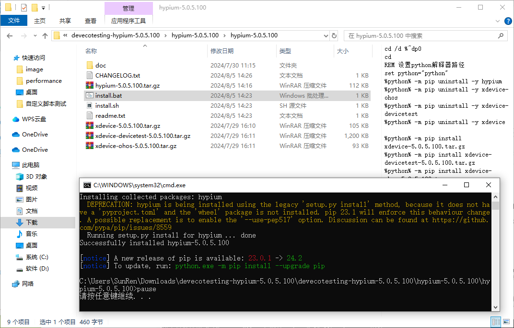
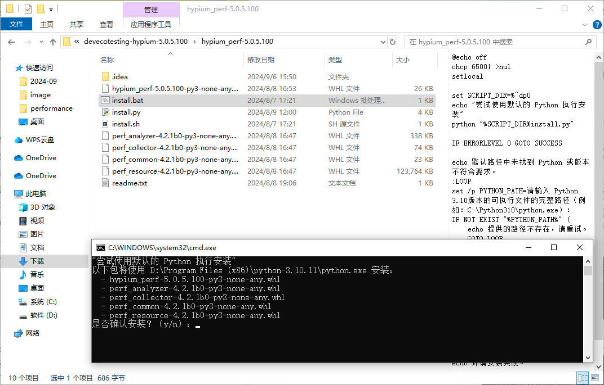
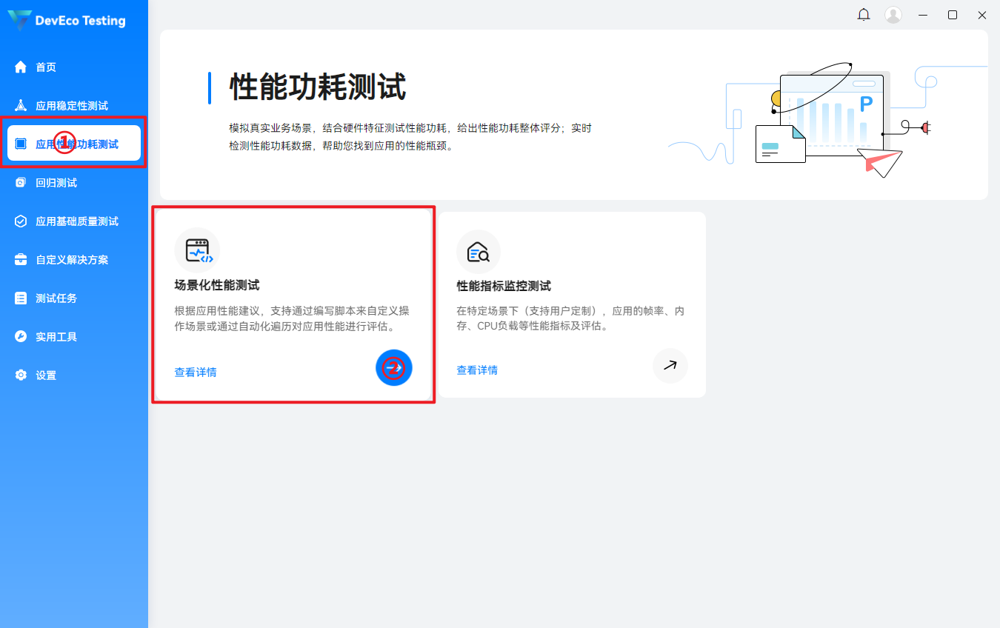
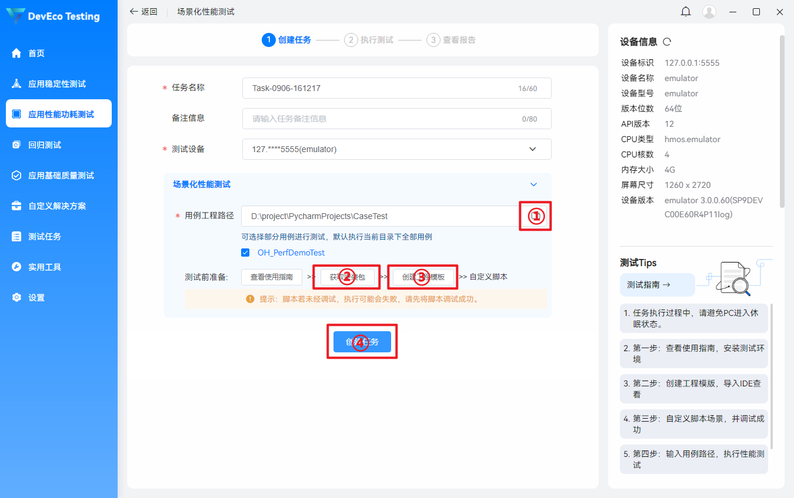
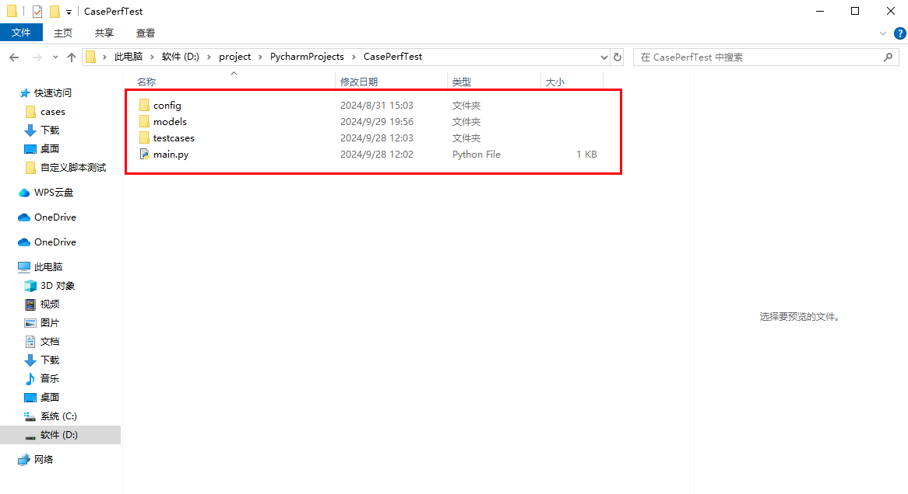
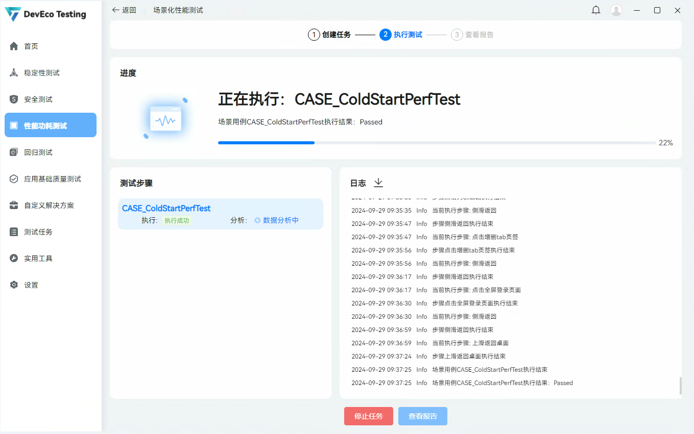
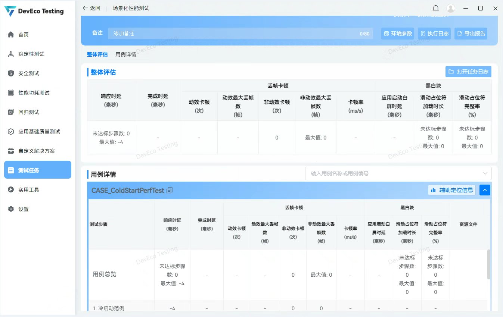

# 自定义性能脚本测试

## 概述

DevEco Testing Hypium是HarmonyOS平台上的UI自动化测试框架，允许开发者使用Python编写测试脚本，具备原生控件、图像及比例坐标定位功能，支持多窗口及触摸屏、鼠标、键盘的模拟输入，并能实现多设备并行测试。此外，它还配备了提升开发效率的辅助插件，如控件查看和投屏操作，并能自动生成详细的测试报告，包括设备日志和执行步骤的截图，为测试过程提供全面的支持与分析工具。

**效果预览图**


## 环境搭建

### 系统要求

- 操作系统：Windows 10/11 64 位
- 内存：推荐使用16GB及以上（可用内存大于8G）
- 处理器：i7-10700@2.9GHz或者同等性能的型号
- 硬盘：可用硬盘空间100GB

### 搭建步骤

配置环境使用DevEco Testing Hypium进行自动化测试，需要按照以下步骤操作：

1. **Python安装**：
   
   - 从Python[官方网站](https://www.python.org/)下载并安装3.10版本（其他版本可能存在兼容性问题）。

2. **pip源配置**：
   
   - 在用户的目录下（如：**C:\Users\用户名\ .pip**）创建一个名为`.pip`的文件夹，并在其中创建一个名为`pip.ini`的文件，内容应包括`index-url`和`trusted-host`设置，指向一个pip源。
   
   - 示例`pip.ini`文件内容：
     
     ```
     [global]
     index-url = http://xxxx/pypi/simple
     trusted-host = xxxx
     ```
   
   - 使用命令行更新pip至最新版本：`python -m pip install --upgrade pip`。

3. **IDE安装**：
   
   - 推荐安装[PyCharm](https://www.jetbrains.com.cn/en-us/pycharm)社区版2021.3或更高版本。

4. **HDC安装**：
   
   - 下载DevEco Studio获取，配置向导默认下载Toolchains获取，详情请参考[DevEco Studio使用指南](https://developer.huawei.com/consumer/cn/doc/harmonyos-guides-V5/ide-tools-overview-0000001558763037-V5?catalogVersion=V5)及[调试工具-hdc](https://developer.huawei.com/consumer/cn/doc/harmonyos-guides-V5/hdc-V5)

5. **Hypium安装**：
   
   - 从华为开发者网站[下载Hypium]([下载中心 | 华为开发者联盟-HarmonyOS开发者官网，共建鸿蒙生态](https://developer.huawei.com/consumer/cn/download/deveco-testing-hypium))的离线安装包并解压。
   
   - 从本地下载目录中打开cmd窗口，运行 install.bat 脚本，跟随提示确认安装。
   
   
   
   
   
   如脚本执行失败，可在CMD命令窗口输入 python -m pip install --upgrade pip 更新pip后，手动安装依赖包。注：以下版本仅供示例，具体版本号请参照实际下载版本。
   
   ```python
   pip install xdevice-5.0.5.100.tar.gz
   pip install xdevice-devicetest-5.0.5.100.tar.gz
   pip install xdevice-ohos-5.0.5.100.tar.gz
   pip install hypium-5.0.4.200b2.tar.gz
   pip install hypium_perf-5.0.5.100.1b3-py3-none-any.whl
   pip install perf_collector-4.2.1b0-py3-none-any.whl perf_analyzer-4.2.1b0-py3-none-any.whl perf_common-4.2.1b0-py3-none-any.whl perf_resource-4.2.1b0-py3-none-any.whl
   ```

6. **DevEco Testing Hypium插件安装及使用方法**：
   
   - 准备DevEco Testing Hypium文件离线安装包，无需解压。
   - 打开pycharm后，点击File -> Settings -> Plugin -> 齿轮图标 -> Install Plugin from Disk -> 选中刚刚下载的离线安装zip包 -> 安装完成后重启pycharm。

以上步骤[搭建DevEco Testing Hypium环境]([文档中心](https://developer.huawei.com/consumer/cn/doc/harmonyos-guides-V5/hypium-python-guidelines-V5))。

## 性能脚本操作步骤

①应用性能功耗测试模块

②长计划性能测试首次点击需要下载



- 点击①后可以导入python脚本

- 点击②可以获取Hypium安装包

- 点击③可以创建一个python脚本的工程模板

- 点击①成功导入后，就可以点击④开始场景化性能测试



## 脚本案例

### 工程目录

- `config`：存放配置文件
- `models`：存放原子用例
- `testcases`：存放场景用例
- `main.py`：本地调试入口



### 场景用例和原子用例使用说明

- **场景用例** 
  
   用户实际使用设备的实际场景定义，性能测试业务上把场景分为一级、二级、三级场景，从大到小，从复杂到简单。下发执行任务以三级场景为基本颗粒度，有独立的三级场景用例编号，三级场景与文本用例是一一对应关系，实际的文本用例与场景中的三级场景对应，脚本编写也是以用例为单个文件，用例编号与用例文件名一致，工程查找用例也是按这个逻辑关系来对应。
  
   **Testcase编写规范：**
   Testcase对应的是测试场景中的一系列相关的原子用例操作序列，在脚本编写时对应一个testcase。
  
   1.命名规范：
   一个testcase是一个独立的python文件，testcase文件命名为可区分的场景编号名称，例：CASE_ColdStartPerfTest.py。
  
   2.继承规范：
   testcase必须继承PerfBaseCase类，PerfBaseCase会负责用例开始时的初始化流程，进行一些设备环境检查操作。
  
   3.注释规范：
   将场景用例的场景描述放置在用例最上方，方便审视测试场景所包含的原子用例执行步骤对应关系。
  
   **场景用例模板：**
   [参考代码](./CasePerfTest/testcases/CASE_ColdStartPerfTest.py)
  
   **配置文件模板：**
   [参考代码](./CasePerfTest/testcases/CASE_ColdStartPerfTest.json)

- **原子用例**
  
   单应用的原子操作序列，是组成场景的基本单应用操作，对应脚本中一个model(模型)，有独立的原子用例编号。
  
   **Model编写规范：**
   Model对应的是原子用例操作中的一组操作序列，在脚本编写时对应一个model。
  
   1.命名规范：
   一个model是一个独立的python文件，model文件命名为有一定业务含义的名称，例如：设置界面浏览-> setting_interface_browsing.py。
  
   2.继承规范：
   model必须继承基类ModelBase，ModelBase会负责与采集器的交互，并且处理model模型中如果执行出错出现的异常场景。
  
   3.注释规范：
   将原子用例操作步骤放置在用例最上方，方便审视模型步骤和用例执行步骤对应关系。
  
   **原子用例模板：**
   [参考代码](./CasePerfTest/models/case_main_page_browsing.py)

### 注意事项

- 1个性能场景用例由1-N个原子用例(models)组成，1个原子用例对应1-N个测试步骤。
- 每个场景用例都需要一个配对的json配置文件。
- 原子用例可以放在在models目录下，推荐按照app进行区分。

## 脚本测试结果解析

- 用例执行中


- 用例分析中



- 查看报告

测试完成后，自动生成测试报告。报告包含任务信息、整体评估、用例详情、指标监控数据、资源文件（trace及视频）。


