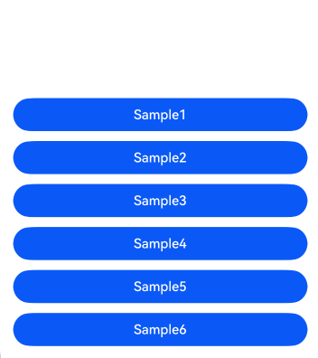

# TaskPool使用规范和常见问题

### 介绍
[任务池（TaskPool）](https://developer.huawei.com/consumer/cn/doc/harmonyos-guides-V5/taskpool-introduction-V5)基于池化思想和任务机制，提供了一系列并发API，旨在充分发挥多核CPU的优势，降低主线程负载，提高程序性能。使用TaskPool进行开发需遵守一些规范，并综合业务和并发特性，细分场景使用。违反这些规范可能会导致性能劣化，引起稳定性或者其他非预期的问题。  
本文就TaskPool错误使用导致的一些诸如应用报错、业务异常、资源消耗过大等问题进行了分析，并总结出了一些使用规范，以帮助开发者更好的使用TaskPool进行应用开发。  

### 效果预览
    

### 使用说明
1. 分别点击Sample1至Sample6按钮，进入各Sample的场景首页。
2. 点击各sample场景首页的按钮，过滤sampleTag日志，查看各场景的正反例日志打印情况。具体详见[测试用例](./ohosTest.md)。

### 工程目录
```
entry/src/main/ets/pages
├── sample1
│   ├── Sample1.ets                       // 视图层-使用规范1主页面
├── sample2
│   ├── Sample2.ets                       // 视图层-使用规范2主页面
├── sample3
│   ├── Sample3.ets                       // 视图层-使用规范3主页面
├── sample4
│   ├── Sample4.ets                       // 视图层-使用规范4主页面
├── sample5
│   ├── Sample5.ets                       // 视图层-使用规范5主页面
├── sample6
│   ├── Sample6.ets                       // 视图层-使用规范6主页面
```

### 相关权限 

不涉及。 

### 依赖

不涉及。 

### 约束与限制   

不涉及。 