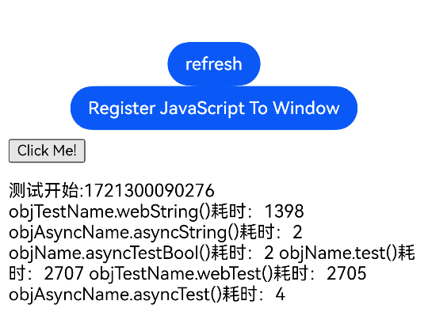

# 异步调用JsBridge

### 介绍

本示例展示使用ArkTS接口实现JSBridge通信，通过计算调用同步和异步JSBridge耗时，来说明异步调用不会阻塞web线程。

### 效果预览图



**使用说明**  
  
运行后点击Register JavaScript To Window，然后点击Click Me！

**原理说明**

异步JSBridge调用适用于H5侧调用原生或C++侧注册得JSBridge函数场景下，将用户指定的JSBridge接口的调用抛出后，不等待执行结果， 以避免在ArkUI主线程负载重时JSBridge同步调用可能导致Web线程等待IPC时间过长，从而造成阻塞的问题。
[文章链接](../../../../docs/performance/performance-web-import.md)

### 实现思路

1. 使用registerJavaScriptProxy或javaScriptProxy注册异步函数或异步同步共存

```ts
// registerJavaScriptProxy方式注册
Button('refresh')
  .onClick(()=>{
    try{
      this.controller.refresh();
    } catch (error) {
      console.error('ErrorCode:' + (error as BusinessError).code + ',Message:' + (error as BusinessError).message)
    }
  })
Button('Register JavaScript To Window')
  .onClick(()=>{
    try {
      //调用注册接口对象及成员函数，其中同步函数列表必填，空白则需要用[]占位；异步函数列表非必填
      //同步、异步函数都注册
      this.controller.registerJavaScriptProxy(this.testObjtest,"objName",["test"],["asyncTestBool"]);
       //只注册同步函数
       this.controller.registerJavaScriptProxy(this.webTestObj,"objTestName",["webTest","webString"]);
      //只注册异步函数，同步函数列表处留空
      this.controller.registerJavaScriptProxy(this.asyncTestObj,"objAsyncName",[],["asyncTest","asyncString"]);
    } catch (error) {
      console.error('ErrorCode:' + (error as BusinessError).code + ',Message:' + (error as BusinessError).message);
    }
  })
Web({src: $rawfile('index.html'),controller: this.controller}).javaScriptAccess(true)

//javaScriptProxy方式注册
//javaScriptProxy只支持注册一个对象，若需要注册多个对象请使用registerJavaScriptProxy
Web({src: $rawfile('index.html'),controller: this.controller})
  .javaScriptAccess(true)
  .javaScriptProxy({
    object: this.testObjtest,
    name:"objName",
    methodList: ["test","toString"],
    //指定异步函数列表
    asyncMethodList: ["test","toString"],
    controller: this.controller
  })
```

2. H5侧调用JSBridge函数

```ts
<!DOCTYPE html>
<html lang="en">
<head>
  <meta charset="UTF-8">
  <meta name="viewport" content="width=device-width, initial-scale=1.0">
  <title>Document</title>
</head>
<body>
<button type="button" onclick="htmlTest()"> Click Me!</button>
<p id="demo"></p>
<p id="webDemo"></p>
<p id="asyncDemo"></p>
</body>
<script type="text/javascript">
  async function htmlTest() {
    document.getElementById("demo").innerHTML = '测试开始:' + new Date().getTime() + '\n';

    const time1 = new Date().getTime()
    objTestName.webString();
    const time2 = new Date().getTime()

    objAsyncName.asyncString()
    const time3 = new Date().getTime()

    objName.asyncTestBool()
    const time4 = new Date().getTime()

    objName.test();
    const time5 = new Date().getTime()

    objTestName.webTest();
    const time6 = new Date().getTime()
    objAsyncName.asyncTest()
    const time7 = new Date().getTime()

    const result = [
      'objTestName.webString()耗时：'+ (time2 - time1),
      'objAsyncName.asyncString()耗时：'+ (time3 - time2),
      'objName.asyncTestBool()耗时：'+ (time4 - time3),
      'objName.test()耗时：'+ (time5 - time4),
      'objTestName.webTest()耗时：'+ (time6 - time5),
      'objAsyncName.asyncTest()耗时：'+ (time7 - time6),
    ]
    document.getElementById("demo").innerHTML = document.getElementById("demo").innerHTML + '\n' + result.join('\n')
  }
</script>
</html>

```

### 工程结构&模块类型

   ```
   WebImportSyncJsBridge
   |---pages
   |   |---index.ets        //UI界面展示
   |---util
   |   |---Logger.ets       //日志工具
   ```

### 参考资料

[webview.registerJavaScriptProxy](https://developer.huawei.com/consumer/cn/doc/harmonyos-references-V5/js-apis-webview-V5#registerjavascriptproxy)
