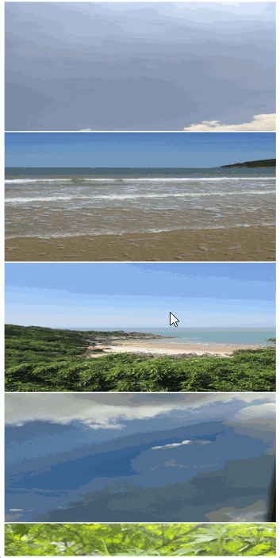

# Web页面预加载优化图片滑动白块

## 介绍

本示例展示Web展示HTML页面图片列表时，在使用懒加载图片的情况下，使用预加载避免滑动过程中图片因未及时加载而出现白块情况，提高使用体验。

## 效果预览图



### 使用说明

运行后向下滑动页面，观察列表图片在滑动过程中是否出现白块现象。

### 原理说明

使用预加载时，HTML页面图片按需加载，当页面在滑动过程中由于拓展了视口高度，预先加载未出现的图片，避免滑动白块问题，提高使用体验。[文章链接](../../../../docs/performance/performance-web-import.md/#预加载优化滑动白块)

## 实现思路

1. 标签预设白块图片，并设置data-src为真实图片地址。
    ```html
    
    ```
2. 在标签进入可视窗口时将date-src地址赋给src，实现图片懒加载，并拓展视口高度，实现预加载。
   ```html
   <script>
      // html结构与上方常规案例相同
      // 可视区域作为根元素，向下扩展50%的margin长度
      const options = {root:document,rootMargin:'0% 0% 100% 0%'};
      // 创建一个IntersectionObserver实例
      const observer = new IntersectionObserver(function(entries,observer){
        entries.forEach(function(entry){
          // 检查图片是否进入可视窗口
          if(entry.isIntersecting){
            const image = entry.target;
            // 将数据源的src赋值给img的src
            image.src = image.dataset.src;
            // 停止观察该图片
            observer.unobserve(image);
            }
        })
      },options);
      
      document.querySelectorAll('img').forEach(img => {observer.observe(img)});
   </script>
   ```

## 工程结构&模块类型

```
WebSlideWhiteBlockNegative
|---pages
|   |---index.ets        //UI界面展示
```

## 参考资料

无